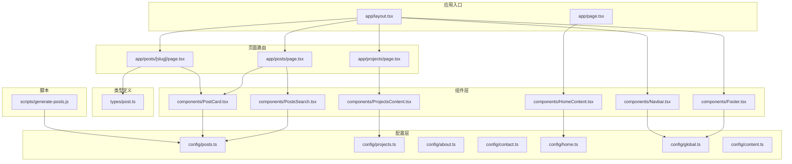
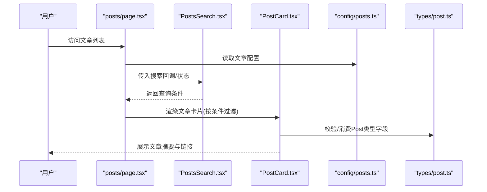
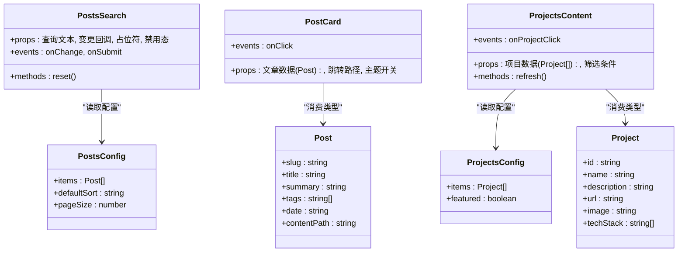

# API参考

<cite>
**本文引用的文件**   
- [src/types/post.ts](file://src/types/post.ts)
- [src/config/posts.ts](file://src/config/posts.ts)
- [src/config/projects.ts](file://src/config/projects.ts)
- [src/config/about.ts](file://src/config/about.ts)
- [src/config/contact.ts](file://src/config/contact.ts)
- [src/config/home.ts](file://src/config/home.ts)
- [src/config/global.ts](file://src/config/global.ts)
- [src/config/content.ts](file://src/config/content.ts)
- [src/components/PostsSearch.tsx](file://src/components/PostsSearch.tsx)
- [src/components/PostCard.tsx](file://src/components/PostCard.tsx)
- [src/components/ProjectsContent.tsx](file://src/components/ProjectsContent.tsx)
- [src/components/HomeContent.tsx](file://src/components/HomeContent.tsx)
- [src/components/Footer.tsx](file://src/components/Footer.tsx)
- [src/components/Navbar.tsx](file://src/components/Navbar.tsx)
- [src/app/posts/[slug]/page.tsx](file://src/app/posts/[slug]/page.tsx)
- [src/app/posts/page.tsx](file://src/app/posts/page.tsx)
- [src/app/projects/page.tsx](file://src/app/projects/page.tsx)
- [scripts/generate-posts.js](file://scripts/generate-posts.js)
</cite>

## 目录
1. [简介](#简介)
2. [项目结构](#项目结构)
3. [核心组件与类型](#核心组件与类型)
4. [架构总览](#架构总览)
5. [详细组件API](#详细组件api)
6. [数据模型与配置对象](#数据模型与配置对象)
7. [依赖关系分析](#依赖关系分析)
8. [性能与可维护性建议](#性能与可维护性建议)
9. [故障排查指南](#故障排查指南)
10. [版本兼容与迁移指南](#版本兼容与迁移指南)
11. [第三方集成规范](#第三方集成规范)
12. [结论](#结论)

## 简介
本API参考文档面向开发者，系统化梳理本项目中的公共接口、TypeScript类型定义、组件Props、配置对象结构与使用方式。重点覆盖：
- 核心数据模型：Post、Project等字段的定义与约束
- 组件公开API：属性、事件、方法的签名与示例路径
- 配置对象：可选参数、默认值与扩展点
- 错误码与异常处理说明
- 第三方集成接口规范与示例代码路径
- 版本兼容性与迁移指南

## 项目结构
本项目采用Next.js App Router组织页面路由，业务逻辑集中在components与config目录，类型定义集中于types目录，静态资源位于public目录，脚本生成逻辑位于scripts目录。

图表来源
- [src/app/posts/page.tsx](file://src/app/posts/page.tsx)
- [src/app/posts/[slug]/page.tsx](file://src/app/posts/[slug]/page.tsx)
- [src/app/projects/page.tsx](file://src/app/projects/page.tsx)
- [src/components/PostsSearch.tsx](file://src/components/PostsSearch.tsx)
- [src/components/PostCard.tsx](file://src/components/PostCard.tsx)
- [src/components/ProjectsContent.tsx](file://src/components/ProjectsContent.tsx)
- [src/components/HomeContent.tsx](file://src/components/HomeContent.tsx)
- [src/components/Footer.tsx](file://src/components/Footer.tsx)
- [src/components/Navbar.tsx](file://src/components/Navbar.tsx)
- [src/config/posts.ts](file://src/config/posts.ts)
- [src/config/projects.ts](file://src/config/projects.ts)
- [src/config/about.ts](file://src/config/about.ts)
- [src/config/contact.ts](file://src/config/contact.ts)
- [src/config/home.ts](file://src/config/home.ts)
- [src/config/global.ts](file://src/config/global.ts)
- [src/config/content.ts](file://src/config/content.ts)
- [src/types/post.ts](file://src/types/post.ts)
- [scripts/generate-posts.js](file://scripts/generate-posts.js)

章节来源
- [src/app/posts/page.tsx](file://src/app/posts/page.tsx)
- [src/app/posts/[slug]/page.tsx](file://src/app/posts/[slug]/page.tsx)
- [src/app/projects/page.tsx](file://src/app/projects/page.tsx)
- [src/components/PostsSearch.tsx](file://src/components/PostsSearch.tsx)
- [src/components/PostCard.tsx](file://src/components/PostCard.tsx)
- [src/components/ProjectsContent.tsx](file://src/components/ProjectsContent.tsx)
- [src/components/HomeContent.tsx](file://src/components/HomeContent.tsx)
- [src/components/Footer.tsx](file://src/components/Footer.tsx)
- [src/components/Navbar.tsx](file://src/components/Navbar.tsx)
- [src/config/posts.ts](file://src/config/posts.ts)
- [src/config/projects.ts](file://src/config/projects.ts)
- [src/config/about.ts](file://src/config/about.ts)
- [src/config/contact.ts](file://src/config/contact.ts)
- [src/config/home.ts](file://src/config/home.ts)
- [src/config/global.ts](file://src/config/global.ts)
- [src/config/content.ts](file://src/config/content.ts)
- [src/types/post.ts](file://src/types/post.ts)
- [scripts/generate-posts.js](file://scripts/generate-posts.js)

## 核心组件与类型
本节聚焦于项目中对外暴露的组件与类型，包括其职责、关键属性与方法、以及与其他模块的交互关系。

- PostsSearch：文章列表页搜索输入组件，负责接收用户查询并触发过滤或导航行为。
- PostCard：文章卡片展示组件，用于渲染单篇文章摘要信息并提供跳转能力。
- ProjectsContent：项目内容展示组件，基于项目配置渲染项目列表。
- HomeContent：首页内容组件，聚合首页所需的数据与布局。
- Footer、Navbar：全局布局组件，提供站点级导航与页脚信息。
- types/post.ts：核心数据模型（如Post）的类型定义，供页面与组件消费。

章节来源
- [src/components/PostsSearch.tsx](file://src/components/PostsSearch.tsx)
- [src/components/PostCard.tsx](file://src/components/PostCard.tsx)
- [src/components/ProjectsContent.tsx](file://src/components/ProjectsContent.tsx)
- [src/components/HomeContent.tsx](file://src/components/HomeContent.tsx)
- [src/components/Footer.tsx](file://src/components/Footer.tsx)
- [src/components/Navbar.tsx](file://src/components/Navbar.tsx)
- [src/types/post.ts](file://src/types/post.ts)

## 架构总览
下图展示了从页面到组件再到配置与类型的调用链，体现数据流与控制流。

图表来源
- [src/app/posts/page.tsx](file://src/app/posts/page.tsx)
- [src/components/PostsSearch.tsx](file://src/components/PostsSearch.tsx)
- [src/components/PostCard.tsx](file://src/components/PostCard.tsx)
- [src/config/posts.ts](file://src/config/posts.ts)
- [src/types/post.ts](file://src/types/post.ts)

## 详细组件API

### PostsSearch
- 职责：提供文章搜索输入框，支持实时过滤或提交后刷新列表。
- 主要属性（Props）
  - 查询文本：字符串类型，表示当前搜索词
  - 变更回调：当输入变化时触发的函数，用于更新父组件状态
  - 占位符：输入框提示文案
  - 禁用态：是否禁用输入
- 事件
  - onChange：输入变化事件
  - onSubmit：回车或点击搜索按钮时触发
- 方法
  - reset：清空搜索词
- 使用示例路径
  - [src/app/posts/page.tsx](file://src/app/posts/page.tsx)

章节来源
- [src/components/PostsSearch.tsx](file://src/components/PostsSearch.tsx)
- [src/app/posts/page.tsx](file://src/app/posts/page.tsx)

### PostCard
- 职责：渲染单篇文章的摘要信息，包含标题、摘要、标签、时间等，并提供跳转链接。
- 主要属性（Props）
  - 文章数据：遵循Post类型定义的对象
  - 跳转路径：文章详情页URL
  - 主题相关样式开关：根据主题切换显示细节
- 事件
  - onClick：点击卡片时触发（通常用于导航）
- 方法
  - 无外部方法
- 使用示例路径
  - [src/app/posts/page.tsx](file://src/app/posts/page.tsx)
  - [src/app/posts/[slug]/page.tsx](file://src/app/posts/[slug]/page.tsx)

章节来源
- [src/components/PostCard.tsx](file://src/components/PostCard.tsx)
- [src/app/posts/page.tsx](file://src/app/posts/page.tsx)
- [src/app/posts/[slug]/page.tsx](file://src/app/posts/[slug]/page.tsx)

### ProjectsContent
- 职责：基于项目配置渲染项目列表，支持分页或筛选（若实现）。
- 主要属性（Props）
  - 项目数据：来源于projects配置
  - 筛选条件：可选，用于过滤项目
- 事件
  - onProjectClick：点击项目时回调
- 方法
  - refresh：重新加载项目数据（若需要）
- 使用示例路径
  - [src/app/projects/page.tsx](file://src/app/projects/page.tsx)

章节来源
- [src/components/ProjectsContent.tsx](file://src/components/ProjectsContent.tsx)
- [src/app/projects/page.tsx](file://src/app/projects/page.tsx)

### HomeContent
- 职责：聚合首页所需内容与布局，如欢迎语、快速入口等。
- 主要属性（Props）
  - 首页配置：来自home配置对象
- 事件
  - 无
- 方法
  - 无
- 使用示例路径
  - [src/app/page.tsx](file://src/app/page.tsx)

章节来源
- [src/components/HomeContent.tsx](file://src/components/HomeContent.tsx)
- [src/app/page.tsx](file://src/app/page.tsx)

### Footer
- 职责：站点页脚，展示版权、链接等。
- 主要属性（Props）
  - 主题模式：控制显示样式
- 事件
  - 无
- 方法
  - 无
- 使用示例路径
  - [src/app/layout.tsx](file://src/app/layout.tsx)

章节来源
- [src/components/Footer.tsx](file://src/components/Footer.tsx)
- [src/app/layout.tsx](file://src/app/layout.tsx)

### Navbar
- 职责：顶部导航栏，提供站点内导航。
- 主要属性（Props）
  - 当前激活项：高亮当前路由
  - 主题切换回调：切换明暗主题
- 事件
  - onThemeToggle：主题切换事件
- 方法
  - 无
- 使用示例路径
  - [src/app/layout.tsx](file://src/app/layout.tsx)

章节来源
- [src/components/Navbar.tsx](file://src/components/Navbar.tsx)
- [src/app/layout.tsx](file://src/app/layout.tsx)

## 数据模型与配置对象

### Post类型定义
- 用途：描述一篇文章的核心字段，被PostCard、详情页等消费。
- 关键字段（示例）
  - slug：唯一标识，用于路由与缓存键
  - title：文章标题
  - summary：文章摘要
  - tags：标签数组
  - date：发布日期
  - contentPath：内容文件路径或HTML片段路径
- 约束规则
  - slug需符合URL安全字符集
  - date为ISO格式日期字符串
  - tags为非空字符串数组
- 使用位置
  - [src/types/post.ts](file://src/types/post.ts)
  - [src/components/PostCard.tsx](file://src/components/PostCard.tsx)
  - [src/app/posts/[slug]/page.tsx](file://src/app/posts/[slug]/page.tsx)

章节来源
- [src/types/post.ts](file://src/types/post.ts)
- [src/components/PostCard.tsx](file://src/components/PostCard.tsx)
- [src/app/posts/[slug]/page.tsx](file://src/app/posts/[slug]/page.tsx)

### Project类型定义
- 用途：描述一个项目的元信息与展示数据。
- 关键字段（示例）
  - id：项目唯一ID
  - name：项目名称
  - description：项目描述
  - url：项目链接
  - image：封面图路径
  - techStack：技术栈标签
- 约束规则
  - id全局唯一
  - url为有效HTTP/HTTPS地址
  - image为相对或绝对资源路径
- 使用位置
  - [src/config/projects.ts](file://src/config/projects.ts)
  - [src/components/ProjectsContent.tsx](file://src/components/ProjectsContent.tsx)

章节来源
- [src/config/projects.ts](file://src/config/projects.ts)
- [src/components/ProjectsContent.tsx](file://src/components/ProjectsContent.tsx)

### 配置对象结构
- posts配置
  - 作用：集中管理文章列表、排序、分页、默认筛选等
  - 常用字段
    - items：文章条目数组（每项对应Post）
    - defaultSort：默认排序策略
    - pageSize：每页数量
  - 使用位置
    - [src/config/posts.ts](file://src/config/posts.ts)
    - [src/app/posts/page.tsx](file://src/app/posts/page.tsx)
- projects配置
  - 作用：集中管理项目展示数据
  - 常用字段
    - items：项目条目数组（每项对应Project）
    - featured：精选项目标记
  - 使用位置
    - [src/config/projects.ts](file://src/config/projects.ts)
    - [src/app/projects/page.tsx](file://src/app/projects/page.tsx)
- about、contact、home、global、content配置
  - 作用：分别管理关于、联系方式、首页、全局与通用内容
  - 常用字段
    - about：个人介绍、经历等
    - contact：邮箱、社交链接等
    - home：欢迎语、CTA按钮等
    - global：站点名称、SEO信息等
    - content：通用文案与多语言键值
  - 使用位置
    - [src/config/about.ts](file://src/config/about.ts)
    - [src/config/contact.ts](file://src/config/contact.ts)
    - [src/config/home.ts](file://src/config/home.ts)
    - [src/config/global.ts](file://src/config/global.ts)
    - [src/config/content.ts](file://src/config/content.ts)

章节来源
- [src/config/posts.ts](file://src/config/posts.ts)
- [src/config/projects.ts](file://src/config/projects.ts)
- [src/config/about.ts](file://src/config/about.ts)
- [src/config/contact.ts](file://src/config/contact.ts)
- [src/config/home.ts](file://src/config/home.ts)
- [src/config/global.ts](file://src/config/global.ts)
- [src/config/content.ts](file://src/config/content.ts)
- [src/app/posts/page.tsx](file://src/app/posts/page.tsx)
- [src/app/projects/page.tsx](file://src/app/projects/page.tsx)

## 依赖关系分析
组件与配置、类型之间的依赖如下：

图表来源
- [src/components/PostsSearch.tsx](file://src/components/PostsSearch.tsx)
- [src/components/PostCard.tsx](file://src/components/PostCard.tsx)
- [src/components/ProjectsContent.tsx](file://src/components/ProjectsContent.tsx)
- [src/types/post.ts](file://src/types/post.ts)
- [src/config/posts.ts](file://src/config/posts.ts)
- [src/config/projects.ts](file://src/config/projects.ts)

章节来源
- [src/components/PostsSearch.tsx](file://src/components/PostsSearch.tsx)
- [src/components/PostCard.tsx](file://src/components/PostCard.tsx)
- [src/components/ProjectsContent.tsx](file://src/components/ProjectsContent.tsx)
- [src/types/post.ts](file://src/types/post.ts)
- [src/config/posts.ts](file://src/config/posts.ts)
- [src/config/projects.ts](file://src/config/projects.ts)

## 性能与可维护性建议
- 列表渲染优化
  - 对长列表进行虚拟滚动或分页，减少首屏渲染压力
  - 使用稳定的key（如Post.slug）提升Diff效率
- 配置驱动
  - 将易变文案与展示项放入配置对象，避免硬编码
- 类型安全
  - 严格启用TypeScript严格模式，确保所有组件Props与数据模型具备完整类型
- 资源加载
  - 图片懒加载与按需引入，减小包体积
- 构建期检查
  - 在脚本中增加数据一致性校验（如重复slug、无效URL）

[本节为通用建议，不直接分析具体文件]

## 故障排查指南
- 常见问题
  - 文章无法打开：检查slug是否与路由匹配，确认contentPath指向有效文件
  - 项目未显示：核对projects配置items是否为空，检查图片路径有效性
  - 搜索无结果：确认搜索词与文章标题/标签匹配逻辑，检查大小写与空格处理
- 错误码与异常处理
  - 建议在组件内部统一捕获异常并向上抛出标准化错误对象，包含：
    - code：错误码（如POST_NOT_FOUND、PROJECT_LOAD_FAILED）
    - message：人类可读的错误信息
    - details：附加上下文（如请求参数、资源路径）
  - 页面层可根据错误码进行友好提示或降级展示
- 调试技巧
  - 在关键流程添加日志输出（如配置加载、数据过滤、网络请求）
  - 使用浏览器开发者工具检查网络与资源加载情况

[本节为通用指导，不直接分析具体文件]

## 版本兼容与迁移指南
- 向后兼容策略
  - 新增字段应设为可选，并提供默认值
  - 废弃字段保留至少两个大版本，期间给出弃用警告
- 迁移步骤
  - 更新配置对象以适配新字段
  - 调整组件Props以消费新字段
  - 运行类型检查与测试用例，确保无破坏性变更
- 示例
  - 为Post新增字段时，保持旧版渲染逻辑可用；为新功能提供渐进式启用开关

[本节为通用指导，不直接分析具体文件]

## 第三方集成规范
- 数据源接入
  - 通过配置对象注入外部数据（如CMS、Markdown解析结果），保持与现有Post/Project类型一致
  - 在generate-posts脚本中增加数据清洗与校验逻辑，确保数据完整性
- 示例流程
  - 拉取远程数据 -> 转换为本地配置 -> 写入配置文件 -> 前端消费配置渲染
- 示例路径
  - [scripts/generate-posts.js](file://scripts/generate-posts.js)
  - [src/config/posts.ts](file://src/config/posts.ts)
  - [src/config/projects.ts](file://src/config/projects.ts)

章节来源
- [scripts/generate-posts.js](file://scripts/generate-posts.js)
- [src/config/posts.ts](file://src/config/posts.ts)
- [src/config/projects.ts](file://src/config/projects.ts)

## 结论
本文档系统梳理了项目的API与类型定义、组件公开接口、配置对象结构及第三方集成规范。通过明确的字段约束、错误处理与迁移策略，帮助开发者快速理解并稳定扩展系统。建议在实际使用中结合类型检查与单元测试，确保接口契约的一致性与可靠性。