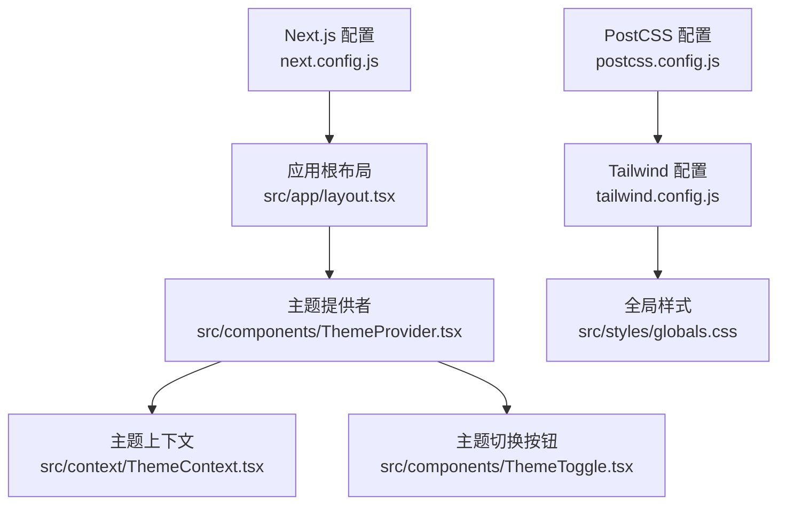
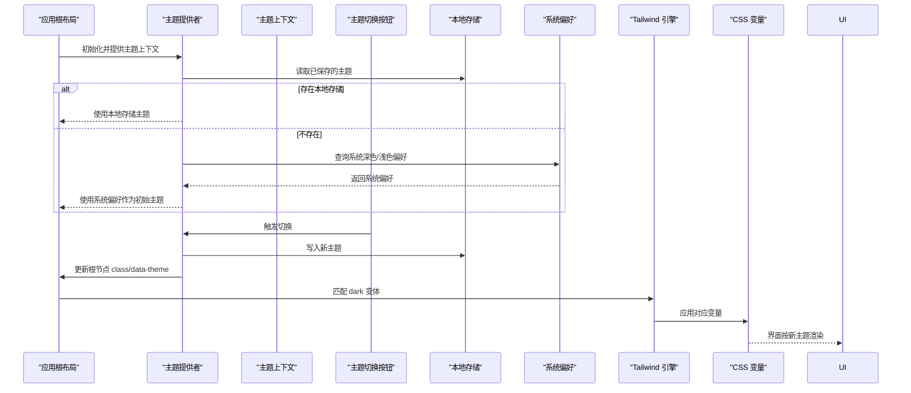
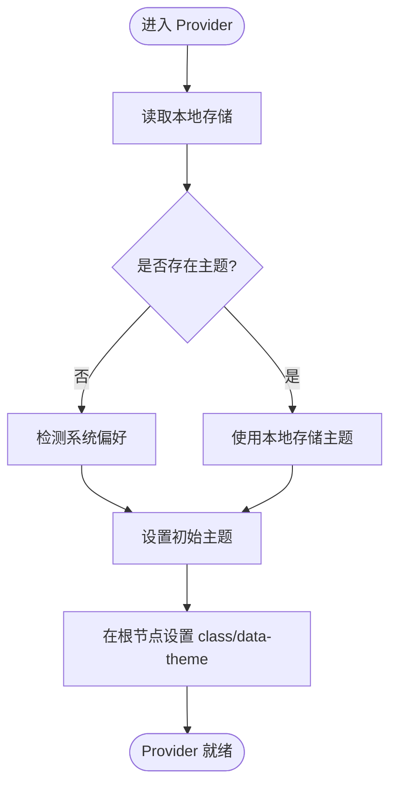
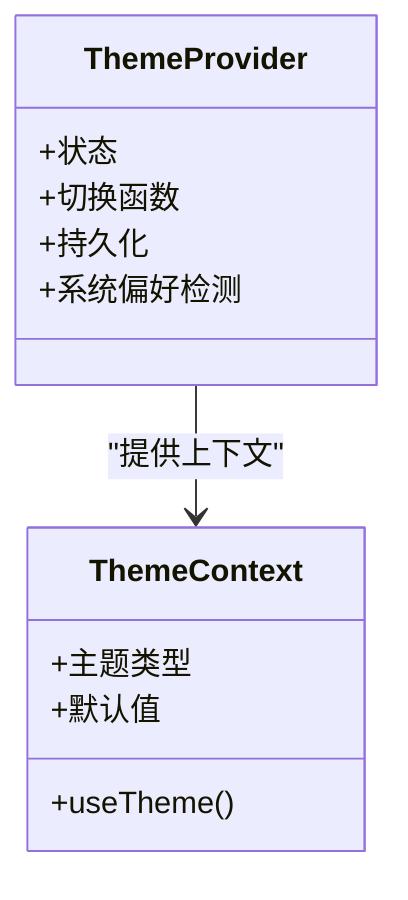
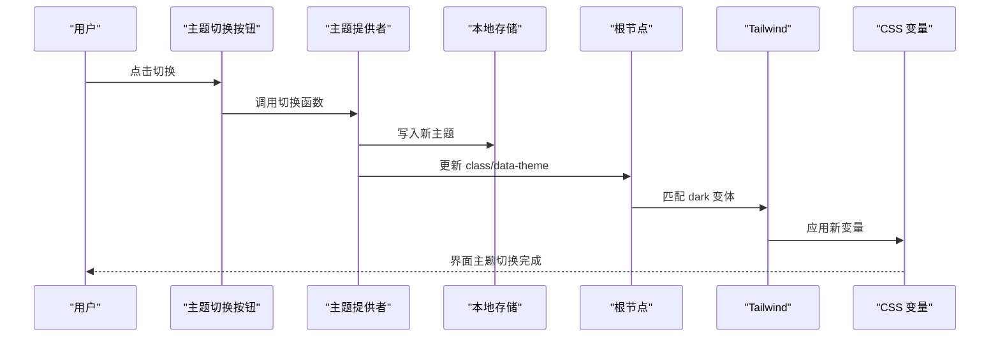
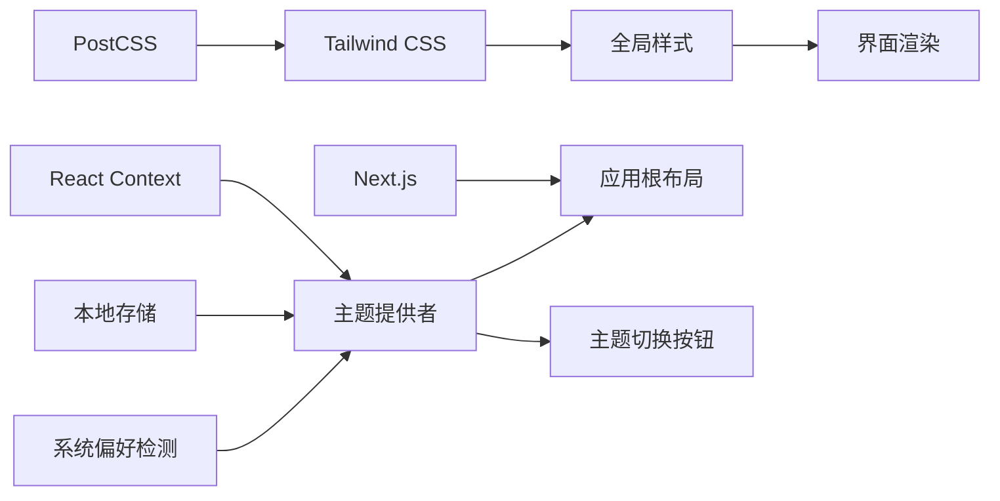

# 主题系统

<cite>
**本文引用的文件**   
- [src/app/layout.tsx](file://src/app/layout.tsx)
- [src/components/ThemeProvider.tsx](file://src/components/ThemeProvider.tsx)
- [src/context/ThemeContext.tsx](file://src/context/ThemeContext.tsx)
- [src/components/ThemeToggle.tsx](file://src/components/ThemeToggle.tsx)
- [tailwind.config.js](file://tailwind.config.js)
- [postcss.config.js](file://postcss.config.js)
- [next.config.js](file://next.config.js)
- [src/styles/globals.css](file://src/styles/globals.css)
- [package.json](file://package.json)
</cite>

## 目录
1. [简介](#简介)
2. [项目结构](#项目结构)
3. [核心组件](#核心组件)
4. [架构总览](#架构总览)
5. [详细组件分析](#详细组件分析)
6. [依赖关系分析](#依赖关系分析)
7. [性能考虑](#性能考虑)
8. [故障排查指南](#故障排查指南)
9. [结论](#结论)
10. [附录：自定义主题完整指南](#附录自定义主题完整指南)

## 简介
本技术文档围绕项目的“主题系统”展开，系统性阐述主题切换机制的实现原理与最佳实践。内容覆盖 React Context 状态管理、本地存储持久化、系统偏好检测、深色/浅色模式样式实现（CSS 变量与 Tailwind CSS 配置）、主题 Provider 的工作流程与组件集成方式、切换动画与用户体验优化、自定义主题扩展方法，以及与全局样式的集成策略和性能优化、错误处理方案。

## 项目结构
主题系统相关代码主要分布在以下位置：
- 应用根布局：用于挂载主题上下文与初始类名设置
- 主题提供者：封装主题状态、切换逻辑与持久化
- 主题上下文：暴露主题值与切换函数
- 主题切换按钮：触发主题切换的 UI 入口
- Tailwind 与 PostCSS 配置：启用 dark 模式与 CSS 变量支持
- Next.js 配置：确保客户端渲染时正确初始化主题
- 全局样式：定义 CSS 变量与基础过渡效果

图表来源
- [src/app/layout.tsx](file://src/app/layout.tsx)
- [src/components/ThemeProvider.tsx](file://src/components/ThemeProvider.tsx)
- [src/context/ThemeContext.tsx](file://src/context/ThemeContext.tsx)
- [src/components/ThemeToggle.tsx](file://src/components/ThemeToggle.tsx)
- [tailwind.config.js](file://tailwind.config.js)
- [postcss.config.js](file://postcss.config.js)
- [next.config.js](file://next.config.js)
- [src/styles/globals.css](file://src/styles/globals.css)

章节来源
- [src/app/layout.tsx](file://src/app/layout.tsx)
- [src/components/ThemeProvider.tsx](file://src/components/ThemeProvider.tsx)
- [src/context/ThemeContext.tsx](file://src/context/ThemeContext.tsx)
- [src/components/ThemeToggle.tsx](file://src/components/ThemeToggle.tsx)
- [tailwind.config.js](file://tailwind.config.js)
- [postcss.config.js](file://postcss.config.js)
- [next.config.js](file://next.config.js)
- [src/styles/globals.css](file://src/styles/globals.css)

## 核心组件
- 主题提供者（ThemeProvider）
  - 职责：维护当前主题状态、提供切换函数、将主题写入本地存储、根据系统偏好初始化主题、向子树注入主题上下文。
  - 关键点：在首次渲染前读取本地存储与系统偏好；避免服务端与客户端不一致导致的闪烁；通过 context 暴露给任意层级组件。
- 主题上下文（ThemeContext）
  - 职责：定义主题类型、默认值、上下文对象；导出 useTheme Hook 供消费。
  - 关键点：类型安全、默认值明确、便于扩展更多主题类型。
- 主题切换按钮（ThemeToggle）
  - 职责：提供用户交互入口，调用切换函数并更新 UI。
  - 关键点：无障碍标签、键盘可操作、图标随主题变化。
- 应用根布局（layout.tsx）
  - 职责：包裹整个应用的主题提供者；在 HTML 根节点设置 data-theme 或 class，驱动 Tailwind dark 模式与 CSS 变量生效。
  - 关键点：在服务端与客户端保持一致的初始主题；避免 SSR/CSR 差异。

章节来源
- [src/components/ThemeProvider.tsx](file://src/components/ThemeProvider.tsx)
- [src/context/ThemeContext.tsx](file://src/context/ThemeContext.tsx)
- [src/components/ThemeToggle.tsx](file://src/components/ThemeToggle.tsx)
- [src/app/layout.tsx](file://src/app/layout.tsx)

## 架构总览
主题系统的整体数据流与控制流如下：

图表来源
- [src/app/layout.tsx](file://src/app/layout.tsx)
- [src/components/ThemeProvider.tsx](file://src/components/ThemeProvider.tsx)
- [src/context/ThemeContext.tsx](file://src/context/ThemeContext.tsx)
- [src/components/ThemeToggle.tsx](file://src/components/ThemeToggle.tsx)
- [tailwind.config.js](file://tailwind.config.js)
- [src/styles/globals.css](file://src/styles/globals.css)

## 详细组件分析

### 主题提供者（ThemeProvider）
- 状态与生命周期
  - 从本地存储读取主题；若为空则回退到系统偏好；在首次渲染后同步到 DOM 根节点。
  - 切换函数负责更新状态、持久化、以及更新根节点 class 或 data 属性。
- 与系统偏好联动
  - 可选监听系统主题变更事件，自动同步到本地存储与 UI。
- 与 Tailwind 集成
  - 通过在根节点添加特定 class（如 dark），使 Tailwind 的 dark 变体生效。
- 与 CSS 变量集成
  - 在根节点设置 CSS 变量键值对，供全局样式与组件样式引用。

图表来源
- [src/components/ThemeProvider.tsx](file://src/components/ThemeProvider.tsx)
- [src/app/layout.tsx](file://src/app/layout.tsx)

章节来源
- [src/components/ThemeProvider.tsx](file://src/components/ThemeProvider.tsx)
- [src/app/layout.tsx](file://src/app/layout.tsx)

### 主题上下文（ThemeContext）
- 类型设计
  - 定义主题枚举/联合类型（例如 light/dark），可扩展为更多主题。
  - 提供默认值与上下文对象，导出 useTheme Hook。
- 扩展性
  - 新增主题类型时，仅需扩展类型定义与对应的样式映射。

图表来源
- [src/context/ThemeContext.tsx](file://src/context/ThemeContext.tsx)
- [src/components/ThemeProvider.tsx](file://src/components/ThemeProvider.tsx)

章节来源
- [src/context/ThemeContext.tsx](file://src/context/ThemeContext.tsx)

### 主题切换按钮（ThemeToggle）
- 交互行为
  - 点击触发切换函数，更新主题并刷新 UI。
- 可访问性
  - 提供 aria-label、键盘操作支持、焦点样式。
- 图标适配
  - 根据当前主题显示不同图标（太阳/月亮）。

图表来源
- [src/components/ThemeToggle.tsx](file://src/components/ThemeToggle.tsx)
- [src/components/ThemeProvider.tsx](file://src/components/ThemeProvider.tsx)
- [tailwind.config.js](file://tailwind.config.js)
- [src/styles/globals.css](file://src/styles/globals.css)

章节来源
- [src/components/ThemeToggle.tsx](file://src/components/ThemeToggle.tsx)

### 应用根布局（layout.tsx）
- 作用
  - 包裹整个应用的主题提供者；在 HTML 根节点设置 class 或 data 属性，驱动 Tailwind 与 CSS 变量。
- 注意事项
  - 在服务端与客户端保持一致的初始主题，避免闪烁。
  - 确保在首屏渲染前完成主题初始化。

章节来源
- [src/app/layout.tsx](file://src/app/layout.tsx)

## 依赖关系分析
- 运行时依赖
  - React Context：跨组件共享主题状态与切换函数。
  - 本地存储：持久化用户选择，保证刷新后主题一致。
  - 系统 API：检测系统深色/浅色偏好。
- 构建与样式依赖
  - Tailwind CSS：dark 模式与变体选择器。
  - PostCSS：解析 Tailwind 指令与插件。
  - Next.js：SSR/CSR 一致性、客户端初始化时机。
  - CSS 变量：集中管理颜色与样式语义。

图表来源
- [src/components/ThemeProvider.tsx](file://src/components/ThemeProvider.tsx)
- [src/context/ThemeContext.tsx](file://src/context/ThemeContext.tsx)
- [src/components/ThemeToggle.tsx](file://src/components/ThemeToggle.tsx)
- [tailwind.config.js](file://tailwind.config.js)
- [postcss.config.js](file://postcss.config.js)
- [next.config.js](file://next.config.js)
- [src/styles/globals.css](file://src/styles/globals.css)

章节来源
- [package.json](file://package.json)
- [tailwind.config.js](file://tailwind.config.js)
- [postcss.config.js](file://postcss.config.js)
- [next.config.js](file://next.config.js)

## 性能考虑
- 减少重排与重绘
  - 仅在根节点切换 class 或 data 属性，避免频繁操作大量 DOM。
  - 使用 CSS 变量集中管理颜色，配合 Tailwind 变体最小化样式计算。
- 避免闪烁
  - 在服务端与客户端同步初始主题，确保首屏渲染一致。
  - 在 Provider 中尽早读取本地存储与系统偏好，并在首次渲染后立即应用到根节点。
- 事件监听优化
  - 系统主题变更监听应防抖或去抖，避免频繁切换。
- 资源加载
  - 图标与图片按需加载，避免阻塞首屏。
- 可访问性与体验
  - 提供平滑过渡动画，提升切换体验；保持键盘导航与屏幕阅读器友好。

[本节为通用指导，不直接分析具体文件]

## 故障排查指南
- 主题未持久化
  - 检查本地存储读写是否受浏览器限制（隐私模式、第三方 Cookie 禁用等）。
  - 确认 Provider 在切换后确实写入本地存储。
- 首屏闪烁
  - 检查 SSR/CSR 初始化顺序，确保在根布局中先设置 class 再渲染内容。
  - 验证 Tailwind dark 模式配置是否正确。
- 系统偏好未生效
  - 检查系统偏好检测逻辑与监听事件是否被正确注册。
  - 确认在首次渲染时能正确读取系统偏好并回退。
- 样式未应用
  - 检查全局样式中的 CSS 变量是否与 Tailwind 配置一致。
  - 确认 PostCSS 与 Tailwind 版本兼容。
- 可访问性问题
  - 检查切换按钮的 aria-label、焦点样式与键盘操作。

章节来源
- [src/components/ThemeProvider.tsx](file://src/components/ThemeProvider.tsx)
- [src/components/ThemeToggle.tsx](file://src/components/ThemeToggle.tsx)
- [tailwind.config.js](file://tailwind.config.js)
- [postcss.config.js](file://postcss.config.js)
- [src/styles/globals.css](file://src/styles/globals.css)

## 结论
本主题系统以 React Context 为核心，结合本地存储与系统偏好检测，实现了稳定、可扩展且用户体验友好的主题切换能力。通过 Tailwind CSS 的 dark 模式与 CSS 变量的协同，样式管理与维护成本显著降低。遵循本文的最佳实践与性能优化建议，可在大型应用中稳健地扩展更多主题类型与个性化选项。

[本节为总结，不直接分析具体文件]

## 附录：自定义主题完整指南

- 新增主题类型
  - 在主题上下文中扩展主题类型定义（例如增加 sepia、highContrast）。
  - 在 Provider 中为新类型添加切换分支与持久化逻辑。
  - 在根布局中为新类型设置对应的 class 或 data 属性。
- 颜色方案定义
  - 在全局样式中为每种主题定义一组 CSS 变量（背景、前景、强调色、边框等）。
  - 在 Tailwind 配置中映射这些变量到语义化 token，便于在组件中使用。
- 样式覆盖方法
  - 优先使用 Tailwind 的 dark 变体与 CSS 变量组合，避免硬编码颜色。
  - 对于复杂组件，可通过局部样式覆盖，但需确保与全局变量保持一致。
- 新增主题类型的实现步骤
  - 扩展类型定义与默认值。
  - 在 Provider 中添加新主题的初始化与切换逻辑。
  - 在全局样式中为新主题定义变量集。
  - 在 Tailwind 配置中注册新变体或别名。
  - 在根布局中为新主题设置 class 或 data 属性。
- 与全局样式的集成
  - 统一在根节点设置 class 或 data 属性，驱动 Tailwind 与 CSS 变量。
  - 使用语义化变量命名，避免耦合具体主题名称。
- 最佳实践
  - 保持主题切换原子性：一次只修改根节点属性。
  - 提供平滑过渡动画，避免突兀变化。
  - 为所有可交互元素提供可访问性支持。
  - 在测试中覆盖主题切换、持久化与系统偏好回退路径。

章节来源
- [src/context/ThemeContext.tsx](file://src/context/ThemeContext.tsx)
- [src/components/ThemeProvider.tsx](file://src/components/ThemeProvider.tsx)
- [src/styles/globals.css](file://src/styles/globals.css)
- [tailwind.config.js](file://tailwind.config.js)
- [src/app/layout.tsx](file://src/app/layout.tsx)