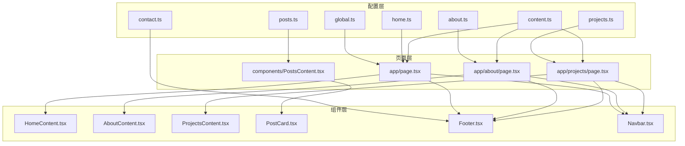
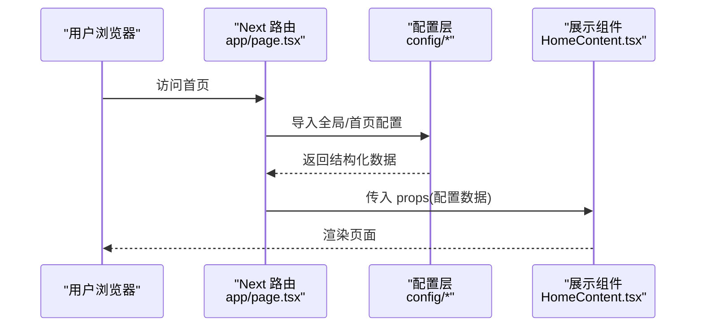
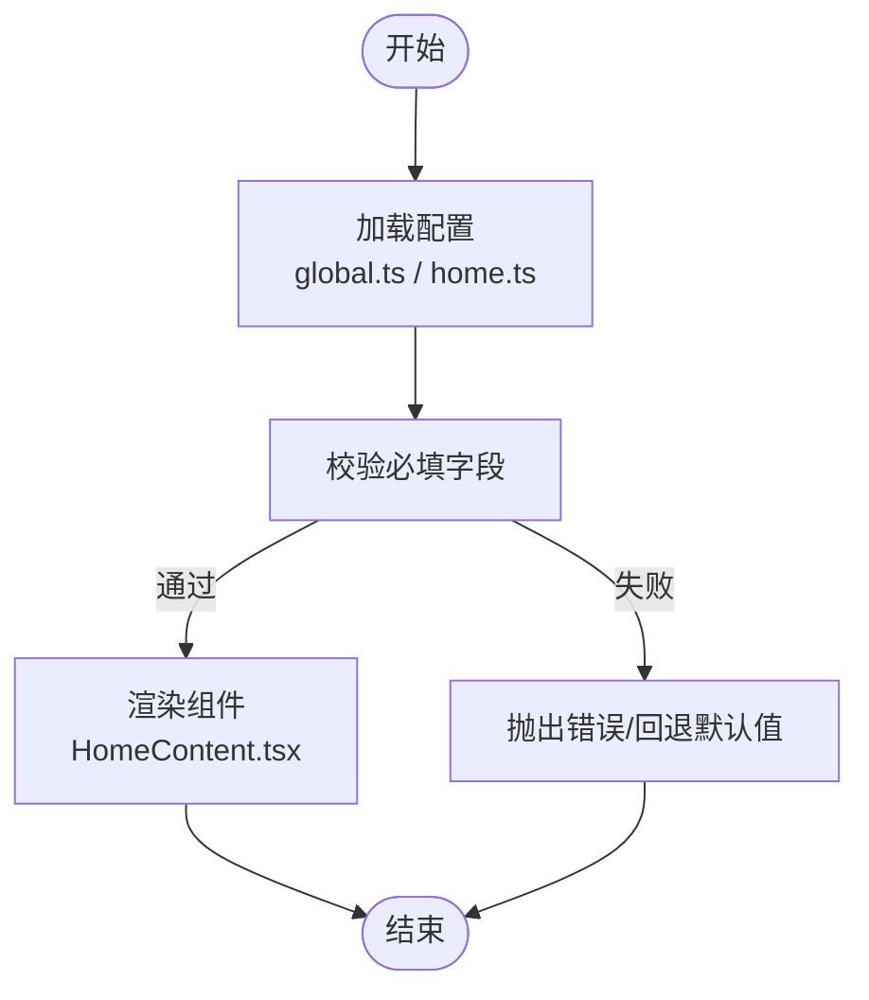
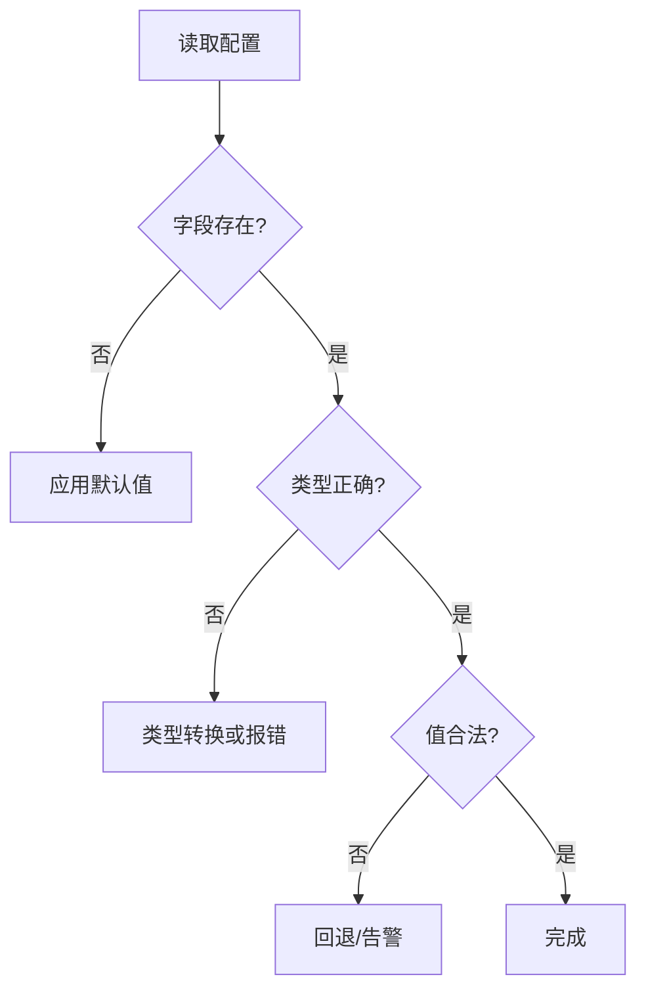
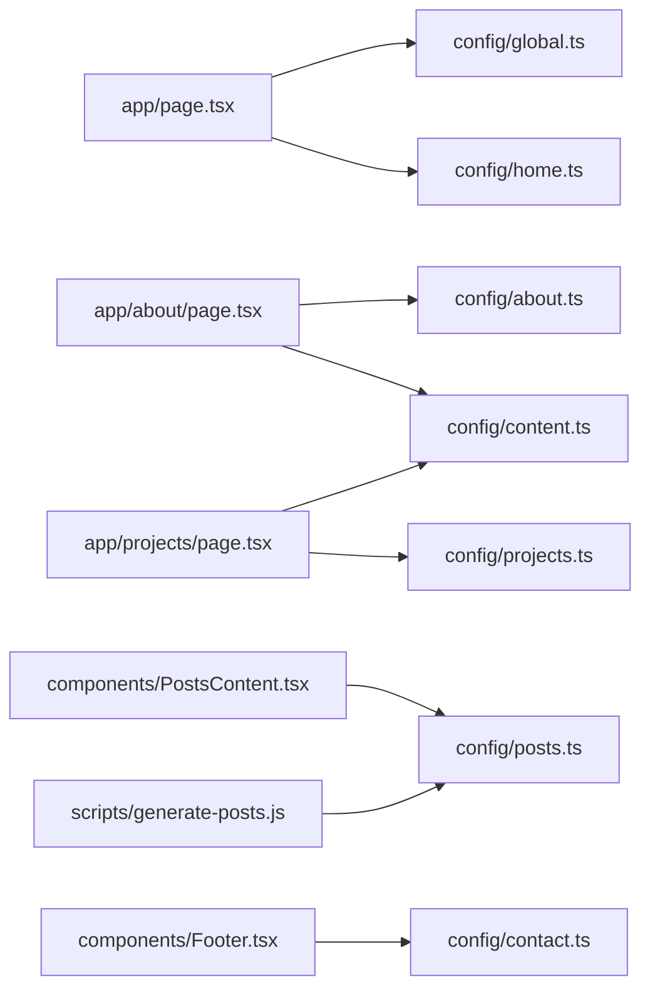

# 内容管理系统

<cite>
**本文引用的文件**   
- [src/config/global.ts](file://src/config/global.ts)
- [src/config/home.ts](file://src/config/home.ts)
- [src/config/about.ts](file://src/config/about.ts)
- [src/config/projects.ts](file://src/config/projects.ts)
- [src/config/contact.ts](file://src/config/contact.ts)
- [src/config/posts.ts](file://src/config/posts.ts)
- [src/config/content.ts](file://src/config/content.ts)
- [src/app/page.tsx](file://src/app/page.tsx)
- [src/app/about/page.tsx](file://src/app/about/page.tsx)
- [src/app/projects/page.tsx](file://src/app/projects/page.tsx)
- [src/components/HomeContent.tsx](file://src/components/HomeContent.tsx)
- [src/components/AboutContent.tsx](file://src/components/AboutContent.tsx)
- [src/components/ProjectsContent.tsx](file://src/components/ProjectsContent.tsx)
- [src/components/PostsContent.tsx](file://src/components/PostsContent.tsx)
- [src/components/PostCard.tsx](file://src/components/PostCard.tsx)
- [src/components/Footer.tsx](file://src/components/Footer.tsx)
- [src/components/Navbar.tsx](file://src/components/Navbar.tsx)
- [src/types/post.ts](file://src/types/post.ts)
- [scripts/generate-posts.js](file://scripts/generate-posts.js)
</cite>

## 目录
1. [简介](#简介)
2. [项目结构](#项目结构)
3. [核心组件](#核心组件)
4. [架构总览](#架构总览)
5. [详细组件分析](#详细组件分析)
6. [依赖关系分析](#依赖关系分析)
7. [性能考虑](#性能考虑)
8. [故障排查指南](#故障排查指南)
9. [结论](#结论)
10. [附录](#附录)

## 简介
本文件为内容管理系统的配置驱动开发文档，聚焦“配置即数据、渲染即展示”的设计原则。系统通过集中化的配置文件定义首页、关于页、项目展示、联系方式与文章列表等页面内容与行为；页面组件仅负责读取配置并渲染，从而实现内容与展示的解耦。本文档涵盖：
- 配置对象的数据模型与字段说明
- 动态内容生成机制与渲染流程
- 配置验证与数据转换策略
- 自定义内容类型的扩展方法与最佳实践
- 配置热重载与开发体验优化建议
- 面向内容创作者的配置指南

## 项目结构
本项目采用“配置层 + 组件层 + 页面路由层”的分层组织方式：
- 配置层：位于 src/config，按模块拆分（全局、首页、关于、项目、联系、文章、通用内容）
- 组件层：位于 src/components，提供可复用的展示组件
- 页面层：位于 src/app，将配置注入到对应页面组件中
- 类型定义：位于 src/types，统一数据结构契约
- 脚本：scripts 下包含静态资源或页面生成的辅助脚本

图表来源
- [src/config/global.ts](file://src/config/global.ts)
- [src/config/home.ts](file://src/config/home.ts)
- [src/config/about.ts](file://src/config/about.ts)
- [src/config/projects.ts](file://src/config/projects.ts)
- [src/config/contact.ts](file://src/config/contact.ts)
- [src/config/posts.ts](file://src/config/posts.ts)
- [src/config/content.ts](file://src/config/content.ts)
- [src/app/page.tsx](file://src/app/page.tsx)
- [src/app/about/page.tsx](file://src/app/about/page.tsx)
- [src/app/projects/page.tsx](file://src/app/projects/page.tsx)
- [src/components/HomeContent.tsx](file://src/components/HomeContent.tsx)
- [src/components/AboutContent.tsx](file://src/components/AboutContent.tsx)
- [src/components/ProjectsContent.tsx](file://src/components/ProjectsContent.tsx)
- [src/components/PostsContent.tsx](file://src/components/PostsContent.tsx)
- [src/components/PostCard.tsx](file://src/components/PostCard.tsx)
- [src/components/Footer.tsx](file://src/components/Footer.tsx)
- [src/components/Navbar.tsx](file://src/components/Navbar.tsx)

章节来源
- [src/config/global.ts](file://src/config/global.ts)
- [src/config/home.ts](file://src/config/home.ts)
- [src/config/about.ts](file://src/config/about.ts)
- [src/config/projects.ts](file://src/config/projects.ts)
- [src/config/contact.ts](file://src/config/contact.ts)
- [src/config/posts.ts](file://src/config/posts.ts)
- [src/config/content.ts](file://src/config/content.ts)
- [src/app/page.tsx](file://src/app/page.tsx)
- [src/app/about/page.tsx](file://src/app/about/page.tsx)
- [src/app/projects/page.tsx](file://src/app/projects/page.tsx)
- [src/components/HomeContent.tsx](file://src/components/HomeContent.tsx)
- [src/components/AboutContent.tsx](file://src/components/AboutContent.tsx)
- [src/components/ProjectsContent.tsx](file://src/components/ProjectsContent.tsx)
- [src/components/PostsContent.tsx](file://src/components/PostsContent.tsx)
- [src/components/PostCard.tsx](file://src/components/PostCard.tsx)
- [src/components/Footer.tsx](file://src/components/Footer.tsx)
- [src/components/Navbar.tsx](file://src/components/Navbar.tsx)

## 核心组件
- 全局配置 global.ts：站点元信息、主题、导航、SEO、社交链接等
- 首页配置 home.ts：首屏区块、轮播、亮点、CTA 等
- 关于配置 about.ts：个人简介、时间线、技能、经历等
- 项目配置 projects.ts：项目卡片、标签、链接、状态等
- 联系配置 contact.ts：邮箱、表单字段、社交入口等
- 文章配置 posts.ts：文章索引、排序、筛选、分页等
- 通用内容 content.ts：跨页面共享的文案、提示、错误信息等

这些配置以纯数据形式导出，页面组件按需导入并渲染，避免在组件内硬编码业务文本与路由。

章节来源
- [src/config/global.ts](file://src/config/global.ts)
- [src/config/home.ts](file://src/config/home.ts)
- [src/config/about.ts](file://src/config/about.ts)
- [src/config/projects.ts](file://src/config/projects.ts)
- [src/config/contact.ts](file://src/config/contact.ts)
- [src/config/posts.ts](file://src/config/posts.ts)
- [src/config/content.ts](file://src/config/content.ts)

## 架构总览
配置驱动的核心在于“数据与视图分离”。页面作为装配器，从配置层拉取数据，交由展示组件渲染。

图表来源
- [src/app/page.tsx](file://src/app/page.tsx)
- [src/config/global.ts](file://src/config/global.ts)
- [src/config/home.ts](file://src/config/home.ts)
- [src/components/HomeContent.tsx](file://src/components/HomeContent.tsx)

## 详细组件分析

### 配置对象数据模型与字段定义
以下为各配置模块的典型字段约定（具体键名以实际实现为准）。建议在类型文件中统一声明，确保强类型约束。

- 全局配置 global.ts
  - 站点标识：名称、描述、语言、时区
  - SEO：标题模板、默认关键词、OpenGraph 基础信息
  - 主题：主色、字体、布局密度
  - 导航：菜单项（标题、路径、是否外链）
  - 社交：GitHub、博客、邮箱等链接
  - 版权：年份、许可协议

- 首页配置 home.ts
  - 英雄区：标题、副标题、CTA 按钮
  - 亮点：图标、标题、描述
  - 推荐项目：引用项目 ID 或片段
  - 公告/横幅：内容、样式、关闭策略

- 关于配置 about.ts
  - 简介：头像、姓名、角色、摘要
  - 经历：公司、职位、时间段、职责要点
  - 技能：分类、条目、熟练度
  - 时间线：事件、日期、描述

- 项目配置 projects.ts
  - 项目清单：ID、标题、摘要、封面、技术栈、链接、状态
  - 分组/标签：用于筛选与聚合
  - 排序规则：默认顺序、置顶标记

- 联系配置 contact.ts
  - 联系方式：邮箱、电话、地址
  - 表单字段：姓名、邮箱、留言、校验规则
  - 社交入口：平台与链接映射

- 文章配置 posts.ts
  - 索引：slug、标题、摘要、封面、标签、发布时间
  - 排序：按时间、热度、权重
  - 分页：每页数量、最大页数
  - 搜索：关键词字段、高亮策略

- 通用内容 content.ts
  - 多语言键值对（可扩展）
  - 错误提示、占位文案、空状态文案
  - 公共操作文案（保存、取消、删除等）

章节来源
- [src/config/global.ts](file://src/config/global.ts)
- [src/config/home.ts](file://src/config/home.ts)
- [src/config/about.ts](file://src/config/about.ts)
- [src/config/projects.ts](file://src/config/projects.ts)
- [src/config/contact.ts](file://src/config/contact.ts)
- [src/config/posts.ts](file://src/config/posts.ts)
- [src/config/content.ts](file://src/config/content.ts)

### 动态内容生成机制与渲染流程
- 构建期生成
  - 使用脚本批量处理 Markdown 或外部数据源，生成页面或索引数据
  - 输出产物供 Next 静态生成或运行时读取
- 运行期渲染
  - 页面组件导入配置，组装 props
  - 展示组件根据配置渲染 UI，支持条件分支与列表循环
- 示例流程（首页）
  - app/page.tsx 导入 global.ts 与 home.ts
  - 将配置传递给 HomeContent.tsx
  - HomeContent.tsx 渲染英雄区、亮点、推荐项目等

图表来源
- [src/app/page.tsx](file://src/app/page.tsx)
- [src/config/global.ts](file://src/config/global.ts)
- [src/config/home.ts](file://src/config/home.ts)
- [src/components/HomeContent.tsx](file://src/components/HomeContent.tsx)

章节来源
- [src/app/page.tsx](file://src/app/page.tsx)
- [src/components/HomeContent.tsx](file://src/components/HomeContent.tsx)

### 配置验证与数据转换
- 验证策略
  - 在配置导入处进行最小化校验（非空、类型、枚举值）
  - 对敏感字段（URL、邮箱）做格式校验
  - 对数组元素进行子项校验（如导航项必须包含标题与路径）
- 转换策略
  - 将相对路径转换为绝对 URL
  - 将字符串布尔值转为布尔类型
  - 将时间字符串标准化为统一格式
- 错误处理
  - 校验失败时记录上下文（模块、字段、值）
  - 提供降级默认值，保证页面可渲染

[此图为概念流程图，不直接映射具体源码文件]

### 自定义内容类型的扩展方法
- 新增配置模块
  - 在 src/config 下新建模块文件，导出结构化数据
  - 在类型文件中补充接口定义，确保强类型
- 接入页面
  - 在目标页面导入新配置，并将其作为 props 传给展示组件
- 复用组件
  - 将通用展示逻辑下沉至组件层，避免重复代码
- 版本兼容
  - 为新字段设置默认值，保持向后兼容
- 示例参考
  - 参考现有模块（如 projects.ts）的结构与命名规范

章节来源
- [src/config/projects.ts](file://src/config/projects.ts)
- [src/components/ProjectsContent.tsx](file://src/components/ProjectsContent.tsx)

### 配置热重载与开发体验优化
- 本地开发
  - 使用 Next 开发服务器，修改配置后自动刷新
  - 将易变文案抽离到配置，减少重启成本
- 构建期优化
  - 使用环境变量区分开发与生产环境
  - 对大体积图片等资源进行压缩与懒加载
- 调试技巧
  - 在页面顶部临时显示当前配置快照，便于核对
  - 对关键渲染分支增加日志输出

[本节为通用指导，不直接分析具体文件]

### 内容与展示分离原则与组件复用策略
- 原则
  - 配置只关心“有什么”，组件只关心“怎么展示”
  - 页面只做装配，不做业务逻辑
- 复用
  - 将列表、卡片、详情等通用 UI 抽象为组件
  - 通过 props 控制样式与行为，避免复制粘贴

章节来源
- [src/components/PostCard.tsx](file://src/components/PostCard.tsx)
- [src/components/PostsContent.tsx](file://src/components/PostsContent.tsx)

### 面向内容创作者的配置指南
- 更新首页文案
  - 编辑首页配置，调整标题、副标题与 CTA
- 发布新项目
  - 在项目配置中添加条目，填写必要字段（标题、摘要、链接）
- 撰写文章
  - 在文章配置中登记索引信息，确保 slug 唯一
- 变更联系方式
  - 更新联系配置中的邮箱与社交链接
- 注意事项
  - 遵循字段约束，避免遗漏必填项
  - 使用统一的命名与格式，便于检索与维护

章节来源
- [src/config/home.ts](file://src/config/home.ts)
- [src/config/projects.ts](file://src/config/projects.ts)
- [src/config/contact.ts](file://src/config/contact.ts)
- [src/config/posts.ts](file://src/config/posts.ts)

## 依赖关系分析
- 页面到配置的单向依赖
  - app/page.tsx 依赖 global.ts 与 home.ts
  - app/about/page.tsx 依赖 about.ts 与 content.ts
  - app/projects/page.tsx 依赖 projects.ts 与 content.ts
- 组件到配置的间接依赖
  - 展示组件通过 props 接收配置数据，不直接导入配置
- 工具与脚本
  - scripts/generate-posts.js 可用于批量生成文章索引或静态页面

图表来源
- [src/app/page.tsx](file://src/app/page.tsx)
- [src/app/about/page.tsx](file://src/app/about/page.tsx)
- [src/app/projects/page.tsx](file://src/app/projects/page.tsx)
- [src/config/global.ts](file://src/config/global.ts)
- [src/config/home.ts](file://src/config/home.ts)
- [src/config/about.ts](file://src/config/about.ts)
- [src/config/projects.ts](file://src/config/projects.ts)
- [src/config/contact.ts](file://src/config/contact.ts)
- [src/config/posts.ts](file://src/config/posts.ts)
- [src/config/content.ts](file://src/config/content.ts)
- [src/components/PostsContent.tsx](file://src/components/PostsContent.tsx)
- [src/components/Footer.tsx](file://src/components/Footer.tsx)
- [scripts/generate-posts.js](file://scripts/generate-posts.js)

章节来源
- [src/app/page.tsx](file://src/app/page.tsx)
- [src/app/about/page.tsx](file://src/app/about/page.tsx)
- [src/app/projects/page.tsx](file://src/app/projects/page.tsx)
- [src/config/global.ts](file://src/config/global.ts)
- [src/config/home.ts](file://src/config/home.ts)
- [src/config/about.ts](file://src/config/about.ts)
- [src/config/projects.ts](file://src/config/projects.ts)
- [src/config/contact.ts](file://src/config/contact.ts)
- [src/config/posts.ts](file://src/config/posts.ts)
- [src/config/content.ts](file://src/config/content.ts)
- [src/components/PostsContent.tsx](file://src/components/PostsContent.tsx)
- [src/components/Footer.tsx](file://src/components/Footer.tsx)
- [scripts/generate-posts.js](file://scripts/generate-posts.js)

## 性能考虑
- 配置体积控制
  - 将大段文案拆分为独立模块，按需导入
- 渲染优化
  - 列表项使用稳定 key，避免不必要的重渲染
  - 图片懒加载与尺寸裁剪
- 缓存策略
  - 构建期生成静态资源，减少运行时开销
- 监控与度量
  - 对关键渲染路径添加性能埋点，定位瓶颈

[本节为通用指导，不直接分析具体文件]

## 故障排查指南
- 常见问题
  - 配置缺失必填字段：检查对应模块的字段完整性
  - 类型不一致：确认字符串/布尔/数字等类型转换
  - 路径错误：校验相对路径与资源是否存在
- 定位步骤
  - 在页面顶部打印当前配置快照
  - 逐步注释渲染分支，缩小问题范围
  - 查看控制台错误堆栈，定位具体模块
- 恢复策略
  - 启用默认值与回退文案，保障页面可用
  - 使用 Git 快速回滚到上一个稳定版本

章节来源
- [src/config/global.ts](file://src/config/global.ts)
- [src/config/home.ts](file://src/config/home.ts)
- [src/config/about.ts](file://src/config/about.ts)
- [src/config/projects.ts](file://src/config/projects.ts)
- [src/config/contact.ts](file://src/config/contact.ts)
- [src/config/posts.ts](file://src/config/posts.ts)
- [src/config/content.ts](file://src/config/content.ts)

## 结论
通过将内容全面配置化，并与展示组件严格解耦，本系统实现了高可维护性与良好的开发者体验。配合类型约束、校验与回退机制，可在保证稳定性的同时提升迭代效率。建议持续完善类型定义与校验逻辑，并将更多易变内容迁移至配置层，进一步降低耦合度。

## 附录
- 术语
  - 配置驱动：以配置为中心驱动页面内容与行为的开发模式
  - 展示组件：仅负责渲染 UI 的可复用组件
  - 页面装配器：负责组合配置与组件的页面级容器
- 最佳实践清单
  - 所有易变文案进入配置
  - 页面只做装配，不做业务逻辑
  - 为每个配置模块编写最小化校验
  - 为新增字段提供默认值，保持向后兼容
  - 使用稳定的 key 与合理的列表分页

[本节为概念性附录，不直接分析具体文件]