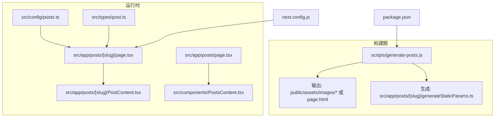
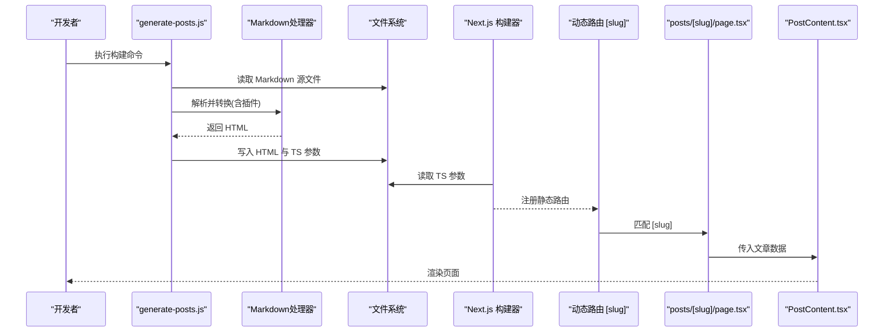
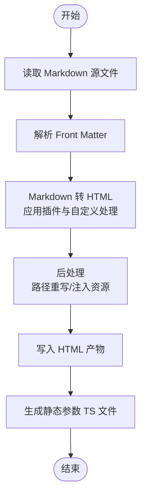
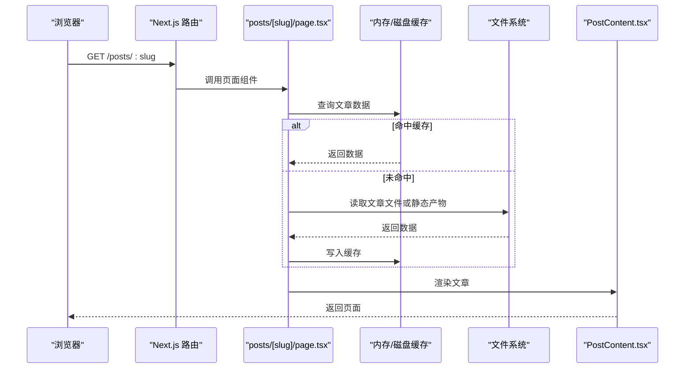
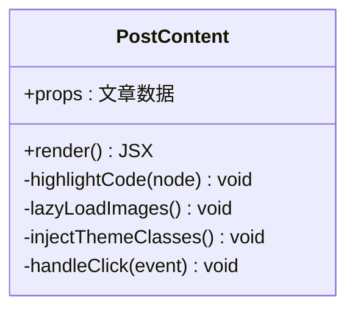
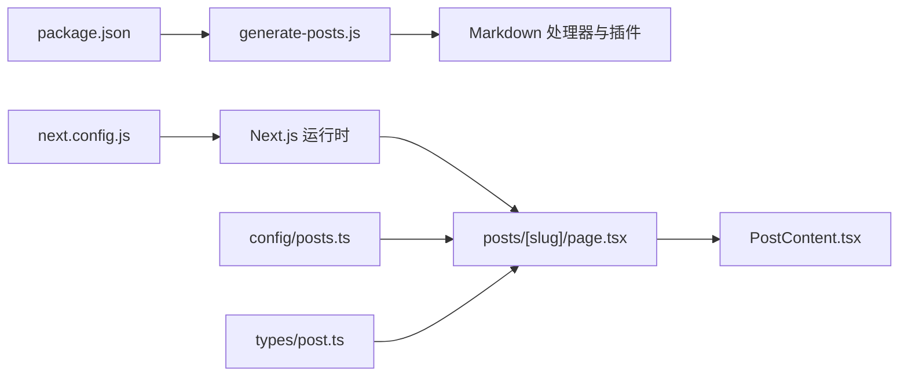

# Markdown处理与渲染

<cite>
**本文引用的文件**   
- [scripts/generate-posts.js](file://scripts/generate-posts.js)
- [src/app/posts/[slug]/PostContent.tsx](file://src/app/posts/[slug]/PostContent.tsx)
- [src/app/posts/[slug]/page.tsx](file://src/app/posts/[slug]/page.tsx)
- [src/app/posts/[slug]/generateStaticParams.ts](file://src/app/posts/[slug]/generateStaticParams.ts)
- [src/app/posts/page.tsx](file://src/app/posts/page.tsx)
- [src/components/PostsContent.tsx](file://src/components/PostsContent.tsx)
- [src/config/posts.ts](file://src/config/posts.ts)
- [src/types/post.ts](file://src/types/post.ts)
- [next.config.js](file://next.config.js)
- [package.json](file://package.json)
</cite>

## 目录
1. [简介](#简介)
2. [项目结构](#项目结构)
3. [核心组件](#核心组件)
4. [架构总览](#架构总览)
5. [详细组件分析](#详细组件分析)
6. [依赖关系分析](#依赖关系分析)
7. [性能考虑](#性能考虑)
8. [故障排查指南](#故障排查指南)
9. [结论](#结论)
10. [附录](#附录)

## 简介
本仓库实现了一个基于 Next.js 的静态博客系统，核心能力包括：
- 将位于 src/posts 下的 Markdown 源文件在构建期转换为 HTML 页面，并生成对应的路由参数。
- 在运行时通过动态路由 [slug] 加载文章，并在 PostContent 组件中渲染 Markdown 内容、代码高亮、图片等。
- 提供统一的配置与类型定义，便于扩展语法、样式与交互。

该文档围绕以下目标展开：
- 深入解释 generate-posts.js 脚本的工作原理（Markdown 解析、内容提取、TypeScript 代码生成）。
- 说明 Markdown 到 HTML 的转换过程（语法支持、插件配置、自定义处理逻辑）。
- 详解 PostContent 组件的实现（渲染、代码高亮、图片处理）。
- 解释动态路由参数的处理机制（[slug] 解析与文章内容加载）。
- 提供自定义 Markdown 处理器的方法（新增语法、样式定制、交互扩展）。
- 给出性能优化策略（缓存、懒加载、预加载）。
- 解决常见渲染问题与兼容性考虑。

## 项目结构
与 Markdown 处理与渲染相关的关键路径如下：
- 构建期脚本：scripts/generate-posts.js
- 运行时页面与组件：
  - src/app/posts/[slug]/page.tsx
  - src/app/posts/[slug]/PostContent.tsx
  - src/app/posts/[slug]/generateStaticParams.ts
  - src/app/posts/page.tsx
  - src/components/PostsContent.tsx
- 配置与类型：
  - src/config/posts.ts
  - src/types/post.ts
- 构建与依赖：
  - next.config.js
  - package.json

图表来源
- [scripts/generate-posts.js](file://scripts/generate-posts.js)
- [src/app/posts/[slug]/page.tsx](file://src/app/posts/[slug]/page.tsx)
- [src/app/posts/[slug]/PostContent.tsx](file://src/app/posts/[slug]/PostContent.tsx)
- [src/app/posts/[slug]/generateStaticParams.ts](file://src/app/posts/[slug]/generateStaticParams.ts)
- [src/app/posts/page.tsx](file://src/app/posts/page.tsx)
- [src/components/PostsContent.tsx](file://src/components/PostsContent.tsx)
- [src/config/posts.ts](file://src/config/posts.ts)
- [src/types/post.ts](file://src/types/post.ts)
- [next.config.js](file://next.config.js)
- [package.json](file://package.json)

章节来源
- [scripts/generate-posts.js](file://scripts/generate-posts.js)
- [src/app/posts/[slug]/page.tsx](file://src/app/posts/[slug]/page.tsx)
- [src/app/posts/[slug]/PostContent.tsx](file://src/app/posts/[slug]/PostContent.tsx)
- [src/app/posts/[slug]/generateStaticParams.ts](file://src/app/posts/[slug]/generateStaticParams.ts)
- [src/app/posts/page.tsx](file://src/app/posts/page.tsx)
- [src/components/PostsContent.tsx](file://src/components/PostsContent.tsx)
- [src/config/posts.ts](file://src/config/posts.ts)
- [src/types/post.ts](file://src/types/post.ts)
- [next.config.js](file://next.config.js)
- [package.json](file://package.json)

## 核心组件
- 构建期脚本 generate-posts.js
  - 职责：扫描 Markdown 源文件，解析元数据与正文，调用 Markdown 处理器生成 HTML，并将结果写入目标位置；同时生成用于 Next.js 静态参数生成的 TypeScript 文件。
  - 关键点：输入源目录、输出目录、Markdown 处理器配置、HTML 模板、TS 参数生成格式。
- 运行时页面 posts/[slug]/page.tsx
  - 职责：根据动态路由 slug 获取文章数据，渲染 PostContent 组件。
  - 关键点：从配置或文件系统读取文章，错误处理，SEO 元信息设置。
- 运行时组件 posts/[slug]/PostContent.tsx
  - 职责：接收已转换的 HTML 或结构化数据，进行安全渲染、代码高亮、图片处理、主题适配等。
  - 关键点：DOM 操作、事件委托、资源懒加载、可访问性。
- 文章列表页 posts/page.tsx 与 PostsContent.tsx
  - 职责：展示文章列表、搜索与筛选，按需加载详情。
  - 关键点：分页、索引、缓存。
- 配置与类型 config/posts.ts 与 types/post.ts
  - 职责：集中管理文章元数据、路由映射、字段类型约束。
  - 关键点：类型安全、可扩展字段。

章节来源
- [scripts/generate-posts.js](file://scripts/generate-posts.js)
- [src/app/posts/[slug]/page.tsx](file://src/app/posts/[slug]/page.tsx)
- [src/app/posts/[slug]/PostContent.tsx](file://src/app/posts/[slug]/PostContent.tsx)
- [src/app/posts/page.tsx](file://src/app/posts/page.tsx)
- [src/components/PostsContent.tsx](file://src/components/PostsContent.tsx)
- [src/config/posts.ts](file://src/config/posts.ts)
- [src/types/post.ts](file://src/types/post.ts)

## 架构总览
整体流程分为“构建期”和“运行期”两个阶段：
- 构建期
  - 脚本读取 Markdown 源文件，解析 front matter 与正文。
  - 使用 Markdown 处理器（如 remark/markdown-it）结合插件生成 HTML。
  - 将 HTML 写入目标目录，并生成 Next.js 静态参数文件。
- 运行期
  - Next.js 根据静态参数生成路由。
  - 请求到达时，page.tsx 根据 slug 定位文章数据，渲染 PostContent。
  - PostContent 负责最终渲染、高亮、图片处理与交互。

图表来源
- [scripts/generate-posts.js](file://scripts/generate-posts.js)
- [src/app/posts/[slug]/page.tsx](file://src/app/posts/[slug]/page.tsx)
- [src/app/posts/[slug]/PostContent.tsx](file://src/app/posts/[slug]/PostContent.tsx)
- [src/app/posts/[slug]/generateStaticParams.ts](file://src/app/posts/[slug]/generateStaticParams.ts)

## 详细组件分析

### 构建期脚本 generate-posts.js
- 功能要点
  - 扫描 Markdown 源文件集合，解析 front matter 与正文。
  - 调用 Markdown 处理器生成 HTML，可能包含自定义节点处理与插件链。
  - 将 HTML 写入目标目录（例如每个文章一个 page.html），并生成 Next.js 静态参数文件。
- 关键流程
  - 输入：Markdown 文件列表、处理器配置、输出目录。
  - 处理：解析 -> 转换 -> 后处理（如替换资源路径、注入样式/脚本）。
  - 输出：HTML 产物 + TS 参数文件。
- 扩展点
  - 新增语法：在处理器插件链中添加规则。
  - 自定义节点：对特定 AST 节点进行改写或注入。
  - 资源处理：图片路径重写、外链处理、内联资源控制。

图表来源
- [scripts/generate-posts.js](file://scripts/generate-posts.js)

章节来源
- [scripts/generate-posts.js](file://scripts/generate-posts.js)

### Markdown 到 HTML 的转换过程
- 语法支持
  - 基础 Markdown 语法（标题、段落、列表、链接、图片、表格、代码块等）。
  - 可选扩展（脚注、任务列表、数学公式、Mermaid 流程图等，取决于插件配置）。
- 插件配置
  - 解析阶段：front matter 解析、AST 遍历。
  - 渲染阶段：HTML 生成、自定义标签/属性处理。
  - 后处理：资源路径修正、注入 CSS/JS、安全过滤。
- 自定义处理逻辑
  - 针对特定节点插入额外 DOM 结构或数据属性。
  - 拦截图片节点，添加懒加载或占位图。
  - 为代码块注入语言标识与高亮类名。

章节来源
- [scripts/generate-posts.js](file://scripts/generate-posts.js)

### 运行时页面与动态路由 [slug]
- 路由匹配
  - Next.js 根据 generateStaticParams.ts 提供的参数表，预生成 /posts/{slug} 路由。
  - 请求到达时，page.tsx 解析 [slug]，定位对应文章数据。
- 数据加载
  - 优先从静态产物或内存缓存中读取，避免重复 IO。
  - 若未命中，回退至文件系统读取并缓存。
- 错误处理
  - 404 页面或友好提示。
  - 记录缺失资源或无效 slug 的错误日志。

图表来源
- [src/app/posts/[slug]/page.tsx](file://src/app/posts/[slug]/page.tsx)
- [src/app/posts/[slug]/generateStaticParams.ts](file://src/app/posts/[slug]/generateStaticParams.ts)
- [src/app/posts/[slug]/PostContent.tsx](file://src/app/posts/[slug]/PostContent.tsx)

章节来源
- [src/app/posts/[slug]/page.tsx](file://src/app/posts/[slug]/page.tsx)
- [src/app/posts/[slug]/generateStaticParams.ts](file://src/app/posts/[slug]/generateStaticParams.ts)

### PostContent 组件实现
- 渲染策略
  - 接受 HTML 字符串或结构化数据，进行安全渲染（防 XSS）。
  - 注入主题类名，适配明暗主题。
- 代码高亮
  - 识别代码块语言，注入高亮库所需类名。
  - 在客户端按需加载高亮样式与脚本。
- 图片处理
  - 自动添加懒加载属性，必要时生成缩略图或占位图。
  - 支持点击放大、灯箱效果（可选）。
- 交互扩展
  - 为特定节点绑定事件（如复制代码、跳转锚点）。
  - 与评论系统或分享组件集成。

图表来源
- [src/app/posts/[slug]/PostContent.tsx](file://src/app/posts/[slug]/PostContent.tsx)

章节来源
- [src/app/posts/[slug]/PostContent.tsx](file://src/app/posts/[slug]/PostContent.tsx)

### 文章列表与搜索
- 列表页 posts/page.tsx
  - 聚合所有文章元数据，提供分页与排序。
- 组件 PostsContent.tsx
  - 渲染卡片列表，支持关键词搜索与分类筛选。
  - 可接入本地索引以提升搜索性能。

章节来源
- [src/app/posts/page.tsx](file://src/app/posts/page.tsx)
- [src/components/PostsContent.tsx](file://src/components/PostsContent.tsx)

### 配置与类型
- 配置 posts.ts
  - 集中管理文章元数据、路由映射、默认值。
  - 便于统一修改 SEO、作者、发布时间等。
- 类型 post.ts
  - 定义文章数据结构与校验规则，提升类型安全。

章节来源
- [src/config/posts.ts](file://src/config/posts.ts)
- [src/types/post.ts](file://src/types/post.ts)

## 依赖关系分析
- 构建期依赖
  - Markdown 处理器与插件（由脚本引入）。
  - 文件系统读写与路径工具。
- 运行期依赖
  - Next.js 路由与静态参数生成。
  - 渲染与安全库（如 DOMPurify，若使用）。
  - 高亮库（如 highlight.js 或 Prism）。
  - 图片懒加载与灯箱库（可选）。

图表来源
- [package.json](file://package.json)
- [scripts/generate-posts.js](file://scripts/generate-posts.js)
- [next.config.js](file://next.config.js)
- [src/app/posts/[slug]/page.tsx](file://src/app/posts/[slug]/page.tsx)
- [src/app/posts/[slug]/PostContent.tsx](file://src/app/posts/[slug]/PostContent.tsx)
- [src/config/posts.ts](file://src/config/posts.ts)
- [src/types/post.ts](file://src/types/post.ts)

章节来源
- [package.json](file://package.json)
- [next.config.js](file://next.config.js)
- [scripts/generate-posts.js](file://scripts/generate-posts.js)
- [src/app/posts/[slug]/page.tsx](file://src/app/posts/[slug]/page.tsx)
- [src/app/posts/[slug]/PostContent.tsx](file://src/app/posts/[slug]/PostContent.tsx)
- [src/config/posts.ts](file://src/config/posts.ts)
- [src/types/post.ts](file://src/types/post.ts)

## 性能考虑
- 构建期优化
  - 增量构建：仅处理变更的 Markdown 文件。
  - 并行处理：多进程或并发转换，缩短构建时间。
  - 产物压缩：HTML/CSS/JS 压缩与树摇。
- 运行期优化
  - 缓存机制：内存缓存文章数据，减少 IO。
  - 懒加载：图片与代码高亮按需加载。
  - 预加载：对热门文章或首屏内容进行预取。
  - 路由级代码分割：按路由拆分组件与依赖。
- 资源优化
  - 图片 WebP/AVIF 与响应式尺寸。
  - 字体与图标子集化。
  - CDN 与缓存头配置。

[本节为通用指导，不直接分析具体文件]

## 故障排查指南
- 常见问题
  - 路由 404：检查 generateStaticParams.ts 是否生成正确，slug 是否与文件名一致。
  - 图片无法显示：确认路径重写是否正确，资源是否在 public 目录或可访问。
  - 代码高亮失效：确认语言类名与高亮库版本兼容，样式是否加载。
  - 主题不生效：检查主题类名注入与 Tailwind 配置。
- 调试建议
  - 在 page.tsx 打印路由参数与数据来源。
  - 在 PostContent 中输出渲染前的 DOM 片段，验证结构与类名。
  - 查看网络面板，确认资源加载顺序与状态码。
- 兼容性
  - 浏览器差异：确保 polyfill 与降级策略。
  - SSR/CSR 一致性：避免仅在客户端可用的 API 被服务端调用。
  - 第三方库版本冲突：锁定依赖版本，定期审计。

章节来源
- [src/app/posts/[slug]/page.tsx](file://src/app/posts/[slug]/page.tsx)
- [src/app/posts/[slug]/PostContent.tsx](file://src/app/posts/[slug]/PostContent.tsx)

## 结论
本系统通过构建期脚本将 Markdown 高效转换为 HTML，并结合 Next.js 的动态路由与组件化渲染，实现了高性能、可扩展的博客平台。通过合理的插件配置、组件实现与性能优化策略，可在保证用户体验的同时，持续扩展语法与交互能力。

[本节为总结性内容，不直接分析具体文件]

## 附录
- 自定义 Markdown 处理器步骤
  - 在 generate-posts.js 中注册新插件，定义 AST 节点处理逻辑。
  - 在后处理阶段注入样式与脚本，确保运行时可用。
  - 在 PostContent 中增加对应渲染与交互逻辑。
- 最佳实践
  - 保持 front matter 字段稳定，便于类型与配置管理。
  - 对敏感内容进行安全过滤，防止 XSS。
  - 使用语义化 HTML，提升可访问性与 SEO。

[本节为补充说明，不直接分析具体文件]