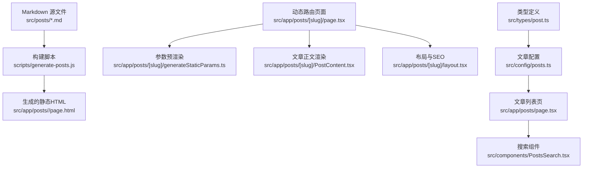
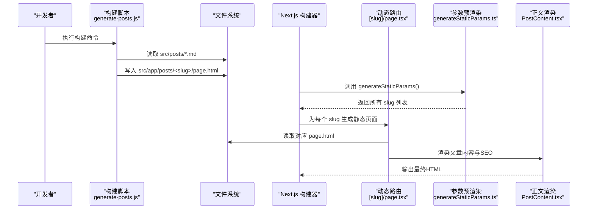
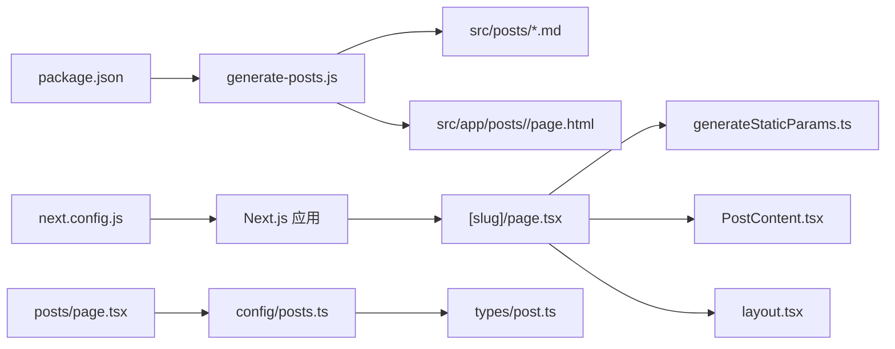

# 博客文章系统

<cite>
**本文引用的文件**   
- [scripts/generate-posts.js](file://scripts/generate-posts.js)
- [src/app/posts/[slug]/page.tsx](file://src/app/posts/[slug]/page.tsx)
- [src/app/posts/[slug]/generateStaticParams.ts](file://src/app/posts/[slug]/generateStaticParams.ts)
- [src/app/posts/[slug]/PostContent.tsx](file://src/app/posts/[slug]/PostContent.tsx)
- [src/app/posts/[slug]/layout.tsx](file://src/app/posts/[slug]/layout.tsx)
- [src/app/posts/page.tsx](file://src/app/posts/page.tsx)
- [src/components/PostsSearch.tsx](file://src/components/PostsSearch.tsx)
- [src/config/posts.ts](file://src/config/posts.ts)
- [src/types/post.ts](file://src/types/post.ts)
- [next.config.js](file://next.config.js)
- [package.json](file://package.json)
</cite>

## 目录
1. [简介](#简介)
2. [项目结构](#项目结构)
3. [核心组件](#核心组件)
4. [架构总览](#架构总览)
5. [详细组件分析](#详细组件分析)
6. [依赖关系分析](#依赖关系分析)
7. [性能考虑](#性能考虑)
8. [故障排查指南](#故障排查指南)
9. [结论](#结论)
10. [附录](#附录)

## 简介
本文件系统性地梳理了基于 Next.js 的博客文章系统的实现，覆盖 Markdown 文件处理、元数据配置、静态页面生成、动态路由与预渲染、搜索功能以及 SEO 优化等关键能力。文档面向开发者与内容作者，既提供代码级细节，也给出可操作的最佳实践与排障建议。

## 项目结构
本项目采用 Next.js App Router 组织页面与布局，文章以 Markdown 形式存放于 src/posts，构建期通过脚本将 Markdown 解析并生成对应的静态 HTML 页面至 src/app/posts/<slug>/page.html；运行时由动态路由 [slug] 加载对应页面，并通过 generateStaticParams 在构建时预渲染所有文章页。

图表来源
- [scripts/generate-posts.js](file://scripts/generate-posts.js)
- [src/app/posts/[slug]/page.tsx](file://src/app/posts/[slug]/page.tsx)
- [src/app/posts/[slug]/generateStaticParams.ts](file://src/app/posts/[slug]/generateStaticParams.ts)
- [src/app/posts/[slug]/PostContent.tsx](file://src/app/posts/[slug]/PostContent.tsx)
- [src/app/posts/[slug]/layout.tsx](file://src/app/posts/[slug]/layout.tsx)
- [src/app/posts/page.tsx](file://src/app/posts/page.tsx)
- [src/components/PostsSearch.tsx](file://src/components/PostsSearch.tsx)
- [src/config/posts.ts](file://src/config/posts.ts)
- [src/types/post.ts](file://src/types/post.ts)

章节来源
- [src/app/posts/[slug]/page.tsx](file://src/app/posts/[slug]/page.tsx)
- [src/app/posts/[slug]/generateStaticParams.ts](file://src/app/posts/[slug]/generateStaticParams.ts)
- [src/app/posts/[slug]/PostContent.tsx](file://src/app/posts/[slug]/PostContent.tsx)
- [src/app/posts/[slug]/layout.tsx](file://src/app/posts/[slug]/layout.tsx)
- [src/app/posts/page.tsx](file://src/app/posts/page.tsx)
- [src/components/PostsSearch.tsx](file://src/components/PostsSearch.tsx)
- [src/config/posts.ts](file://src/config/posts.ts)
- [src/types/post.ts](file://src/types/post.ts)
- [scripts/generate-posts.js](file://scripts/generate-posts.js)

## 核心组件
- 构建期脚本：负责读取 Markdown 源文件，解析 Front Matter 元数据，生成静态 HTML 到目标目录，供 Next.js 静态路由直接访问。
- 动态路由页面：[slug] 路由根据 URL 中的 slug 定位 page.html，并进行渲染与 SEO 注入。
- 参数预渲染：generateStaticParams 收集所有文章 slug，在构建阶段生成静态页面。
- 文章正文渲染：PostContent 负责将 HTML 片段渲染为 React 组件树，支持主题切换与样式。
- 文章列表与搜索：posts 列表页聚合文章信息并提供前端搜索能力。
- 配置与类型：posts.ts 集中管理文章元数据与展示配置；post.ts 定义统一的数据模型。

章节来源
- [scripts/generate-posts.js](file://scripts/generate-posts.js)
- [src/app/posts/[slug]/page.tsx](file://src/app/posts/[slug]/page.tsx)
- [src/app/posts/[slug]/generateStaticParams.ts](file://src/app/posts/[slug]/generateStaticParams.ts)
- [src/app/posts/[slug]/PostContent.tsx](file://src/app/posts/[slug]/PostContent.tsx)
- [src/app/posts/page.tsx](file://src/app/posts/page.tsx)
- [src/components/PostsSearch.tsx](file://src/components/PostsSearch.tsx)
- [src/config/posts.ts](file://src/config/posts.ts)
- [src/types/post.ts](file://src/types/post.ts)

## 架构总览
下图展示了从 Markdown 到最终页面的端到端流程，包括构建期与运行期的交互。

图表来源
- [scripts/generate-posts.js](file://scripts/generate-posts.js)
- [src/app/posts/[slug]/page.tsx](file://src/app/posts/[slug]/page.tsx)
- [src/app/posts/[slug]/generateStaticParams.ts](file://src/app/posts/[slug]/generateStaticParams.ts)
- [src/app/posts/[slug]/PostContent.tsx](file://src/app/posts/[slug]/PostContent.tsx)

## 详细组件分析

### 构建脚本：generate-posts.js
职责
- 扫描 src/posts 下的所有 Markdown 文件。
- 解析 Front Matter（如标题、摘要、标签、分类、发布日期等）。
- 将 Markdown 转换为 HTML。
- 将 HTML 写入 src/app/posts/<slug>/page.html，供 Next.js 静态路由使用。
- 可选：生成索引或清单，辅助列表页与搜索。

关键点
- 输入：Markdown 文件路径与内容。
- 输出：静态 HTML 文件路径与名称（通常与 slug 一致）。
- 错误处理：对缺失的 Front Matter 字段进行默认值填充或报错提示。
- 可扩展点：自定义转换插件、图片资源处理、外链重写等。

章节来源
- [scripts/generate-posts.js](file://scripts/generate-posts.js)

### 动态路由：[slug]/page.tsx
职责
- 接收 URL 中的 slug 参数。
- 读取同目录下的 page.html 作为文章主体。
- 结合 layout.tsx 完成 SEO 注入（标题、描述、Open Graph、结构化数据等）。
- 与 PostContent.tsx 协作完成内容渲染。

要点
- 静态化：配合 generateStaticParams 在构建期生成所有文章页。
- 资源路径：确保 page.html 中引用资源的路径正确。
- 缓存策略：利用 Next.js 静态输出与 CDN 缓存提升首屏速度。

章节来源
- [src/app/posts/[slug]/page.tsx](file://src/app/posts/[slug]/page.tsx)
- [src/app/posts/[slug]/layout.tsx](file://src/app/posts/[slug]/layout.tsx)

### 参数预渲染：[slug]/generateStaticParams.ts
职责
- 在构建时返回所有文章的 slug 列表，驱动 Next.js 预渲染对应页面。
- 数据来源可为文件系统扫描结果或构建脚本输出的清单。

要点
- 稳定性：确保 slug 集合与 page.html 一一对应。
- 增量构建：当新增文章时，重新构建会触发新的静态页面生成。

章节来源
- [src/app/posts/[slug]/generateStaticParams.ts](file://src/app/posts/[slug]/generateStaticParams.ts)

### 正文渲染：[slug]/PostContent.tsx
职责
- 将 HTML 片段安全地渲染为 React 组件树。
- 应用主题样式与代码高亮等增强能力。
- 处理图片懒加载、锚点跳转等交互。

要点
- 安全性：避免 XSS，必要时对 HTML 进行清洗。
- 性能：按需加载重型插件（如语法高亮）以提升首屏性能。

章节来源
- [src/app/posts/[slug]/PostContent.tsx](file://src/app/posts/[slug]/PostContent.tsx)

### 文章列表页：posts/page.tsx
职责
- 聚合文章元数据，展示文章卡片列表。
- 集成搜索组件，支持按标题、标签、分类等筛选。
- 提供分页或无限滚动（可选）。

要点
- 数据来源：优先使用构建期生成的清单或配置文件，减少运行时 IO。
- 排序与过滤：在客户端或构建期完成，避免服务端开销。

章节来源
- [src/app/posts/page.tsx](file://src/app/posts/page.tsx)
- [src/config/posts.ts](file://src/config/posts.ts)

### 搜索组件：PostsSearch.tsx
职责
- 提供关键词检索、标签/分类过滤。
- 维护本地搜索索引，支持即时反馈。

要点
- 索引结构：将标题、摘要、标签、分类、slug 等扁平化为可检索结构。
- 性能优化：
  - 使用 Web Worker 或 requestIdleCallback 避免阻塞主线程。
  - 防抖输入，降低计算频率。
  - 对长文本进行分词与倒排索引（可选）。
  - 限制搜索结果数量与延迟加载详情。

章节来源
- [src/components/PostsSearch.tsx](file://src/components/PostsSearch.tsx)

### 配置与类型：config/posts.ts 与 types/post.ts
职责
- post.ts 定义文章数据结构（如 id、title、summary、tags、category、date、slug 等）。
- posts.ts 集中管理文章元数据与展示配置，便于列表页与搜索直接使用。

要点
- 单一事实来源：尽量让列表页与搜索直接从配置读取，避免重复解析 Markdown。
- 校验与默认值：在构建期或运行时对缺失字段进行校验与补全。

章节来源
- [src/config/posts.ts](file://src/config/posts.ts)
- [src/types/post.ts](file://src/types/post.ts)

## 依赖关系分析
- 构建期依赖：脚本依赖 Node 文件系统与 Markdown 解析库（具体库以 package.json 为准）。
- 运行期依赖：Next.js 路由与静态输出机制；React 组件渲染。
- 外部资源：图片、动画等资源位于 public 目录，注意路径一致性。

图表来源
- [package.json](file://package.json)
- [scripts/generate-posts.js](file://scripts/generate-posts.js)
- [next.config.js](file://next.config.js)
- [src/app/posts/[slug]/page.tsx](file://src/app/posts/[slug]/page.tsx)
- [src/app/posts/[slug]/generateStaticParams.ts](file://src/app/posts/[slug]/generateStaticParams.ts)
- [src/app/posts/[slug]/PostContent.tsx](file://src/app/posts/[slug]/PostContent.tsx)
- [src/app/posts/[slug]/layout.tsx](file://src/app/posts/[slug]/layout.tsx)
- [src/app/posts/page.tsx](file://src/app/posts/page.tsx)
- [src/config/posts.ts](file://src/config/posts.ts)
- [src/types/post.ts](file://src/types/post.ts)

章节来源
- [package.json](file://package.json)
- [next.config.js](file://next.config.js)
- [scripts/generate-posts.js](file://scripts/generate-posts.js)
- [src/app/posts/[slug]/page.tsx](file://src/app/posts/[slug]/page.tsx)
- [src/app/posts/[slug]/generateStaticParams.ts](file://src/app/posts/[slug]/generateStaticParams.ts)
- [src/app/posts/[slug]/PostContent.tsx](file://src/app/posts/[slug]/PostContent.tsx)
- [src/app/posts/[slug]/layout.tsx](file://src/app/posts/[slug]/layout.tsx)
- [src/app/posts/page.tsx](file://src/app/posts/page.tsx)
- [src/config/posts.ts](file://src/config/posts.ts)
- [src/types/post.ts](file://src/types/post.ts)

## 性能考虑
- 构建期生成静态 HTML，减少运行时解析成本。
- 使用 generateStaticParams 预渲染所有文章页，提高首屏速度与 SEO。
- 搜索索引在构建期或首次加载时生成，使用防抖与异步任务避免卡顿。
- 图片与媒体资源启用懒加载与压缩，合理设置缓存头。
- 代码分割与按需加载：仅在需要时引入语法高亮、数学公式等重型模块。
- 使用 Next.js 内置缓存与 CDN 加速静态资源分发。

## 故障排查指南
常见问题与解决思路
- 构建后找不到文章页
  - 检查 generateStaticParams 是否返回了正确的 slug 列表。
  - 确认 generate-posts.js 已将 page.html 写入对应目录。
- 文章内容为空或样式异常
  - 验证 Markdown 转 HTML 的输出是否完整。
  - 检查 PostContent.tsx 是否正确挂载与样式生效。
- 搜索无结果或响应慢
  - 确认搜索索引包含必要字段（标题、摘要、标签、分类）。
  - 增加防抖与分页/截断，避免一次性渲染过多 DOM。
- SEO 不生效
  - 检查 layout.tsx 中的 meta 标签与 Open Graph 数据。
  - 确认页面 title 与 description 来自文章元数据。

章节来源
- [src/app/posts/[slug]/generateStaticParams.ts](file://src/app/posts/[slug]/generateStaticParams.ts)
- [scripts/generate-posts.js](file://scripts/generate-posts.js)
- [src/app/posts/[slug]/PostContent.tsx](file://src/app/posts/[slug]/PostContent.tsx)
- [src/components/PostsSearch.tsx](file://src/components/PostsSearch.tsx)
- [src/app/posts/[slug]/layout.tsx](file://src/app/posts/[slug]/layout.tsx)

## 结论
本博客文章系统通过“构建期生成静态 HTML + Next.js 动态路由 + 预渲染”的组合，实现了高效、可维护且 SEO 友好的文章发布方案。配合统一的配置与类型定义，内容作者可以专注于写作，而开发者则能稳定扩展功能与优化性能。

## 附录

### 文章数据结构定义（示例字段）
- id：唯一标识
- slug：URL 友好标识
- title：文章标题
- summary：摘要
- tags：标签数组
- category：分类
- date：发布日期
- coverImage：封面图路径
- seoTitle：SEO 标题（可选）
- seoDescription：SEO 描述（可选）

说明
- 以上字段用于指导 Front Matter 与配置文件的编写，实际字段以类型定义与配置为准。

章节来源
- [src/types/post.ts](file://src/types/post.ts)
- [src/config/posts.ts](file://src/config/posts.ts)

### 配置文件格式与使用方法
- 位置：src/config/posts.ts
- 用途：集中管理文章元数据与展示配置，供列表页与搜索直接使用。
- 建议：
  - 保持与 Markdown Front Matter 字段一致。
  - 对缺失字段提供默认值。
  - 在构建期校验配置完整性。

章节来源
- [src/config/posts.ts](file://src/config/posts.ts)

### generate-posts.js 工作原理与自定义方法
- 工作原理：
  - 扫描 Markdown 源文件。
  - 解析 Front Matter 与正文。
  - 生成 HTML 并写入目标目录。
  - 可选：生成索引清单供列表页使用。
- 自定义方法：
  - 添加自定义 Markdown 插件（如表格、脚注、Mermaid）。
  - 调整资源路径重写规则。
  - 输出额外产物（如 RSS、Sitemap）。

章节来源
- [scripts/generate-posts.js](file://scripts/generate-posts.js)

### Next.js 动态路由与 generateStaticParams 用法
- 动态路由：[slug]/page.tsx 根据 URL 中的 slug 加载对应 page.html。
- 预渲染：generateStaticParams 返回所有 slug，构建时生成静态页面。
- 最佳实践：
  - 确保 slug 与文件名一致。
  - 在 layout.tsx 中注入 SEO 元数据。
  - 使用相对路径引用静态资源。

章节来源
- [src/app/posts/[slug]/page.tsx](file://src/app/posts/[slug]/page.tsx)
- [src/app/posts/[slug]/generateStaticParams.ts](file://src/app/posts/[slug]/generateStaticParams.ts)
- [src/app/posts/[slug]/layout.tsx](file://src/app/posts/[slug]/layout.tsx)

### 文章搜索功能原理与优化
- 原理：
  - 构建期或首次加载时生成搜索索引。
  - 客户端基于索引进行关键词匹配与过滤。
- 优化策略：
  - 防抖输入、限制结果数量。
  - 使用 Web Worker 或异步任务避免阻塞 UI。
  - 对长文本进行分词与倒排索引（可选）。
  - 预取与缓存常用查询结果。

章节来源
- [src/components/PostsSearch.tsx](file://src/components/PostsSearch.tsx)

### 添加新文章与修改配置的完整示例
- 步骤：
  - 在 src/posts 下新增 .md 文件，填写 Front Matter（标题、摘要、标签、分类、日期等）。
  - 运行构建脚本，生成对应 page.html。
  - 如需更新列表展示，同步更新 src/config/posts.ts 的配置项。
  - 提交变更并重新构建部署。
- 注意事项：
  - 确保 slug 唯一且符合 URL 规范。
  - 图片资源放入 public 目录并使用正确路径。
  - 若使用自定义插件，需在构建脚本中注册。

章节来源
- [scripts/generate-posts.js](file://scripts/generate-posts.js)
- [src/config/posts.ts](file://src/config/posts.ts)

### 文章分类、标签与 SEO 优化最佳实践
- 分类与标签：
  - 使用小写与连字符分隔，保持一致性。
  - 在列表页与搜索中提供分组与筛选。
- SEO：
  - 每篇文章提供独立的 title、description、canonical URL。
  - 使用 Open Graph 与 Twitter Card 元数据。
  - 生成 Sitemap 与 robots.txt。
  - 合理使用 heading 层级与语义化标签。

章节来源
- [src/app/posts/[slug]/layout.tsx](file://src/app/posts/[slug]/layout.tsx)
- [src/config/posts.ts](file://src/config/posts.ts)