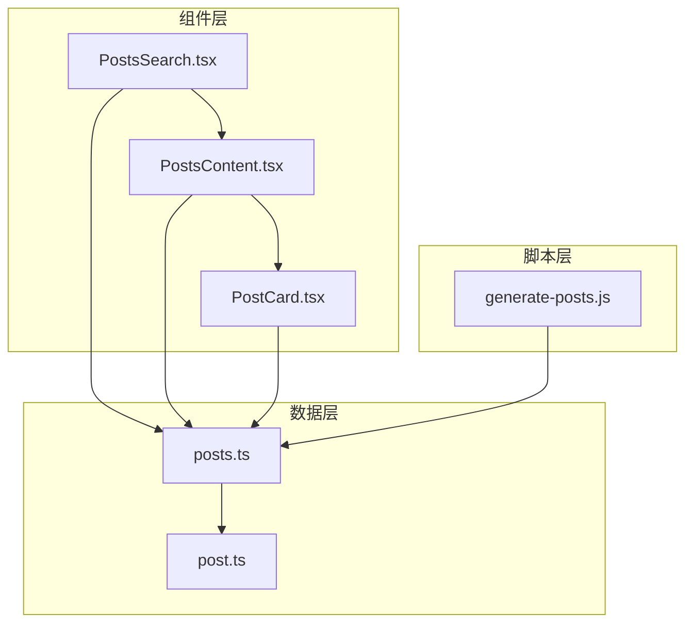
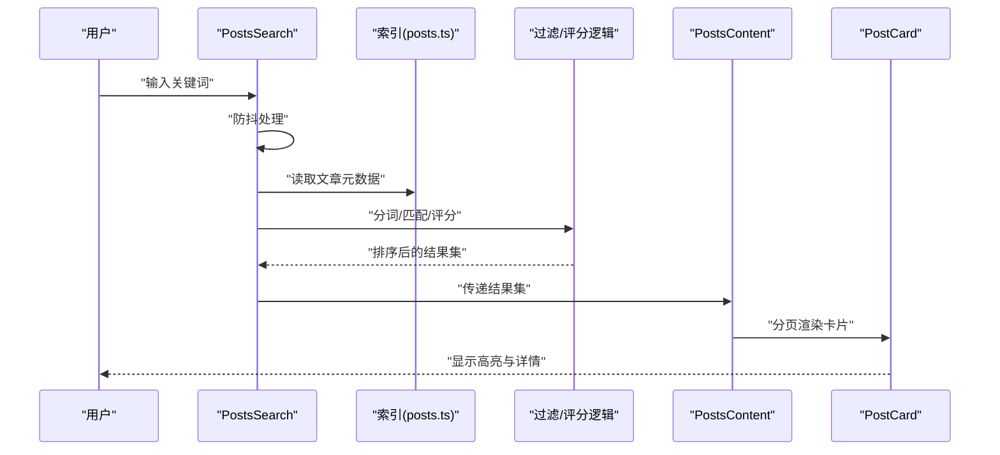
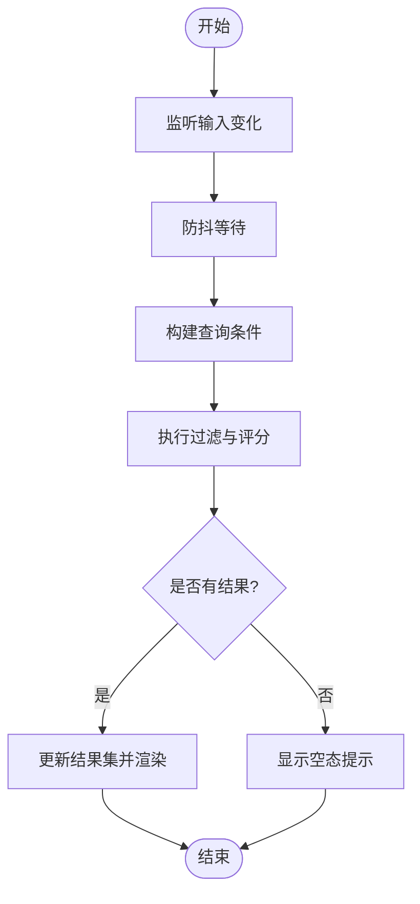
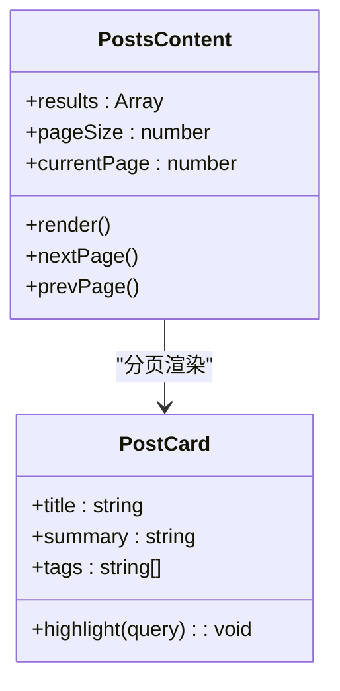
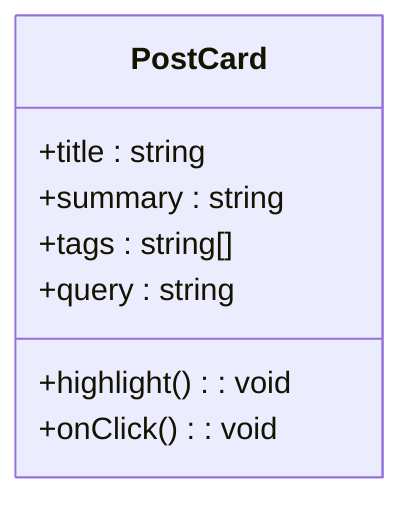
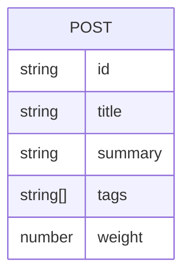
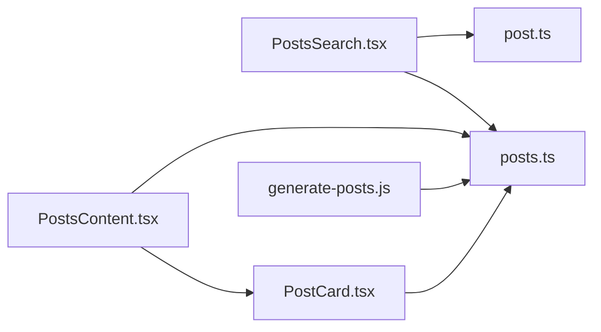

# 文章搜索功能

<cite>
**本文引用的文件**   
- [PostsSearch.tsx](file://src/components/PostsSearch.tsx)
- [posts.ts](file://src/config/posts.ts)
- [PostCard.tsx](file://src/components/PostCard.tsx)
- [PostsContent.tsx](file://src/components/PostsContent.tsx)
- [post.ts](file://src/types/post.ts)
- [generate-posts.js](file://scripts/generate-posts.js)
</cite>

## 目录
1. [简介](#简介)
2. [项目结构](#项目结构)
3. [核心组件](#核心组件)
4. [架构总览](#架构总览)
5. [详细组件分析](#详细组件分析)
6. [依赖关系分析](#依赖关系分析)
7. [性能考虑](#性能考虑)
8. [故障排查指南](#故障排查指南)
9. [结论](#结论)
10. [附录](#附录)

## 简介
本文件面向“文章搜索”功能的实现与使用，覆盖前端搜索算法、索引构建、实时过滤、UI交互（搜索框、关键词高亮、结果展示）、性能优化（防抖、缓存、分页）、高级能力（相关性排序、模糊匹配、同义词扩展）以及移动端适配和无障碍访问支持。文档同时提供常见问题定位与优化建议，帮助读者快速理解并扩展该功能。

## 项目结构
搜索相关代码主要分布在以下位置：
- 组件层：PostsSearch（搜索入口与交互）、PostCard（单篇文章卡片）、PostsContent（搜索结果列表容器）
- 数据层：posts.ts（文章元数据与索引源）、post.ts（类型定义）
- 脚本层：generate-posts.js（可选的构建期生成脚本，用于预处理或导出索引）

图表来源
- [PostsSearch.tsx](file://src/components/PostsSearch.tsx)
- [PostsContent.tsx](file://src/components/PostsContent.tsx)
- [PostCard.tsx](file://src/components/PostCard.tsx)
- [posts.ts](file://src/config/posts.ts)
- [post.ts](file://src/types/post.ts)
- [generate-posts.js](file://scripts/generate-posts.js)

章节来源
- [PostsSearch.tsx](file://src/components/PostsSearch.tsx)
- [PostsContent.tsx](file://src/components/PostsContent.tsx)
- [PostCard.tsx](file://src/components/PostCard.tsx)
- [posts.ts](file://src/config/posts.ts)
- [post.ts](file://src/types/post.ts)
- [generate-posts.js](file://scripts/generate-posts.js)

## 核心组件
- PostsSearch：负责搜索输入、查询状态管理、实时过滤、结果渲染入口、无障碍属性设置等。
- PostsContent：接收过滤后的文章集合，负责分页、空态提示、加载态处理与结果列表布局。
- PostCard：展示单篇文章的关键信息（标题、摘要、标签等），并在命中关键词时进行高亮。
- posts.ts：提供文章元数据与索引源，包含标题、正文片段、标签、权重等字段，供搜索逻辑消费。
- post.ts：定义文章与搜索结果的类型契约，确保前后端一致的数据结构。
- generate-posts.js：可选的构建期脚本，用于从原始内容生成标准化索引或静态资源，提升运行时性能。

章节来源
- [PostsSearch.tsx](file://src/components/PostsSearch.tsx)
- [PostsContent.tsx](file://src/components/PostsContent.tsx)
- [PostCard.tsx](file://src/components/PostCard.tsx)
- [posts.ts](file://src/config/posts.ts)
- [post.ts](file://src/types/post.ts)
- [generate-posts.js](file://scripts/generate-posts.js)

## 架构总览
整体采用“前端本地索引 + 实时过滤”的轻量方案：
- 数据准备：在模块加载时从 posts.ts 读取文章元数据，必要时通过 generate-posts.js 在构建期生成更优的索引结构。
- 搜索执行：用户输入触发防抖后，对索引进行分词与匹配，计算相关性得分，返回排序后的结果。
- UI 渲染：PostsSearch 将结果传递给 PostsContent，后者分页渲染 PostCard；PostCard 对命中词进行高亮。

图表来源
- [PostsSearch.tsx](file://src/components/PostsSearch.tsx)
- [posts.ts](file://src/config/posts.ts)
- [PostsContent.tsx](file://src/components/PostsContent.tsx)
- [PostCard.tsx](file://src/components/PostCard.tsx)

## 详细组件分析

### PostsSearch 组件
职责与特性
- 搜索框交互：支持输入、清空、回车触发、键盘导航。
- 实时过滤：基于防抖减少频繁计算，结合本地索引进行即时反馈。
- 关键词高亮：对标题与摘要中的命中片段进行标记。
- 结果展示：将结果集交给上层容器进行分页与布局。
- 无障碍：为输入框提供 aria-label、aria-live 等属性，增强屏幕阅读器体验。

关键流程
- 输入变更 -> 防抖 -> 调用过滤函数 -> 更新结果状态 -> 通知容器渲染。

图表来源
- [PostsSearch.tsx](file://src/components/PostsSearch.tsx)

章节来源
- [PostsSearch.tsx](file://src/components/PostsSearch.tsx)

### PostsContent 组件
职责与特性
- 接收 PostsSearch 提供的结果集，负责分页、空态与加载态处理。
- 控制每页条数与页码切换，避免一次性渲染过多节点。
- 与 PostCard 协作，完成卡片级的高亮与交互。

图表来源
- [PostsContent.tsx](file://src/components/PostsContent.tsx)
- [PostCard.tsx](file://src/components/PostCard.tsx)

章节来源
- [PostsContent.tsx](file://src/components/PostsContent.tsx)
- [PostCard.tsx](file://src/components/PostCard.tsx)

### PostCard 组件
职责与特性
- 展示文章标题、摘要、标签等基本信息。
- 根据当前查询关键词对标题与摘要进行高亮。
- 提供点击跳转至文章详情的行为。

图表来源
- [PostCard.tsx](file://src/components/PostCard.tsx)

章节来源
- [PostCard.tsx](file://src/components/PostCard.tsx)

### 搜索索引与数据结构
索引来源
- posts.ts 提供文章元数据，包括标题、摘要、标签、权重等字段，作为搜索的基础数据。
- post.ts 定义统一的数据类型，保证组件与索引之间的契约一致性。

索引构建要点
- 元数据提取：从 posts.ts 中抽取标题、摘要、标签等字段。
- 关键词分词：按空格、标点与中文切分策略进行分词（可按需引入分词库）。
- 权重计算：标题命中权重高于摘要，标签命中可额外加权。
- 去重与归一化：去除重复项、标准化大小写与空白字符。

图表来源
- [posts.ts](file://src/config/posts.ts)
- [post.ts](file://src/types/post.ts)

章节来源
- [posts.ts](file://src/config/posts.ts)
- [post.ts](file://src/types/post.ts)

### 构建期脚本（可选）
generate-posts.js 可在构建阶段对原始内容进行预处理，输出标准化的索引文件或中间产物，从而降低运行时开销。典型用途包括：
- 批量解析 Markdown 或 HTML，提取结构化元数据。
- 预计算分词与倒排索引，加速运行时检索。
- 生成静态 JSON 供前端直接加载。

章节来源
- [generate-posts.js](file://scripts/generate-posts.js)

## 依赖关系分析
- PostsSearch 依赖 posts.ts 的索引数据与 post.ts 的类型定义。
- PostsContent 依赖 PostCard 进行卡片渲染，并受分页参数影响。
- generate-posts.js 与 posts.ts 存在数据产出关系，可用于优化索引质量与性能。

图表来源
- [PostsSearch.tsx](file://src/components/PostsSearch.tsx)
- [PostsContent.tsx](file://src/components/PostsContent.tsx)
- [PostCard.tsx](file://src/components/PostCard.tsx)
- [posts.ts](file://src/config/posts.ts)
- [post.ts](file://src/types/post.ts)
- [generate-posts.js](file://scripts/generate-posts.js)

章节来源
- [PostsSearch.tsx](file://src/components/PostsSearch.tsx)
- [PostsContent.tsx](file://src/components/PostsContent.tsx)
- [PostCard.tsx](file://src/components/PostCard.tsx)
- [posts.ts](file://src/config/posts.ts)
- [post.ts](file://src/types/post.ts)
- [generate-posts.js](file://scripts/generate-posts.js)

## 性能考虑
- 防抖处理：在输入事件上增加防抖，避免每次按键都触发全量扫描。
- 结果缓存：对相同查询条件缓存结果，减少重复计算。
- 分页加载：限制单次渲染数量，降低 DOM 压力。
- 索引优化：在构建期预计算分词与权重，运行时仅做匹配与排序。
- 文本处理：统一大小写、去除多余空白与停用词，提高匹配效率。
- 懒加载与虚拟滚动：当结果集较大时，按需渲染可视区域条目。

[本节为通用性能建议，不直接分析具体文件]

## 故障排查指南
常见问题与定位思路
- 无结果或结果不准确
  - 检查 posts.ts 的元数据是否完整，标题与摘要是否存在。
  - 确认分词策略是否覆盖目标语言与术语。
  - 验证权重配置是否合理，避免低权重导致排名异常。
- 输入卡顿或延迟明显
  - 检查防抖时间是否过短，适当延长以减少计算频率。
  - 评估是否需要引入结果缓存或构建期索引。
- 高亮异常
  - 确认高亮逻辑是否正确转义特殊字符，避免破坏 DOM。
  - 检查正则表达式边界条件，防止误匹配。
- 分页错乱
  - 校验 pageSize 与 total 的计算逻辑，确保边界情况正确。
- 无障碍问题
  - 为输入框添加合适的 aria-label 与 aria-live 提示，确保读屏器能播报结果变化。

章节来源
- [PostsSearch.tsx](file://src/components/PostsSearch.tsx)
- [PostsContent.tsx](file://src/components/PostsContent.tsx)
- [PostCard.tsx](file://src/components/PostCard.tsx)
- [posts.ts](file://src/config/posts.ts)

## 结论
本搜索方案以“前端本地索引 + 实时过滤”为核心，具备实现简单、响应迅速、易于扩展的特点。通过合理的分词与权重策略，可获得较好的相关性排序；借助防抖、缓存与分页等手段，能在用户体验与性能之间取得平衡。若需要更强的检索能力，可在构建期引入倒排索引或全文检索引擎，进一步提升准确性与可扩展性。

[本节为总结性内容，不直接分析具体文件]

## 附录

### 搜索算法自定义方法
- 相关性排序
  - 依据命中位置（标题 > 摘要 > 标签）与命中次数加权。
  - 引入时间衰减因子，使较新文章获得更高优先级。
- 模糊匹配
  - 编辑距离（Levenshtein）或近似匹配，容忍少量拼写错误。
  - 前缀匹配与后缀匹配，提升输入容错率。
- 同义词扩展
  - 维护同义词表，在查询时自动扩展关键词，扩大召回范围。
- 短语匹配与布尔查询
  - 支持“必须包含/不包含”、“邻近词”等复杂查询语义。

[本节为概念性说明，不直接分析具体文件]

### 搜索体验增强
- 搜索建议：基于历史输入与热门词条提供下拉建议。
- 历史记录：持久化最近查询，便于快速回溯。
- 热门搜索：统计高频查询词，在首页或搜索页展示。
- 筛选与排序：按标签、时间、热度等多维度组合筛选。

[本节为概念性说明，不直接分析具体文件]

### 移动端适配与无障碍
- 移动端适配
  - 大触控区域、自适应字号与间距，提升触摸体验。
  - 横向滚动与固定头部搜索栏，保持操作便捷。
- 无障碍访问
  - 为输入框与结果区域提供语义化标签与 ARIA 属性。
  - 键盘可达性与焦点顺序清晰，支持 Enter 与 Esc 快捷操作。

[本节为概念性说明，不直接分析具体文件]