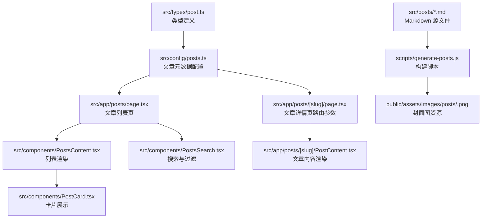
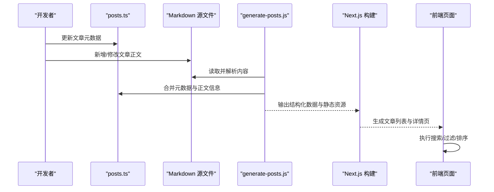
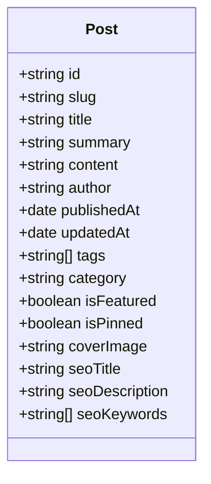
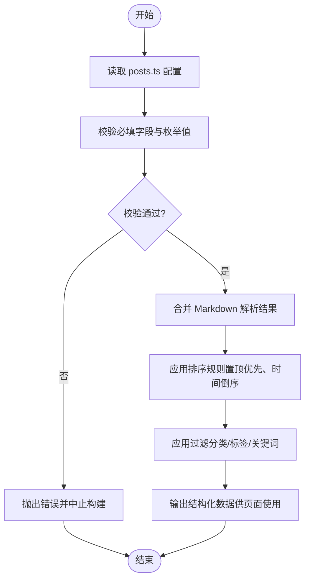
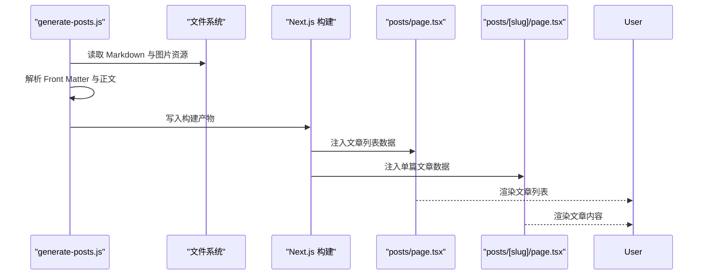
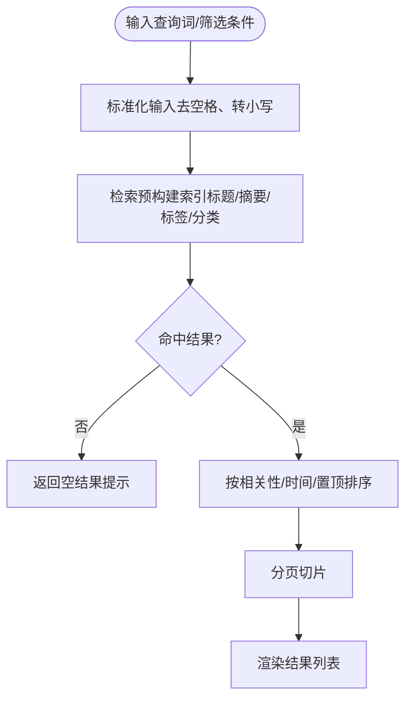
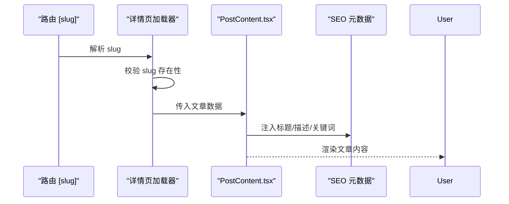
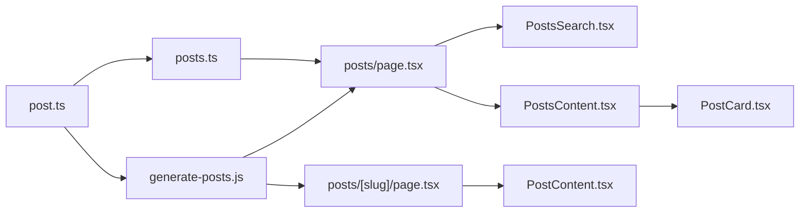

# 文章管理与配置

<cite>
**本文引用的文件**   
- [posts.ts](file://src/config/posts.ts)
- [post.ts](file://src/types/post.ts)
- [generate-posts.js](file://scripts/generate-posts.js)
- [page.tsx](file://src/app/posts/page.tsx)
- [PostContent.tsx](file://src/app/posts/[slug]/PostContent.tsx)
- [PostsSearch.tsx](file://src/components/PostsSearch.tsx)
- [PostsContent.tsx](file://src/components/PostsContent.tsx)
- [PostCard.tsx](file://src/components/PostCard.tsx)
- [next.config.js](file://next.config.js)
</cite>

## 目录
1. [简介](#简介)
2. [项目结构](#项目结构)
3. [核心组件](#核心组件)
4. [架构总览](#架构总览)
5. [详细组件分析](#详细组件分析)
6. [依赖分析](#依赖分析)
7. [性能考虑](#性能考虑)
8. [故障排查指南](#故障排查指南)
9. [结论](#结论)
10. [附录](#附录)

## 简介
本文件面向博客文章管理系统的维护者与贡献者，系统化说明文章数据模型、配置文件组织、Markdown 内容管理策略、静态页面生成流程、排序/过滤/搜索实现原理、SEO 优化方法以及常见问题解决方案。目标是帮助读者在不深入源码细节的前提下，也能高效地添加、管理与优化文章。

## 项目结构
与文章管理相关的关键目录与文件：
- 类型定义：src/types/post.ts
- 文章配置：src/config/posts.ts
- Markdown 源文件：src/posts/*.md
- 构建脚本：scripts/generate-posts.js
- 路由与渲染：src/app/posts/*（列表页、动态详情页）
- 通用组件：src/components/PostsSearch.tsx、PostsContent.tsx、PostCard.tsx
- Next.js 配置：next.config.js

图表来源
- [post.ts](file://src/types/post.ts)
- [posts.ts](file://src/config/posts.ts)
- [generate-posts.js](file://scripts/generate-posts.js)
- [page.tsx](file://src/app/posts/page.tsx)
- [PostContent.tsx](file://src/app/posts/[slug]/PostContent.tsx)
- [PostsSearch.tsx](file://src/components/PostsSearch.tsx)
- [PostsContent.tsx](file://src/components/PostsContent.tsx)
- [PostCard.tsx](file://src/components/PostCard.tsx)

章节来源
- [post.ts](file://src/types/post.ts)
- [posts.ts](file://src/config/posts.ts)
- [generate-posts.js](file://scripts/generate-posts.js)
- [page.tsx](file://src/app/posts/page.tsx)
- [PostContent.tsx](file://src/app/posts/[slug]/PostContent.tsx)
- [PostsSearch.tsx](file://src/components/PostsSearch.tsx)
- [PostsContent.tsx](file://src/components/PostsContent.tsx)
- [PostCard.tsx](file://src/components/PostCard.tsx)

## 核心组件
- 类型定义层：统一约束文章字段、枚举值与校验规则，确保配置与运行时数据结构一致。
- 配置层：集中声明文章元数据（标题、摘要、标签、分类、发布日期、是否置顶等），并提供排序与筛选所需的数据。
- 构建层：将 Markdown 源文件转换为可被前端消费的结构化数据，并生成静态资源（如封面图）。
- 渲染层：列表页聚合配置与搜索能力；详情页根据 slug 解析并渲染具体文章。
- 交互层：提供搜索、过滤、分页等用户交互能力。

章节来源
- [post.ts](file://src/types/post.ts)
- [posts.ts](file://src/config/posts.ts)
- [generate-posts.js](file://scripts/generate-posts.js)
- [page.tsx](file://src/app/posts/page.tsx)
- [PostContent.tsx](file://src/app/posts/[slug]/PostContent.tsx)
- [PostsSearch.tsx](file://src/components/PostsSearch.tsx)
- [PostsContent.tsx](file://src/components/PostsContent.tsx)
- [PostCard.tsx](file://src/components/PostCard.tsx)

## 架构总览
系统采用“配置驱动 + 构建脚本 + 静态渲染”的架构：
- 配置驱动：通过 posts.ts 声明式描述文章元数据，作为单一事实来源。
- 构建脚本：读取 Markdown 源文件，提取 Front Matter 或约定式字段，生成结构化数据与静态资源。
- 静态渲染：Next.js 在构建期生成文章列表与详情页，提升首屏性能与 SEO。

图表来源
- [posts.ts](file://src/config/posts.ts)
- [generate-posts.js](file://scripts/generate-posts.js)
- [page.tsx](file://src/app/posts/page.tsx)
- [PostContent.tsx](file://src/app/posts/[slug]/PostContent.tsx)

## 详细组件分析

### 文章数据模型（Post 接口）
- 设计目标
  - 为文章元数据与正文解析结果提供统一的类型契约。
  - 明确必填字段、可选字段、枚举取值范围与格式约束。
- 关键字段建议（以实际类型定义为准）
  - 标识类：唯一标识符（如 id/slug）、URL 友好路径。
  - 内容类：标题、摘要、正文、作者、发布时间、更新时间。
  - 组织类：分类、标签、语言、状态（草稿/已发布）。
  - 展示类：封面图、是否置顶、是否推荐。
  - SEO 类：页面标题、描述、关键词、Open Graph 信息。
- 类型约束与验证
  - 字符串长度限制（标题、摘要）。
  - 日期时间格式（ISO 8601）。
  - 枚举值白名单（分类、标签、状态）。
  - 必填项校验（id/slug、标题、发布时间等）。
  - 关联一致性（slug 与文件名/路由一致）。

图表来源
- [post.ts](file://src/types/post.ts)

章节来源
- [post.ts](file://src/types/post.ts)

### 文章配置（posts.ts）
- 组织结构
  - 数组形式列出所有文章条目，每条包含元数据与指向 Markdown 文件的映射。
  - 支持分组/分类常量，便于复用与扩展。
- 元数据定义格式
  - 基础信息：标题、摘要、作者、发布时间、更新时间。
  - 组织信息：分类、标签、语言、状态。
  - 展示信息：封面图路径、是否置顶、是否推荐。
  - SEO 信息：页面标题、描述、关键词。
- 分类与标签配置
  - 分类建议使用枚举或常量集合，避免硬编码字符串不一致。
  - 标签建议扁平化，必要时提供别名映射。
- 排序与筛选
  - 默认按发布时间倒序，支持置顶优先。
  - 可按分类、标签、关键词进行过滤。
  - 支持自定义排序键（如热度、评分）。

图表来源
- [posts.ts](file://src/config/posts.ts)

章节来源
- [posts.ts](file://src/config/posts.ts)

### Markdown 文件管理策略
- 命名规范
  - 文件名使用小写英文与连字符（kebab-case），与 slug 保持一致。
  - 示例：docker-basics.md、react-performance.md。
- 目录结构
  - 统一存放于 src/posts 目录，便于构建脚本扫描。
  - 若需多语言，可在子目录按语言划分（如 en/、zh/）。
- 内容组织最佳实践
  - 使用 Front Matter 或约定式头部声明元数据（标题、摘要、标签、分类、发布时间等）。
  - 图片资源放置于 public/assets/images/posts/<slug>.png，并在配置中引用。
  - 正文保持语义化 Markdown，合理使用标题层级、列表、代码块与表格。
  - 外链与内部链接使用相对路径，避免构建期失效。

章节来源
- [generate-posts.js](file://scripts/generate-posts.js)

### 静态页面生成流程
- 构建脚本职责
  - 扫描 src/posts 下的 Markdown 文件。
  - 解析 Front Matter 与正文，生成结构化数据。
  - 校验与 posts.ts 的一致性（slug、封面图等）。
  - 输出到 Next.js 可消费的目录或环境变量。
- 页面集成
  - 列表页从配置与构建产物加载文章列表。
  - 详情页通过 [slug] 动态路由解析文章并渲染。

图表来源
- [generate-posts.js](file://scripts/generate-posts.js)
- [page.tsx](file://src/app/posts/page.tsx)
- [PostContent.tsx](file://src/app/posts/[slug]/PostContent.tsx)

章节来源
- [generate-posts.js](file://scripts/generate-posts.js)
- [page.tsx](file://src/app/posts/page.tsx)
- [PostContent.tsx](file://src/app/posts/[slug]/PostContent.tsx)

### 列表页与搜索过滤
- 列表页
  - 聚合 posts.ts 的配置与构建产物，渲染文章卡片。
  - 支持分页与加载更多。
- 搜索与过滤
  - 客户端搜索：基于标题、摘要、标签、分类的模糊匹配。
  - 服务端过滤：构建期预计算索引，减少运行时开销。
  - 组合条件：支持多标签交集/并集、分类多选、时间范围。

图表来源
- [PostsSearch.tsx](file://src/components/PostsSearch.tsx)
- [PostsContent.tsx](file://src/components/PostsContent.tsx)
- [PostCard.tsx](file://src/components/PostCard.tsx)

章节来源
- [PostsSearch.tsx](file://src/components/PostsSearch.tsx)
- [PostsContent.tsx](file://src/components/PostsContent.tsx)
- [PostCard.tsx](file://src/components/PostCard.tsx)

### 详情页渲染
- 路由解析
  - 通过 [slug] 动态路由定位文章。
  - 校验 slug 有效性，不存在时返回 404。
- 内容渲染
  - 解析 Markdown 为 HTML，注入样式与语法高亮。
  - 渲染封面图、目录、相关文章推荐。
- SEO 注入
  - 根据文章元数据设置页面标题、描述、关键词与 Open Graph 信息。

图表来源
- [PostContent.tsx](file://src/app/posts/[slug]/PostContent.tsx)

章节来源
- [PostContent.tsx](file://src/app/posts/[slug]/PostContent.tsx)

## 依赖分析
- 模块耦合
  - 类型定义（post.ts）被配置（posts.ts）与构建脚本（generate-posts.js）共同依赖，保证数据一致性。
  - 列表页（page.tsx）依赖配置与搜索组件，详情页（[slug]/page.tsx）依赖内容渲染组件。
- 外部依赖
  - Next.js 路由与构建系统。
  - Markdown 解析库（由构建脚本引入）。
  - 图像处理库（用于封面图生成与压缩）。

图表来源
- [post.ts](file://src/types/post.ts)
- [posts.ts](file://src/config/posts.ts)
- [generate-posts.js](file://scripts/generate-posts.js)
- [page.tsx](file://src/app/posts/page.tsx)
- [PostContent.tsx](file://src/app/posts/[slug]/PostContent.tsx)
- [PostsSearch.tsx](file://src/components/PostsSearch.tsx)
- [PostsContent.tsx](file://src/components/PostsContent.tsx)
- [PostCard.tsx](file://src/components/PostCard.tsx)

章节来源
- [post.ts](file://src/types/post.ts)
- [posts.ts](file://src/config/posts.ts)
- [generate-posts.js](file://scripts/generate-posts.js)
- [page.tsx](file://src/app/posts/page.tsx)
- [PostContent.tsx](file://src/app/posts/[slug]/PostContent.tsx)
- [PostsSearch.tsx](file://src/components/PostsSearch.tsx)
- [PostsContent.tsx](file://src/components/PostsContent.tsx)
- [PostCard.tsx](file://src/components/PostCard.tsx)

## 性能考虑
- 构建期预处理
  - 在构建阶段完成 Markdown 解析、索引生成与图片压缩，减少运行时开销。
- 客户端搜索优化
  - 对长列表使用虚拟滚动或分页加载。
  - 搜索词归一化与防抖，避免频繁重渲染。
- 资源优化
  - 封面图按需加载与懒加载。
  - 使用现代图片格式与 CDN 缓存。
- 路由与数据
  - 列表页使用静态生成（SSG）提高首屏速度。
  - 详情页按需生成，避免不必要的页面构建。

## 故障排查指南
- 路径冲突
  - 现象：多个文章 slug 相同导致路由覆盖或构建失败。
  - 排查：检查 posts.ts 中的 slug 唯一性与 Markdown 文件名一致性。
- 构建错误
  - 现象：构建脚本无法解析 Markdown 或找不到封面图。
  - 排查：确认 Front Matter 字段完整、图片路径正确、依赖安装齐全。
- 搜索无结果
  - 现象：输入关键词后列表为空。
  - 排查：检查索引是否包含目标字段、搜索词是否被正确归一化。
- 详情页 404
  - 现象：访问 /posts/<slug> 返回 404。
  - 排查：确认 slug 存在于配置与构建产物中，且路由参数有效。
- SEO 未生效
  - 现象：搜索引擎抓取不到正确的标题与描述。
  - 排查：检查详情页 SEO 元数据注入逻辑与 meta 标签是否正确渲染。

章节来源
- [generate-posts.js](file://scripts/generate-posts.js)
- [page.tsx](file://src/app/posts/page.tsx)
- [PostContent.tsx](file://src/app/posts/[slug]/PostContent.tsx)
- [PostsSearch.tsx](file://src/components/PostsSearch.tsx)
- [PostsContent.tsx](file://src/components/PostsContent.tsx)
- [PostCard.tsx](file://src/components/PostCard.tsx)

## 结论
通过类型定义、配置驱动与构建脚本的协同，本系统实现了文章管理的标准化与自动化。遵循本文档的规范与实践，可显著提升文章添加与维护效率，同时保障性能与 SEO 表现。

## 附录

### 添加新文章的完整步骤
- 准备内容
  - 在 src/posts 下创建新的 Markdown 文件，文件名使用 kebab-case，并与 slug 一致。
  - 在文件中添加必要的元数据（标题、摘要、标签、分类、发布时间等）。
- 更新配置
  - 在 posts.ts 中添加对应条目，确保 slug、封面图路径与文件一致。
  - 如需新增分类或标签，请在相应常量或枚举中补充。
- 资源准备
  - 将封面图放入 public/assets/images/posts/<slug>.png，并在配置中引用。
- 构建与预览
  - 运行构建脚本，确保无报错。
  - 启动开发服务器，验证列表页与详情页显示正常。
- SEO 优化
  - 在配置中完善页面标题、描述与关键词。
  - 在详情页渲染时注入 Open Graph 与 Twitter Card 元数据。

章节来源
- [posts.ts](file://src/config/posts.ts)
- [generate-posts.js](file://scripts/generate-posts.js)
- [page.tsx](file://src/app/posts/page.tsx)
- [PostContent.tsx](file://src/app/posts/[slug]/PostContent.tsx)

### 文章排序、过滤与搜索实现要点
- 排序
  - 默认按发布时间倒序，置顶文章优先。
  - 支持自定义排序键（如热度、评分）。
- 过滤
  - 按分类、标签、关键词进行过滤。
  - 支持多条件组合与布尔逻辑。
- 搜索
  - 客户端模糊匹配，结合预构建索引提升性能。
  - 搜索词归一化（去停用词、大小写统一）。

章节来源
- [posts.ts](file://src/config/posts.ts)
- [PostsSearch.tsx](file://src/components/PostsSearch.tsx)
- [PostsContent.tsx](file://src/components/PostsContent.tsx)

### SEO 优化配置清单
- 页面标题：简洁明确，包含核心关键词。
- 页面描述：概括文章主旨，控制长度以提升可读性。
- 关键词：精选 3-5 个相关关键词。
- Open Graph：设置 og:title、og:description、og:image、og:url。
- Twitter Card：设置 twitter:card、twitter:title、twitter:description、twitter:image。
- 结构化数据：必要时添加 JSON-LD（如 Article 类型）。

章节来源
- [PostContent.tsx](file://src/app/posts/[slug]/PostContent.tsx)
- [posts.ts](file://src/config/posts.ts)