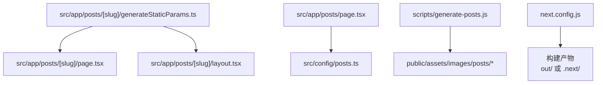
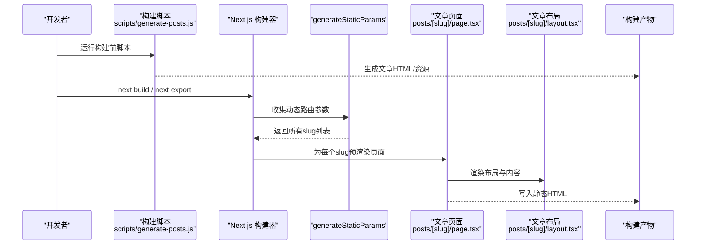
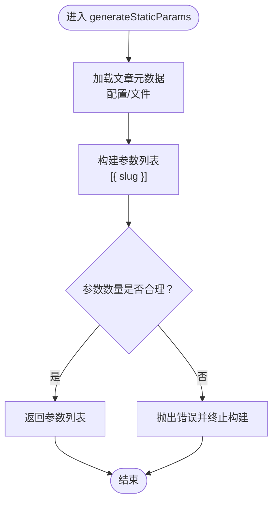
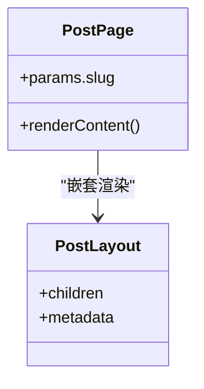
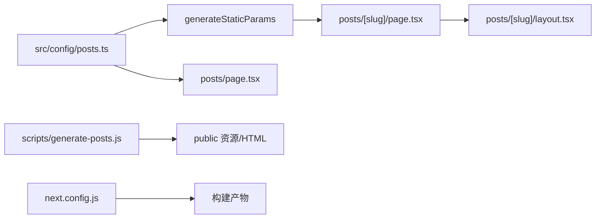

# 静态页面生成

<cite>
**本文引用的文件**   
- [next.config.js](file://next.config.js)
- [package.json](file://package.json)
- [src/app/posts/[slug]/generateStaticParams.ts](file://src/app/posts/[slug]/generateStaticParams.ts)
- [src/app/posts/[slug]/page.tsx](file://src/app/posts/[slug]/page.tsx)
- [src/app/posts/[slug]/layout.tsx](file://src/app/posts/[slug]/layout.tsx)
- [src/app/posts/page.tsx](file://src/app/posts/page.tsx)
- [src/config/posts.ts](file://src/config/posts.ts)
- [scripts/generate-posts.js](file://scripts/generate-posts.js)
</cite>

## 目录
1. [简介](#简介)
2. [项目结构](#项目结构)
3. [核心组件](#核心组件)
4. [架构总览](#架构总览)
5. [详细组件分析](#详细组件分析)
6. [依赖关系分析](#依赖关系分析)
7. [性能考虑](#性能考虑)
8. [故障排查指南](#故障排查指南)
9. [结论](#结论)
10. [附录](#附录)

## 简介
本文件面向使用 Next.js 的静态站点生成（SSG）实践，围绕以下目标展开：
- 解释 SSG 在构建时预渲染的优势与限制
- 深入说明 generateStaticParams 的作用、工作机制与动态路由参数生成
- 梳理构建流程配置（next.config.js）、优化选项与增量静态再生成（ISR）
- 提供自定义构建脚本方法（预处理、后处理、资源优化等扩展点）
- 给出构建性能优化策略（并行构建、缓存利用、内存管理等）
- 说明部署时的构建注意事项与平台特定配置
- 总结常见问题与调试方法

## 项目结构
本项目采用 App Router 组织页面，静态文章通过 Markdown 源文件与脚本生成 HTML，并通过 generateStaticParams 在构建期确定所有文章路径。关键目录与职责如下：
- src/app：应用路由与页面布局
  - posts/[slug]：动态文章路由，包含 generateStaticParams、页面与布局
  - posts/page.tsx：文章列表页
- src/config：站点内容与元数据配置
- scripts：构建期脚本（如生成文章 HTML）
- public：静态资源（图片、动画、样式等）

图表来源
- [src/app/posts/[slug]/generateStaticParams.ts](file://src/app/posts/[slug]/generateStaticParams.ts)
- [src/app/posts/[slug]/page.tsx](file://src/app/posts/[slug]/page.tsx)
- [src/app/posts/[slug]/layout.tsx](file://src/app/posts/[slug]/layout.tsx)
- [src/app/posts/page.tsx](file://src/app/posts/page.tsx)
- [src/config/posts.ts](file://src/config/posts.ts)
- [scripts/generate-posts.js](file://scripts/generate-posts.js)
- [next.config.js](file://next.config.js)

章节来源
- [src/app/posts/[slug]/generateStaticParams.ts](file://src/app/posts/[slug]/generateStaticParams.ts)
- [src/app/posts/[slug]/page.tsx](file://src/app/posts/[slug]/page.tsx)
- [src/app/posts/[slug]/layout.tsx](file://src/app/posts/[slug]/layout.tsx)
- [src/app/posts/page.tsx](file://src/app/posts/page.tsx)
- [src/config/posts.ts](file://src/config/posts.ts)
- [scripts/generate-posts.js](file://scripts/generate-posts.js)
- [next.config.js](file://next.config.js)

## 核心组件
- generateStaticParams：在构建期返回动态路由的所有参数组合，驱动 Next.js 为每个 slug 生成静态页面
- 文章页面与布局：接收参数并渲染文章内容与通用布局
- 文章列表页：聚合文章元信息，用于导航与搜索
- 构建脚本：将 Markdown 转换为 HTML 或其他中间产物，供页面读取
- 配置文件：控制导出模式、输出目录、优化项与 ISR 行为

章节来源
- [src/app/posts/[slug]/generateStaticParams.ts](file://src/app/posts/[slug]/generateStaticParams.ts)
- [src/app/posts/[slug]/page.tsx](file://src/app/posts/[slug]/page.tsx)
- [src/app/posts/[slug]/layout.tsx](file://src/app/posts/[slug]/layout.tsx)
- [src/app/posts/page.tsx](file://src/app/posts/page.tsx)
- [scripts/generate-posts.js](file://scripts/generate-posts.js)
- [next.config.js](file://next.config.js)

## 架构总览
下图展示了从构建脚本到页面生成的端到端流程，以及 generateStaticParams 如何决定最终产出的静态页面集合。

图表来源
- [scripts/generate-posts.js](file://scripts/generate-posts.js)
- [src/app/posts/[slug]/generateStaticParams.ts](file://src/app/posts/[slug]/generateStaticParams.ts)
- [src/app/posts/[slug]/page.tsx](file://src/app/posts/[slug]/page.tsx)
- [src/app/posts/[slug]/layout.tsx](file://src/app/posts/[slug]/layout.tsx)

## 详细组件分析

### generateStaticParams 机制与动态路由参数
- 作用：在构建期同步返回一组对象数组，每个对象代表一个动态段参数的取值，Next.js 据此为每个参数组合生成独立静态页面
- 输入来源：通常来自配置或文件系统（例如文章清单），保证参数集与真实内容一致
- 输出格式：[{ slug: "..." }, ...]，对应路由段 [slug]
- 执行时机：构建阶段，不参与运行时请求
- 错误处理：若参数过多或 IO 失败，会直接导致构建失败，便于尽早暴露问题

图表来源
- [src/app/posts/[slug]/generateStaticParams.ts](file://src/app/posts/[slug]/generateStaticParams.ts)

章节来源
- [src/app/posts/[slug]/generateStaticParams.ts](file://src/app/posts/[slug]/generateStaticParams.ts)

### 文章页面与布局
- 页面组件：根据传入的 slug 参数渲染具体文章内容；由于由 generateStaticParams 驱动，该页面在构建期被静态化
- 布局组件：包裹文章页面，提供统一的头部、尾部、主题等上下文
- 数据获取：建议在构建期完成（例如读取已生成的 HTML 或解析 Markdown），避免运行时网络请求

图表来源
- [src/app/posts/[slug]/page.tsx](file://src/app/posts/[slug]/page.tsx)
- [src/app/posts/[slug]/layout.tsx](file://src/app/posts/[slug]/layout.tsx)

章节来源
- [src/app/posts/[slug]/page.tsx](file://src/app/posts/[slug]/page.tsx)
- [src/app/posts/[slug]/layout.tsx](file://src/app/posts/[slug]/layout.tsx)

### 文章列表页
- 职责：汇总文章元信息，提供导航入口与搜索能力
- 数据来源：可从配置或构建产物中读取，确保与 generateStaticParams 保持一致
- 静态化：作为普通页面，默认参与 SSG

章节来源
- [src/app/posts/page.tsx](file://src/app/posts/page.tsx)
- [src/config/posts.ts](file://src/config/posts.ts)

### 构建脚本与资源生成
- 典型任务：遍历 Markdown 源文件，生成 HTML、缩略图、索引等
- 输出位置：建议写入 public 或构建输出目录，便于 Next.js 打包与引用
- 触发方式：可在 package.json 的脚本中编排，或在 CI 中显式调用

章节来源
- [scripts/generate-posts.js](file://scripts/generate-posts.js)
- [package.json](file://package.json)

### 构建配置与优化（next.config.js）
- 导出模式：可配置为静态导出（如 outDir 指向 out），适合无服务器托管
- 输出目录：指定构建产物目录，便于部署与缓存
- 资源优化：启用图片、字体、脚本等优化开关，减少体积与请求数
- 环境变量：注入构建期常量，避免运行时开销
- 插件与中间件：按需引入，注意对构建时间与产物大小的影响

章节来源
- [next.config.js](file://next.config.js)

### 增量静态再生成（ISR）
- 适用场景：内容更新频繁但页面仍希望具备静态性能的页面
- 工作方式：首次构建生成静态页面，后续按 revalidate 时间间隔后台重新生成
- 与 SSG 的关系：ISR 是对 SSG 的增强，适用于需要“准实时”更新的页面
- 配置要点：在页面级设置 revalidate 或 fetch 的 cache 策略，结合 CDN 缓存失效策略

章节来源
- [next.config.js](file://next.config.js)
- [src/app/posts/[slug]/page.tsx](file://src/app/posts/[slug]/page.tsx)

## 依赖关系分析
- 页面与参数：文章页面依赖 generateStaticParams 提供的 slug 列表进行静态化
- 配置与内容：文章列表与参数生成均依赖统一的内容配置，保证一致性
- 脚本与产物：构建脚本产出 HTML/资源，页面在构建期消费这些产物
- 构建配置：next.config.js 影响导出模式、输出目录与优化项

图表来源
- [src/config/posts.ts](file://src/config/posts.ts)
- [src/app/posts/[slug]/generateStaticParams.ts](file://src/app/posts/[slug]/generateStaticParams.ts)
- [src/app/posts/page.tsx](file://src/app/posts/page.tsx)
- [scripts/generate-posts.js](file://scripts/generate-posts.js)
- [src/app/posts/[slug]/page.tsx](file://src/app/posts/[slug]/page.tsx)
- [src/app/posts/[slug]/layout.tsx](file://src/app/posts/[slug]/layout.tsx)
- [next.config.js](file://next.config.js)

章节来源
- [src/config/posts.ts](file://src/config/posts.ts)
- [src/app/posts/[slug]/generateStaticParams.ts](file://src/app/posts/[slug]/generateStaticParams.ts)
- [src/app/posts/page.tsx](file://src/app/posts/page.tsx)
- [scripts/generate-posts.js](file://scripts/generate-posts.js)
- [src/app/posts/[slug]/page.tsx](file://src/app/posts/[slug]/page.tsx)
- [src/app/posts/[slug]/layout.tsx](file://src/app/posts/[slug]/layout.tsx)
- [next.config.js](file://next.config.js)

## 性能考虑
- 并行构建：充分利用多核 CPU，避免单线程瓶颈；合理拆分大任务
- 缓存利用：复用 node_modules、构建缓存与 CDN 缓存，缩短冷启动时间
- 内存管理：控制并发度与产物大小，避免 OOM；必要时分步构建
- 资源优化：启用图片懒加载、压缩与去重，减少首屏体积
- 增量构建：仅重建变更部分，缩短迭代周期
- 构建脚本优化：批量读写、流式处理、避免阻塞主线程

[本节为通用指导，不直接分析具体文件]

## 故障排查指南
- 构建失败：检查 generateStaticParams 返回的参数是否与真实内容一致；确认构建脚本成功产出所需资源
- 页面缺失：核对动态路由参数与文件名/路径映射；确认 next.config.js 的导出与输出目录配置
- 运行时异常：确保页面在构建期能正确读取资源；避免在 SSG 页面中进行网络请求
- 性能问题：分析构建日志，定位耗时步骤；调整并发与缓存策略
- 部署问题：确认平台支持的导出模式与静态资源访问路径；校验环境变量注入

章节来源
- [src/app/posts/[slug]/generateStaticParams.ts](file://src/app/posts/[slug]/generateStaticParams.ts)
- [src/app/posts/[slug]/page.tsx](file://src/app/posts/[slug]/page.tsx)
- [scripts/generate-posts.js](file://scripts/generate-posts.js)
- [next.config.js](file://next.config.js)

## 结论
通过 combine 构建脚本、generateStaticParams 与页面静态化，本项目实现了高效、可控的静态站点生成。配合合理的构建配置与性能优化策略，可在保证首屏性能的同时，兼顾内容更新与部署效率。对于需要“准实时”更新的页面，可引入 ISR 以平衡静态性能与时效性。

[本节为总结性内容，不直接分析具体文件]

## 附录
- 术语
  - SSG：构建时预渲染，生成静态 HTML
  - ISR：增量静态再生成，在后台按策略刷新静态页面
  - 导出模式：将应用构建为纯静态资源的模式
- 最佳实践
  - 将内容清单集中管理，确保参数生成与内容一致
  - 在构建期完成数据准备，避免运行时 IO 与网络
  - 使用 CDN 缓存静态资源，并结合版本号或哈希实现强缓存
  - 在 CI 中固化构建步骤，确保环境一致性与可重复性

[本节为概念性内容，不直接分析具体文件]