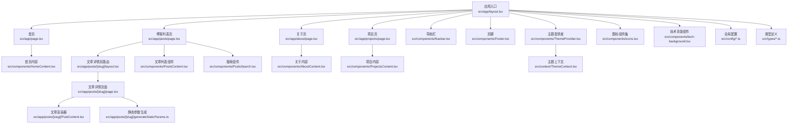
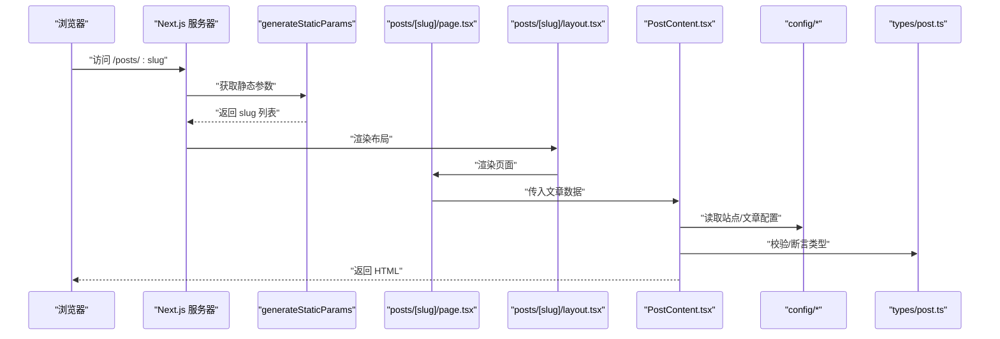
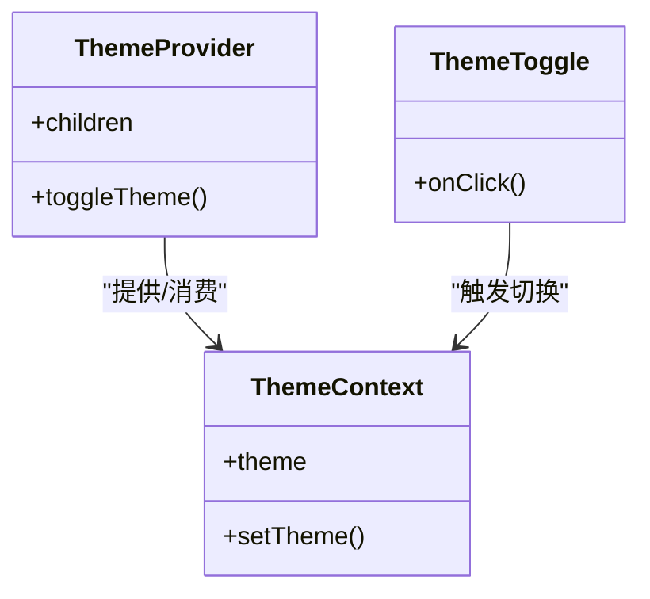
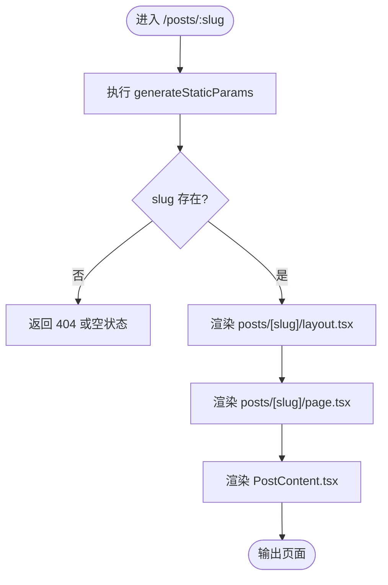
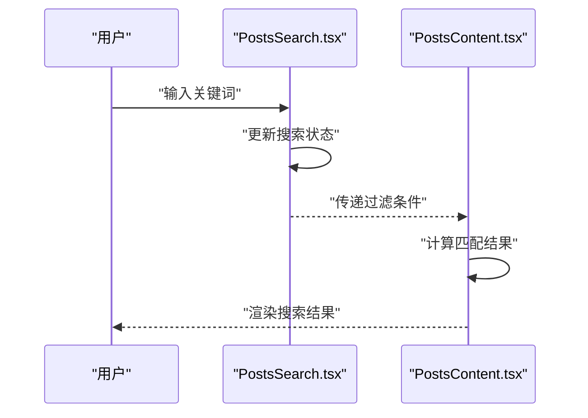
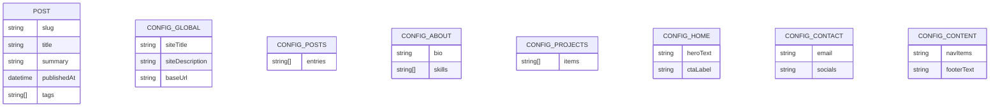
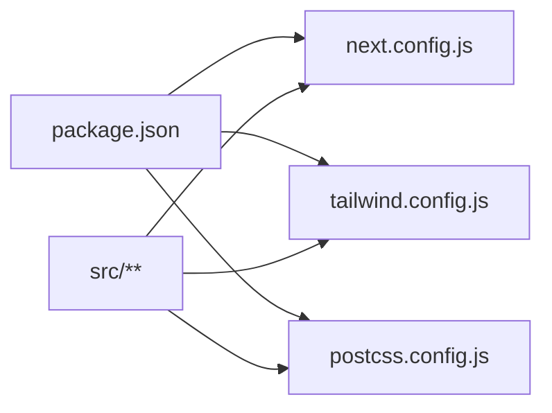

# 开发指南

<cite>
**本文引用的文件**   
- [package.json](file://package.json)
- [next.config.js](file://next.config.js)
- [tsconfig.json](file://tsconfig.json)
- [tsconfig.scripts.json](file://tsconfig.scripts.json)
- [tailwind.config.js](file://tailwind.config.js)
- [postcss.config.js](file://postcss.config.js)
- [src/app/layout.tsx](file://src/app/layout.tsx)
- [src/app/page.tsx](file://src/app/page.tsx)
- [src/app/posts/[slug]/layout.tsx](file://src/app/posts/[slug]/layout.tsx)
- [src/app/posts/[slug]/page.tsx](file://src/app/posts/[slug]/page.tsx)
- [src/app/posts/[slug]/PostContent.tsx](file://src/app/posts/[slug]/PostContent.tsx)
- [src/app/posts/[slug]/generateStaticParams.ts](file://src/app/posts/[slug]/generateStaticParams.ts)
- [src/components/Navbar.tsx](file://src/components/Navbar.tsx)
- [src/components/Footer.tsx](file://src/components/Footer.tsx)
- [src/components/HomeContent.tsx](file://src/components/HomeContent.tsx)
- [src/components/PostsContent.tsx](file://src/components/PostsContent.tsx)
- [src/components/PostsSearch.tsx](file://src/components/PostsSearch.tsx)
- [src/components/AboutContent.tsx](file://src/components/AboutContent.tsx)
- [src/components/ProjectsContent.tsx](file://src/components/ProjectsContent.tsx)
- [src/components/ThemeToggle.tsx](file://src/components/ThemeToggle.tsx)
- [src/components/ThemeProvider.tsx](file://src/components/ThemeProvider.tsx)
- [src/components/icons.tsx](file://src/components/icons.tsx)
- [src/components/tech-background.tsx](file://src/components/tech-background.tsx)
- [src/config/global.ts](file://src/config/global.ts)
- [src/config/content.ts](file://src/config/content.ts)
- [src/config/about.ts](file://src/config/about.ts)
- [src/config/contact.ts](file://src/config/contact.ts)
- [src/config/home.ts](file://src/config/home.ts)
- [src/config/posts.ts](file://src/config/posts.ts)
- [src/config/projects.ts](file://src/config/projects.ts)
- [src/context/ThemeContext.tsx](file://src/context/ThemeContext.tsx)
- [src/types/post.ts](file://src/types/post.ts)
- [src/types/json.d.ts](file://src/types/json.d.ts)
- [scripts/generate-posts.js](file://scripts/generate-posts.js)
</cite>

## 目录
1. [简介](#简介)
2. [项目结构](#项目结构)
3. [核心组件](#核心组件)
4. [架构总览](#架构总览)
5. [详细组件分析](#详细组件分析)
6. [依赖分析](#依赖分析)
7. [性能考虑](#性能考虑)
8. [故障排查指南](#故障排查指南)
9. [结论](#结论)
10. [附录](#附录)

## 简介
本指南面向新贡献者与日常开发者，提供基于 Next.js App Router 的博客项目的完整开发规范与最佳实践。内容涵盖：
- TypeScript 类型定义、命名规范与文件组织约定
- 新功能开发与代码提交、分支管理流程
- 调试与测试方法、工具配置
- 扩展现有功能与新增组件类型的步骤
- 性能优化指导与常用技巧
- 错误处理与日志记录规范
- 浏览器兼容性与移动端适配注意事项
- 开发环境设置与代码审查标准

## 项目结构
本项目采用 Next.js App Router 的目录约定，结合“按功能域”的组织方式：
- src/app：页面路由与布局（App Router）
- src/components：可复用 UI 组件
- src/config：站点内容与全局配置
- src/context：全局上下文（如主题）
- src/types：TypeScript 类型声明
- scripts：构建期脚本（如文章生成）
- public：静态资源（图片、动画等）

图表来源
- [src/app/layout.tsx](file://src/app/layout.tsx)
- [src/app/page.tsx](file://src/app/page.tsx)
- [src/app/posts/[slug]/layout.tsx](file://src/app/posts/[slug]/layout.tsx)
- [src/app/posts/[slug]/page.tsx](file://src/app/posts/[slug]/page.tsx)
- [src/app/posts/[slug]/PostContent.tsx](file://src/app/posts/[slug]/PostContent.tsx)
- [src/app/posts/[slug]/generateStaticParams.ts](file://src/app/posts/[slug]/generateStaticParams.ts)
- [src/components/Navbar.tsx](file://src/components/Navbar.tsx)
- [src/components/Footer.tsx](file://src/components/Footer.tsx)
- [src/components/ThemeProvider.tsx](file://src/components/ThemeProvider.tsx)
- [src/context/ThemeContext.tsx](file://src/context/ThemeContext.tsx)
- [src/components/PostsContent.tsx](file://src/components/PostsContent.tsx)
- [src/components/PostsSearch.tsx](file://src/components/PostsSearch.tsx)
- [src/components/HomeContent.tsx](file://src/components/HomeContent.tsx)
- [src/components/AboutContent.tsx](file://src/components/AboutContent.tsx)
- [src/components/ProjectsContent.tsx](file://src/components/ProjectsContent.tsx)
- [src/components/icons.tsx](file://src/components/icons.tsx)
- [src/components/tech-background.tsx](file://src/components/tech-background.tsx)
- [src/config/global.ts](file://src/config/global.ts)
- [src/types/post.ts](file://src/types/post.ts)

章节来源
- [src/app/layout.tsx](file://src/app/layout.tsx)
- [src/app/page.tsx](file://src/app/page.tsx)
- [src/app/posts/[slug]/layout.tsx](file://src/app/posts/[slug]/layout.tsx)
- [src/app/posts/[slug]/page.tsx](file://src/app/posts/[slug]/page.tsx)
- [src/app/posts/[slug]/PostContent.tsx](file://src/app/posts/[slug]/PostContent.tsx)
- [src/app/posts/[slug]/generateStaticParams.ts](file://src/app/posts/[slug]/generateStaticParams.ts)
- [src/components/Navbar.tsx](file://src/components/Navbar.tsx)
- [src/components/Footer.tsx](file://src/components/Footer.tsx)
- [src/components/ThemeProvider.tsx](file://src/components/ThemeProvider.tsx)
- [src/context/ThemeContext.tsx](file://src/context/ThemeContext.tsx)
- [src/components/PostsContent.tsx](file://src/components/PostsContent.tsx)
- [src/components/PostsSearch.tsx](file://src/components/PostsSearch.tsx)
- [src/components/HomeContent.tsx](file://src/components/HomeContent.tsx)
- [src/components/AboutContent.tsx](file://src/components/AboutContent.tsx)
- [src/components/ProjectsContent.tsx](file://src/components/ProjectsContent.tsx)
- [src/components/icons.tsx](file://src/components/icons.tsx)
- [src/components/tech-background.tsx](file://src/components/tech-background.tsx)
- [src/config/global.ts](file://src/config/global.ts)
- [src/types/post.ts](file://src/types/post.ts)

## 核心组件
- 布局与根组件
  - 根布局负责全局样式、主题注入与通用 UI 壳层。
  - 各页面通过 layout 组合共享区域（导航、页脚）。
- 主题系统
  - 使用 Context 提供主题状态，组件按需消费。
  - 提供切换按钮组件，便于用户交互。
- 内容展示
  - 首页、关于、项目、文章列表与详情分别由独立组件承载。
  - 文章详情支持动态路由与静态参数预生成。
- 配置与类型
  - 所有文案、元信息、站点数据集中在 config 目录。
  - 统一的类型定义在 types 目录，确保跨模块一致性。

章节来源
- [src/app/layout.tsx](file://src/app/layout.tsx)
- [src/components/ThemeProvider.tsx](file://src/components/ThemeProvider.tsx)
- [src/context/ThemeContext.tsx](file://src/context/ThemeContext.tsx)
- [src/components/ThemeToggle.tsx](file://src/components/ThemeToggle.tsx)
- [src/components/HomeContent.tsx](file://src/components/HomeContent.tsx)
- [src/components/AboutContent.tsx](file://src/components/AboutContent.tsx)
- [src/components/ProjectsContent.tsx](file://src/components/ProjectsContent.tsx)
- [src/components/PostsContent.tsx](file://src/components/PostsContent.tsx)
- [src/components/PostsSearch.tsx](file://src/components/PostsSearch.tsx)
- [src/app/posts/[slug]/PostContent.tsx](file://src/app/posts/[slug]/PostContent.tsx)
- [src/config/global.ts](file://src/config/global.ts)
- [src/types/post.ts](file://src/types/post.ts)

## 架构总览
下图展示了从请求到渲染的关键路径，包括静态参数生成、页面渲染与组件树。

图表来源
- [src/app/posts/[slug]/generateStaticParams.ts](file://src/app/posts/[slug]/generateStaticParams.ts)
- [src/app/posts/[slug]/layout.tsx](file://src/app/posts/[slug]/layout.tsx)
- [src/app/posts/[slug]/page.tsx](file://src/app/posts/[slug]/page.tsx)
- [src/app/posts/[slug]/PostContent.tsx](file://src/app/posts/[slug]/PostContent.tsx)
- [src/config/global.ts](file://src/config/global.ts)
- [src/types/post.ts](file://src/types/post.ts)

## 详细组件分析

### 主题系统与上下文
- 设计要点
  - 使用 React Context 暴露主题状态与切换方法。
  - 在根布局中包裹主题提供者，确保全应用可用。
  - 提供独立的切换按钮组件，避免在业务组件中直接耦合上下文。
- 扩展建议
  - 如需增加更多主题模式（如高对比度），可在上下文中扩展状态并更新提供者逻辑。
  - 将主题相关样式类名集中管理，避免散落在组件内。

图表来源
- [src/components/ThemeProvider.tsx](file://src/components/ThemeProvider.tsx)
- [src/context/ThemeContext.tsx](file://src/context/ThemeContext.tsx)
- [src/components/ThemeToggle.tsx](file://src/components/ThemeToggle.tsx)

章节来源
- [src/components/ThemeProvider.tsx](file://src/components/ThemeProvider.tsx)
- [src/context/ThemeContext.tsx](file://src/context/ThemeContext.tsx)
- [src/components/ThemeToggle.tsx](file://src/components/ThemeToggle.tsx)

### 文章详情路由与静态参数
- 关键流程
  - generateStaticParams 根据数据源生成 slug 列表。
  - 页面组件接收 params 并渲染文章。
  - 布局组件统一包裹文章区域。
- 数据流
  - 配置与类型定义作为数据契约，保证前后端一致。
  - 渲染阶段仅消费必要字段，减少不必要重渲染。

图表来源
- [src/app/posts/[slug]/generateStaticParams.ts](file://src/app/posts/[slug]/generateStaticParams.ts)
- [src/app/posts/[slug]/layout.tsx](file://src/app/posts/[slug]/layout.tsx)
- [src/app/posts/[slug]/page.tsx](file://src/app/posts/[slug]/page.tsx)
- [src/app/posts/[slug]/PostContent.tsx](file://src/app/posts/[slug]/PostContent.tsx)

章节来源
- [src/app/posts/[slug]/generateStaticParams.ts](file://src/app/posts/[slug]/generateStaticParams.ts)
- [src/app/posts/[slug]/layout.tsx](file://src/app/posts/[slug]/layout.tsx)
- [src/app/posts/[slug]/page.tsx](file://src/app/posts/[slug]/page.tsx)
- [src/app/posts/[slug]/PostContent.tsx](file://src/app/posts/[slug]/PostContent.tsx)

### 文章列表与搜索
- 列表组件
  - 负责聚合文章元信息并渲染卡片。
  - 与搜索组件解耦，通过 props 传递过滤条件。
- 搜索组件
  - 维护本地搜索状态，对列表数据进行客户端过滤。
  - 输入防抖与边界条件处理，提升体验。

图表来源
- [src/components/PostsSearch.tsx](file://src/components/PostsSearch.tsx)
- [src/components/PostsContent.tsx](file://src/components/PostsContent.tsx)

章节来源
- [src/components/PostsSearch.tsx](file://src/components/PostsSearch.tsx)
- [src/components/PostsContent.tsx](file://src/components/PostsContent.tsx)

### 配置与类型契约
- 配置组织
  - global.ts：站点级常量（标题、描述、链接等）。
  - content.ts：通用文案与结构化内容。
  - about.ts、contact.ts、home.ts、projects.ts：页面专属内容。
  - posts.ts：文章元信息与索引。
- 类型定义
  - post.ts：文章实体类型，约束字段与枚举值。
  - json.d.ts：第三方 JSON 模块类型声明。

图表来源
- [src/types/post.ts](file://src/types/post.ts)
- [src/config/global.ts](file://src/config/global.ts)
- [src/config/content.ts](file://src/config/content.ts)
- [src/config/about.ts](file://src/config/about.ts)
- [src/config/contact.ts](file://src/config/contact.ts)
- [src/config/home.ts](file://src/config/home.ts)
- [src/config/posts.ts](file://src/config/posts.ts)
- [src/config/projects.ts](file://src/config/projects.ts)

章节来源
- [src/types/post.ts](file://src/types/post.ts)
- [src/config/global.ts](file://src/config/global.ts)
- [src/config/content.ts](file://src/config/content.ts)
- [src/config/about.ts](file://src/config/about.ts)
- [src/config/contact.ts](file://src/config/contact.ts)
- [src/config/home.ts](file://src/config/home.ts)
- [src/config/posts.ts](file://src/config/posts.ts)
- [src/config/projects.ts](file://src/config/projects.ts)

## 依赖分析
- 运行时依赖
  - next：框架核心。
  - react/react-dom：UI 库。
  - tailwindcss/postcss autoprefixer：样式与构建链。
- 开发依赖
  - typescript、@types/*：类型检查与声明。
  - eslint/prettier（若启用）：代码质量与格式化。
- 构建与脚本
  - package.json 中的脚本用于启动、构建与生成文章。
  - next.config.js 控制构建行为与插件集成。
  - tailwind.config.js 与 postcss.config.js 协同工作。

图表来源
- [package.json](file://package.json)
- [next.config.js](file://next.config.js)
- [tailwind.config.js](file://tailwind.config.js)
- [postcss.config.js](file://postcss.config.js)

章节来源
- [package.json](file://package.json)
- [next.config.js](file://next.config.js)
- [tailwind.config.js](file://tailwind.config.js)
- [postcss.config.js](file://postcss.config.js)

## 性能考虑
- 渲染策略
  - 优先使用静态生成（SSG）与静态参数预取，减少首屏延迟。
  - 仅在必要时使用服务端渲染（SSR），避免不必要的请求。
- 资源优化
  - 图片与媒体资源使用合适的尺寸与格式，必要时懒加载。
  - 动画等资源按需引入，避免阻塞首屏。
- 组件优化
  - 合理拆分组件，减少重渲染范围。
  - 使用 memo/useMemo/useCallback 谨慎优化热点路径。
- 样式与字体
  - 利用 Tailwind 的原子化特性，避免重复样式。
  - 字体与图标按需加载，减少体积。
- 缓存与网络
  - 合理使用 HTTP 缓存头与 CDN。
  - 对频繁变动的数据采用增量静态再生（ISR）或客户端缓存。

[本节为通用性能指导，不直接分析具体文件]

## 故障排查指南
- 常见问题定位
  - 路由 404：检查 generateStaticParams 是否返回对应 slug。
  - 主题异常：确认 ThemeProvider 已包裹根布局且未被意外卸载。
  - 样式错乱：检查 Tailwind 配置与 CSS 导入顺序。
- 调试建议
  - 使用浏览器开发者工具的 Network 面板查看资源加载。
  - 使用 React DevTools 检查组件树与状态变化。
- 日志与错误
  - 在关键路径添加必要的 console 日志，避免在生产环境泄露敏感信息。
  - 捕获异步错误并给出友好提示，避免白屏。

章节来源
- [src/app/posts/[slug]/generateStaticParams.ts](file://src/app/posts/[slug]/generateStaticParams.ts)
- [src/components/ThemeProvider.tsx](file://src/components/ThemeProvider.tsx)
- [tailwind.config.js](file://tailwind.config.js)

## 结论
本指南总结了项目的结构与开发规范，提供了从环境搭建、组件扩展、性能优化到问题排查的完整路径。遵循本文约定有助于团队协作与长期维护。

[本节为总结性内容，不直接分析具体文件]

## 附录

### 开发环境与工具配置
- Node 版本
  - 建议使用 LTS 版本，与 package.json 中指定版本保持一致。
- 安装与运行
  - 安装依赖后，使用提供的脚本启动开发服务器与构建产物。
- 类型检查
  - 使用 tsconfig.json 进行编译与类型检查；脚本专用配置位于 tsconfig.scripts.json。
- 样式与构建
  - Tailwind 与 PostCSS 通过配置文件驱动，保持默认即可满足需求。

章节来源
- [package.json](file://package.json)
- [tsconfig.json](file://tsconfig.json)
- [tsconfig.scripts.json](file://tsconfig.scripts.json)
- [tailwind.config.js](file://tailwind.config.js)
- [postcss.config.js](file://postcss.config.js)

### 代码规范与命名约定
- 文件与目录
  - 页面与布局放在 src/app 下，按路由组织。
  - 组件放在 src/components，按功能域划分。
  - 配置与类型分别放在 src/config 与 src/types。
- 命名
  - 组件使用 PascalCase，文件以 .tsx 结尾。
  - 配置与类型使用小驼峰或大写下划线（视语义而定），保持统一。
- 类型
  - 所有外部数据需定义类型并在入口处进行断言。
  - 公共类型放入 types 目录，避免重复定义。

章节来源
- [src/app/layout.tsx](file://src/app/layout.tsx)
- [src/components/Navbar.tsx](file://src/components/Navbar.tsx)
- [src/config/global.ts](file://src/config/global.ts)
- [src/types/post.ts](file://src/types/post.ts)

### 开发工作流程与分支管理
- 分支模型
  - main：稳定分支，仅合并经过评审的代码。
  - feature/*：新功能开发分支。
  - fix/*：缺陷修复分支。
- 提交规范
  - 使用清晰的提交信息，包含变更范围与动机。
  - 小步提交，便于回滚与审查。
- 代码审查
  - 至少一名审查者批准后方可合并。
  - 关注类型安全、可读性与性能影响。

[本节为通用流程指导，不直接分析具体文件]

### 调试与测试方法
- 调试
  - 使用浏览器控制台与 React DevTools 定位问题。
  - 在关键函数入口与出口打印必要日志。
- 测试
  - 单元测试：针对纯函数与工具方法进行覆盖。
  - 组件测试：验证交互与渲染结果。
  - 端到端测试：模拟真实用户路径，确保关键流程稳定。

[本节为通用测试指导，不直接分析具体文件]

### 扩展现有功能与新增组件类型
- 新增页面
  - 在 src/app 下创建对应路由目录与 page.tsx。
  - 如有需要，补充 layout.tsx 与 generateStaticParams.ts。
- 新增组件
  - 在 src/components 下创建组件文件，导出默认或具名组件。
  - 在目标页面或布局中按需引入并使用。
- 新增配置
  - 在 src/config 下新增或修改配置项，并在类型中同步更新。
- 新增类型
  - 在 src/types 下定义新类型，并在消费处进行断言。

章节来源
- [src/app/posts/[slug]/layout.tsx](file://src/app/posts/[slug]/layout.tsx)
- [src/app/posts/[slug]/page.tsx](file://src/app/posts/[slug]/page.tsx)
- [src/app/posts/[slug]/generateStaticParams.ts](file://src/app/posts/[slug]/generateStaticParams.ts)
- [src/components/PostsContent.tsx](file://src/components/PostsContent.tsx)
- [src/config/posts.ts](file://src/config/posts.ts)
- [src/types/post.ts](file://src/types/post.ts)

### 文章生成脚本
- 用途
  - 自动化生成文章静态页面或索引，减少手工操作。
- 使用
  - 在脚本目录下执行，依据 posts 目录与配置生成目标文件。
- 扩展
  - 可按需增加模板引擎与发布流程集成。

章节来源
- [scripts/generate-posts.js](file://scripts/generate-posts.js)

### 浏览器兼容性与移动端适配
- 兼容性
  - 使用现代浏览器 API，必要时提供降级方案。
  - 注意 Polyfill 与特性检测。
- 移动端
  - 使用响应式布局与触摸友好的交互。
  - 避免过大的首屏资源，优先加载关键内容。

[本节为通用适配指导，不直接分析具体文件]