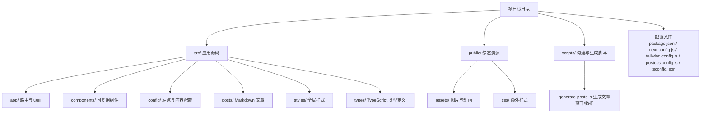
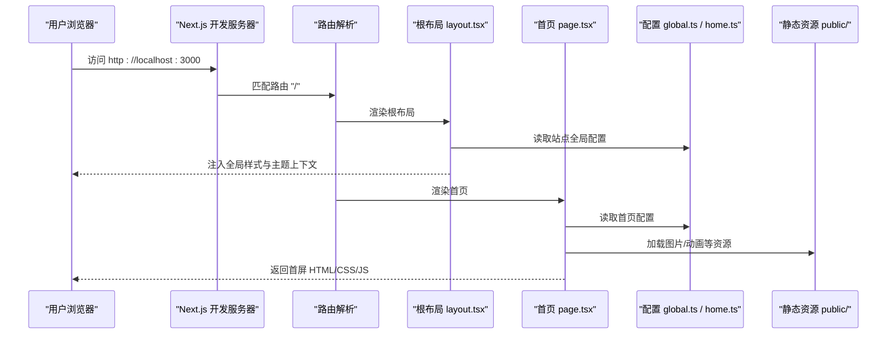
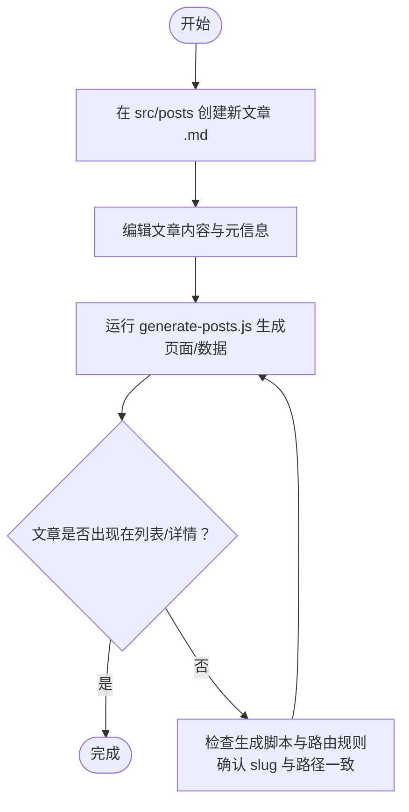
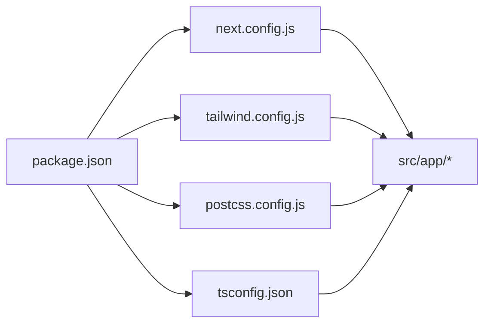

# 快速开始

<cite>
**本文引用的文件**   
- [README.md](file://README.md)
- [package.json](file://package.json)
- [next.config.js](file://next.config.js)
- [tailwind.config.js](file://tailwind.config.js)
- [postcss.config.js](file://postcss.config.js)
- [tsconfig.json](file://tsconfig.json)
- [src/app/layout.tsx](file://src/app/layout.tsx)
- [src/app/page.tsx](file://src/app/page.tsx)
- [src/config/global.ts](file://src/config/global.ts)
- [src/config/home.ts](file://src/config/home.ts)
- [src/posts/docker-basics.md](file://src/posts/docker-basics.md)
- [scripts/generate-posts.js](file://scripts/generate-posts.js)
</cite>

## 目录
1. [简介](#简介)
2. [项目结构](#项目结构)
3. [核心组件](#核心组件)
4. [架构总览](#架构总览)
5. [详细组件分析](#详细组件分析)
6. [依赖分析](#依赖分析)
7. [性能考虑](#性能考虑)
8. [故障排除指南](#故障排除指南)
9. [结论](#结论)
10. [附录](#附录)

## 简介
本指南面向首次接触该博客项目的开发者与内容作者，目标是帮助你在最短时间内完成环境准备、安装依赖、启动开发服务器，并成功运行站点。你将了解：
- 环境与工具要求（Node.js、包管理器）
- 完整安装与启动步骤
- 目录结构与关键配置文件说明
- 第一个自定义示例（修改站点标题、添加新文章）
- 常见问题排查
- 基本开发工作流

## 项目结构
本项目基于 Next.js App Router 构建，采用“配置驱动 + Markdown 内容”的方式组织内容。根目录包含应用代码、静态资源、脚本与配置文件；内容以 Markdown 形式存放在 src/posts 下，并通过生成脚本产出页面或数据。

图表来源
- [package.json:1-200](file://package.json#L1-L200)
- [next.config.js:1-200](file://next.config.js#L1-L200)
- [tailwind.config.js:1-200](file://tailwind.config.js#L1-L200)
- [postcss.config.js:1-200](file://postcss.config.js#L1-L200)
- [tsconfig.json:1-200](file://tsconfig.json#L1-L200)
- [src/app/layout.tsx:1-200](file://src/app/layout.tsx#L1-L200)
- [src/app/page.tsx:1-200](file://src/app/page.tsx#L1-L200)
- [src/config/global.ts:1-200](file://src/config/global.ts#L1-L200)
- [src/config/home.ts:1-200](file://src/config/home.ts#L1-L200)
- [src/posts/docker-basics.md:1-200](file://src/posts/docker-basics.md#L1-L200)
- [scripts/generate-posts.js:1-200](file://scripts/generate-posts.js#L1-L200)

章节来源
- [README.md:1-200](file://README.md#L1-L200)
- [package.json:1-200](file://package.json#L1-L200)
- [next.config.js:1-200](file://next.config.js#L1-L200)
- [tailwind.config.js:1-200](file://tailwind.config.js#L1-L200)
- [postcss.config.js:1-200](file://postcss.config.js#L1-L200)
- [tsconfig.json:1-200](file://tsconfig.json#L1-L200)
- [src/app/layout.tsx:1-200](file://src/app/layout.tsx#L1-L200)
- [src/app/page.tsx:1-200](file://src/app/page.tsx#L1-L200)
- [src/config/global.ts:1-200](file://src/config/global.ts#L1-L200)
- [src/config/home.ts:1-200](file://src/config/home.ts#L1-L200)
- [src/posts/docker-basics.md:1-200](file://src/posts/docker-basics.md#L1-L200)
- [scripts/generate-posts.js:1-200](file://scripts/generate-posts.js#L1-L200)

## 核心组件
- 应用入口与布局
  - 根布局负责站点元信息、主题上下文与全局样式注入。
  - 首页路由展示站点概览与导航入口。
- 配置层
  - 全局配置（站点名称、描述、社交链接等）。
  - 首页文案与模块配置。
- 内容层
  - Markdown 文章位于 src/posts，通过生成脚本产出页面或数据。
- 组件层
  - 通用 UI 组件（导航、页脚、卡片、搜索等）。
- 静态资源
  - public/assets 存放图片与动画，public/css 存放额外样式。

章节来源
- [src/app/layout.tsx:1-200](file://src/app/layout.tsx#L1-L200)
- [src/app/page.tsx:1-200](file://src/app/page.tsx#L1-L200)
- [src/config/global.ts:1-200](file://src/config/global.ts#L1-L200)
- [src/config/home.ts:1-200](file://src/config/home.ts#L1-L200)
- [src/posts/docker-basics.md:1-200](file://src/posts/docker-basics.md#L1-L200)
- [scripts/generate-posts.js:1-200](file://scripts/generate-posts.js#L1-L200)

## 架构总览
下图展示了从浏览器到应用的核心请求路径与主要模块的交互关系。

图表来源
- [src/app/layout.tsx:1-200](file://src/app/layout.tsx#L1-L200)
- [src/app/page.tsx:1-200](file://src/app/page.tsx#L1-L200)
- [src/config/global.ts:1-200](file://src/config/global.ts#L1-L200)
- [src/config/home.ts:1-200](file://src/config/home.ts#L1-L200)
- [next.config.js:1-200](file://next.config.js#L1-L200)

## 详细组件分析

### 环境要求与安装
- Node.js 版本
  - 请根据 package.json 中的 engines 字段确认所需 Node.js 版本范围。
- 包管理器
  - 推荐使用 npm 或 pnpm。若使用 pnpm，请在安装时启用 .npmrc 或相应配置。
- 安装依赖
  - 在项目根目录执行依赖安装命令（npm 或 pnpm）。
- 启动开发服务器
  - 执行开发脚本以启动本地服务，默认端口通常为 3000。
- 构建与预览
  - 执行构建脚本生成生产产物，并使用预览脚本在本地查看构建结果。

章节来源
- [package.json:1-200](file://package.json#L1-L200)

### 目录结构与关键配置
- 根级配置
  - next.config.js：Next.js 应用配置（如路径别名、插件、输出等）。
  - tailwind.config.js：Tailwind CSS 主题与插件配置。
  - postcss.config.js：PostCSS 处理链配置（通常与 Tailwind 配合）。
  - tsconfig.json：TypeScript 编译选项与路径映射。
- 应用源码
  - src/app：App Router 路由与页面，layout.tsx 为根布局，page.tsx 为首页。
  - src/components：UI 组件集合。
  - src/config：站点与内容配置（global.ts、home.ts 等）。
  - src/posts：Markdown 文章源文件。
  - src/styles：全局样式。
  - src/types：类型声明。
- 静态资源
  - public/assets：图片与动画资源。
  - public/css：额外样式。
- 脚本
  - scripts/generate-posts.js：用于将 Markdown 文章生成页面或数据。

章节来源
- [next.config.js:1-200](file://next.config.js#L1-L200)
- [tailwind.config.js:1-200](file://tailwind.config.js#L1-L200)
- [postcss.config.js:1-200](file://postcss.config.js#L1-L200)
- [tsconfig.json:1-200](file://tsconfig.json#L1-L200)
- [src/app/layout.tsx:1-200](file://src/app/layout.tsx#L1-L200)
- [src/app/page.tsx:1-200](file://src/app/page.tsx#L1-L200)
- [src/config/global.ts:1-200](file://src/config/global.ts#L1-L200)
- [src/config/home.ts:1-200](file://src/config/home.ts#L1-L200)
- [src/posts/docker-basics.md:1-200](file://src/posts/docker-basics.md#L1-L200)
- [scripts/generate-posts.js:1-200](file://scripts/generate-posts.js#L1-L200)

### 第一个自定义示例：修改站点标题
目标：修改站点标题（例如在导航或标签中显示的新标题）。

步骤建议：
- 打开全局配置 global.ts，找到站点标题相关字段并进行修改。
- 保存后，开发服务器会自动热重载，刷新浏览器即可看到变化。
- 若标题未生效，检查是否有其他配置覆盖或在特定页面内硬编码了标题。

章节来源
- [src/config/global.ts:1-200](file://src/config/global.ts#L1-L200)
- [src/app/layout.tsx:1-200](file://src/app/layout.tsx#L1-L200)

### 第一个自定义示例：添加新文章
目标：新增一篇 Markdown 文章并使其可在站点中访问。

步骤建议：
- 在 src/posts 目录下新增一个 .md 文件（建议使用英文 slug 作为文件名）。
- 编写文章内容与必要的元信息（如标题、日期、摘要等，具体字段参考现有文章）。
- 运行生成脚本 scripts/generate-posts.js，确保新的文章被正确生成页面或索引。
- 重启开发服务器（如需），在 Posts 列表或详情页验证新文章是否可见。
- 若文章无法访问，检查生成脚本逻辑与路由规则，确认 slug 与路径一致。

图表来源
- [src/posts/docker-basics.md:1-200](file://src/posts/docker-basics.md#L1-L200)
- [scripts/generate-posts.js:1-200](file://scripts/generate-posts.js#L1-L200)

章节来源
- [src/posts/docker-basics.md:1-200](file://src/posts/docker-basics.md#L1-L200)
- [scripts/generate-posts.js:1-200](file://scripts/generate-posts.js#L1-L200)

## 依赖分析
- 运行时依赖
  - Next.js、React、Tailwind CSS、PostCSS、TypeScript 等。
- 构建与开发依赖
  - ESLint、Prettier、测试框架（如有）、生成脚本依赖等。
- 配置耦合
  - next.config.js 与 tailwind.config.js、postcss.config.js 共同决定构建与样式行为。
  - tsconfig.json 影响类型检查与路径解析。

图表来源
- [package.json:1-200](file://package.json#L1-L200)
- [next.config.js:1-200](file://next.config.js#L1-L200)
- [tailwind.config.js:1-200](file://tailwind.config.js#L1-L200)
- [postcss.config.js:1-200](file://postcss.config.js#L1-L200)
- [tsconfig.json:1-200](file://tsconfig.json#L1-L200)

章节来源
- [package.json:1-200](file://package.json#L1-L200)
- [next.config.js:1-200](file://next.config.js#L1-L200)
- [tailwind.config.js:1-200](file://tailwind.config.js#L1-L200)
- [postcss.config.js:1-200](file://postcss.config.js#L1-L200)
- [tsconfig.json:1-200](file://tsconfig.json#L1-L200)

## 性能考虑
- 首屏优化
  - 合理使用静态资源与懒加载策略，避免首屏过大。
- 样式与字体
  - 按需引入 Tailwind 类，减少冗余样式体积。
- 构建产物
  - 生产构建前清理缓存，确保增量构建稳定。
- 资源路径
  - 使用相对路径或 CDN 加速静态资源。

[本节提供通用指导，无需引用具体文件]

## 故障排除指南
- 端口占用
  - 若 3000 端口被占用，可在开发脚本中指定端口或关闭占用进程后重试。
- 依赖安装失败
  - 清理 node_modules 与锁文件后重新安装；检查网络代理与镜像源。
- 样式不生效
  - 确认 Tailwind 与 PostCSS 配置已正确加载；检查类名拼写与选择器优先级。
- 文章未生成
  - 检查 generate-posts.js 的执行权限与依赖；确认输入文件路径与输出目录存在。
- 类型错误
  - 运行类型检查命令定位问题；必要时更新类型定义或调整 tsconfig 选项。

章节来源
- [package.json:1-200](file://package.json#L1-L200)
- [scripts/generate-posts.js:1-200](file://scripts/generate-posts.js#L1-L200)
- [tailwind.config.js:1-200](file://tailwind.config.js#L1-L200)
- [postcss.config.js:1-200](file://postcss.config.js#L1-L200)
- [tsconfig.json:1-200](file://tsconfig.json#L1-L200)

## 结论
通过以上步骤，你应已完成环境搭建、安装依赖、启动开发服务器，并成功运行博客站点。你可以继续探索更多功能：扩展配置、定制组件、完善文章与项目页面，以及优化构建与部署流程。

[本节为总结性内容，无需引用具体文件]

## 附录
- 常用命令速查
  - 安装依赖：参见 package.json 中的安装脚本。
  - 启动开发服务器：参见 package.json 中的开发脚本。
  - 构建与预览：参见 package.json 中的构建与预览脚本。
- 参考文档
  - README.md：项目概述与使用说明。
  - 各配置文件：next.config.js、tailwind.config.js、postcss.config.js、tsconfig.json。

章节来源
- [README.md:1-200](file://README.md#L1-L200)
- [package.json:1-200](file://package.json#L1-L200)
- [next.config.js:1-200](file://next.config.js#L1-L200)
- [tailwind.config.js:1-200](file://tailwind.config.js#L1-L200)
- [postcss.config.js:1-200](file://postcss.config.js#L1-L200)
- [tsconfig.json:1-200](file://tsconfig.json#L1-L200)