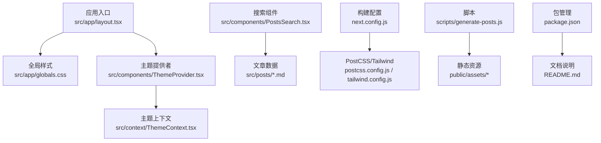
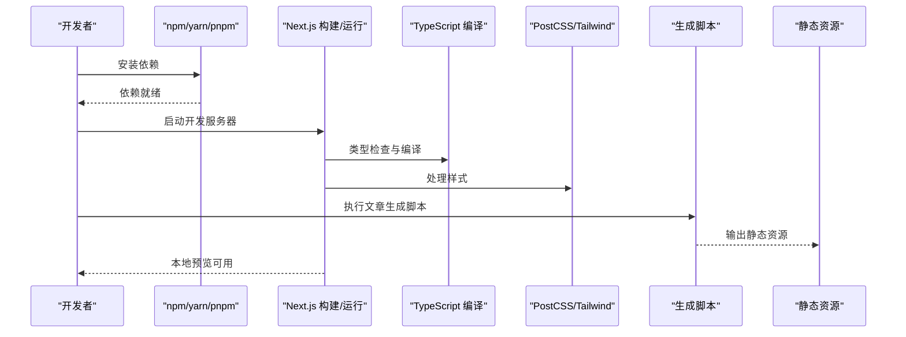
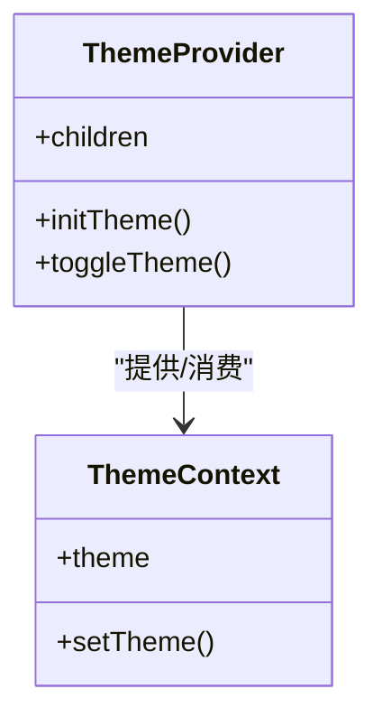
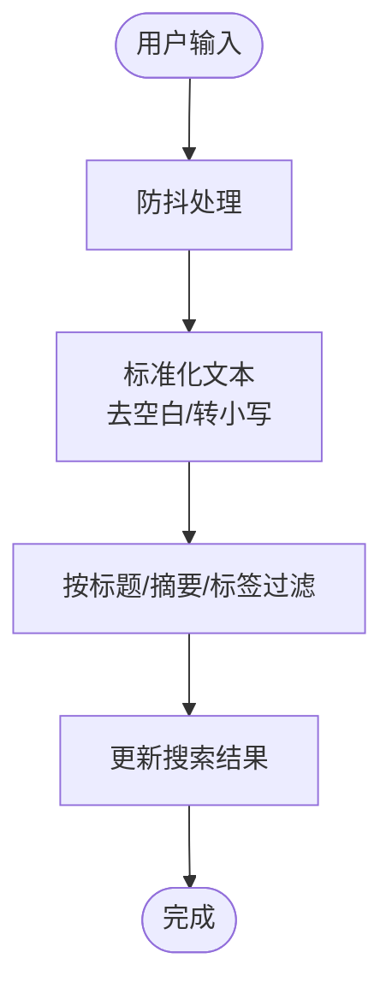
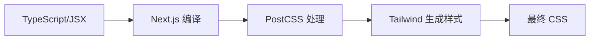
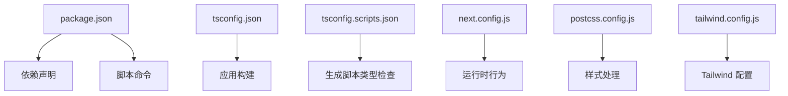

# 故障排除

<cite>
**本文引用的文件**   
- [README.md](file://README.md)
- [package.json](file://package.json)
- [next.config.js](file://next.config.js)
- [postcss.config.js](file://postcss.config.js)
- [tailwind.config.js](file://tailwind.config.js)
- [tsconfig.json](file://tsconfig.json)
- [tsconfig.scripts.json](file://tsconfig.scripts.json)
- [src/app/layout.tsx](file://src/app/layout.tsx)
- [src/app/globals.css](file://src/app/globals.css)
- [src/styles/globals.css](file://src/styles/globals.css)
- [src/components/ThemeProvider.tsx](file://src/components/ThemeProvider.tsx)
- [src/context/ThemeContext.tsx](file://src/context/ThemeContext.tsx)
- [src/components/PostsSearch.tsx](file://src/components/PostsSearch.tsx)
- [scripts/generate-posts.js](file://scripts/generate-posts.js)
</cite>

## 目录
1. [简介](#简介)
2. [项目结构](#项目结构)
3. [核心组件](#核心组件)
4. [架构总览](#架构总览)
5. [详细组件分析](#详细组件分析)
6. [依赖分析](#依赖分析)
7. [性能考虑](#性能考虑)
8. [故障排除指南](#故障排除指南)
9. [结论](#结论)
10. [附录](#附录)

## 简介
本指南面向使用 Next.js 构建的个人博客项目的开发与运维人员，聚焦于“如何快速定位并解决问题”。内容覆盖环境配置、构建与运行异常、运行时错误、性能问题诊断（首屏加载慢、内存泄漏等）、浏览器兼容性、CSS 样式冲突与组件渲染异常、日志分析与错误追踪、社区支持与已知限制。目标是提供一套可操作的自助排障流程，帮助你在最短时间内恢复服务或完成修复。

## 项目结构
本项目采用 Next.js App Router 组织页面与布局，主题通过 Context + Provider 注入，文章数据由 Markdown 源文件经脚本生成静态资源，样式基于 Tailwind CSS 与 PostCSS。关键路径包括：
- 应用入口与全局布局：src/app/layout.tsx
- 全局样式：src/app/globals.css、src/styles/globals.css
- 主题上下文与提供者：src/context/ThemeContext.tsx、src/components/ThemeProvider.tsx
- 搜索组件：src/components/PostsSearch.tsx
- 构建与工具链配置：next.config.js、postcss.config.js、tailwind.config.js、tsconfig*.json
- 脚本与元信息：scripts/generate-posts.js、package.json、README.md

图表来源
- [src/app/layout.tsx](file://src/app/layout.tsx)
- [src/app/globals.css](file://src/app/globals.css)
- [src/styles/globals.css](file://src/styles/globals.css)
- [src/components/ThemeProvider.tsx](file://src/components/ThemeProvider.tsx)
- [src/context/ThemeContext.tsx](file://src/context/ThemeContext.tsx)
- [src/components/PostsSearch.tsx](file://src/components/PostsSearch.tsx)
- [next.config.js](file://next.config.js)
- [postcss.config.js](file://postcss.config.js)
- [tailwind.config.js](file://tailwind.config.js)
- [scripts/generate-posts.js](file://scripts/generate-posts.js)
- [package.json](file://package.json)
- [README.md](file://README.md)

章节来源
- [README.md](file://README.md)
- [package.json](file://package.json)
- [next.config.js](file://next.config.js)
- [postcss.config.js](file://postcss.config.js)
- [tailwind.config.js](file://tailwind.config.js)
- [tsconfig.json](file://tsconfig.json)
- [tsconfig.scripts.json](file://tsconfig.scripts.json)
- [src/app/layout.tsx](file://src/app/layout.tsx)
- [src/app/globals.css](file://src/app/globals.css)
- [src/styles/globals.css](file://src/styles/globals.css)
- [src/components/ThemeProvider.tsx](file://src/components/ThemeProvider.tsx)
- [src/context/ThemeContext.tsx](file://src/context/ThemeContext.tsx)
- [src/components/PostsSearch.tsx](file://src/components/PostsSearch.tsx)
- [scripts/generate-posts.js](file://scripts/generate-posts.js)

## 核心组件
- 主题提供者与上下文：负责在客户端初始化主题状态，并在服务端渲染时避免闪烁；若未正确包裹根布局，可能导致主题切换失效或 SSR 不一致。
- 全局布局：挂载主题提供者与全局样式，是样式与上下文生效的关键节点。
- 搜索组件：对文章进行本地过滤，若数据未正确生成或字段不匹配，会导致搜索无结果或报错。

章节来源
- [src/components/ThemeProvider.tsx](file://src/components/ThemeProvider.tsx)
- [src/context/ThemeContext.tsx](file://src/context/ThemeContext.tsx)
- [src/app/layout.tsx](file://src/app/layout.tsx)
- [src/components/PostsSearch.tsx](file://src/components/PostsSearch.tsx)

## 架构总览
下图展示了从开发到构建再到运行的关键链路，以及常见故障点的位置。

图表来源
- [package.json](file://package.json)
- [next.config.js](file://next.config.js)
- [postcss.config.js](file://postcss.config.js)
- [tailwind.config.js](file://tailwind.config.js)
- [scripts/generate-posts.js](file://scripts/generate-posts.js)

## 详细组件分析

### 主题系统（Provider + Context）
- 职责：在客户端初始化主题，在服务端避免闪烁；为子组件提供统一的主题 API。
- 常见问题：
  - 未在根布局包裹提供者，导致主题无效或首次闪烁。
  - 服务端读取 window 对象引发 SSR 错误。
  - 主题值与 Tailwind 自定义类名不一致，导致样式不生效。
- 排查要点：
  - 确认根布局已引入并包裹主题提供者。
  - 确保仅在客户端访问浏览器 API。
  - 校验 Tailwind 配置中是否包含所需颜色/变量。

图表来源
- [src/components/ThemeProvider.tsx](file://src/components/ThemeProvider.tsx)
- [src/context/ThemeContext.tsx](file://src/context/ThemeContext.tsx)

章节来源
- [src/components/ThemeProvider.tsx](file://src/components/ThemeProvider.tsx)
- [src/context/ThemeContext.tsx](file://src/context/ThemeContext.tsx)
- [src/app/layout.tsx](file://src/app/layout.tsx)
- [tailwind.config.js](file://tailwind.config.js)

### 搜索组件（PostsSearch）
- 职责：根据输入过滤文章列表。
- 常见问题：
  - 文章数据未生成或字段缺失，导致过滤失败。
  - 大小写/空格处理不当，导致匹配不到结果。
  - 大量数据时前端过滤性能下降。
- 优化建议：
  - 预计算索引或分词，减少重复计算。
  - 防抖输入，降低频繁重渲染。
  - 分页或虚拟滚动，提升大数据量体验。

图表来源
- [src/components/PostsSearch.tsx](file://src/components/PostsSearch.tsx)

章节来源
- [src/components/PostsSearch.tsx](file://src/components/PostsSearch.tsx)

### 构建与样式管线（Next + PostCSS + Tailwind）
- 职责：将 TypeScript/JSX 编译为产物，并通过 PostCSS/Tailwind 生成最终样式。
- 常见问题：
  - Tailwind 类名未被识别（content 路径未覆盖）。
  - PostCSS 插件顺序或版本不兼容。
  - 全局样式重复定义导致冲突。
- 排查要点：
  - 检查 Tailwind content 配置是否包含 src/**/*.{js,ts,jsx,tsx}。
  - 确认 postcss.config.js 与 tailwind.config.js 的插件与扩展关系。
  - 合并或清理重复的全局样式文件。

图表来源
- [next.config.js](file://next.config.js)
- [postcss.config.js](file://postcss.config.js)
- [tailwind.config.js](file://tailwind.config.js)
- [src/app/globals.css](file://src/app/globals.css)
- [src/styles/globals.css](file://src/styles/globals.css)

章节来源
- [next.config.js](file://next.config.js)
- [postcss.config.js](file://postcss.config.js)
- [tailwind.config.js](file://tailwind.config.js)
- [src/app/globals.css](file://src/app/globals.css)
- [src/styles/globals.css](file://src/styles/globals.css)

## 依赖分析
- 包管理与脚本：package.json 定义了依赖与常用命令（安装、构建、开发、脚本执行）。
- 类型配置：tsconfig.json 与 tsconfig.scripts.json 分别用于应用与脚本的类型检查。
- 外部集成：Next.js 作为框架核心，PostCSS/Tailwind 负责样式，脚本负责文章生成。

图表来源
- [package.json](file://package.json)
- [tsconfig.json](file://tsconfig.json)
- [tsconfig.scripts.json](file://tsconfig.scripts.json)
- [next.config.js](file://next.config.js)
- [postcss.config.js](file://postcss.config.js)
- [tailwind.config.js](file://tailwind.config.js)

章节来源
- [package.json](file://package.json)
- [tsconfig.json](file://tsconfig.json)
- [tsconfig.scripts.json](file://tsconfig.scripts.json)
- [next.config.js](file://next.config.js)
- [postcss.config.js](file://postcss.config.js)
- [tailwind.config.js](file://tailwind.config.js)

## 性能考虑
- 首屏加载慢
  - 检查图片与动画资源体积，按需懒加载与压缩。
  - 评估 Tailwind 生成的 CSS 体积，启用 Purge/Content 精准裁剪。
  - 开启 Next.js 代码分割与缓存策略。
- 内存泄漏
  - 避免在组件内创建闭包引用 DOM 或大对象。
  - 事件监听器及时移除，定时器及时清理。
  - 使用浏览器性能面板观察堆快照与火焰图。
- 搜索性能
  - 对长列表使用防抖与分片渲染。
  - 预构建索引或后端检索替代全量前端过滤。

[本节为通用指导，无需源码引用]

## 故障排除指南

### 环境与依赖
- 现象：安装依赖失败或版本冲突
  - 可能原因：Node 版本不兼容、锁文件损坏、镜像源不可用
  - 解决步骤：
    - 切换至推荐的 Node LTS 版本
    - 删除锁文件后重新安装
    - 更换国内镜像源或代理
- 现象：TypeScript 类型报错
  - 可能原因：类型定义缺失或不一致
  - 解决步骤：
    - 检查 tsconfig.json 与 tsconfig.scripts.json 的路径映射
    - 针对第三方库补充类型声明
    - 使用严格模式逐步修复

章节来源
- [package.json](file://package.json)
- [tsconfig.json](file://tsconfig.json)
- [tsconfig.scripts.json](file://tsconfig.scripts.json)

### 构建与运行
- 现象：开发服务器无法启动
  - 可能原因：端口占用、环境变量缺失、配置文件语法错误
  - 解决步骤：
    - 更换端口或释放占用
    - 核对 next.config.js 与相关插件配置
    - 查看控制台错误栈定位具体模块
- 现象：构建成功但页面空白
  - 可能原因：全局样式未生效、主题提供者未包裹、路由未匹配
  - 解决步骤：
    - 确认根布局已引入主题提供者
    - 检查全局样式文件是否被正确引入
    - 验证路由结构与动态参数

章节来源
- [next.config.js](file://next.config.js)
- [src/app/layout.tsx](file://src/app/layout.tsx)
- [src/app/globals.css](file://src/app/globals.css)

### 样式与主题
- 现象：Tailwind 类名无效
  - 可能原因：content 路径未覆盖、类名拼写错误、样式优先级问题
  - 解决步骤：
    - 在 tailwind.config.js 中完善 content 路径
    - 使用浏览器开发者工具检查元素实际样式
    - 调整样式文件引入顺序或使用更高优先级选择器
- 现象：主题切换无效或闪烁
  - 可能原因：服务端访问 window、Provider 未包裹、CSS 变量未定义
  - 解决步骤：
    - 确保仅在客户端访问浏览器 API
    - 在根布局包裹主题提供者
    - 校验 Tailwind 配置中的颜色/变量

章节来源
- [tailwind.config.js](file://tailwind.config.js)
- [postcss.config.js](file://postcss.config.js)
- [src/components/ThemeProvider.tsx](file://src/components/ThemeProvider.tsx)
- [src/context/ThemeContext.tsx](file://src/context/ThemeContext.tsx)
- [src/app/globals.css](file://src/app/globals.css)
- [src/styles/globals.css](file://src/styles/globals.css)

### 文章与脚本
- 现象：文章列表为空或搜索无结果
  - 可能原因：生成脚本未执行、Markdown 字段缺失、输出路径不正确
  - 解决步骤：
    - 执行文章生成脚本并检查输出
    - 校验 Markdown 文件的字段与搜索组件期望一致
    - 确认 public/assets 下资源存在且路径正确
- 现象：脚本执行报错
  - 可能原因：Node 版本不兼容、依赖缺失、路径错误
  - 解决步骤：
    - 检查 tsconfig.scripts.json 与脚本路径
    - 重新安装依赖并清理缓存
    - 打印中间结果定位失败位置

章节来源
- [scripts/generate-posts.js](file://scripts/generate-posts.js)
- [src/components/PostsSearch.tsx](file://src/components/PostsSearch.tsx)

### 运行时异常与日志
- 现象：控制台出现异步错误
  - 可能原因：网络请求失败、数据格式不符、组件渲染异常
  - 解决步骤：
    - 捕获并记录错误上下文（URL、时间戳、用户代理）
    - 使用浏览器 Network 面板检查请求与响应
    - 对关键路径添加 try/catch 与边界组件
- 现象：生产环境错误难以复现
  - 可能原因：环境变量差异、缓存污染、第三方服务不稳定
  - 解决步骤：
    - 收集错误堆栈与来源映射
    - 对比不同环境的配置与依赖版本
    - 增加重试与降级逻辑

[本节为通用指导，无需源码引用]

### 浏览器兼容性
- 现象：某些浏览器样式错乱或功能不可用
  - 可能原因：CSS 特性不支持、API 缺失、Polyfill 未引入
  - 解决步骤：
    - 使用 Can I Use 查询特性支持度
    - 在 PostCSS 中启用必要的转换插件
    - 针对目标浏览器引入 Polyfill 或降级方案

[本节为通用指导，无需源码引用]

### 获取帮助与社区支持
- 官方文档与论坛：查阅 Next.js 与 Tailwind 官方文档与社区问答
- 仓库说明：参考 README.md 中的使用说明与注意事项
- 问题反馈：提交 Issue 时附上环境信息、复现步骤与错误日志

章节来源
- [README.md](file://README.md)

### 已知限制与替代方案
- 前端搜索仅适合中小规模数据，超大数据集建议后端检索或全文搜索引擎
- 主题切换应避免在服务端访问浏览器 API，必要时使用惰性初始化
- 多份全局样式需合并以避免冲突，优先使用单一入口样式文件

[本节为通用指导，无需源码引用]

## 结论
通过明确的环境准备、规范的构建与样式管线、健壮的主题系统与搜索实现，以及完善的日志与错误追踪机制，可以显著降低开发与维护成本。遇到问题时，建议按照“环境→构建→样式→运行时→性能”的顺序逐步排查，并结合浏览器开发者工具与日志信息进行定位。对于复杂场景，优先考虑替代方案与降级策略，保障用户体验与稳定性。

## 附录
- 常用命令与入口：参见 package.json 的命令定义
- 类型与脚本配置：参见 tsconfig.json 与 tsconfig.scripts.json
- 构建与样式配置：参见 next.config.js、postcss.config.js、tailwind.config.js
- 应用布局与样式：参见 src/app/layout.tsx、src/app/globals.css、src/styles/globals.css
- 主题与上下文：参见 src/components/ThemeProvider.tsx、src/context/ThemeContext.tsx
- 搜索与数据：参见 src/components/PostsSearch.tsx、scripts/generate-posts.js

章节来源
- [package.json](file://package.json)
- [tsconfig.json](file://tsconfig.json)
- [tsconfig.scripts.json](file://tsconfig.scripts.json)
- [next.config.js](file://next.config.js)
- [postcss.config.js](file://postcss.config.js)
- [tailwind.config.js](file://tailwind.config.js)
- [src/app/layout.tsx](file://src/app/layout.tsx)
- [src/app/globals.css](file://src/app/globals.css)
- [src/styles/globals.css](file://src/styles/globals.css)
- [src/components/ThemeProvider.tsx](file://src/components/ThemeProvider.tsx)
- [src/context/ThemeContext.tsx](file://src/context/ThemeContext.tsx)
- [src/components/PostsSearch.tsx](file://src/components/PostsSearch.tsx)
- [scripts/generate-posts.js](file://scripts/generate-posts.js)