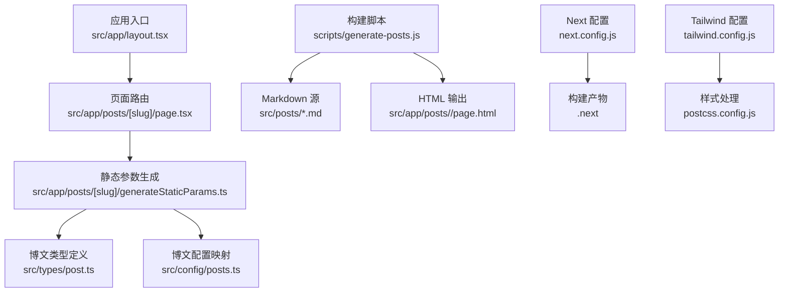
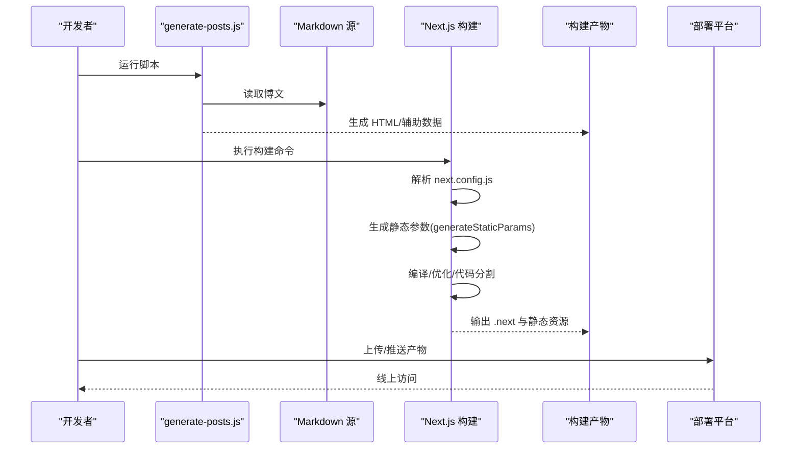
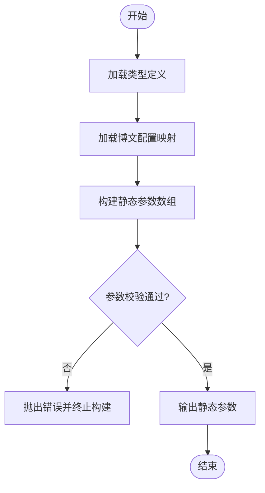
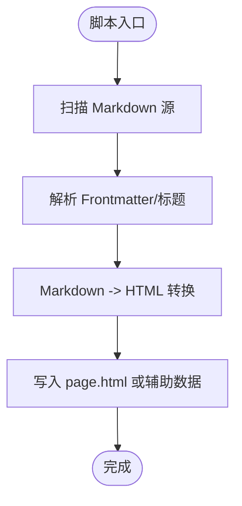
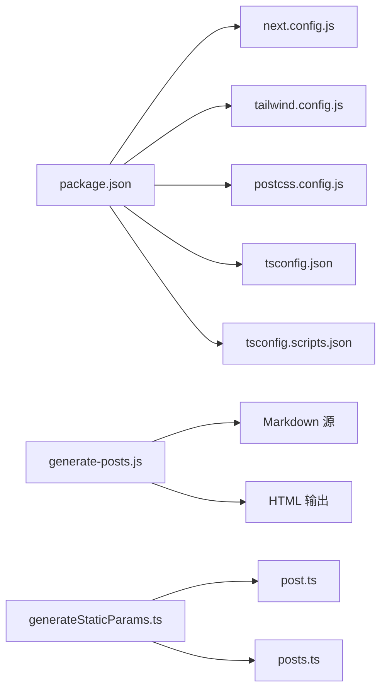

# 构建和部署

<cite>
**本文引用的文件**   
- [next.config.js](file://next.config.js)
- [tailwind.config.js](file://tailwind.config.js)
- [postcss.config.js](file://postcss.config.js)
- [tsconfig.json](file://tsconfig.json)
- [tsconfig.scripts.json](file://tsconfig.scripts.json)
- [package.json](file://package.json)
- [scripts/generate-posts.js](file://scripts/generate-posts.js)
- [src/app/posts/[slug]/generateStaticParams.ts](file://src/app/posts/[slug]/generateStaticParams.ts)
- [src/types/post.ts](file://src/types/post.ts)
- [src/config/posts.ts](file://src/config/posts.ts)
</cite>

## 目录
1. [简介](#简介)
2. [项目结构](#项目结构)
3. [核心组件](#核心组件)
4. [架构总览](#架构总览)
5. [详细组件分析](#详细组件分析)
6. [依赖分析](#依赖分析)
7. [性能考虑](#性能考虑)
8. [故障排查指南](#故障排查指南)
9. [结论](#结论)
10. [附录](#附录)

## 简介
本文件面向构建与部署，聚焦于 Next.js 静态站点生成（SSG）的构建流程、优化策略、脚本机制与平台部署实践。文档将深入解释：
- 构建流程与优化策略（代码分割、资源压缩、缓存等）
- generate-posts.js 的工作原理与扩展方法
- 关键配置文件的作用与调优选项（next.config.js、tailwind.config.js、PostCSS、TypeScript 配置等）
- 生产环境构建优化与产物说明
- 多平台部署指南（Vercel、Netlify、GitHub Pages）
- CI/CD 流水线与自动化部署
- 性能监控与错误追踪集成
- 常见问题排查与性能调优建议

## 项目结构
本项目采用 Next.js App Router 组织页面与组件，内容以 Markdown 形式存放并通过脚本与类型系统驱动静态参数生成。关键目录与职责：
- src/app：应用路由与页面布局
- src/components：可复用 UI 组件
- src/config：站点内容与元数据配置
- src/posts：Markdown 博文源文件
- scripts：构建期脚本（如 generate-posts.js）
- public：静态资源（图片、动画、样式等）
- 根级配置文件：Next.js、Tailwind、PostCSS、TypeScript、包管理

图表来源
- [next.config.js](file://next.config.js)
- [tailwind.config.js](file://tailwind.config.js)
- [postcss.config.js](file://postcss.config.js)
- [src/app/posts/[slug]/generateStaticParams.ts](file://src/app/posts/[slug]/generateStaticParams.ts)
- [src/types/post.ts](file://src/types/post.ts)
- [src/config/posts.ts](file://src/config/posts.ts)
- [scripts/generate-posts.js](file://scripts/generate-posts.js)

章节来源
- [next.config.js](file://next.config.js)
- [tailwind.config.js](file://tailwind.config.js)
- [postcss.config.js](file://postcss.config.js)
- [tsconfig.json](file://tsconfig.json)
- [tsconfig.scripts.json](file://tsconfig.scripts.json)
- [package.json](file://package.json)
- [scripts/generate-posts.js](file://scripts/generate-posts.js)
- [src/app/posts/[slug]/generateStaticParams.ts](file://src/app/posts/[slug]/generateStaticParams.ts)
- [src/types/post.ts](file://src/types/post.ts)
- [src/config/posts.ts](file://src/config/posts.ts)

## 核心组件
- 静态参数生成器：根据博文列表与类型定义，在构建时生成所有文章路由的静态参数，确保 SSG 预渲染。
- 博文生成脚本：扫描 Markdown 源文件，按需生成对应的 HTML 页面或辅助数据，便于非 React 场景或外部工具消费。
- 站点配置：集中管理博文元信息、导航、主题等，供页面与构建期使用。
- 构建与样式配置：Next.js、Tailwind、PostCSS、TypeScript 配置共同决定构建行为与产物形态。

章节来源
- [src/app/posts/[slug]/generateStaticParams.ts](file://src/app/posts/[slug]/generateStaticParams.ts)
- [src/types/post.ts](file://src/types/post.ts)
- [src/config/posts.ts](file://src/config/posts.ts)
- [scripts/generate-posts.js](file://scripts/generate-posts.js)

## 架构总览
下图展示了从源码到产物的整体构建与部署路径，包括脚本生成、Next.js 编译、静态导出以及部署产物。

图表来源
- [scripts/generate-posts.js](file://scripts/generate-posts.js)
- [src/app/posts/[slug]/generateStaticParams.ts](file://src/app/posts/[slug]/generateStaticParams.ts)
- [next.config.js](file://next.config.js)

## 详细组件分析

### 静态参数生成（SSG 路由预渲染）
- 作用：在构建阶段为每个博文生成唯一 slug，驱动 Next.js 预渲染对应页面。
- 输入：博文类型定义与博文配置映射。
- 输出：静态参数数组，供路由动态段 [slug] 使用。
- 关键点：
  - 类型安全：通过统一类型约束，避免 slug 不一致导致的运行时错误。
  - 可扩展性：新增博文只需更新配置映射，无需修改路由逻辑。

图表来源
- [src/app/posts/[slug]/generateStaticParams.ts](file://src/app/posts/[slug]/generateStaticParams.ts)
- [src/types/post.ts](file://src/types/post.ts)
- [src/config/posts.ts](file://src/config/posts.ts)

章节来源
- [src/app/posts/[slug]/generateStaticParams.ts](file://src/app/posts/[slug]/generateStaticParams.ts)
- [src/types/post.ts](file://src/types/post.ts)
- [src/config/posts.ts](file://src/config/posts.ts)

### 博文生成脚本（generate-posts.js）
- 目标：扫描 Markdown 源文件，按约定生成 HTML 页面或辅助数据，便于非 React 消费或离线预览。
- 工作流：
  - 遍历 src/posts 下的 Markdown 文件
  - 解析文件名或 Frontmatter 提取 slug 与元信息
  - 渲染模板或转换 Markdown 为 HTML
  - 写入 src/app/posts/<slug>/page.html 或其他目标路径
- 自定义扩展点：
  - 增加新的渲染引擎或模板变量
  - 支持额外字段（如封面图、标签、分类）
  - 输出多种格式（JSON、RSS、Sitemap 片段）
  - 增量构建：仅处理变更的 Markdown 文件

图表来源
- [scripts/generate-posts.js](file://scripts/generate-posts.js)

章节来源
- [scripts/generate-posts.js](file://scripts/generate-posts.js)

### 配置文件与作用
- next.config.js：控制 Next.js 构建行为，包括导出模式、路径别名、插件、优化开关等。
- tailwind.config.js：定义 Tailwind CSS 的主题、插件、内容扫描范围等。
- postcss.config.js：配置 PostCSS 处理器链（如 Autoprefixer、Tailwind）。
- tsconfig.json / tsconfig.scripts.json：分别用于应用与脚本的 TypeScript 编译选项。
- package.json：声明依赖、脚本命令、版本锁定等。

章节来源
- [next.config.js](file://next.config.js)
- [tailwind.config.js](file://tailwind.config.js)
- [postcss.config.js](file://postcss.config.js)
- [tsconfig.json](file://tsconfig.json)
- [tsconfig.scripts.json](file://tsconfig.scripts.json)
- [package.json](file://package.json)

## 依赖分析
- 构建期依赖：Next.js、Tailwind、PostCSS、TypeScript、脚本工具库（如 fs、path、markdown 转换器等）。
- 运行时依赖：Next.js 运行时、浏览器端样式与组件库。
- 耦合关系：
  - 静态参数生成依赖类型与配置映射，保证一致性。
  - 脚本与 Markdown 源强耦合，需保持命名与 Frontmatter 规范。
  - 构建配置影响产物结构与优化效果。

图表来源
- [package.json](file://package.json)
- [next.config.js](file://next.config.js)
- [tailwind.config.js](file://tailwind.config.js)
- [postcss.config.js](file://postcss.config.js)
- [tsconfig.json](file://tsconfig.json)
- [tsconfig.scripts.json](file://tsconfig.scripts.json)
- [scripts/generate-posts.js](file://scripts/generate-posts.js)
- [src/app/posts/[slug]/generateStaticParams.ts](file://src/app/posts/[slug]/generateStaticParams.ts)
- [src/types/post.ts](file://src/types/post.ts)
- [src/config/posts.ts](file://src/config/posts.ts)

章节来源
- [package.json](file://package.json)
- [next.config.js](file://next.config.js)
- [tailwind.config.js](file://tailwind.config.js)
- [postcss.config.js](file://postcss.config.js)
- [tsconfig.json](file://tsconfig.json)
- [tsconfig.scripts.json](file://tsconfig.scripts.json)
- [scripts/generate-posts.js](file://scripts/generate-posts.js)
- [src/app/posts/[slug]/generateStaticParams.ts](file://src/app/posts/[slug]/generateStaticParams.ts)
- [src/types/post.ts](file://src/types/post.ts)
- [src/config/posts.ts](file://src/config/posts.ts)

## 性能考虑
- 代码分割：利用 Next.js 自动路由级与组件级代码分割，减少首屏体积。
- 资源优化：启用图片与字体优化，按需加载；对静态资源进行压缩与缓存。
- 构建优化：合理设置导出模式与并行度；避免在构建期执行重 IO 操作。
- 缓存策略：利用 CDN 与浏览器缓存头，结合版本号或哈希提升命中率。
- 样式优化：精简 Tailwind 扫描范围，避免未使用样式进入产物。
- 脚本优化：对 generate-posts.js 实现增量构建与并发处理，降低构建时间。

[本节为通用指导，不直接分析具体文件]

## 故障排查指南
- 构建失败
  - 检查 Markdown 文件命名与 Frontmatter 是否符合约定
  - 确认类型定义与配置映射一致，避免 slug 缺失或重复
  - 查看构建日志中的错误堆栈，定位脚本或 Next.js 配置问题
- 页面未预渲染
  - 验证 generateStaticParams 是否返回有效参数
  - 检查路由文件是否存在且正确引用静态参数
- 样式异常
  - 确认 Tailwind 内容扫描路径包含实际使用的组件与页面
  - 检查 PostCSS 链顺序与插件版本兼容性
- 部署失败
  - 核对平台环境变量与构建命令
  - 确认产物目录与静态资源路径正确

章节来源
- [scripts/generate-posts.js](file://scripts/generate-posts.js)
- [src/app/posts/[slug]/generateStaticParams.ts](file://src/app/posts/[slug]/generateStaticParams.ts)
- [tailwind.config.js](file://tailwind.config.js)
- [postcss.config.js](file://postcss.config.js)

## 结论
通过统一的类型与配置、清晰的脚本与构建流程，本项目实现了稳定的静态站点生成与高效的开发体验。配合合理的优化策略与多平台部署方案，可在保证性能的同时简化运维复杂度。建议在持续迭代中关注增量构建、缓存命中与监控指标，持续提升构建速度与用户体验。

[本节为总结，不直接分析具体文件]

## 附录

### 生产环境构建优化清单
- 启用导出模式与最小化输出
- 开启资源压缩与缓存头
- 限制 Tailwind 扫描范围
- 使用并行构建与缓存层
- 分离脚本与运行时依赖

[本节为通用指导，不直接分析具体文件]

### 多平台部署指南
- Vercel
  - 推荐方式：连接仓库后自动识别 Next.js 项目，使用默认构建命令与导出配置
  - 环境变量：在平台面板配置站点域名、API 密钥等
  - 缓存：利用 Vercel 边缘缓存与 CDN
- Netlify
  - 构建命令：指定 Next.js 构建与导出步骤
  - 发布目录：指向构建产物目录
  - 重写规则：如需 SPA 风格路由，配置单页应用重写
- GitHub Pages
  - 使用静态导出产物，配置 Actions 构建并推送到 gh-pages 分支
  - 注意基础路径与相对资源路径

[本节为通用指导，不直接分析具体文件]

### CI/CD 流水线建议
- 触发条件：push 至主分支或创建 Pull Request
- 步骤：
  - 安装依赖与缓存
  - 运行脚本生成辅助数据
  - 执行构建与测试
  - 上传构建产物或触发平台部署
- 缓存策略：缓存 node_modules 与构建缓存目录，缩短构建时间

[本节为通用指导，不直接分析具体文件]

### 性能监控与错误追踪集成
- 前端监控：接入性能采集 SDK，上报首屏时间、交互延迟与资源耗时
- 错误追踪：捕获未处理异常与边界错误，关联用户上下文与请求 ID
- 日志聚合：集中收集构建与运行日志，设置告警阈值
- 指标看板：可视化关键指标，跟踪优化效果

[本节为通用指导，不直接分析具体文件]