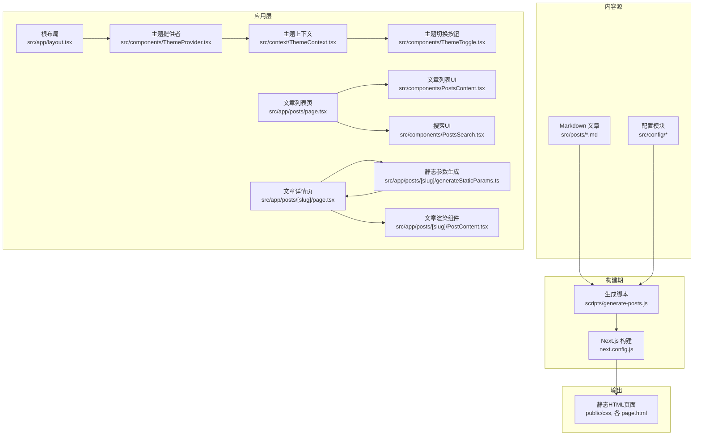
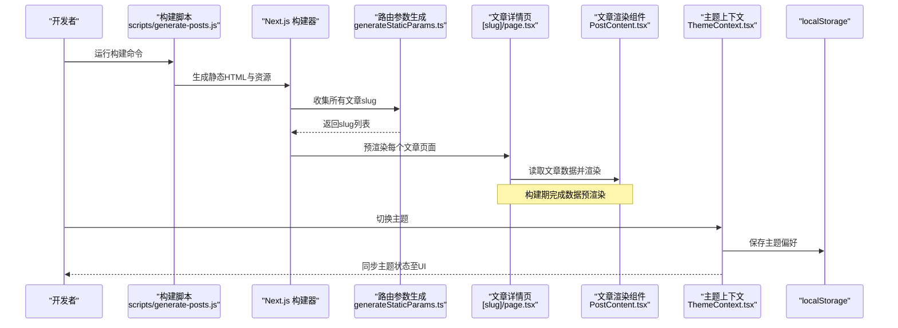
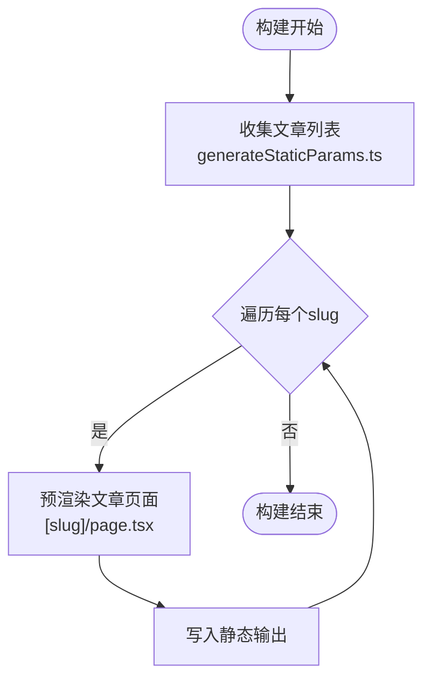
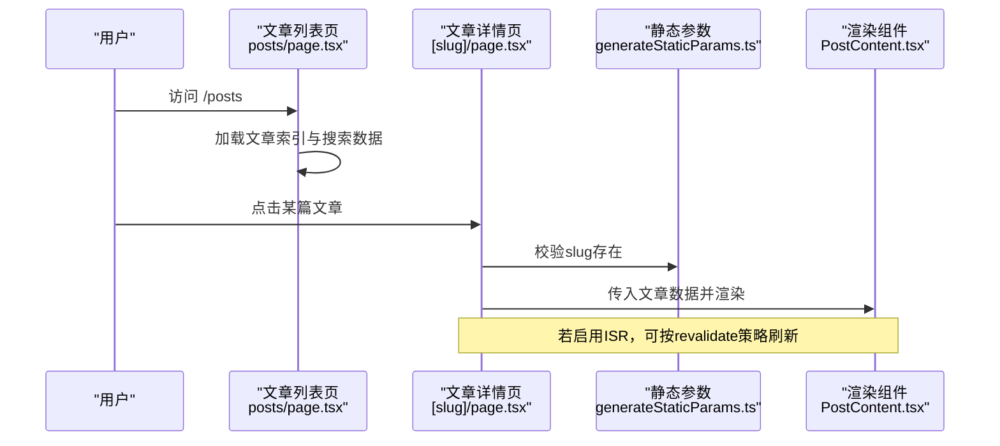
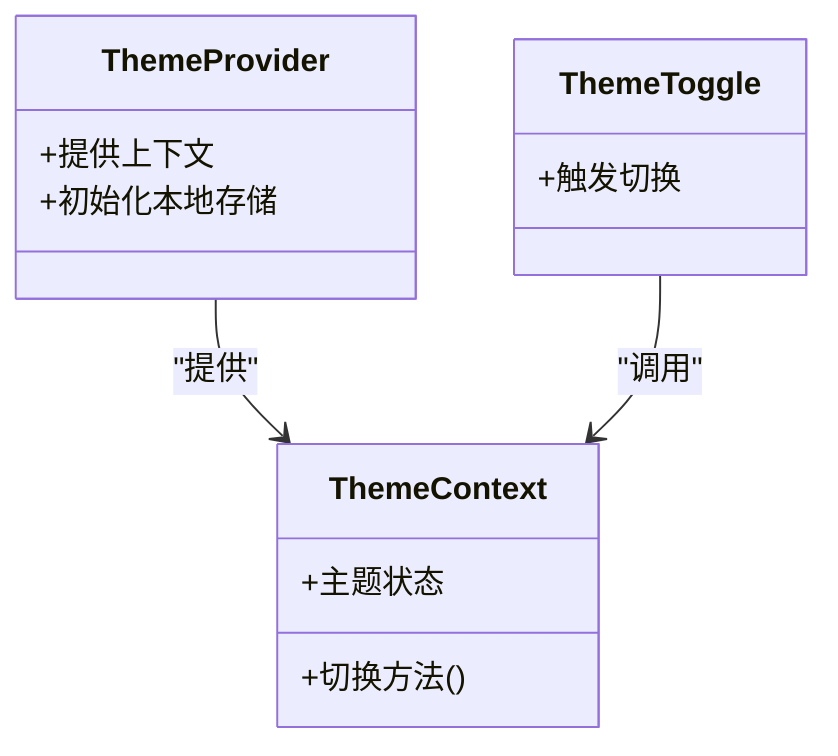
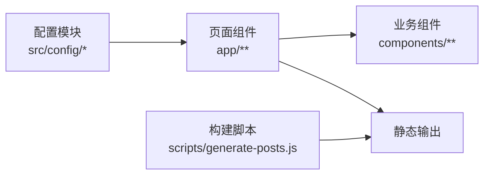

# 数据流模式

<cite>
**本文引用的文件**   
- [README.md](file://README.md)
- [package.json](file://package.json)
- [next.config.js](file://next.config.js)
- [scripts/generate-posts.js](file://scripts/generate-posts.js)
- [src/config/posts.ts](file://src/config/posts.ts)
- [src/config/global.ts](file://src/config/global.ts)
- [src/config/content.ts](file://src/config/content.ts)
- [src/config/about.ts](file://src/config/about.ts)
- [src/config/contact.ts](file://src/config/contact.ts)
- [src/config/home.ts](file://src/config/home.ts)
- [src/config/projects.ts](file://src/config/projects.ts)
- [src/posts/docker-basics.md](file://src/posts/docker-basics.md)
- [src/posts/getting-started-with-nextjs.md](file://src/posts/getting-started-with-nextjs.md)
- [src/posts/graphql-api.md](file://src/posts/graphql-api.md)
- [src/posts/mcp-template-list.md](file://src/posts/mcp-template-list.md)
- [src/posts/nodejs-microservices.md](file://src/posts/nodejs-microservices.md)
- [src/posts/react-performance.md](file://src/posts/react-performance.md)
- [src/posts/security-best-practices.md](file://src/posts/security-best-practices.md)
- [src/posts/tailwind-css-tips.md](file://src/posts/tailwind-css-tips.md)
- [src/posts/testing-react.md](file://src/posts/testing-react.md)
- [src/posts/typescript-best-practices.md](file://src/posts/typescript-best-practices.md)
- [src/app/layout.tsx](file://src/app/layout.tsx)
- [src/app/page.tsx](file://src/app/page.tsx)
- [src/app/posts/page.tsx](file://src/app/posts/page.tsx)
- [src/app/posts/[slug]/layout.tsx](file://src/app/posts/[slug]/layout.tsx)
- [src/app/posts/[slug]/page.tsx](file://src/app/posts/[slug]/page.tsx)
- [src/app/posts/[slug]/generateStaticParams.ts](file://src/app/posts/[slug]/generateStaticParams.ts)
- [src/app/posts/[slug]/PostContent.tsx](file://src/app/posts/[slug]/PostContent.tsx)
- [src/components/PostsContent.tsx](file://src/components/PostsContent.tsx)
- [src/components/PostsSearch.tsx](file://src/components/PostsSearch.tsx)
- [src/components/HomeContent.tsx](file://src/components/HomeContent.tsx)
- [src/components/AboutContent.tsx](file://src/components/AboutContent.tsx)
- [src/components/ProjectsContent.tsx](file://src/components/ProjectsContent.tsx)
- [src/context/ThemeContext.tsx](file://src/context/ThemeContext.tsx)
- [src/components/ThemeProvider.tsx](file://src/components/ThemeProvider.tsx)
- [src/components/ThemeToggle.tsx](file://src/components/ThemeToggle.tsx)
- [src/types/post.ts](file://src/types/post.ts)
</cite>

## 目录
1. [简介](#简介)
2. [项目结构](#项目结构)
3. [核心组件](#核心组件)
4. [架构总览](#架构总览)
5. [详细组件分析](#详细组件分析)
6. [依赖分析](#依赖分析)
7. [性能考虑](#性能考虑)
8. [故障排查指南](#故障排查指南)
9. [结论](#结论)
10. [附录](#附录)

## 简介
本文件面向博客项目的“数据流模式”，聚焦从 Markdown 源文件到静态页面的完整数据处理流程，覆盖以下主题：
- 配置驱动的数据管理模式
- 构建时的数据转换过程（Markdown -> HTML/结构化数据）
- 运行时数据的获取与更新机制
- 静态站点生成的预渲染原理与增量静态再生成（ISR）的应用
- 主题状态的持久化与同步机制
- 数据验证与错误处理策略
- 缓存策略与性能优化方案
- 数据扩展与自定义的处理指南

## 项目结构
本项目采用 Next.js App Router 组织页面与组件，内容以 Markdown 存放于 src/posts，通过脚本在构建期转换为静态 HTML 并生成路由参数。配置集中在 src/config，主题状态通过 Context + localStorage 实现持久化。

图表来源
- [scripts/generate-posts.js](file://scripts/generate-posts.js)
- [next.config.js](file://next.config.js)
- [src/app/layout.tsx](file://src/app/layout.tsx)
- [src/app/posts/page.tsx](file://src/app/posts/page.tsx)
- [src/app/posts/[slug]/page.tsx](file://src/app/posts/[slug]/page.tsx)
- [src/app/posts/[slug]/generateStaticParams.ts](file://src/app/posts/[slug]/generateStaticParams.ts)
- [src/app/posts/[slug]/PostContent.tsx](file://src/app/posts/[slug]/PostContent.tsx)
- [src/components/PostsContent.tsx](file://src/components/PostsContent.tsx)
- [src/components/PostsSearch.tsx](file://src/components/PostsSearch.tsx)
- [src/context/ThemeContext.tsx](file://src/context/ThemeContext.tsx)
- [src/components/ThemeProvider.tsx](file://src/components/ThemeProvider.tsx)
- [src/components/ThemeToggle.tsx](file://src/components/ThemeToggle.tsx)

章节来源
- [README.md](file://README.md)
- [package.json](file://package.json)
- [next.config.js](file://next.config.js)

## 核心组件
- 配置驱动的数据管理
  - 全局与页面级配置集中于 src/config 下的多个模块，如 posts、global、content、about、contact、home、projects 等，提供统一的数据入口，便于集中维护与按需导入。
- 构建期数据转换
  - scripts/generate-posts.js 负责将 Markdown 转换为静态 HTML，并写入 public 或对应页面目录，形成可被 Next.js 直接输出的静态资源。
- 路由与静态参数
  - src/app/posts/[slug]/generateStaticParams.ts 在构建时生成所有文章的 slug 列表，驱动 Next.js 预渲染每个文章详情页面。
- 运行时数据获取
  - 文章列表页 src/app/posts/page.tsx 与详情页 src/app/posts/[slug]/page.tsx 在构建期或首次访问时加载数据；若启用 ISR，可在后续请求中按策略刷新。
- 主题状态持久化与同步
  - src/context/ThemeContext.tsx 定义主题状态与变更方法；src/components/ThemeProvider.tsx 作为 Provider 注入；src/components/ThemeToggle.tsx 触发切换；状态通过 localStorage 持久化，并在客户端与服务端之间保持同步。

章节来源
- [src/config/posts.ts](file://src/config/posts.ts)
- [src/config/global.ts](file://src/config/global.ts)
- [src/config/content.ts](file://src/config/content.ts)
- [src/config/about.ts](file://src/config/about.ts)
- [src/config/contact.ts](file://src/config/contact.ts)
- [src/config/home.ts](file://src/config/home.ts)
- [src/config/projects.ts](file://src/config/projects.ts)
- [scripts/generate-posts.js](file://scripts/generate-posts.js)
- [src/app/posts/[slug]/generateStaticParams.ts](file://src/app/posts/[slug]/generateStaticParams.ts)
- [src/app/posts/page.tsx](file://src/app/posts/page.tsx)
- [src/app/posts/[slug]/page.tsx](file://src/app/posts/[slug]/page.tsx)
- [src/context/ThemeContext.tsx](file://src/context/ThemeContext.tsx)
- [src/components/ThemeProvider.tsx](file://src/components/ThemeProvider.tsx)
- [src/components/ThemeToggle.tsx](file://src/components/ThemeToggle.tsx)

## 架构总览
下图展示从 Markdown 到静态页面的端到端数据流，以及运行时与主题状态交互的关键路径。

图表来源
- [scripts/generate-posts.js](file://scripts/generate-posts.js)
- [src/app/posts/[slug]/generateStaticParams.ts](file://src/app/posts/[slug]/generateStaticParams.ts)
- [src/app/posts/[slug]/page.tsx](file://src/app/posts/[slug]/page.tsx)
- [src/app/posts/[slug]/PostContent.tsx](file://src/app/posts/[slug]/PostContent.tsx)
- [src/context/ThemeContext.tsx](file://src/context/ThemeContext.tsx)

## 详细组件分析

### 配置驱动的数据管理
- 设计要点
  - 将站点元信息、导航、文章索引、项目与关于信息等拆分为独立配置文件，降低耦合度，提高可维护性。
  - 页面组件按需导入配置，避免一次性加载全部数据。
- 关键文件
  - 文章相关：posts.ts
  - 全局与通用：global.ts、content.ts
  - 页面特定：about.ts、contact.ts、home.ts、projects.ts
- 使用建议
  - 新增字段时优先在配置文件中声明，再在组件侧消费，确保类型安全与一致性。
  - 对敏感或动态字段，建议使用环境变量或外部 API，并通过配置桥接。

章节来源
- [src/config/posts.ts](file://src/config/posts.ts)
- [src/config/global.ts](file://src/config/global.ts)
- [src/config/content.ts](file://src/config/content.ts)
- [src/config/about.ts](file://src/config/about.ts)
- [src/config/contact.ts](file://src/config/contact.ts)
- [src/config/home.ts](file://src/config/home.ts)
- [src/config/projects.ts](file://src/config/projects.ts)

### 构建期数据转换（Markdown -> 静态HTML）
- 流程说明
  - 构建脚本遍历 src/posts 下的 Markdown 文件，解析元数据与正文，转换为 HTML 并输出到目标目录。
  - Next.js 在构建阶段读取这些静态资源，生成最终站点。
- 关键点
  - 文件名与 slug 的映射关系需保持一致，确保路由稳定。
  - 图片等资源应放置在 public 下或通过构建脚本复制到输出目录。
- 优化建议
  - 对大文档进行分块渲染或懒加载。
  - 引入缓存层减少重复转换开销。

章节来源
- [scripts/generate-posts.js](file://scripts/generate-posts.js)
- [src/posts/docker-basics.md](file://src/posts/docker-basics.md)
- [src/posts/getting-started-with-nextjs.md](file://src/posts/getting-started-with-nextjs.md)
- [src/posts/graphql-api.md](file://src/posts/graphql-api.md)
- [src/posts/mcp-template-list.md](file://src/posts/mcp-template-list.md)
- [src/posts/nodejs-microservices.md](file://src/posts/nodejs-microservices.md)
- [src/posts/react-performance.md](file://src/posts/react-performance.md)
- [src/posts/security-best-practices.md](file://src/posts/security-best-practices.md)
- [src/posts/tailwind-css-tips.md](file://src/posts/tailwind-css-tips.md)
- [src/posts/testing-react.md](file://src/posts/testing-react.md)
- [src/posts/typescript-best-practices.md](file://src/posts/typescript-best-practices.md)

### 路由参数与静态预渲染（SSG）
- 静态参数生成
  - generateStaticParams.ts 在构建时产出所有文章 slug，驱动 Next.js 为每个文章生成静态页面。
- 预渲染优势
  - 首屏加载更快，SEO 友好，CDN 缓存命中率高。
- ISR 集成点
  - 在详情页或列表页可通过 revalidate 选项启用增量静态再生成，使内容更新后按需重建。

图表来源
- [src/app/posts/[slug]/generateStaticParams.ts](file://src/app/posts/[slug]/generateStaticParams.ts)
- [src/app/posts/[slug]/page.tsx](file://src/app/posts/[slug]/page.tsx)

章节来源
- [src/app/posts/[slug]/generateStaticParams.ts](file://src/app/posts/[slug]/generateStaticParams.ts)
- [src/app/posts/[slug]/page.tsx](file://src/app/posts/[slug]/page.tsx)

### 运行时数据获取与更新（含 ISR）
- 列表页数据获取
  - src/app/posts/page.tsx 在构建期或首次访问时加载文章索引与摘要，结合 PostsContent.tsx 与 PostsSearch.tsx 提供搜索与展示。
- 详情页数据获取
  - src/app/posts/[slug]/page.tsx 根据 slug 定位文章数据，交由 PostContent.tsx 渲染。
- ISR 策略
  - 对于频繁更新的内容，可在页面级别设置 revalidate 时间窗口，实现增量静态再生成，平衡实时性与性能。

图表来源
- [src/app/posts/page.tsx](file://src/app/posts/page.tsx)
- [src/app/posts/[slug]/page.tsx](file://src/app/posts/[slug]/page.tsx)
- [src/app/posts/[slug]/generateStaticParams.ts](file://src/app/posts/[slug]/generateStaticParams.ts)
- [src/app/posts/[slug]/PostContent.tsx](file://src/app/posts/[slug]/PostContent.tsx)
- [src/components/PostsContent.tsx](file://src/components/PostsContent.tsx)
- [src/components/PostsSearch.tsx](file://src/components/PostsSearch.tsx)

章节来源
- [src/app/posts/page.tsx](file://src/app/posts/page.tsx)
- [src/app/posts/[slug]/page.tsx](file://src/app/posts/[slug]/page.tsx)
- [src/app/posts/[slug]/generateStaticParams.ts](file://src/app/posts/[slug]/generateStaticParams.ts)
- [src/app/posts/[slug]/PostContent.tsx](file://src/app/posts/[slug]/PostContent.tsx)
- [src/components/PostsContent.tsx](file://src/components/PostsContent.tsx)
- [src/components/PostsSearch.tsx](file://src/components/PostsSearch.tsx)

### 主题状态持久化与同步
- 状态定义与提供者
  - ThemeContext.tsx 定义主题状态与变更函数；ThemeProvider.tsx 作为 React 上下文提供者包裹应用。
- 持久化与同步
  - 主题偏好保存在 localStorage，客户端初始化时读取并同步到上下文；服务端渲染时默认值由 Provider 提供，避免闪烁。
- 交互组件
  - ThemeToggle.tsx 暴露切换按钮，调用上下文方法更新主题。

图表来源
- [src/context/ThemeContext.tsx](file://src/context/ThemeContext.tsx)
- [src/components/ThemeProvider.tsx](file://src/components/ThemeProvider.tsx)
- [src/components/ThemeToggle.tsx](file://src/components/ThemeToggle.tsx)

章节来源
- [src/context/ThemeContext.tsx](file://src/context/ThemeContext.tsx)
- [src/components/ThemeProvider.tsx](file://src/components/ThemeProvider.tsx)
- [src/components/ThemeToggle.tsx](file://src/components/ThemeToggle.tsx)

### 数据验证与错误处理策略
- 输入验证
  - 对 slug、配置字段进行基本校验，防止非法路由或空数据导致崩溃。
- 错误边界
  - 在页面或组件层级捕获渲染异常，提供降级 UI 与日志上报。
- 构建期错误
  - 在生成脚本中对缺失文件或格式错误的 Markdown 进行提示与跳过，保证构建稳定性。

章节来源
- [src/types/post.ts](file://src/types/post.ts)
- [src/app/posts/[slug]/page.tsx](file://src/app/posts/[slug]/page.tsx)
- [scripts/generate-posts.js](file://scripts/generate-posts.js)

### 缓存策略与性能优化
- 静态资源缓存
  - 利用 CDN 与浏览器缓存，对静态 HTML、CSS、JS 与图片设置长期缓存头。
- 构建缓存
  - 复用上次构建产物，仅增量重建受影响页面。
- 运行时优化
  - 列表页分页与虚拟滚动，详情页按需加载代码与媒体资源。
- ISR 调优
  - 合理设置 revalidate 时间，兼顾新鲜度与构建成本。

章节来源
- [next.config.js](file://next.config.js)
- [src/app/posts/page.tsx](file://src/app/posts/page.tsx)
- [src/app/posts/[slug]/page.tsx](file://src/app/posts/[slug]/page.tsx)

### 数据扩展与自定义处理指南
- 新增文章类型
  - 在 src/types/post.ts 扩展类型定义，在配置模块中添加新字段，在渲染组件中消费。
- 自定义数据源
  - 将 Markdown 替换为 CMS 或数据库，通过脚本或 API 在构建期拉取数据并生成静态页面。
- 插件化渲染
  - 在 PostContent.tsx 中抽象渲染管线，支持不同内容格式的插件式处理。

章节来源
- [src/types/post.ts](file://src/types/post.ts)
- [src/app/posts/[slug]/PostContent.tsx](file://src/app/posts/[slug]/PostContent.tsx)
- [scripts/generate-posts.js](file://scripts/generate-posts.js)

## 依赖分析
- 模块耦合
  - 页面组件依赖配置与上下文，构建脚本依赖文件系统与模板引擎。
- 外部依赖
  - Next.js 提供路由、构建与 SSR/SSG 能力；Tailwind 与 PostCSS 用于样式处理。
- 潜在循环依赖
  - 避免在配置模块中反向引用页面组件，保持单向依赖。

图表来源
- [src/config/posts.ts](file://src/config/posts.ts)
- [src/app/posts/page.tsx](file://src/app/posts/page.tsx)
- [src/components/PostsContent.tsx](file://src/components/PostsContent.tsx)
- [scripts/generate-posts.js](file://scripts/generate-posts.js)

章节来源
- [package.json](file://package.json)
- [next.config.js](file://next.config.js)

## 性能考虑
- 构建期
  - 并行处理 Markdown 文件，减少 I/O 等待；对大文档进行分片与压缩。
- 运行时
  - 列表页采用分页与惰性加载；详情页启用 ISR 控制刷新频率。
- 缓存
  - 合理设置 HTTP 缓存头；对热点页面启用边缘缓存。
- 资源优化
  - 图片懒加载与响应式尺寸；字体与图标按需加载。

## 故障排查指南
- 常见问题
  - 构建失败：检查 Markdown 语法与脚本输出路径；确认依赖版本兼容。
  - 路由 404：核对 slug 与 generateStaticParams 输出是否一致。
  - 主题闪烁：确保 Provider 在服务端正确初始化，避免客户端与服务端不一致。
- 调试建议
  - 在关键节点添加日志；使用浏览器网络面板观察缓存命中情况。
  - 对 ISR 页面，手动触发重新生成并验证缓存失效行为。

章节来源
- [scripts/generate-posts.js](file://scripts/generate-posts.js)
- [src/app/posts/[slug]/generateStaticParams.ts](file://src/app/posts/[slug]/generateStaticParams.ts)
- [src/app/posts/[slug]/page.tsx](file://src/app/posts/[slug]/page.tsx)
- [src/components/ThemeProvider.tsx](file://src/components/ThemeProvider.tsx)

## 结论
本项目通过配置驱动与构建期转换，实现了从 Markdown 到静态页面的高效数据流。结合 Next.js 的 SSG 与 ISR，既保证了首屏性能与 SEO，又提供了内容更新的灵活性。主题状态通过 Context 与 localStorage 实现持久化与同步，提升了用户体验。建议在后续迭代中完善数据验证与错误边界，持续优化缓存与构建性能，并逐步引入插件化渲染以增强可扩展性。

## 附录
- 快速上手
  - 安装依赖与运行构建命令请参考 README 与 package.json。
- 参考文件
  - 页面布局与首页：src/app/layout.tsx、src/app/page.tsx
  - 关于与项目页面：src/app/about/page.tsx、src/app/projects/page.tsx
  - 组件示例：src/components/AboutContent.tsx、src/components/ProjectsContent.tsx、src/components/HomeContent.tsx

章节来源
- [README.md](file://README.md)
- [package.json](file://package.json)
- [src/app/layout.tsx](file://src/app/layout.tsx)
- [src/app/page.tsx](file://src/app/page.tsx)
- [src/app/about/page.tsx](file://src/app/about/page.tsx)
- [src/app/projects/page.tsx](file://src/app/projects/page.tsx)
- [src/components/AboutContent.tsx](file://src/components/AboutContent.tsx)
- [src/components/ProjectsContent.tsx](file://src/components/ProjectsContent.tsx)
- [src/components/HomeContent.tsx](file://src/components/HomeContent.tsx)