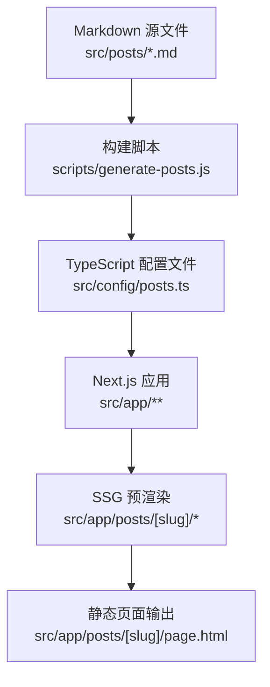
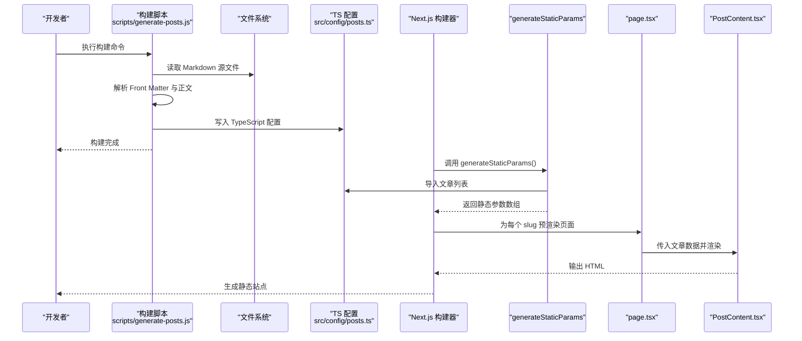
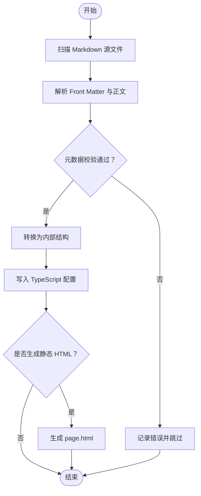
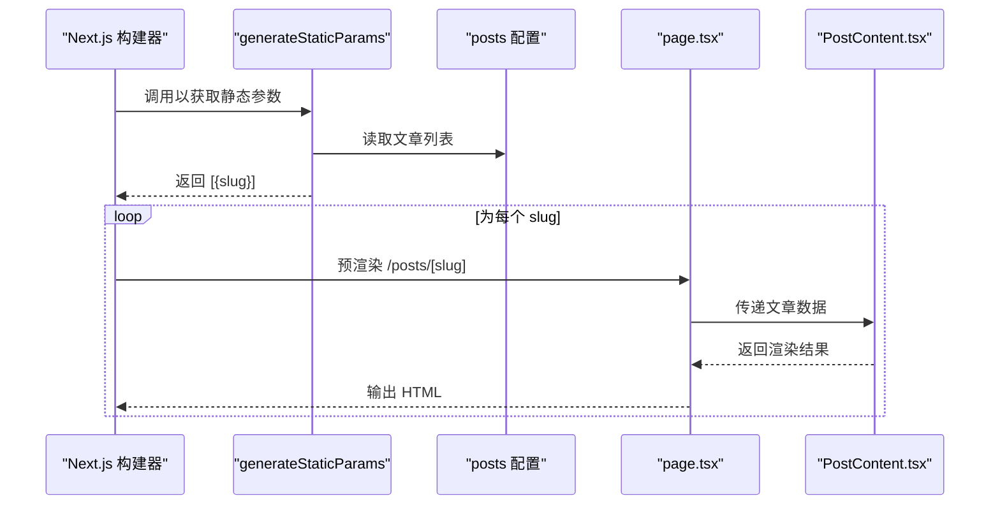
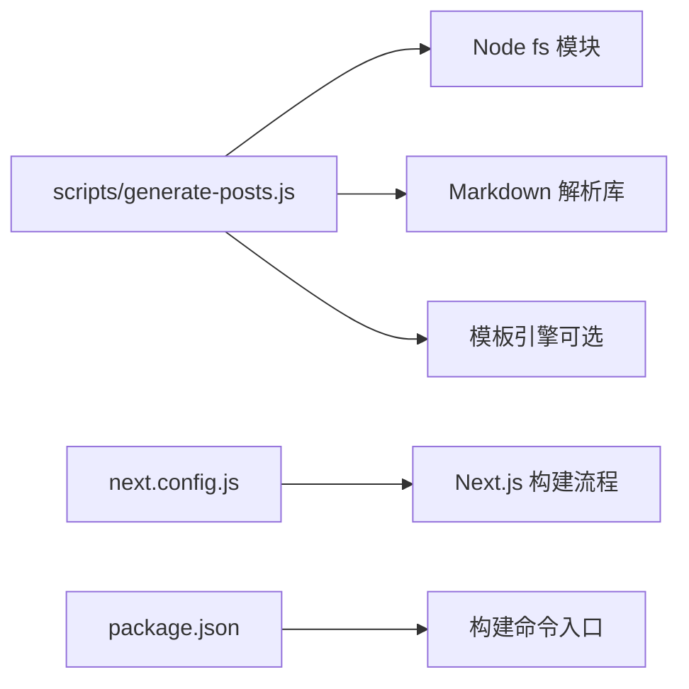

# 构建时数据处理

<cite>
**本文引用的文件**   
- [scripts/generate-posts.js](file://scripts/generate-posts.js)
- [src/posts/docker-basics.md](file://src/posts/docker-basics.md)
- [src/posts/getting-started-with-nextjs.md](file://src/posts/getting-started-with-nextjs.md)
- [src/posts/graphql-api.md](file://src/posts/graphql-api.md)
- [src/posts/mcp-template-list.md](file://src/posts/mcp-template-list.md)
- [src/posts/nodejs-microservices.md](file://src/posts/nodejs-microservices.md)
- [src/posts/react-performance.md](file://src/posts/react-performance.md)
- [src/posts/security-best-practices.md](file://src/posts/security-best-practices.md)
- [src/posts/tailwind-css-tips.md](file://src/posts/tailwind-css-tips.md)
- [src/posts/testing-react.md](file://src/posts/testing-react.md)
- [src/posts/typescript-best-practices.md](file://src/posts/typescript-best-practices.md)
- [src/app/posts/[slug]/generateStaticParams.ts](file://src/app/posts/[slug]/generateStaticParams.ts)
- [src/app/posts/[slug]/page.tsx](file://src/app/posts/[slug]/page.tsx)
- [src/app/posts/[slug]/PostContent.tsx](file://src/app/posts/[slug]/PostContent.tsx)
- [src/app/posts/page.tsx](file://src/app/posts/page.tsx)
- [src/config/posts.ts](file://src/config/posts.ts)
- [src/types/post.ts](file://src/types/post.ts)
- [next.config.js](file://next.config.js)
- [package.json](file://package.json)
</cite>

## 目录
1. [简介](#简介)
2. [项目结构](#项目结构)
3. [核心组件](#核心组件)
4. [架构总览](#架构总览)
5. [详细组件分析](#详细组件分析)
6. [依赖分析](#依赖分析)
7. [性能考虑](#性能考虑)
8. [故障排查指南](#故障排查指南)
9. [结论](#结论)
10. [附录](#附录)

## 简介
本文件面向博客项目的“构建时数据处理”子系统，聚焦从 Markdown 源文件到 TypeScript 配置文件的转换流程。内容涵盖：
- generate-posts.js 脚本的工作原理与执行时机
- Markdown 解析与元数据提取过程
- 静态页面生成机制（Next.js SSG）
- generateStaticParams 的作用与使用方式
- 构建时的数据验证、错误处理与日志记录
- 构建流程图与数据处理时序图
- 自定义构建脚本与扩展数据处理管道的指南

## 项目结构
本项目采用 Next.js App Router，Markdown 源文件位于 src/posts，构建产物为 src/app/posts/[slug]/page.html 等静态页面；同时通过 scripts/generate-posts.js 将 Markdown 转换为 TypeScript 配置文件（如 src/config/posts.ts），供运行时读取。

图表来源
- [scripts/generate-posts.js](file://scripts/generate-posts.js)
- [src/config/posts.ts](file://src/config/posts.ts)
- [src/app/posts/[slug]/generateStaticParams.ts](file://src/app/posts/[slug]/generateStaticParams.ts)
- [src/app/posts/[slug]/page.tsx](file://src/app/posts/[slug]/page.tsx)

章节来源
- [scripts/generate-posts.js](file://scripts/generate-posts.js)
- [src/config/posts.ts](file://src/config/posts.ts)
- [src/app/posts/[slug]/generateStaticParams.ts](file://src/app/posts/[slug]/generateStaticParams.ts)
- [src/app/posts/[slug]/page.tsx](file://src/app/posts/[slug]/page.tsx)

## 核心组件
- 构建脚本：scripts/generate-posts.js
  - 职责：扫描 Markdown 源文件，解析 Front Matter 元数据，生成 TypeScript 配置文件，并可选生成静态 HTML 页面。
- 类型定义：src/types/post.ts
  - 职责：定义 Post 元数据结构，用于校验和约束生成的配置。
- 配置文件：src/config/posts.ts
  - 职责：导出所有文章列表及详情，供 Next.js 在构建期或运行期消费。
- SSG 路由：src/app/posts/[slug]/generateStaticParams.ts 与 page.tsx
  - 职责：根据 posts 配置生成静态参数，预渲染每个文章的静态页面。
- 页面组件：src/app/posts/[slug]/PostContent.tsx
  - 职责：渲染文章内容（HTML/Markdown 渲染结果）。

章节来源
- [scripts/generate-posts.js](file://scripts/generate-posts.js)
- [src/types/post.ts](file://src/types/post.ts)
- [src/config/posts.ts](file://src/config/posts.ts)
- [src/app/posts/[slug]/generateStaticParams.ts](file://src/app/posts/[slug]/generateStaticParams.ts)
- [src/app/posts/[slug]/page.tsx](file://src/app/posts/[slug]/page.tsx)
- [src/app/posts/[slug]/PostContent.tsx](file://src/app/posts/[slug]/PostContent.tsx)

## 架构总览
下图展示了从 Markdown 到最终静态页面的端到端流程，包括构建脚本、配置生成、Next.js SSG 与页面渲染。

图表来源
- [scripts/generate-posts.js](file://scripts/generate-posts.js)
- [src/config/posts.ts](file://src/config/posts.ts)
- [src/app/posts/[slug]/generateStaticParams.ts](file://src/app/posts/[slug]/generateStaticParams.ts)
- [src/app/posts/[slug]/page.tsx](file://src/app/posts/[slug]/page.tsx)
- [src/app/posts/[slug]/PostContent.tsx](file://src/app/posts/[slug]/PostContent.tsx)

## 详细组件分析

### 构建脚本：scripts/generate-posts.js
- 功能要点
  - 扫描 src/posts 下的 .md 文件
  - 解析 Front Matter（标题、日期、标签、摘要等）
  - 将正文转为 HTML（可结合 Markdown 渲染库）
  - 生成 TypeScript 配置文件（导出文章列表与详情）
  - 可选：生成静态 HTML 页面至 src/app/posts/[slug]/page.html
- 关键流程
  - 输入：Markdown 源文件集合
  - 处理：解析、校验、转换
  - 输出：TypeScript 配置文件与静态 HTML
- 错误处理与日志
  - 对缺失必填字段进行校验并抛出错误
  - 记录解析失败的文件路径与原因
  - 提供构建阶段的警告与提示

图表来源
- [scripts/generate-posts.js](file://scripts/generate-posts.js)

章节来源
- [scripts/generate-posts.js](file://scripts/generate-posts.js)

### 类型定义：src/types/post.ts
- 作用
  - 定义文章元数据的类型契约，确保生成的配置与运行时数据一致
- 关键字段（示例）
  - 标识：slug、id
  - 展示：title、summary、coverImage
  - 时间：date、updatedAt
  - 分类：tags、categories
  - 状态：published、draft
- 复杂度
  - 类型校验为 O(1) 的字段级检查
  - 与构建脚本配合实现强类型保障

章节来源
- [src/types/post.ts](file://src/types/post.ts)

### 配置文件：src/config/posts.ts
- 作用
  - 由构建脚本自动生成，导出文章列表与详情对象
  - 被 generateStaticParams 与页面组件消费
- 结构
  - 列表：包含每篇文章的基础信息
  - 详情：按 slug 索引的文章完整数据
- 维护策略
  - 禁止手动编辑，应由构建脚本覆盖生成
  - 若需新增文章，仅需添加 Markdown 源文件并重新构建

章节来源
- [src/config/posts.ts](file://src/config/posts.ts)

### SSG 路由：generateStaticParams 与 page.tsx
- generateStaticParams
  - 在构建期计算所有 /posts/[slug] 的动态路由参数
  - 从 posts 配置中读取 slug 列表，返回静态参数数组
- page.tsx
  - 接收 params.slug，查找对应文章数据
  - 将数据传递给 PostContent 组件进行渲染
- 优势
  - 构建期确定路由，提升首屏加载性能
  - 减少运行期开销，利于 SEO

图表来源
- [src/app/posts/[slug]/generateStaticParams.ts](file://src/app/posts/[slug]/generateStaticParams.ts)
- [src/app/posts/[slug]/page.tsx](file://src/app/posts/[slug]/page.tsx)
- [src/app/posts/[slug]/PostContent.tsx](file://src/app/posts/[slug]/PostContent.tsx)
- [src/config/posts.ts](file://src/config/posts.ts)

章节来源
- [src/app/posts/[slug]/generateStaticParams.ts](file://src/app/posts/[slug]/generateStaticParams.ts)
- [src/app/posts/[slug]/page.tsx](file://src/app/posts/[slug]/page.tsx)
- [src/app/posts/[slug]/PostContent.tsx](file://src/app/posts/[slug]/PostContent.tsx)
- [src/config/posts.ts](file://src/config/posts.ts)

### 文章列表页：src/app/posts/page.tsx
- 作用
  - 聚合文章列表，支持分页、搜索、筛选等
  - 数据来源：posts 配置
- 交互
  - 点击文章卡片跳转到 /posts/[slug]
  - 支持前端过滤与排序

章节来源
- [src/app/posts/page.tsx](file://src/app/posts/page.tsx)

### Markdown 源文件示例
- 位置：src/posts/*.md
- 约定
  - 文件名即为 slug（或遵循脚本约定的映射规则）
  - Front Matter 必须包含必要字段（如 title、date、tags）
  - 正文支持 Markdown 语法，必要时引入自定义组件或样式

章节来源
- [src/posts/docker-basics.md](file://src/posts/docker-basics.md)
- [src/posts/getting-started-with-nextjs.md](file://src/posts/getting-started-with-nextjs.md)
- [src/posts/graphql-api.md](file://src/posts/graphql-api.md)
- [src/posts/mcp-template-list.md](file://src/posts/mcp-template-list.md)
- [src/posts/nodejs-microservices.md](file://src/posts/nodejs-microservices.md)
- [src/posts/react-performance.md](file://src/posts/react-performance.md)
- [src/posts/security-best-practices.md](file://src/posts/security-best-practices.md)
- [src/posts/tailwind-css-tips.md](file://src/posts/tailwind-css-tips.md)
- [src/posts/testing-react.md](file://src/posts/testing-react.md)
- [src/posts/typescript-best-practices.md](file://src/posts/typescript-best-practices.md)

## 依赖分析
- 构建脚本依赖
  - Node.js 文件系统 API
  - Markdown 解析库（如 marked、remark 等，具体取决于实现）
  - 模板引擎（如需生成 HTML）
- Next.js 集成
  - next.config.js 中的相关配置（如输出目录、外部化模块等）
  - package.json 中的构建脚本入口（如 npm run build）

图表来源
- [scripts/generate-posts.js](file://scripts/generate-posts.js)
- [next.config.js](file://next.config.js)
- [package.json](file://package.json)

章节来源
- [scripts/generate-posts.js](file://scripts/generate-posts.js)
- [next.config.js](file://next.config.js)
- [package.json](file://package.json)

## 性能考虑
- 增量构建
  - 仅变更的 Markdown 文件触发重新生成
  - 缓存已解析的 Markdown 与 HTML，避免重复计算
- I/O 优化
  - 批量读取与写入，减少磁盘访问次数
  - 并行处理多个文件，缩短构建时间
- 内存管理
  - 流式处理大文件，避免一次性加载全部文本
- 渲染优化
  - 预渲染静态页面，减少客户端负担
  - 按需加载图片与资源，降低首屏体积

## 故障排查指南
- 常见问题
  - Front Matter 缺失必填字段：检查类型定义与构建脚本校验逻辑
  - Markdown 解析失败：确认语法正确性与依赖库版本
  - 静态页面未生成：检查生成路径与权限
- 定位步骤
  - 查看构建日志中的错误堆栈与文件路径
  - 临时禁用 HTML 生成，仅生成 TypeScript 配置，缩小问题范围
  - 使用最小复现案例验证解析与转换逻辑
- 恢复建议
  - 修正元数据后重新执行构建脚本
  - 清理构建缓存与输出目录后重试

章节来源
- [scripts/generate-posts.js](file://scripts/generate-posts.js)
- [src/types/post.ts](file://src/types/post.ts)

## 结论
本系统通过构建脚本将 Markdown 源文件转换为 TypeScript 配置，并结合 Next.js 的 SSG 能力预渲染文章页面，实现了高效、稳定且可扩展的博客内容生产流水线。通过严格的类型定义与校验、清晰的错误处理与日志记录，以及灵活的扩展点，团队可以便捷地定制与增强数据处理管道。

## 附录

### 自定义构建脚本与扩展指南
- 新增字段
  - 在类型定义中添加新字段
  - 在构建脚本中解析并写入新字段
  - 更新页面组件以展示新字段
- 替换解析器
  - 更换 Markdown 解析库，调整 AST 处理逻辑
  - 保持输出结构不变，确保向后兼容
- 增加中间件
  - 在生成配置前插入预处理步骤（如内容清洗、外链替换）
  - 在生成 HTML 前插入后处理步骤（如注入统计代码、SEO 元信息）
- 集成 CI/CD
  - 在构建阶段自动执行脚本
  - 对生成的配置进行快照对比，防止意外变更

章节来源
- [scripts/generate-posts.js](file://scripts/generate-posts.js)
- [src/types/post.ts](file://src/types/post.ts)
- [src/config/posts.ts](file://src/config/posts.ts)
- [src/app/posts/[slug]/PostContent.tsx](file://src/app/posts/[slug]/PostContent.tsx)