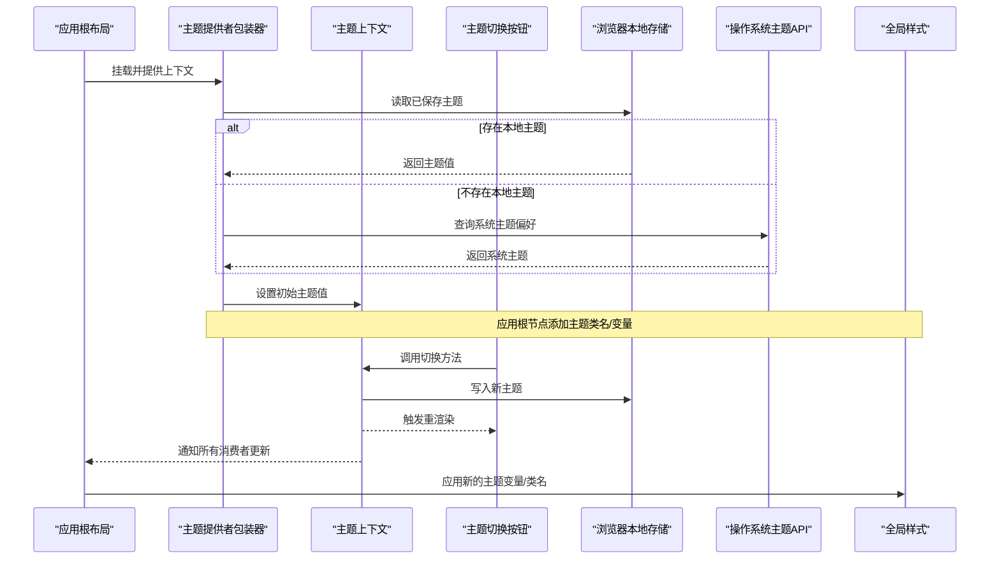
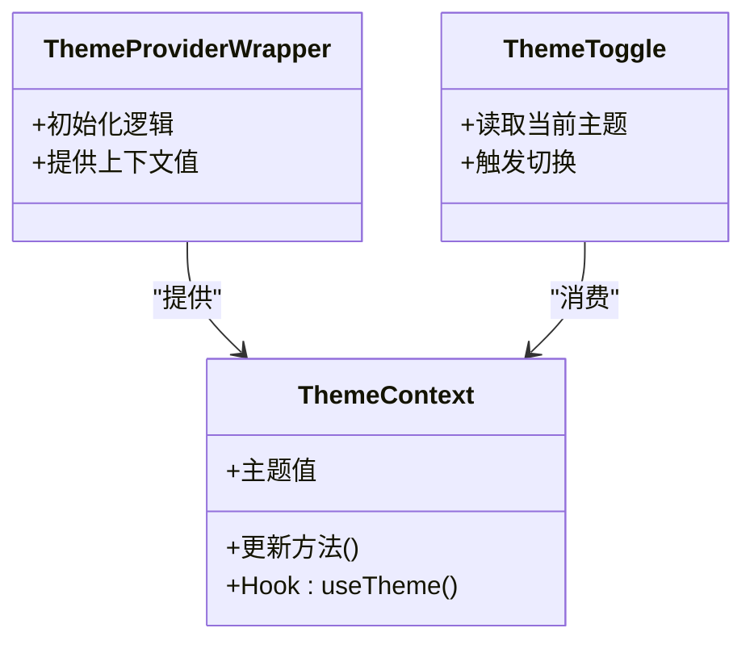
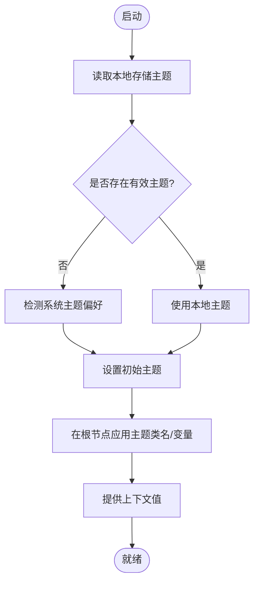
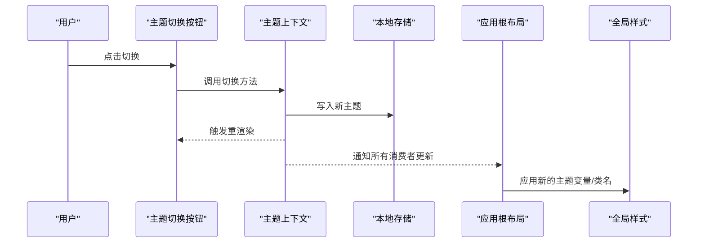
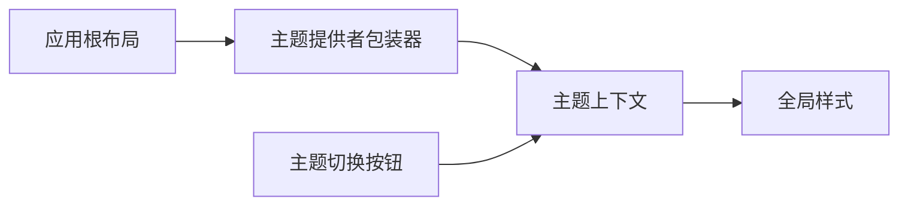

# 运行时状态管理

<cite>
**本文引用的文件**   
- [src/context/ThemeContext.tsx](file://src/context/ThemeContext.tsx)
- [src/components/ThemeProvider.tsx](file://src/components/ThemeProvider.tsx)
- [src/components/ThemeToggle.tsx](file://src/components/ThemeToggle.tsx)
- [src/app/layout.tsx](file://src/app/layout.tsx)
- [src/styles/globals.css](file://src/styles/globals.css)
</cite>

## 目录
1. [简介](#简介)
2. [项目结构](#项目结构)
3. [核心组件与上下文](#核心组件与上下文)
4. [架构总览](#架构总览)
5. [详细组件分析](#详细组件分析)
6. [依赖关系分析](#依赖关系分析)
7. [性能考虑](#性能考虑)
8. [故障排查指南](#故障排查指南)
9. [结论](#结论)
10. [附录：最佳实践与扩展建议](#附录最佳实践与扩展建议)

## 简介
本文件聚焦博客项目的运行时状态管理，围绕 React Context API 的主题状态展开，涵盖以下要点：
- 主题状态的创建、提供者与消费者架构
- 状态持久化机制（localStorage）与系统主题检测
- 组件间状态同步与数据传递模式
- 状态更新生命周期与性能优化策略
- 状态流图与组件交互图
- 自定义状态管理钩子与扩展建议

## 项目结构
与运行时状态管理直接相关的代码集中在 context 与 components 目录，并在应用根布局中注入主题提供者。

```mermaid
graph TB
A["应用根布局<br/>src/app/layout.tsx"] --> B["主题提供者包装器<br/>src/components/ThemeProvider.tsx"]
B --> C["主题上下文定义<br/>src/context/ThemeContext.tsx"]
D["主题切换按钮<br/>src/components/ThemeToggle.tsx"] --> C
E["全局样式变量<br/>src/styles/globals.css"] <- --> F["主题值light/dark"]
```

图表来源
- [src/app/layout.tsx](file://src/app/layout.tsx)
- [src/components/ThemeProvider.tsx](file://src/components/ThemeProvider.tsx)
- [src/context/ThemeContext.tsx](file://src/context/ThemeContext.tsx)
- [src/components/ThemeToggle.tsx](file://src/components/ThemeToggle.tsx)
- [src/styles/globals.css](file://src/styles/globals.css)

章节来源
- [src/app/layout.tsx](file://src/app/layout.tsx)
- [src/components/ThemeProvider.tsx](file://src/components/ThemeProvider.tsx)
- [src/context/ThemeContext.tsx](file://src/context/ThemeContext.tsx)
- [src/components/ThemeToggle.tsx](file://src/components/ThemeToggle.tsx)
- [src/styles/globals.css](file://src/styles/globals.css)

## 核心组件与上下文
- 主题上下文：集中定义主题状态及其更新方法，供消费方通过 Hook 获取。
- 主题提供者包装器：在应用启动时初始化主题（含本地存储与系统偏好），并将上下文值提供给整棵组件树。
- 主题切换按钮：作为典型消费者，读取当前主题并触发更新。
- 应用根布局：将主题提供者包裹到整个应用，确保全局可用。
- 全局样式：根据主题值切换 CSS 变量或类名，驱动 UI 表现。

章节来源
- [src/context/ThemeContext.tsx](file://src/context/ThemeContext.tsx)
- [src/components/ThemeProvider.tsx](file://src/components/ThemeProvider.tsx)
- [src/components/ThemeToggle.tsx](file://src/components/ThemeToggle.tsx)
- [src/app/layout.tsx](file://src/app/layout.tsx)
- [src/styles/globals.css](file://src/styles/globals.css)

## 架构总览
下图展示了从应用启动到用户切换主题的完整流程，包括初始化的持久化加载、系统主题检测、以及后续的状态更新与渲染传播。



图表来源
- [src/app/layout.tsx](file://src/app/layout.tsx)
- [src/components/ThemeProvider.tsx](file://src/components/ThemeProvider.tsx)
- [src/context/ThemeContext.tsx](file://src/context/ThemeContext.tsx)
- [src/components/ThemeToggle.tsx](file://src/components/ThemeToggle.tsx)
- [src/styles/globals.css](file://src/styles/globals.css)

## 详细组件分析

### 主题上下文（状态源）
职责
- 定义主题状态与更新函数
- 暴露统一的 Hook 接口供组件消费
- 保证类型安全与默认值

关键点
- 使用 React 的 createContext 与 useState/useReducer 等组合实现状态与更新
- 对外提供 useTheme 风格的 Hook，避免直接访问上下文对象
- 为更新函数做稳定化处理，减少不必要的重渲染

章节来源
- [src/context/ThemeContext.tsx](file://src/context/ThemeContext.tsx)

#### 类/模块关系图


图表来源
- [src/context/ThemeContext.tsx](file://src/context/ThemeContext.tsx)
- [src/components/ThemeProvider.tsx](file://src/components/ThemeProvider.tsx)
- [src/components/ThemeToggle.tsx](file://src/components/ThemeToggle.tsx)

### 主题提供者包装器（初始化与持久化）
职责
- 在应用启动阶段完成主题初始化
- 优先读取本地存储，否则回退到系统主题检测
- 将最终主题值注入上下文

关键流程
- 读取 localStorage 中的主题键
- 若未命中，则监听系统主题变化并采用其值
- 将主题值与更新函数打包为上下文值
- 在根节点上应用主题类名或变量，驱动样式



图表来源
- [src/components/ThemeProvider.tsx](file://src/components/ThemeProvider.tsx)
- [src/context/ThemeContext.tsx](file://src/context/ThemeContext.tsx)
- [src/styles/globals.css](file://src/styles/globals.css)

章节来源
- [src/components/ThemeProvider.tsx](file://src/components/ThemeProvider.tsx)
- [src/context/ThemeContext.tsx](file://src/context/ThemeContext.tsx)
- [src/styles/globals.css](file://src/styles/globals.css)

### 主题切换按钮（消费者示例）
职责
- 展示当前主题图标/文案
- 调用上下文提供的更新方法切换主题
- 保持自身最小化，仅负责交互与显示

交互时序


图表来源
- [src/components/ThemeToggle.tsx](file://src/components/ThemeToggle.tsx)
- [src/context/ThemeContext.tsx](file://src/context/ThemeContext.tsx)
- [src/styles/globals.css](file://src/styles/globals.css)

章节来源
- [src/components/ThemeToggle.tsx](file://src/components/ThemeToggle.tsx)
- [src/context/ThemeContext.tsx](file://src/context/ThemeContext.tsx)
- [src/styles/globals.css](file://src/styles/globals.css)

### 应用根布局（提供者挂载点）
职责
- 将主题提供者包裹到整个应用
- 确保所有页面与组件均可消费主题状态

章节来源
- [src/app/layout.tsx](file://src/app/layout.tsx)
- [src/components/ThemeProvider.tsx](file://src/components/ThemeProvider.tsx)

## 依赖关系分析
- 低耦合：主题上下文只关注状态与更新，不关心具体 UI；UI 组件只消费 Hook，不感知上下文细节。
- 单一事实来源：主题值由提供者统一维护，并通过上下文向下游广播。
- 外部依赖：浏览器本地存储与系统主题 API 仅在提供者初始化阶段使用，避免污染业务组件。



图表来源
- [src/app/layout.tsx](file://src/app/layout.tsx)
- [src/components/ThemeProvider.tsx](file://src/components/ThemeProvider.tsx)
- [src/context/ThemeContext.tsx](file://src/context/ThemeContext.tsx)
- [src/components/ThemeToggle.tsx](file://src/components/ThemeToggle.tsx)
- [src/styles/globals.css](file://src/styles/globals.css)

章节来源
- [src/app/layout.tsx](file://src/app/layout.tsx)
- [src/components/ThemeProvider.tsx](file://src/components/ThemeProvider.tsx)
- [src/context/ThemeContext.tsx](file://src/context/ThemeContext.tsx)
- [src/components/ThemeToggle.tsx](file://src/components/ThemeToggle.tsx)
- [src/styles/globals.css](file://src/styles/globals.css)

## 性能考虑
- 避免不必要的重渲染
  - 对更新函数进行稳定化处理，防止每次渲染都产生新引用导致消费者重渲染。
  - 将频繁更新的值与稳定的配置拆分到不同上下文，或使用更细粒度的 Hook。
- 延迟初始化与首屏优化
  - 在客户端环境再执行本地存储与系统主题检测，避免服务端渲染时的不一致与额外开销。
  - 可结合 Suspense 或占位态，提升首屏体验。
- 事件监听与资源释放
  - 系统主题监听应在组件卸载时移除，避免内存泄漏。
- 样式切换策略
  - 优先使用 CSS 变量或类名切换，减少 DOM 操作与计算样式成本。

[本节为通用指导，无需特定文件来源]

## 故障排查指南
常见问题与定位思路
- 主题未生效
  - 检查根节点是否正确添加了主题类名或变量。
  - 确认全局样式是否覆盖了预期选择器。
- 切换后其他组件未更新
  - 确认组件是否通过 Hook 消费上下文，而非缓存旧值。
  - 检查更新函数是否被稳定化，避免引用变化导致订阅失效。
- 首次加载主题闪烁
  - 确认是否在客户端才读取本地存储与系统主题，避免 SSR 与 CSR 不一致。
  - 必要时增加过渡动画或占位样式。
- 本地存储不可用
  - 在非浏览器环境（如测试、SSR）需降级处理，避免抛出异常。

章节来源
- [src/components/ThemeProvider.tsx](file://src/components/ThemeProvider.tsx)
- [src/context/ThemeContext.tsx](file://src/context/ThemeContext.tsx)
- [src/styles/globals.css](file://src/styles/globals.css)

## 结论
本项目以 React Context 为核心实现了轻量级、可扩展的主题状态管理。通过“提供者包装器 + 上下文 + 消费 Hook”的分层设计，既保证了全局状态的一致性，又维持了组件的低耦合。配合本地存储与系统主题检测，提供了良好的用户体验与可维护性。

[本节为总结性内容，无需特定文件来源]

## 附录：最佳实践与扩展建议
- 自定义 Hook 封装
  - 将主题相关逻辑封装为 useTheme/useThemeColor 等 Hook，统一入口，便于测试与复用。
- 多主题与动态主题
  - 在上下文中引入主题集合与当前主题键，支持运行时切换主题集。
- 状态分层与拆分
  - 将高频更新的状态与低频配置拆分到不同上下文，降低无关组件的重渲染。
- 可观测性与调试
  - 在开发模式下输出主题变更日志，便于定位问题。
- 测试策略
  - 为提供者编写单元测试，覆盖初始化、持久化与系统主题回退路径。
  - 为消费组件编写集成测试，验证主题切换后的 UI 行为。

[本节为通用指导，无需特定文件来源]