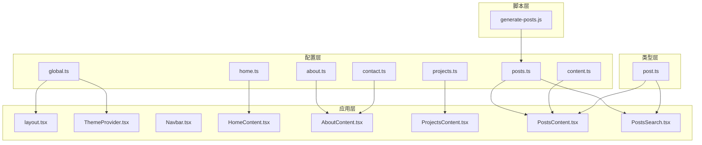
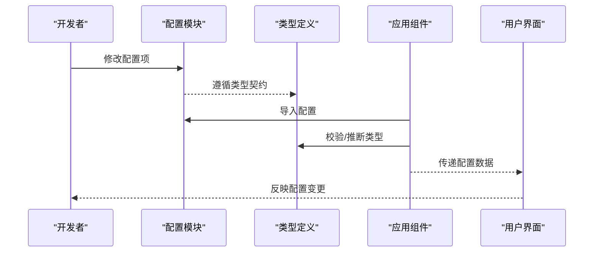
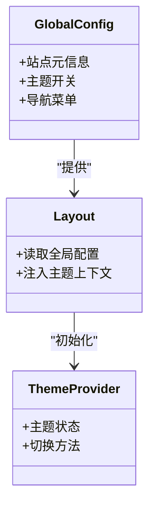
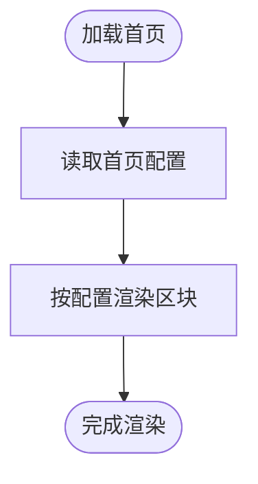
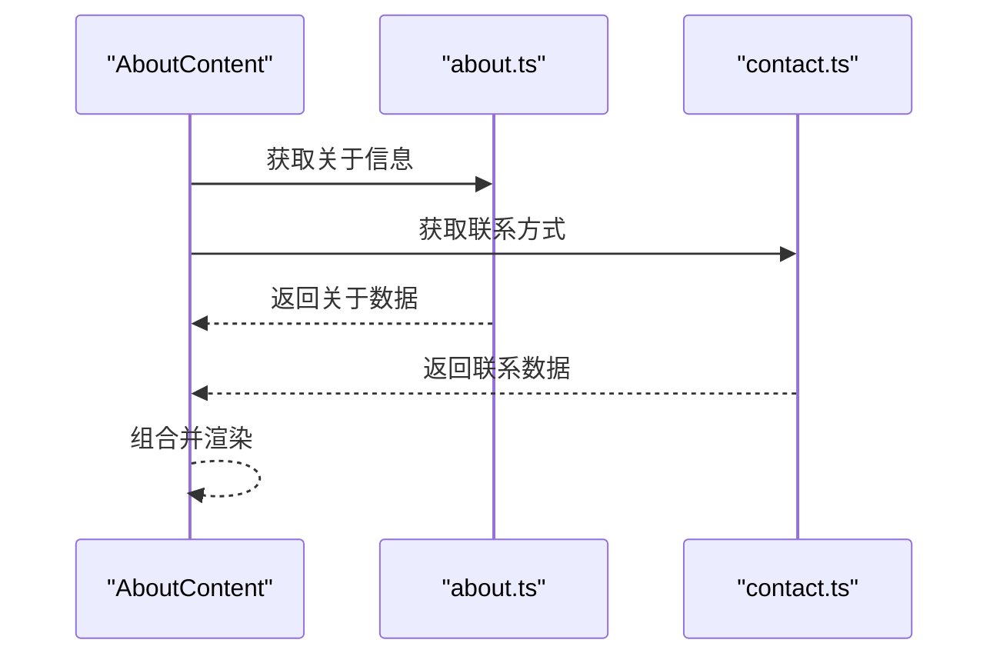
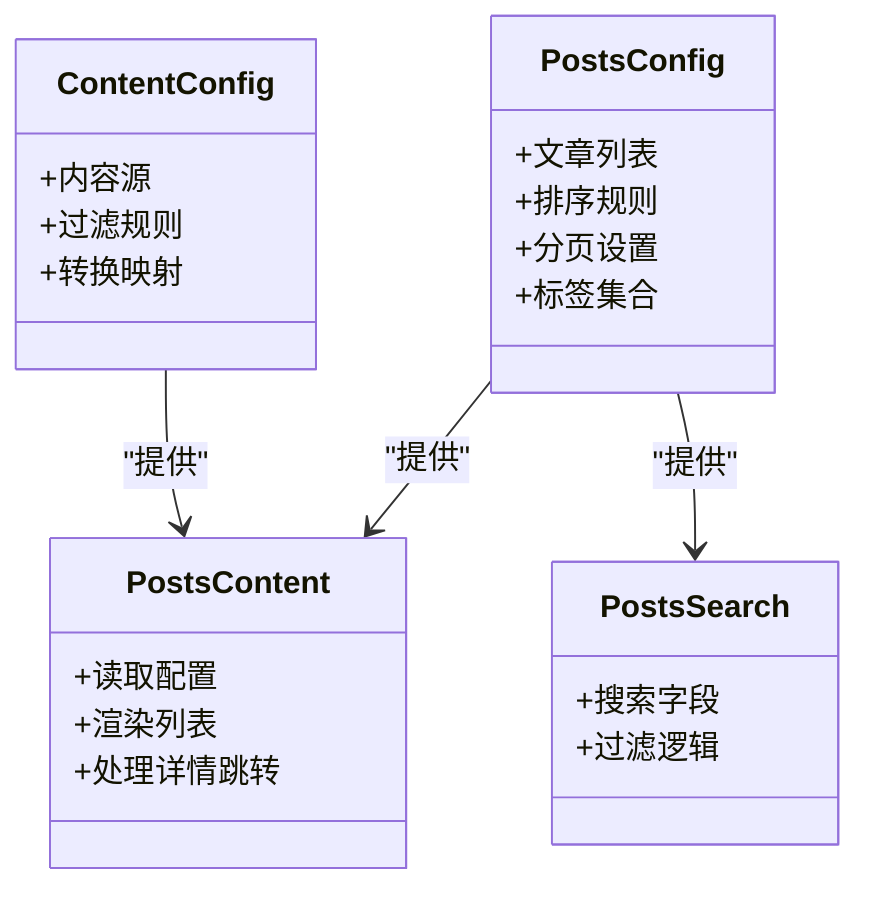
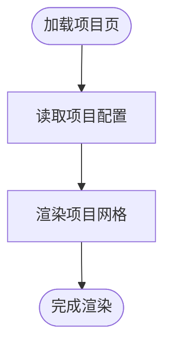
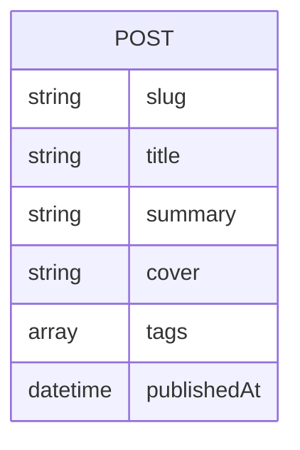
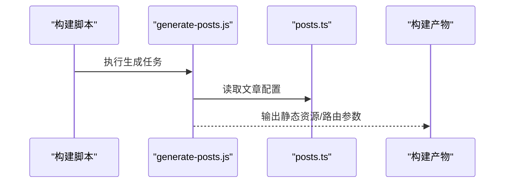
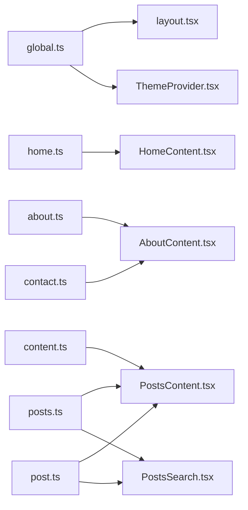

# 配置驱动数据模式

<cite>
**本文引用的文件**   
- [src/config/global.ts](file://src/config/global.ts)
- [src/config/home.ts](file://src/config/home.ts)
- [src/config/about.ts](file://src/config/about.ts)
- [src/config/contact.ts](file://src/config/contact.ts)
- [src/config/posts.ts](file://src/config/posts.ts)
- [src/config/projects.ts](file://src/config/projects.ts)
- [src/config/content.ts](file://src/config/content.ts)
- [src/types/post.ts](file://src/types/post.ts)
- [src/app/layout.tsx](file://src/app/layout.tsx)
- [src/components/ThemeProvider.tsx](file://src/components/ThemeProvider.tsx)
- [src/components/Navbar.tsx](file://src/components/Navbar.tsx)
- [src/components/HomeContent.tsx](file://src/components/HomeContent.tsx)
- [src/components/AboutContent.tsx](file://src/components/AboutContent.tsx)
- [src/components/ProjectsContent.tsx](file://src/components/ProjectsContent.tsx)
- [src/components/PostsContent.tsx](file://src/components/PostsContent.tsx)
- [src/components/PostsSearch.tsx](file://src/components/PostsSearch.tsx)
- [scripts/generate-posts.js](file://scripts/generate-posts.js)
</cite>

## 目录
1. [简介](#简介)
2. [项目结构](#项目结构)
3. [核心组件](#核心组件)
4. [架构总览](#架构总览)
5. [详细组件分析](#详细组件分析)
6. [依赖关系分析](#依赖关系分析)
7. [性能考虑](#性能考虑)
8. [故障排查指南](#故障排查指南)
9. [结论](#结论)
10. [附录](#附录)

## 简介
本文件面向博客项目的“配置驱动数据模式”，聚焦于集中式配置管理的设计与实现。文档将说明：
- 各配置文件的作用与数据结构定义
- 配置的导入导出机制与类型安全保证
- 配置变更对应用行为的影响及热重载支持
- 配置验证规则与默认值处理策略
- 配置层次结构与依赖关系图
- 自定义配置模块与扩展配置系统的开发指南

该模式通过统一的配置入口、强类型约束与可组合的数据模型，使页面内容与展示逻辑解耦，提升可维护性与可扩展性。

## 项目结构
本项目采用“按功能域划分”的配置组织方式，所有业务配置集中在 src/config 目录下，类型定义集中于 src/types，UI 组件按需从配置中读取数据并渲染。

图表来源
- [src/config/global.ts](file://src/config/global.ts)
- [src/config/home.ts](file://src/config/home.ts)
- [src/config/about.ts](file://src/config/about.ts)
- [src/config/contact.ts](file://src/config/contact.ts)
- [src/config/posts.ts](file://src/config/posts.ts)
- [src/config/projects.ts](file://src/config/projects.ts)
- [src/config/content.ts](file://src/config/content.ts)
- [src/types/post.ts](file://src/types/post.ts)
- [src/app/layout.tsx](file://src/app/layout.tsx)
- [src/components/ThemeProvider.tsx](file://src/components/ThemeProvider.tsx)
- [src/components/Navbar.tsx](file://src/components/Navbar.tsx)
- [src/components/HomeContent.tsx](file://src/components/HomeContent.tsx)
- [src/components/AboutContent.tsx](file://src/components/AboutContent.tsx)
- [src/components/ProjectsContent.tsx](file://src/components/ProjectsContent.tsx)
- [src/components/PostsContent.tsx](file://src/components/PostsContent.tsx)
- [src/components/PostsSearch.tsx](file://src/components/PostsSearch.tsx)
- [scripts/generate-posts.js](file://scripts/generate-posts.js)

章节来源
- [src/config/global.ts](file://src/config/global.ts)
- [src/config/home.ts](file://src/config/home.ts)
- [src/config/about.ts](file://src/config/about.ts)
- [src/config/contact.ts](file://src/config/contact.ts)
- [src/config/posts.ts](file://src/config/posts.ts)
- [src/config/projects.ts](file://src/config/projects.ts)
- [src/config/content.ts](file://src/config/content.ts)
- [src/types/post.ts](file://src/types/post.ts)
- [src/app/layout.tsx](file://src/app/layout.tsx)
- [src/components/ThemeProvider.tsx](file://src/components/ThemeProvider.tsx)
- [src/components/Navbar.tsx](file://src/components/Navbar.tsx)
- [src/components/HomeContent.tsx](file://src/components/HomeContent.tsx)
- [src/components/AboutContent.tsx](file://src/components/AboutContent.tsx)
- [src/components/ProjectsContent.tsx](file://src/components/ProjectsContent.tsx)
- [src/components/PostsContent.tsx](file://src/components/PostsContent.tsx)
- [src/components/PostsSearch.tsx](file://src/components/PostsSearch.tsx)
- [scripts/generate-posts.js](file://scripts/generate-posts.js)

## 核心组件
- 全局配置（主题、站点元信息、导航等）：由 layout 与 ThemeProvider 消费，决定整体外观与行为。
- 首页配置：被 HomeContent 使用，控制首屏内容区块与文案。
- 关于页配置：被 AboutContent 使用，包含个人介绍、联系方式等。
- 联系配置：被 AboutContent 或相关表单组件使用，提供社交链接与联系方式。
- 文章配置：被 PostsContent 与 PostsSearch 使用，提供文章列表、排序、搜索字段等。
- 项目配置：被 ProjectsContent 使用，提供项目卡片数据与展示选项。
- 内容聚合配置：为 PostsContent 提供统一的内容源与过滤规则。
- 类型定义：为文章数据提供强类型约束，确保配置与运行时数据一致。

章节来源
- [src/config/global.ts](file://src/config/global.ts)
- [src/config/home.ts](file://src/config/home.ts)
- [src/config/about.ts](file://src/config/about.ts)
- [src/config/contact.ts](file://src/config/contact.ts)
- [src/config/posts.ts](file://src/config/posts.ts)
- [src/config/projects.ts](file://src/config/projects.ts)
- [src/config/content.ts](file://src/config/content.ts)
- [src/types/post.ts](file://src/types/post.ts)
- [src/app/layout.tsx](file://src/app/layout.tsx)
- [src/components/ThemeProvider.tsx](file://src/components/ThemeProvider.tsx)
- [src/components/Navbar.tsx](file://src/components/Navbar.tsx)
- [src/components/HomeContent.tsx](file://src/components/HomeContent.tsx)
- [src/components/AboutContent.tsx](file://src/components/AboutContent.tsx)
- [src/components/ProjectsContent.tsx](file://src/components/ProjectsContent.tsx)
- [src/components/PostsContent.tsx](file://src/components/PostsContent.tsx)
- [src/components/PostsSearch.tsx](file://src/components/PostsSearch.tsx)

## 架构总览
配置驱动的核心在于“单一事实来源”。配置层以模块化的方式暴露结构化数据；类型层提供契约；应用层仅消费配置而不直接持有业务数据。

图表来源
- [src/config/global.ts](file://src/config/global.ts)
- [src/config/posts.ts](file://src/config/posts.ts)
- [src/types/post.ts](file://src/types/post.ts)
- [src/components/PostsContent.tsx](file://src/components/PostsContent.tsx)
- [src/components/PostsSearch.tsx](file://src/components/PostsSearch.tsx)

## 详细组件分析

### 全局配置与主题系统
- 职责：提供站点级元信息、主题开关、导航菜单等。
- 消费方：layout 用于设置文档头与全局样式；ThemeProvider 用于切换主题上下文。
- 影响范围：全局布局、颜色方案、字体、导航可见性等。

图表来源
- [src/config/global.ts](file://src/config/global.ts)
- [src/app/layout.tsx](file://src/app/layout.tsx)
- [src/components/ThemeProvider.tsx](file://src/components/ThemeProvider.tsx)

章节来源
- [src/config/global.ts](file://src/config/global.ts)
- [src/app/layout.tsx](file://src/app/layout.tsx)
- [src/components/ThemeProvider.tsx](file://src/components/ThemeProvider.tsx)

### 首页配置
- 职责：定义首页区块标题、描述、快捷入口等。
- 消费方：HomeContent 根据配置渲染首屏内容。
- 影响范围：首页文案、布局顺序、交互入口。

图表来源
- [src/config/home.ts](file://src/config/home.ts)
- [src/components/HomeContent.tsx](file://src/components/HomeContent.tsx)

章节来源
- [src/config/home.ts](file://src/config/home.ts)
- [src/components/HomeContent.tsx](file://src/components/HomeContent.tsx)

### 关于页与联系配置
- 职责：关于页配置提供个人简介、经历、技能等；联系配置提供社交链接与联系方式。
- 消费方：AboutContent 组合两者进行展示。
- 影响范围：关于页内容、外链跳转、联系方式展示。

图表来源
- [src/config/about.ts](file://src/config/about.ts)
- [src/config/contact.ts](file://src/config/contact.ts)
- [src/components/AboutContent.tsx](file://src/components/AboutContent.tsx)

章节来源
- [src/config/about.ts](file://src/config/about.ts)
- [src/config/contact.ts](file://src/config/contact.ts)
- [src/components/AboutContent.tsx](file://src/components/AboutContent.tsx)

### 文章配置与内容聚合
- 职责：posts.ts 定义文章列表、排序、分页、标签等；content.ts 提供统一内容源与过滤规则。
- 消费方：PostsContent 负责渲染文章列表与详情；PostsSearch 基于 posts.ts 的字段进行搜索。
- 影响范围：文章展示顺序、筛选条件、搜索字段、详情页路由参数。

图表来源
- [src/config/posts.ts](file://src/config/posts.ts)
- [src/config/content.ts](file://src/config/content.ts)
- [src/components/PostsContent.tsx](file://src/components/PostsContent.tsx)
- [src/components/PostsSearch.tsx](file://src/components/PostsSearch.tsx)

章节来源
- [src/config/posts.ts](file://src/config/posts.ts)
- [src/config/content.ts](file://src/config/content.ts)
- [src/components/PostsContent.tsx](file://src/components/PostsContent.tsx)
- [src/components/PostsSearch.tsx](file://src/components/PostsSearch.tsx)

### 项目配置
- 职责：projects.ts 定义项目卡片数据、技术栈、链接等。
- 消费方：ProjectsContent 渲染项目网格与详情。
- 影响范围：项目展示顺序、封面图、技术标签、外链跳转。

图表来源
- [src/config/projects.ts](file://src/config/projects.ts)
- [src/components/ProjectsContent.tsx](file://src/components/ProjectsContent.tsx)

章节来源
- [src/config/projects.ts](file://src/config/projects.ts)
- [src/components/ProjectsContent.tsx](file://src/components/ProjectsContent.tsx)

### 类型安全与数据契约
- 职责：post.ts 定义文章数据的强类型契约，确保配置与运行时数据一致。
- 消费方：PostsContent、PostsSearch 在编译期获得类型提示与校验。
- 影响范围：减少运行时错误、提升重构安全性、增强 IDE 体验。

图表来源
- [src/types/post.ts](file://src/types/post.ts)
- [src/components/PostsContent.tsx](file://src/components/PostsContent.tsx)
- [src/components/PostsSearch.tsx](file://src/components/PostsSearch.tsx)

章节来源
- [src/types/post.ts](file://src/types/post.ts)
- [src/components/PostsContent.tsx](file://src/components/PostsContent.tsx)
- [src/components/PostsSearch.tsx](file://src/components/PostsSearch.tsx)

### 构建期生成与配置联动
- 职责：generate-posts.js 可在构建期生成或更新文章相关的静态资源或配置片段，与 posts.ts 保持一致。
- 影响范围：构建产物、静态路由参数、SEO 元数据。

图表来源
- [scripts/generate-posts.js](file://scripts/generate-posts.js)
- [src/config/posts.ts](file://src/config/posts.ts)

章节来源
- [scripts/generate-posts.js](file://scripts/generate-posts.js)
- [src/config/posts.ts](file://src/config/posts.ts)

## 依赖关系分析
配置模块之间的依赖遵循“低耦合、高内聚”原则：
- global.ts 作为顶层配置，被 layout 与 ThemeProvider 消费。
- home.ts、about.ts、contact.ts、projects.ts 各自独立，分别被对应页面组件消费。
- posts.ts 与 content.ts 共同支撑 PostsContent 与 PostsSearch。
- post.ts 为文章相关配置与组件提供类型契约。

图表来源
- [src/config/global.ts](file://src/config/global.ts)
- [src/config/home.ts](file://src/config/home.ts)
- [src/config/about.ts](file://src/config/about.ts)
- [src/config/contact.ts](file://src/config/contact.ts)
- [src/config/posts.ts](file://src/config/posts.ts)
- [src/config/projects.ts](file://src/config/projects.ts)
- [src/config/content.ts](file://src/config/content.ts)
- [src/types/post.ts](file://src/types/post.ts)
- [src/app/layout.tsx](file://src/app/layout.tsx)
- [src/components/ThemeProvider.tsx](file://src/components/ThemeProvider.tsx)
- [src/components/HomeContent.tsx](file://src/components/HomeContent.tsx)
- [src/components/AboutContent.tsx](file://src/components/AboutContent.tsx)
- [src/components/PostsContent.tsx](file://src/components/PostsContent.tsx)
- [src/components/PostsSearch.tsx](file://src/components/PostsSearch.tsx)

章节来源
- [src/config/global.ts](file://src/config/global.ts)
- [src/config/home.ts](file://src/config/home.ts)
- [src/config/about.ts](file://src/config/about.ts)
- [src/config/contact.ts](file://src/config/contact.ts)
- [src/config/posts.ts](file://src/config/posts.ts)
- [src/config/projects.ts](file://src/config/projects.ts)
- [src/config/content.ts](file://src/config/content.ts)
- [src/types/post.ts](file://src/types/post.ts)
- [src/app/layout.tsx](file://src/app/layout.tsx)
- [src/components/ThemeProvider.tsx](file://src/components/ThemeProvider.tsx)
- [src/components/HomeContent.tsx](file://src/components/HomeContent.tsx)
- [src/components/AboutContent.tsx](file://src/components/AboutContent.tsx)
- [src/components/PostsContent.tsx](file://src/components/PostsContent.tsx)
- [src/components/PostsSearch.tsx](file://src/components/PostsSearch.tsx)

## 性能考虑
- 配置体积控制：避免在配置中嵌入大对象或冗余数据，必要时拆分模块并按需导入。
- 懒加载与缓存：对于大型配置（如文章列表），可在组件层进行懒加载或使用轻量索引。
- 构建期优化：利用 generate-posts.js 在构建时生成静态数据，减少运行时代码路径。
- 类型检查：启用严格类型检查，尽早发现配置不一致问题，降低运行时开销。

[本节为通用指导，不直接分析具体文件]

## 故障排查指南
- 配置未生效
  - 确认组件是否正确导入对应配置模块
  - 检查配置键名是否与类型定义一致
- 类型报错
  - 核对 post.ts 中的字段是否完整
  - 检查 posts.ts 中的数据是否符合类型约束
- 搜索无效
  - 确认 PostsSearch 使用的搜索字段在 posts.ts 中已声明
  - 检查过滤逻辑是否匹配实际数据结构
- 构建产物异常
  - 检查 generate-posts.js 的输出路径与文件名
  - 确认 posts.ts 与生成脚本的数据约定一致

章节来源
- [src/types/post.ts](file://src/types/post.ts)
- [src/config/posts.ts](file://src/config/posts.ts)
- [src/components/PostsSearch.tsx](file://src/components/PostsSearch.tsx)
- [scripts/generate-posts.js](file://scripts/generate-posts.js)

## 结论
通过集中式配置与强类型契约，本项目实现了“配置即数据”的可维护架构。配置变更能迅速反映到 UI，类型系统保障数据一致性，构建期脚本进一步提升了效率。建议持续完善配置验证与默认值策略，并在需要时引入运行时校验以提升健壮性。

[本节为总结，不直接分析具体文件]

## 附录

### 配置层次结构与默认值策略
- 层次结构
  - 全局层：站点元信息、主题、导航
  - 页面层：首页、关于、项目、文章
  - 内容层：文章聚合、过滤、映射
- 默认值策略
  - 在配置模块中提供合理的默认值，避免空引用
  - 对关键配置项进行必填校验，缺失时回退至默认值
  - 在组件层对可选字段提供降级展示

[本节为概念性说明，不直接分析具体文件]

### 配置验证与类型安全
- 编译期类型安全：通过 TypeScript 接口与类型断言确保配置结构正确
- 运行时校验（建议）：在关键入口增加轻量校验，捕获非法配置并给出友好提示
- 文档化契约：在类型文件中补充注释，明确字段含义与取值范围

[本节为概念性说明，不直接分析具体文件]

### 热重载支持
- 开发环境：Next.js 默认支持模块热替换，修改配置后通常可即时刷新
- 注意事项：若配置涉及构建期产物（如 generate-posts.js 生成的文件），可能需要重启开发服务器

[本节为概念性说明，不直接分析具体文件]

### 自定义配置模块与扩展指南
- 新增配置模块
  - 在 src/config 下创建新模块，定义清晰的数据结构
  - 在 src/types 中补充类型定义，确保跨模块一致性
  - 在目标组件中按需导入并使用配置
- 扩展配置系统
  - 建立配置合并与覆盖机制，支持多环境配置
  - 引入配置版本管理，便于向后兼容
  - 为复杂配置提供可视化编辑器或校验工具

[本节为概念性说明，不直接分析具体文件]