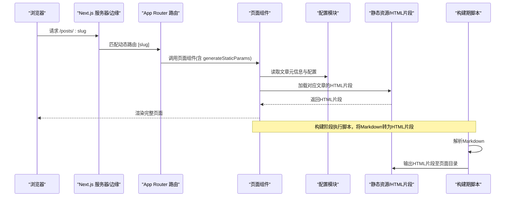
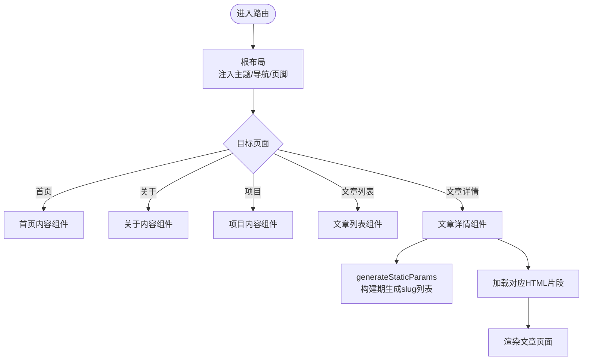
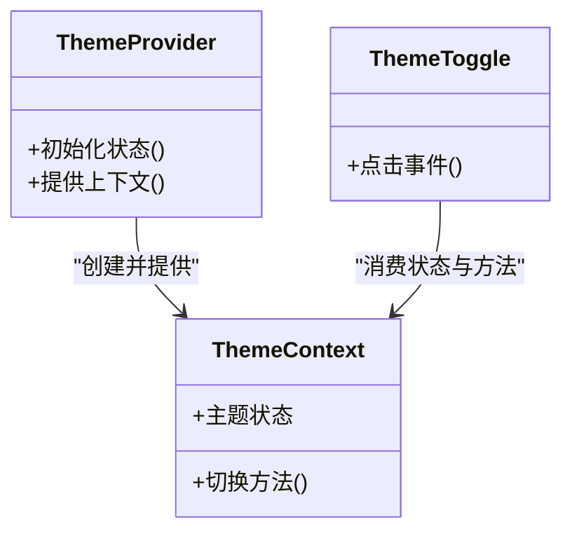
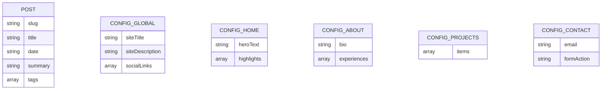
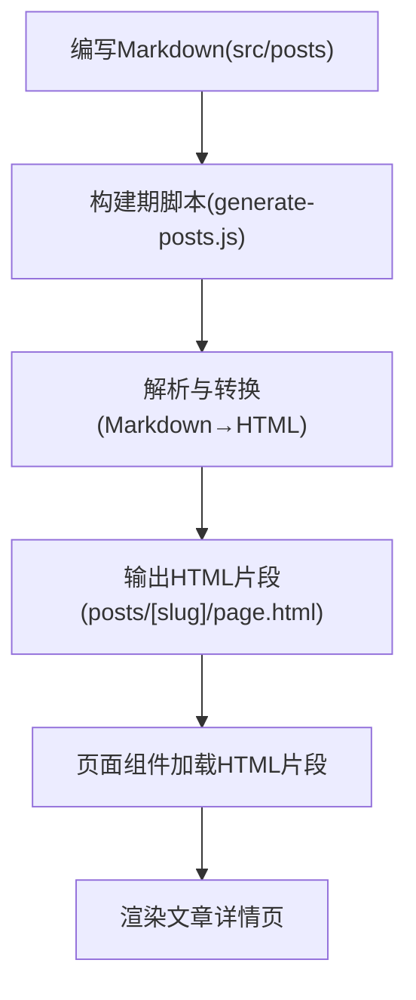
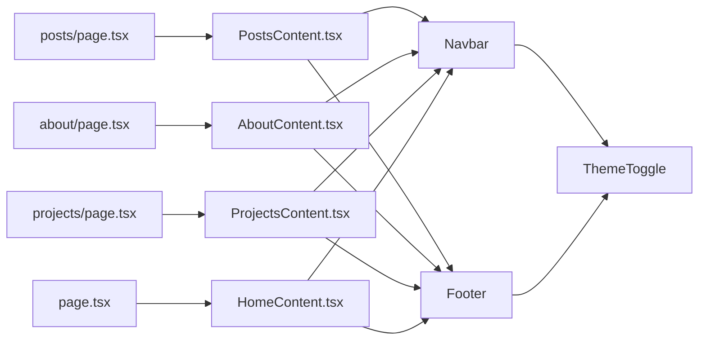
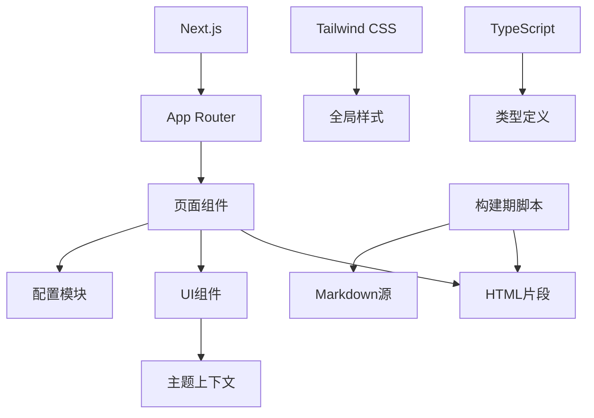

# 架构设计

<cite>
**本文引用的文件**   
- [README.md](file://README.md)
- [package.json](file://package.json)
- [next.config.js](file://next.config.js)
- [tailwind.config.js](file://tailwind.config.js)
- [postcss.config.js](file://postcss.config.js)
- [tsconfig.json](file://tsconfig.json)
- [src/app/layout.tsx](file://src/app/layout.tsx)
- [src/app/page.tsx](file://src/app/page.tsx)
- [src/app/about/page.tsx](file://src/app/about/page.tsx)
- [src/app/posts/page.tsx](file://src/app/posts/page.tsx)
- [src/app/posts/[slug]/layout.tsx](file://src/app/posts/[slug]/layout.tsx)
- [src/app/posts/[slug]/page.tsx](file://src/app/posts/[slug]/page.tsx)
- [src/app/posts/[slug]/PostContent.tsx](file://src/app/posts/[slug]/PostContent.tsx)
- [src/app/posts/[slug]/generateStaticParams.ts](file://src/app/posts/[slug]/generateStaticParams.ts)
- [src/components/Navbar.tsx](file://src/components/Navbar.tsx)
- [src/components/Footer.tsx](file://src/components/Footer.tsx)
- [src/components/HomeContent.tsx](file://src/components/HomeContent.tsx)
- [src/components/PostsContent.tsx](file://src/components/PostsContent.tsx)
- [src/components/AboutContent.tsx](file://src/components/AboutContent.tsx)
- [src/components/ProjectsContent.tsx](file://src/components/ProjectsContent.tsx)
- [src/components/ThemeToggle.tsx](file://src/components/ThemeToggle.tsx)
- [src/components/ThemeProvider.tsx](file://src/components/ThemeProvider.tsx)
- [src/context/ThemeContext.tsx](file://src/context/ThemeContext.tsx)
- [src/config/global.ts](file://src/config/global.ts)
- [src/config/home.ts](file://src/config/home.ts)
- [src/config/about.ts](file://src/config/about.ts)
- [src/config/posts.ts](file://src/config/posts.ts)
- [src/config/projects.ts](file://src/config/projects.ts)
- [src/config/contact.ts](file://src/config/contact.ts)
- [src/types/post.ts](file://src/types/post.ts)
- [scripts/generate-posts.js](file://scripts/generate-posts.js)
</cite>

## 目录
1. [简介](#简介)
2. [项目结构](#项目结构)
3. [核心组件](#核心组件)
4. [架构总览](#架构总览)
5. [详细组件分析](#详细组件分析)
6. [依赖关系分析](#依赖关系分析)
7. [性能考量](#性能考量)
8. [故障排查指南](#故障排查指南)
9. [结论](#结论)
10. [附录](#附录)

## 简介
本博客采用 Next.js App Router 构建，结合 Tailwind CSS、TypeScript 与 Markdown 内容源，实现配置驱动、可静态生成的个人技术博客。整体遵循“页面组件 + UI 组件 + 配置系统”的分层组织方式：路由由 App Router 的目录约定驱动；页面组件负责数据准备与布局组合；UI 组件专注展示与交互；配置模块集中管理站点元信息、导航、文章列表等可变内容；主题通过 Context 提供全局状态。

技术决策要点：
- 使用 App Router 的目录结构与动态路由 [slug] 组织文章页，便于扩展与维护。
- 通过 generateStaticParams 在构建期生成所有文章路径，提升首屏加载与 SEO。
- 将站点文案、链接、文章索引等抽取到 config 目录，实现“配置即内容”，降低硬编码耦合。
- 使用 Tailwind CSS 进行样式开发，配合 PostCSS 与自定义主题切换能力。
- 通过脚本在构建前或发布前将 Markdown 转换为 HTML 片段，供页面渲染使用。

[本节不直接分析具体文件，故无章节来源]

## 项目结构
项目采用按功能域与层次混合的组织方式：
- src/app：Next.js App Router 路由与页面布局，包含首页、关于、项目、文章列表与文章详情（动态路由）。
- src/components：通用与页面级 UI 组件，如导航栏、页脚、主题切换、各页面内容容器。
- src/config：站点配置中心，包括全局、首页、关于、项目、文章、联系方式等。
- src/context：全局上下文（如主题）提供者与消费者。
- src/posts：Markdown 文章源文件。
- scripts：构建期脚本，用于将 Markdown 转换为 HTML 片段并输出至对应页面目录。
- public：静态资源（图片、动画、CSS 等）。
- 根级配置文件：Next.js、Tailwind、PostCSS、TypeScript 等。

```mermaid
graph TB
subgraph "应用入口"
L["src/app/layout.tsx"]
P["src/app/page.tsx"]
end
subgraph "路由与页面"
About["src/app/about/page.tsx"]
PostsList["src/app/posts/page.tsx"]
PostDetail["src/app/posts/[slug]/page.tsx"]
PostLayout["src/app/posts/[slug]/layout.tsx"]
PostGen["src/app/posts/[slug]/generateStaticParams.ts"]
end
subgraph "组件层"
Navbar["src/components/Navbar.tsx"]
Footer["src/components/Footer.tsx"]
HomeC["src/components/HomeContent.tsx"]
PostsC["src/components/PostsContent.tsx"]
AboutC["src/components/AboutContent.tsx"]
ProjectsC["src/components/ProjectsContent.tsx"]
ThemeT["src/components/ThemeToggle.tsx"]
ThemeP["src/components/ThemeProvider.tsx"]
end
subgraph "配置与类型"
CGlobal["src/config/global.ts"]
CHome["src/config/home.ts"]
CAbout["src/config/about.ts"]
CPosts["src/config/posts.ts"]
CProjects["src/config/projects.ts"]
CContact["src/config/contact.ts"]
TPost["src/types/post.ts"]
end
subgraph "内容与脚本"
PostsMD["src/posts/*.md"]
Gen["scripts/generate-posts.js"]
end
L --> Navbar
L --> Footer
L --> ThemeP
P --> HomeC
About --> AboutC
PostsList --> PostsC
PostLayout --> PostDetail
PostDetail --> PostGen
PostsC --> CPosts
AboutC --> CAbout
HomeC --> CHome
ProjectsC --> CProjects
PostDetail --> TPost
Gen --> PostsMD
```

图表来源
- [src/app/layout.tsx](file://src/app/layout.tsx)
- [src/app/page.tsx](file://src/app/page.tsx)
- [src/app/about/page.tsx](file://src/app/about/page.tsx)
- [src/app/posts/page.tsx](file://src/app/posts/page.tsx)
- [src/app/posts/[slug]/layout.tsx](file://src/app/posts/[slug]/layout.tsx)
- [src/app/posts/[slug]/page.tsx](file://src/app/posts/[slug]/page.tsx)
- [src/app/posts/[slug]/generateStaticParams.ts](file://src/app/posts/[slug]/generateStaticParams.ts)
- [src/components/Navbar.tsx](file://src/components/Navbar.tsx)
- [src/components/Footer.tsx](file://src/components/Footer.tsx)
- [src/components/HomeContent.tsx](file://src/components/HomeContent.tsx)
- [src/components/PostsContent.tsx](file://src/components/PostsContent.tsx)
- [src/components/AboutContent.tsx](file://src/components/AboutContent.tsx)
- [src/components/ProjectsContent.tsx](file://src/components/ProjectsContent.tsx)
- [src/components/ThemeToggle.tsx](file://src/components/ThemeToggle.tsx)
- [src/components/ThemeProvider.tsx](file://src/components/ThemeProvider.tsx)
- [src/config/global.ts](file://src/config/global.ts)
- [src/config/home.ts](file://src/config/home.ts)
- [src/config/about.ts](file://src/config/about.ts)
- [src/config/posts.ts](file://src/config/posts.ts)
- [src/config/projects.ts](file://src/config/projects.ts)
- [src/config/contact.ts](file://src/config/contact.ts)
- [src/types/post.ts](file://src/types/post.ts)
- [scripts/generate-posts.js](file://scripts/generate-posts.js)

章节来源
- [README.md](file://README.md)
- [package.json](file://package.json)
- [next.config.js](file://next.config.js)
- [tailwind.config.js](file://tailwind.config.js)
- [postcss.config.js](file://postcss.config.js)
- [tsconfig.json](file://tsconfig.json)

## 核心组件
- 布局与根组件
  - 根布局负责注入全局样式、主题提供者、导航与页脚，确保全站一致体验。
  - 首页作为入口，聚合首页内容组件与必要元信息。
- 页面组件
  - 关于、项目、文章列表与文章详情分别位于各自路由下，职责单一，仅负责组装与数据准备。
  - 文章详情使用动态路由参数 slug，并通过 generateStaticParams 在构建期生成所有文章路径。
- UI 组件
  - 导航栏、页脚、主题切换为跨页面复用组件。
  - 各页面内容组件（HomeContent、PostsContent、AboutContent、ProjectsContent）专注于展示逻辑与局部交互。
- 配置系统
  - global、home、about、posts、projects、contact 等模块集中管理站点文案、链接、文章索引等，避免散落在页面中。
- 主题上下文
  - 通过 Context 暴露主题状态与切换方法，组件按需消费，支持深色模式等扩展。

章节来源
- [src/app/layout.tsx](file://src/app/layout.tsx)
- [src/app/page.tsx](file://src/app/page.tsx)
- [src/app/about/page.tsx](file://src/app/about/page.tsx)
- [src/app/posts/page.tsx](file://src/app/posts/page.tsx)
- [src/app/posts/[slug]/layout.tsx](file://src/app/posts/[slug]/layout.tsx)
- [src/app/posts/[slug]/page.tsx](file://src/app/posts/[slug]/page.tsx)
- [src/app/posts/[slug]/generateStaticParams.ts](file://src/app/posts/[slug]/generateStaticParams.ts)
- [src/components/Navbar.tsx](file://src/components/Navbar.tsx)
- [src/components/Footer.tsx](file://src/components/Footer.tsx)
- [src/components/HomeContent.tsx](file://src/components/HomeContent.tsx)
- [src/components/PostsContent.tsx](file://src/components/PostsContent.tsx)
- [src/components/AboutContent.tsx](file://src/components/AboutContent.tsx)
- [src/components/ProjectsContent.tsx](file://src/components/ProjectsContent.tsx)
- [src/components/ThemeToggle.tsx](file://src/components/ThemeToggle.tsx)
- [src/components/ThemeProvider.tsx](file://src/components/ThemeProvider.tsx)
- [src/config/global.ts](file://src/config/global.ts)
- [src/config/home.ts](file://src/config/home.ts)
- [src/config/about.ts](file://src/config/about.ts)
- [src/config/posts.ts](file://src/config/posts.ts)
- [src/config/projects.ts](file://src/config/projects.ts)
- [src/config/contact.ts](file://src/config/contact.ts)
- [src/types/post.ts](file://src/types/post.ts)

## 架构总览
下图展示了从用户访问到页面渲染的整体流程，以及 Markdown 到静态页面的转换链路。

图表来源
- [src/app/posts/[slug]/page.tsx](file://src/app/posts/[slug]/page.tsx)
- [src/app/posts/[slug]/generateStaticParams.ts](file://src/app/posts/[slug]/generateStaticParams.ts)
- [src/config/posts.ts](file://src/config/posts.ts)
- [scripts/generate-posts.js](file://scripts/generate-posts.js)

章节来源
- [src/app/posts/[slug]/page.tsx](file://src/app/posts/[slug]/page.tsx)
- [src/app/posts/[slug]/generateStaticParams.ts](file://src/app/posts/[slug]/generateStaticParams.ts)
- [src/config/posts.ts](file://src/config/posts.ts)
- [scripts/generate-posts.js](file://scripts/generate-posts.js)

## 详细组件分析

### 路由与布局体系
- 根布局
  - 作用：注入全局样式、主题提供者、导航与页脚，统一站点外壳。
  - 关键点：主题上下文包裹整个应用，保证任意子组件均可消费主题状态。
- 首页
  - 作用：承载首页内容组件，展示站点概览与入口。
- 关于与项目
  - 作用：独立页面，分别聚合 AboutContent 与 ProjectsContent，并从对应配置模块读取内容。
- 文章列表
  - 作用：展示文章索引，数据来源为 posts 配置模块，支持搜索与筛选（若实现）。
- 文章详情（动态路由）
  - 作用：根据 URL 中的 slug 定位文章，渲染对应 HTML 片段与布局。
  - 关键点：generateStaticParams 在构建期枚举所有 slug，预渲染静态页面，提升性能与 SEO。

图表来源
- [src/app/layout.tsx](file://src/app/layout.tsx)
- [src/app/page.tsx](file://src/app/page.tsx)
- [src/app/about/page.tsx](file://src/app/about/page.tsx)
- [src/app/posts/page.tsx](file://src/app/posts/page.tsx)
- [src/app/posts/[slug]/layout.tsx](file://src/app/posts/[slug]/layout.tsx)
- [src/app/posts/[slug]/page.tsx](file://src/app/posts/[slug]/page.tsx)
- [src/app/posts/[slug]/generateStaticParams.ts](file://src/app/posts/[slug]/generateStaticParams.ts)

章节来源
- [src/app/layout.tsx](file://src/app/layout.tsx)
- [src/app/page.tsx](file://src/app/page.tsx)
- [src/app/about/page.tsx](file://src/app/about/page.tsx)
- [src/app/posts/page.tsx](file://src/app/posts/page.tsx)
- [src/app/posts/[slug]/layout.tsx](file://src/app/posts/[slug]/layout.tsx)
- [src/app/posts/[slug]/page.tsx](file://src/app/posts/[slug]/page.tsx)
- [src/app/posts/[slug]/generateStaticParams.ts](file://src/app/posts/[slug]/generateStaticParams.ts)

### 主题系统与上下文
- 主题上下文
  - 提供当前主题状态与切换方法，组件通过上下文消费。
- 主题提供者
  - 在根布局中包裹应用，初始化主题状态并持久化（如本地存储）。
- 主题切换按钮
  - 触发切换动作，更新上下文状态，影响全站样式。

图表来源
- [src/context/ThemeContext.tsx](file://src/context/ThemeContext.tsx)
- [src/components/ThemeProvider.tsx](file://src/components/ThemeProvider.tsx)
- [src/components/ThemeToggle.tsx](file://src/components/ThemeToggle.tsx)

章节来源
- [src/context/ThemeContext.tsx](file://src/context/ThemeContext.tsx)
- [src/components/ThemeProvider.tsx](file://src/components/ThemeProvider.tsx)
- [src/components/ThemeToggle.tsx](file://src/components/ThemeToggle.tsx)

### 配置系统与数据模型
- 配置模块
  - global：站点全局信息（标题、描述、社交链接等）。
  - home：首页文案与入口。
  - about：关于页内容。
  - projects：项目列表与描述。
  - posts：文章索引、分类、标签等元数据。
  - contact：联系方式与表单字段。
- 类型定义
  - post：文章数据结构，约束字段类型，提升类型安全与编辑器提示。

图表来源
- [src/types/post.ts](file://src/types/post.ts)
- [src/config/global.ts](file://src/config/global.ts)
- [src/config/home.ts](file://src/config/home.ts)
- [src/config/about.ts](file://src/config/about.ts)
- [src/config/projects.ts](file://src/config/projects.ts)
- [src/config/contact.ts](file://src/config/contact.ts)

章节来源
- [src/types/post.ts](file://src/types/post.ts)
- [src/config/global.ts](file://src/config/global.ts)
- [src/config/home.ts](file://src/config/home.ts)
- [src/config/about.ts](file://src/config/about.ts)
- [src/config/projects.ts](file://src/config/projects.ts)
- [src/config/contact.ts](file://src/config/contact.ts)

### 文章处理流水线（Markdown → 静态页面）
- 输入：src/posts 下的 Markdown 文件。
- 构建期脚本：解析 Markdown，提取元信息，生成 HTML 片段，输出至对应页面目录（例如 posts/[slug]/page.html）。
- 运行期：页面组件通过 generateStaticParams 获取 slug 列表，并在渲染时加载对应的 HTML 片段进行展示。

图表来源
- [scripts/generate-posts.js](file://scripts/generate-posts.js)
- [src/app/posts/[slug]/page.tsx](file://src/app/posts/[slug]/page.tsx)
- [src/app/posts/[slug]/generateStaticParams.ts](file://src/app/posts/[slug]/generateStaticParams.ts)

章节来源
- [scripts/generate-posts.js](file://scripts/generate-posts.js)
- [src/app/posts/[slug]/page.tsx](file://src/app/posts/[slug]/page.tsx)
- [src/app/posts/[slug]/generateStaticParams.ts](file://src/app/posts/[slug]/generateStaticParams.ts)

### 页面组件与UI组件协作
- 页面组件（如 PostsContent、AboutContent、ProjectsContent、HomeContent）负责：
  - 从配置模块读取数据。
  - 组合基础 UI 组件完成展示。
  - 处理页面级交互（如搜索、分页等）。
- UI 组件（如 Navbar、Footer、ThemeToggle）负责：
  - 提供一致的视觉与交互体验。
  - 消费主题上下文以适配不同主题。

图表来源
- [src/app/posts/page.tsx](file://src/app/posts/page.tsx)
- [src/app/about/page.tsx](file://src/app/about/page.tsx)
- [src/app/page.tsx](file://src/app/page.tsx)
- [src/components/PostsContent.tsx](file://src/components/PostsContent.tsx)
- [src/components/AboutContent.tsx](file://src/components/AboutContent.tsx)
- [src/components/ProjectsContent.tsx](file://src/components/ProjectsContent.tsx)
- [src/components/HomeContent.tsx](file://src/components/HomeContent.tsx)
- [src/components/Navbar.tsx](file://src/components/Navbar.tsx)
- [src/components/Footer.tsx](file://src/components/Footer.tsx)
- [src/components/ThemeToggle.tsx](file://src/components/ThemeToggle.tsx)

章节来源
- [src/app/posts/page.tsx](file://src/app/posts/page.tsx)
- [src/app/about/page.tsx](file://src/app/about/page.tsx)
- [src/app/page.tsx](file://src/app/page.tsx)
- [src/components/PostsContent.tsx](file://src/components/PostsContent.tsx)
- [src/components/AboutContent.tsx](file://src/components/AboutContent.tsx)
- [src/components/ProjectsContent.tsx](file://src/components/ProjectsContent.tsx)
- [src/components/HomeContent.tsx](file://src/components/HomeContent.tsx)
- [src/components/Navbar.tsx](file://src/components/Navbar.tsx)
- [src/components/Footer.tsx](file://src/components/Footer.tsx)
- [src/components/ThemeToggle.tsx](file://src/components/ThemeToggle.tsx)

## 依赖关系分析
- 外部依赖
  - Next.js：提供 App Router、SSG/SSR 能力。
  - Tailwind CSS：原子化样式框架，配合 PostCSS 与自定义配置。
  - TypeScript：类型系统与开发体验保障。
- 内部依赖
  - 页面组件依赖配置模块与 UI 组件。
  - 主题上下文被多个组件消费，形成松耦合的状态共享。
  - 构建期脚本与 Markdown 源文件解耦，输出产物被页面组件消费。

图表来源
- [next.config.js](file://next.config.js)
- [tailwind.config.js](file://tailwind.config.js)
- [postcss.config.js](file://postcss.config.js)
- [tsconfig.json](file://tsconfig.json)
- [src/app/posts/[slug]/page.tsx](file://src/app/posts/[slug]/page.tsx)
- [src/config/posts.ts](file://src/config/posts.ts)
- [src/components/ThemeProvider.tsx](file://src/components/ThemeProvider.tsx)
- [scripts/generate-posts.js](file://scripts/generate-posts.js)

章节来源
- [next.config.js](file://next.config.js)
- [tailwind.config.js](file://tailwind.config.js)
- [postcss.config.js](file://postcss.config.js)
- [tsconfig.json](file://tsconfig.json)
- [src/app/posts/[slug]/page.tsx](file://src/app/posts/[slug]/page.tsx)
- [src/config/posts.ts](file://src/config/posts.ts)
- [src/components/ThemeProvider.tsx](file://src/components/ThemeProvider.tsx)
- [scripts/generate-posts.js](file://scripts/generate-posts.js)

## 性能考量
- 静态生成
  - 使用 generateStaticParams 在构建期生成所有文章路径，减少运行时开销，提升首屏性能与 SEO。
- 资源优化
  - 静态资源放置于 public 目录，利用 CDN 缓存策略。
  - 图片与动画等资源按需加载，避免阻塞关键渲染路径。
- 样式与主题
  - Tailwind 按需生成样式，减小 CSS 体积。
  - 主题切换通过上下文更新，避免整站重绘。
- 构建脚本
  - 将 Markdown 转换为 HTML 片段，减少运行时解析成本。

[本节提供一般性指导，未直接分析具体文件，故无章节来源]

## 故障排查指南
- 构建失败
  - 检查 Markdown 语法与元信息是否完整。
  - 确认构建脚本输出路径与页面组件加载路径一致。
- 路由无法命中
  - 验证动态路由参数 slug 是否与文件名一致。
  - 检查 generateStaticParams 是否正确枚举所有 slug。
- 主题不生效
  - 确认主题提供者已包裹根布局。
  - 检查主题切换按钮是否正确更新上下文状态。
- 样式异常
  - 确认 Tailwind 与 PostCSS 配置正确。
  - 检查全局样式文件是否被引入。

章节来源
- [scripts/generate-posts.js](file://scripts/generate-posts.js)
- [src/app/posts/[slug]/generateStaticParams.ts](file://src/app/posts/[slug]/generateStaticParams.ts)
- [src/app/posts/[slug]/page.tsx](file://src/app/posts/[slug]/page.tsx)
- [src/components/ThemeProvider.tsx](file://src/components/ThemeProvider.tsx)
- [src/components/ThemeToggle.tsx](file://src/components/ThemeToggle.tsx)
- [tailwind.config.js](file://tailwind.config.js)
- [postcss.config.js](file://postcss.config.js)

## 结论
本项目通过 App Router 的路由组织、组件分层与配置驱动，实现了高内聚、低耦合的博客架构。Markdown 到静态页面的转换流程清晰可控，主题系统可扩展性强。建议在后续迭代中：
- 增加文章分类与标签的索引与过滤能力。
- 引入增量静态再生（ISR）以提升长尾内容的更新效率。
- 完善错误边界与日志上报，提高可观测性与稳定性。

[本节总结性内容，未直接分析具体文件，故无章节来源]

## 附录
- 扩展点
  - 新增页面：在 src/app 下创建对应目录与 page.tsx，并在导航配置中添加链接。
  - 新增文章：在 src/posts 下添加 Markdown 文件，运行构建脚本生成 HTML 片段。
  - 新增配置：在 src/config 下新增模块，并在页面组件中引用。
  - 新增主题：扩展主题上下文与提供者，提供新的主题变量与样式覆盖。
- 集成方式
  - 第三方服务（如评论、统计）可通过组件或脚本集成，保持与页面组件解耦。
  - 静态资源通过 public 目录管理，便于部署与缓存。

[本节为概念性说明，未直接分析具体文件，故无章节来源]