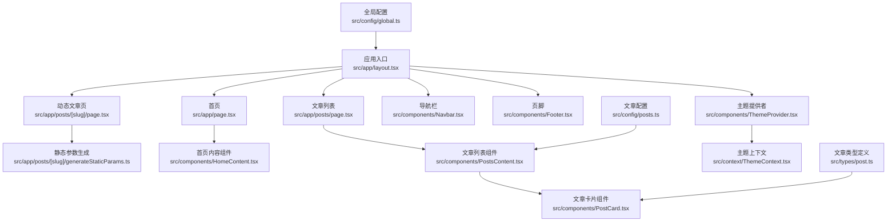
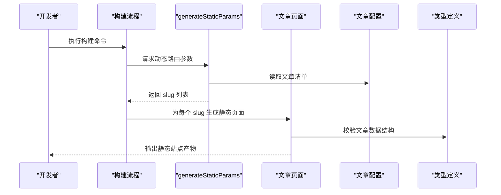
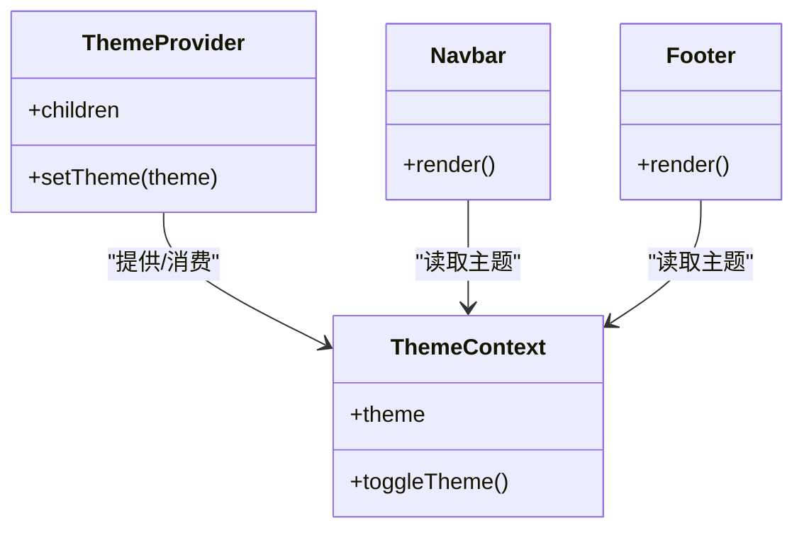
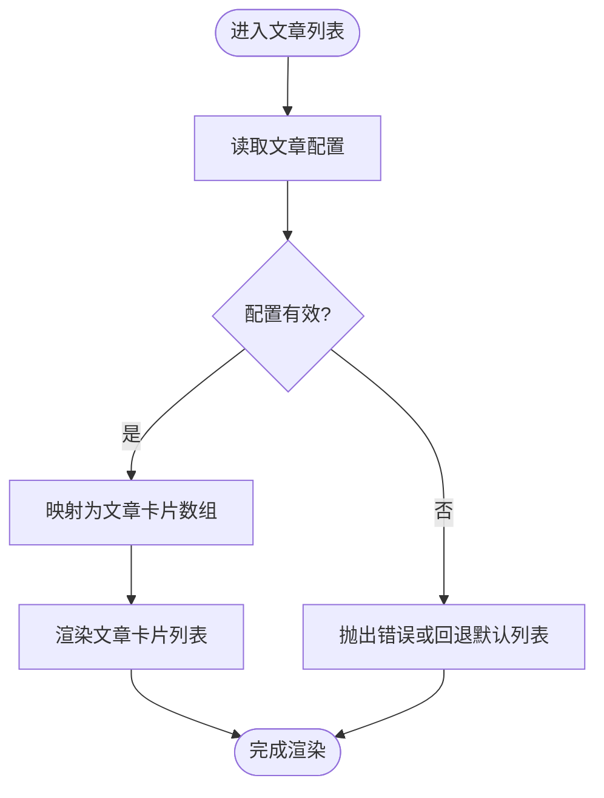
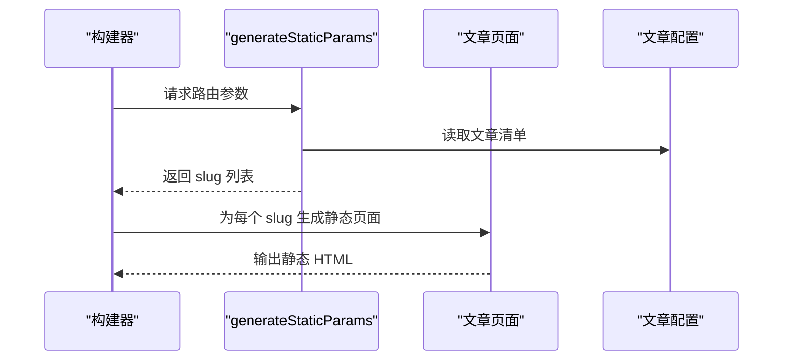
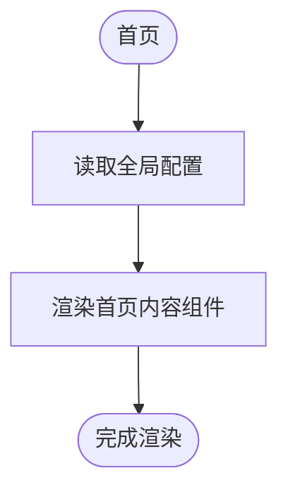
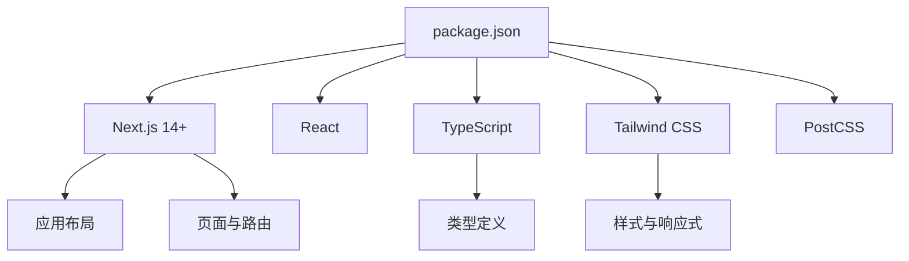

# 系统概览

<cite>
**本文引用的文件**   
- [README.md](file://README.md)
- [package.json](file://package.json)
- [next.config.js](file://next.config.js)
- [tailwind.config.js](file://tailwind.config.js)
- [postcss.config.js](file://postcss.config.js)
- [tsconfig.json](file://tsconfig.json)
- [src/app/layout.tsx](file://src/app/layout.tsx)
- [src/app/page.tsx](file://src/app/page.tsx)
- [src/app/posts/[slug]/page.tsx](file://src/app/posts/[slug]/page.tsx)
- [src/app/posts/[slug]/generateStaticParams.ts](file://src/app/posts/[slug]/generateStaticParams.ts)
- [src/components/Navbar.tsx](file://src/components/Navbar.tsx)
- [src/components/Footer.tsx](file://src/components/Footer.tsx)
- [src/components/HomeContent.tsx](file://src/components/HomeContent.tsx)
- [src/components/PostsContent.tsx](file://src/components/PostsContent.tsx)
- [src/components/PostCard.tsx](file://src/components/PostCard.tsx)
- [src/components/ThemeProvider.tsx](file://src/components/ThemeProvider.tsx)
- [src/context/ThemeContext.tsx](file://src/context/ThemeContext.tsx)
- [src/config/global.ts](file://src/config/global.ts)
- [src/config/posts.ts](file://src/config/posts.ts)
- [src/types/post.ts](file://src/types/post.ts)
- [scripts/generate-posts.js](file://scripts/generate-posts.js)
</cite>

## 目录
1. [简介](#简介)
2. [项目结构](#项目结构)
3. [核心组件](#核心组件)
4. [架构总览](#架构总览)
5. [详细组件分析](#详细组件分析)
6. [依赖关系分析](#依赖关系分析)
7. [性能与SEO考量](#性能与seo考量)
8. [故障排查指南](#故障排查指南)
9. [结论](#结论)
10. [附录](#附录)

## 简介
本博客采用 Next.js 14+（App Router）作为前端框架，结合 React 组件化架构与 TypeScript 类型安全，构建一个高性能、可维护且对搜索引擎友好的静态站点。技术栈选择的核心目标包括：
- 使用 Next.js 的静态站点生成（SSG）能力，在构建期预渲染页面，提升首屏加载速度与 SEO 表现。
- 通过 React 组件化实现高内聚、低耦合的可复用 UI，降低维护成本并提高开发效率。
- 借助 TypeScript 提供编译期类型检查与智能提示，减少运行时错误，增强团队协作体验。
- 以 Tailwind CSS 实现响应式设计与主题切换，兼顾移动端适配与视觉一致性。

该方案在“开发体验、运行性能、可维护性”三者之间取得平衡，适合个人博客与技术分享类内容型网站。

## 项目结构
项目遵循 Next.js App Router 约定，按功能域组织代码：
- src/app：路由与页面布局，包含全局布局、首页、文章列表与动态文章页等。
- src/components：通用 UI 组件，如导航栏、页脚、文章卡片、主题提供者等。
- src/config：站点配置与内容元数据，集中管理全局信息与文章列表。
- src/context：React Context 用于跨组件状态共享（例如主题）。
- src/types：TypeScript 类型定义，确保数据结构一致性与类型安全。
- scripts：构建期脚本，辅助生成或转换内容。
- public：静态资源（图片、动画、CSS 等）。

图表来源
- [src/app/layout.tsx](file://src/app/layout.tsx)
- [src/app/page.tsx](file://src/app/page.tsx)
- [src/app/posts/[slug]/page.tsx](file://src/app/posts/[slug]/page.tsx)
- [src/app/posts/[slug]/generateStaticParams.ts](file://src/app/posts/[slug]/generateStaticParams.ts)
- [src/components/HomeContent.tsx](file://src/components/HomeContent.tsx)
- [src/components/PostsContent.tsx](file://src/components/PostsContent.tsx)
- [src/components/PostCard.tsx](file://src/components/PostCard.tsx)
- [src/components/Navbar.tsx](file://src/components/Navbar.tsx)
- [src/components/Footer.tsx](file://src/components/Footer.tsx)
- [src/components/ThemeProvider.tsx](file://src/components/ThemeProvider.tsx)
- [src/context/ThemeContext.tsx](file://src/context/ThemeContext.tsx)
- [src/config/global.ts](file://src/config/global.ts)
- [src/config/posts.ts](file://src/config/posts.ts)
- [src/types/post.ts](file://src/types/post.ts)

章节来源
- [src/app/layout.tsx](file://src/app/layout.tsx)
- [src/app/page.tsx](file://src/app/page.tsx)
- [src/app/posts/[slug]/page.tsx](file://src/app/posts/[slug]/page.tsx)
- [src/app/posts/[slug]/generateStaticParams.ts](file://src/app/posts/[slug]/generateStaticParams.ts)
- [src/components/Navbar.tsx](file://src/components/Navbar.tsx)
- [src/components/Footer.tsx](file://src/components/Footer.tsx)
- [src/components/HomeContent.tsx](file://src/components/HomeContent.tsx)
- [src/components/PostsContent.tsx](file://src/components/PostsContent.tsx)
- [src/components/PostCard.tsx](file://src/components/PostCard.tsx)
- [src/components/ThemeProvider.tsx](file://src/components/ThemeProvider.tsx)
- [src/context/ThemeContext.tsx](file://src/context/ThemeContext.tsx)
- [src/config/global.ts](file://src/config/global.ts)
- [src/config/posts.ts](file://src/config/posts.ts)
- [src/types/post.ts](file://src/types/post.ts)

## 核心组件
- 应用布局与根组件
  - 负责全局 HTML 结构、主题注入、导航与页脚挂载，以及路由容器。
  - 通过主题提供者包裹子树，使主题状态跨组件共享。
- 首页与内容展示
  - 首页聚合关键信息，调用内容组件进行渲染。
  - 内容组件从配置中读取数据，保持页面与数据解耦。
- 文章列表与文章详情
  - 文章列表组件基于配置生成文章卡片集合，支持分页或筛选扩展。
  - 动态文章页通过 generateStaticParams 在构建期生成所有 slug 对应的静态页面，实现 SSG。
- 主题系统与上下文
  - 主题上下文提供当前主题值与切换方法，主题提供者将上下文注入到组件树。
- 类型与配置
  - 文章类型定义约束数据结构，保证组件间传递的数据具有一致的形状。
  - 全局与文章配置集中管理站点元数据与文章清单，便于统一修改与维护。

章节来源
- [src/app/layout.tsx](file://src/app/layout.tsx)
- [src/app/page.tsx](file://src/app/page.tsx)
- [src/components/HomeContent.tsx](file://src/components/HomeContent.tsx)
- [src/components/PostsContent.tsx](file://src/components/PostsContent.tsx)
- [src/components/PostCard.tsx](file://src/components/PostCard.tsx)
- [src/components/ThemeProvider.tsx](file://src/components/ThemeProvider.tsx)
- [src/context/ThemeContext.tsx](file://src/context/ThemeContext.tsx)
- [src/config/global.ts](file://src/config/global.ts)
- [src/config/posts.ts](file://src/config/posts.ts)
- [src/types/post.ts](file://src/types/post.ts)

## 架构总览
整体采用“配置驱动 + 组件化 + 静态生成”的架构模式：
- 配置层：集中管理站点元数据与文章清单，避免硬编码。
- 组件层：UI 按职责拆分为独立组件，通过 props 与 context 通信。
- 路由层：Next.js App Router 提供声明式路由与静态参数生成。
- 构建层：构建期执行脚本与静态参数生成，产出静态 HTML/CSS/JS。

图表来源
- [src/app/posts/[slug]/generateStaticParams.ts](file://src/app/posts/[slug]/generateStaticParams.ts)
- [src/config/posts.ts](file://src/config/posts.ts)
- [src/types/post.ts](file://src/types/post.ts)
- [src/app/posts/[slug]/page.tsx](file://src/app/posts/[slug]/page.tsx)

章节来源
- [src/app/posts/[slug]/generateStaticParams.ts](file://src/app/posts/[slug]/generateStaticParams.ts)
- [src/config/posts.ts](file://src/config/posts.ts)
- [src/types/post.ts](file://src/types/post.ts)
- [src/app/posts/[slug]/page.tsx](file://src/app/posts/[slug]/page.tsx)

## 详细组件分析

### 主题系统与上下文
主题系统通过 React Context 实现跨组件状态共享，主题提供者负责初始化与注入上下文，组件通过消费上下文获取当前主题并进行样式切换。

图表来源
- [src/components/ThemeProvider.tsx](file://src/components/ThemeProvider.tsx)
- [src/context/ThemeContext.tsx](file://src/context/ThemeContext.tsx)
- [src/components/Navbar.tsx](file://src/components/Navbar.tsx)
- [src/components/Footer.tsx](file://src/components/Footer.tsx)

章节来源
- [src/components/ThemeProvider.tsx](file://src/components/ThemeProvider.tsx)
- [src/context/ThemeContext.tsx](file://src/context/ThemeContext.tsx)
- [src/components/Navbar.tsx](file://src/components/Navbar.tsx)
- [src/components/Footer.tsx](file://src/components/Footer.tsx)

### 文章列表与文章卡片
文章列表组件根据配置生成文章卡片集合，文章卡片负责展示标题、摘要与链接。类型定义约束文章对象结构，确保数据一致性。

图表来源
- [src/components/PostsContent.tsx](file://src/components/PostsContent.tsx)
- [src/components/PostCard.tsx](file://src/components/PostCard.tsx)
- [src/config/posts.ts](file://src/config/posts.ts)
- [src/types/post.ts](file://src/types/post.ts)

章节来源
- [src/components/PostsContent.tsx](file://src/components/PostsContent.tsx)
- [src/components/PostCard.tsx](file://src/components/PostCard.tsx)
- [src/config/posts.ts](file://src/config/posts.ts)
- [src/types/post.ts](file://src/types/post.ts)

### 动态文章页与静态参数生成
动态文章页通过 generateStaticParams 在构建期生成所有文章的静态页面，从而获得 SSG 的性能优势与 SEO 友好性。

图表来源
- [src/app/posts/[slug]/generateStaticParams.ts](file://src/app/posts/[slug]/generateStaticParams.ts)
- [src/app/posts/[slug]/page.tsx](file://src/app/posts/[slug]/page.tsx)
- [src/config/posts.ts](file://src/config/posts.ts)

章节来源
- [src/app/posts/[slug]/generateStaticParams.ts](file://src/app/posts/[slug]/generateStaticParams.ts)
- [src/app/posts/[slug]/page.tsx](file://src/app/posts/[slug]/page.tsx)
- [src/config/posts.ts](file://src/config/posts.ts)

### 首页与内容组件
首页组件负责聚合关键信息，并通过内容组件渲染。内容组件从配置中读取数据，保持页面结构与数据分离，便于扩展与维护。

图表来源
- [src/app/page.tsx](file://src/app/page.tsx)
- [src/components/HomeContent.tsx](file://src/components/HomeContent.tsx)
- [src/config/global.ts](file://src/config/global.ts)

章节来源
- [src/app/page.tsx](file://src/app/page.tsx)
- [src/components/HomeContent.tsx](file://src/components/HomeContent.tsx)
- [src/config/global.ts](file://src/config/global.ts)

## 依赖关系分析
- 框架与工具链
  - Next.js 14+：提供 App Router、SSG、服务端渲染能力与生态集成。
  - React：组件化 UI 基础库。
  - TypeScript：类型安全与开发体验增强。
  - Tailwind CSS：原子化样式与响应式设计。
  - PostCSS：样式处理管线。
- 配置与类型
  - 全局与文章配置集中管理站点元数据。
  - 类型定义约束数据结构，保障组件间数据一致性。
- 构建脚本
  - 构建期脚本辅助生成或转换内容，配合静态参数生成实现自动化。

图表来源
- [package.json](file://package.json)
- [next.config.js](file://next.config.js)
- [tailwind.config.js](file://tailwind.config.js)
- [postcss.config.js](file://postcss.config.js)
- [tsconfig.json](file://tsconfig.json)
- [src/app/layout.tsx](file://src/app/layout.tsx)

章节来源
- [package.json](file://package.json)
- [next.config.js](file://next.config.js)
- [tailwind.config.js](file://tailwind.config.js)
- [postcss.config.js](file://postcss.config.js)
- [tsconfig.json](file://tsconfig.json)
- [src/app/layout.tsx](file://src/app/layout.tsx)

## 性能与SEO考量
- 静态站点生成（SSG）
  - 构建期预渲染页面，减少客户端计算与网络请求，显著提升首屏加载速度。
  - 静态 HTML 更易被搜索引擎抓取与索引，有利于 SEO。
- 组件化与按需渲染
  - 组件拆分与惰性加载策略可减少初始包体积，提升交互性能。
- 响应式设计与移动端适配
  - 基于 Tailwind CSS 的断点与原子化样式，快速实现多端一致的界面。
  - 通过主题上下文与样式变量，实现暗色/亮色模式切换，提升用户体验。
- 类型安全与可维护性
  - TypeScript 在构建期发现潜在问题，降低运行时错误概率，提升长期维护效率。

[本节为通用指导，不直接分析具体文件]

## 故障排查指南
- 构建失败
  - 检查 generateStaticParams 是否正确读取配置并返回有效的 slug 列表。
  - 确认文章类型定义与实际数据一致，避免类型不匹配导致构建中断。
- 页面未渲染或空白
  - 验证配置路径与字段名称是否与组件期望一致。
  - 检查主题上下文是否被正确提供，避免主题相关样式失效。
- 样式异常或主题切换无效
  - 确认 Tailwind 配置与 PostCSS 管线正常。
  - 检查主题提供者是否包裹了需要主题的组件树。

章节来源
- [src/app/posts/[slug]/generateStaticParams.ts](file://src/app/posts/[slug]/generateStaticParams.ts)
- [src/types/post.ts](file://src/types/post.ts)
- [src/config/posts.ts](file://src/config/posts.ts)
- [src/components/ThemeProvider.tsx](file://src/components/ThemeProvider.tsx)
- [src/context/ThemeContext.tsx](file://src/context/ThemeContext.tsx)
- [tailwind.config.js](file://tailwind.config.js)
- [postcss.config.js](file://postcss.config.js)

## 结论
本项目以 Next.js 14+ 为核心，结合 React 组件化与 TypeScript 类型安全，构建了高性能、易维护的博客站点。通过 SSG 与静态参数生成，实现了优秀的加载性能与 SEO 表现；通过 Tailwind CSS 与主题上下文，达成了良好的响应式设计与用户体验。整体架构清晰、职责分明，适合初学者理解现代前端工程化实践，并为后续功能扩展（如评论、搜索、国际化）奠定坚实基础。

[本节为总结性内容，不直接分析具体文件]

## 附录
- 技术决策权衡
  - Next.js vs 纯 SPA：SSG 更适合内容型站点，SEO 与性能更优；SPA 更适合强交互应用。
  - 配置驱动 vs 数据库驱动：配置驱动简化部署与缓存策略，适合个人博客；数据库驱动适合大规模内容与协作编辑。
  - Tailwind CSS vs CSS Modules：Tailwind 提升样式开发效率与一致性；CSS Modules 更适合复杂样式逻辑与团队规范。
- 参考文件
  - 项目说明与使用说明见 README。
  - 构建脚本位于 scripts 目录，可根据需求扩展内容生成流程。

章节来源
- [README.md](file://README.md)
- [scripts/generate-posts.js](file://scripts/generate-posts.js)