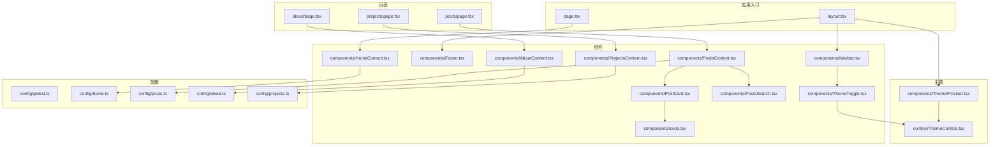
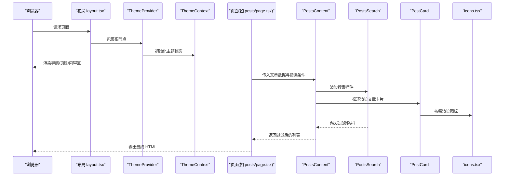
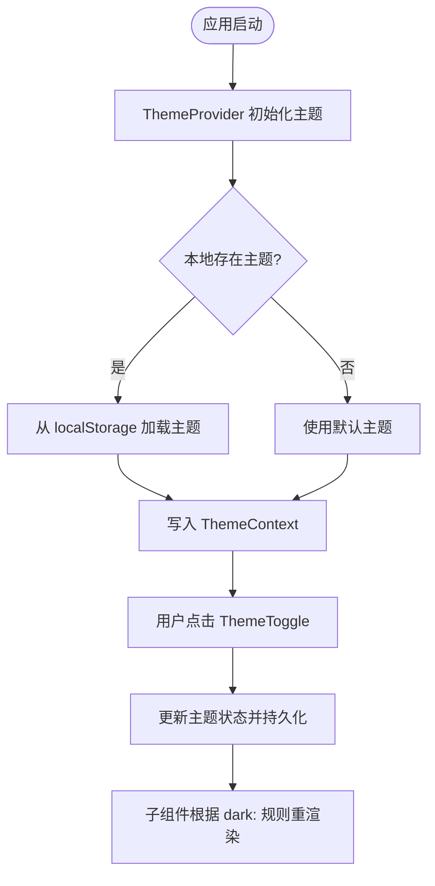
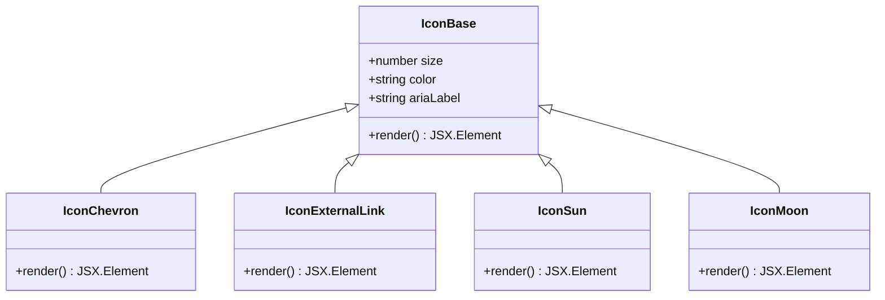
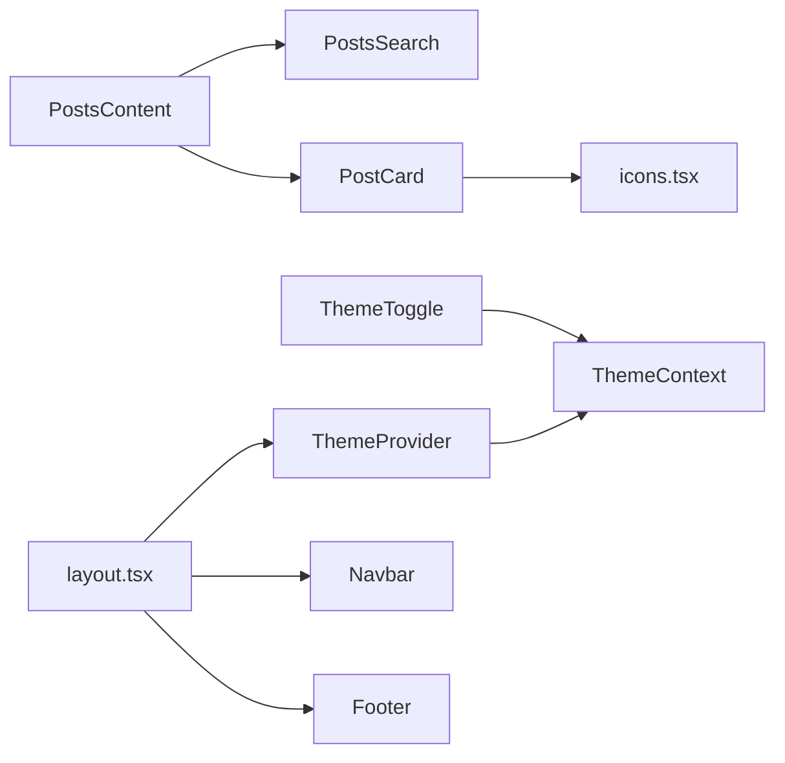

# 组件复用策略

<cite>
**本文引用的文件**   
- [src/components/Navbar.tsx](file://src/components/Navbar.tsx)
- [src/components/Footer.tsx](file://src/components/Footer.tsx)
- [src/components/PostCard.tsx](file://src/components/PostCard.tsx)
- [src/components/PostsContent.tsx](file://src/components/PostsContent.tsx)
- [src/components/PostsSearch.tsx](file://src/components/PostsSearch.tsx)
- [src/components/HomeContent.tsx](file://src/components/HomeContent.tsx)
- [src/components/AboutContent.tsx](file://src/components/AboutContent.tsx)
- [src/components/ProjectsContent.tsx](file://src/components/ProjectsContent.tsx)
- [src/components/icons.tsx](file://src/components/icons.tsx)
- [src/components/ThemeToggle.tsx](file://src/components/ThemeToggle.tsx)
- [src/components/ThemeProvider.tsx](file://src/components/ThemeProvider.tsx)
- [src/context/ThemeContext.tsx](file://src/context/ThemeContext.tsx)
- [src/app/layout.tsx](file://src/app/layout.tsx)
- [src/app/page.tsx](file://src/app/page.tsx)
- [src/app/posts/page.tsx](file://src/app/posts/page.tsx)
- [src/app/about/page.tsx](file://src/app/about/page.tsx)
- [src/app/projects/page.tsx](file://src/app/projects/page.tsx)
- [src/config/global.ts](file://src/config/global.ts)
- [src/config/home.ts](file://src/config/home.ts)
- [src/config/posts.ts](file://src/config/posts.ts)
- [src/config/about.ts](file://src/config/about.ts)
- [src/config/projects.ts](file://src/config/projects.ts)
- [src/types/post.ts](file://src/types/post.ts)
- [tailwind.config.js](file://tailwind.config.js)
- [next.config.js](file://next.config.js)
- [package.json](file://package.json)
</cite>

## 目录
1. [简介](#简介)
2. [项目结构](#项目结构)
3. [核心组件](#核心组件)
4. [架构总览](#架构总览)
5. [详细组件分析](#详细组件分析)
6. [依赖关系分析](#依赖关系分析)
7. [性能考虑](#性能考虑)
8. [故障排查指南](#故障排查指南)
9. [结论](#结论)
10. [附录](#附录)

## 简介
本文件面向博客项目的组件复用策略，聚焦于如何设计并实现可复用的 React 组件。内容涵盖：
- 组件抽象与接口设计
- 样式定制与主题适配
- 图标系统设计与实现
- 配置化开发与参数化设计
- 组件库组织与版本管理
- 文档生成与示例展示
- 测试策略与质量保证
- 性能监控与优化技巧

目标是帮助团队在 Next.js + Tailwind CSS 的技术栈下，构建一致、可维护、可扩展的 UI 组件体系。

## 项目结构
本项目采用“页面路由 + 功能组件 + 配置数据 + 上下文主题”的组织方式：
- 页面层：Next.js App Router 下的页面与布局
- 组件层：通用 UI 组件与页面级组合组件
- 配置层：各模块的数据与文案集中管理
- 类型层：共享类型定义
- 主题层：基于 Context 的主题切换与 Provider 注入
- 样式层：Tailwind 配置与全局样式

图表来源
- [src/app/layout.tsx](file://src/app/layout.tsx)
- [src/app/page.tsx](file://src/app/page.tsx)
- [src/app/posts/page.tsx](file://src/app/posts/page.tsx)
- [src/app/about/page.tsx](file://src/app/about/page.tsx)
- [src/app/projects/page.tsx](file://src/app/projects/page.tsx)
- [src/components/Navbar.tsx](file://src/components/Navbar.tsx)
- [src/components/Footer.tsx](file://src/components/Footer.tsx)
- [src/components/PostCard.tsx](file://src/components/PostCard.tsx)
- [src/components/PostsContent.tsx](file://src/components/PostsContent.tsx)
- [src/components/PostsSearch.tsx](file://src/components/PostsSearch.tsx)
- [src/components/HomeContent.tsx](file://src/components/HomeContent.tsx)
- [src/components/AboutContent.tsx](file://src/components/AboutContent.tsx)
- [src/components/ProjectsContent.tsx](file://src/components/ProjectsContent.tsx)
- [src/components/ThemeToggle.tsx](file://src/components/ThemeToggle.tsx)
- [src/components/icons.tsx](file://src/components/icons.tsx)
- [src/context/ThemeContext.tsx](file://src/context/ThemeContext.tsx)
- [src/components/ThemeProvider.tsx](file://src/components/ThemeProvider.tsx)
- [src/config/global.ts](file://src/config/global.ts)
- [src/config/home.ts](file://src/config/home.ts)
- [src/config/posts.ts](file://src/config/posts.ts)
- [src/config/about.ts](file://src/config/about.ts)
- [src/config/projects.ts](file://src/config/projects.ts)

章节来源
- [src/app/layout.tsx](file://src/app/layout.tsx)
- [src/app/page.tsx](file://src/app/page.tsx)
- [src/app/posts/page.tsx](file://src/app/posts/page.tsx)
- [src/app/about/page.tsx](file://src/app/about/page.tsx)
- [src/app/projects/page.tsx](file://src/app/projects/page.tsx)
- [src/components/Navbar.tsx](file://src/components/Navbar.tsx)
- [src/components/Footer.tsx](file://src/components/Footer.tsx)
- [src/components/PostCard.tsx](file://src/components/PostCard.tsx)
- [src/components/PostsContent.tsx](file://src/components/PostsContent.tsx)
- [src/components/PostsSearch.tsx](file://src/components/PostsSearch.tsx)
- [src/components/HomeContent.tsx](file://src/components/HomeContent.tsx)
- [src/components/AboutContent.tsx](file://src/components/AboutContent.tsx)
- [src/components/ProjectsContent.tsx](file://src/components/ProjectsContent.tsx)
- [src/components/ThemeToggle.tsx](file://src/components/ThemeToggle.tsx)
- [src/components/icons.tsx](file://src/components/icons.tsx)
- [src/context/ThemeContext.tsx](file://src/context/ThemeContext.tsx)
- [src/components/ThemeProvider.tsx](file://src/components/ThemeProvider.tsx)
- [src/config/global.ts](file://src/config/global.ts)
- [src/config/home.ts](file://src/config/home.ts)
- [src/config/posts.ts](file://src/config/posts.ts)
- [src/config/about.ts](file://src/config/about.ts)
- [src/config/projects.ts](file://src/config/projects.ts)

## 核心组件
- 导航栏（Navbar）：承载站点导航、品牌标识与主题切换入口，具备响应式行为与可访问性基础。
- 页脚（Footer）：提供版权信息、链接与社交入口，支持主题色适配。
- 文章卡片（PostCard）：展示文章摘要、标签、阅读时长等元信息，支持点击跳转与图片懒加载。
- 文章列表（PostsContent）：聚合搜索与列表渲染，负责分页或过滤逻辑的组合。
- 搜索框（PostsSearch）：提供关键词输入与实时过滤，支持防抖与无障碍提示。
- 首页内容（HomeContent）：组合首屏关键信息与推荐文章。
- 关于内容（AboutContent）：展示个人简介、技能与经历。
- 项目内容（ProjectsContent）：展示项目卡片与外部链接。
- 主题开关（ThemeToggle）：切换明暗主题，持久化到本地存储。
- 主题提供者（ThemeProvider）：封装主题状态并提供给子树使用。
- 图标系统（icons.tsx）：统一 SVG 图标组件，支持尺寸、颜色与无障碍属性。

章节来源
- [src/components/Navbar.tsx](file://src/components/Navbar.tsx)
- [src/components/Footer.tsx](file://src/components/Footer.tsx)
- [src/components/PostCard.tsx](file://src/components/PostCard.tsx)
- [src/components/PostsContent.tsx](file://src/components/PostsContent.tsx)
- [src/components/PostsSearch.tsx](file://src/components/PostsSearch.tsx)
- [src/components/HomeContent.tsx](file://src/components/HomeContent.tsx)
- [src/components/AboutContent.tsx](file://src/components/AboutContent.tsx)
- [src/components/ProjectsContent.tsx](file://src/components/ProjectsContent.tsx)
- [src/components/ThemeToggle.tsx](file://src/components/ThemeToggle.tsx)
- [src/components/ThemeProvider.tsx](file://src/components/ThemeProvider.tsx)
- [src/components/icons.tsx](file://src/components/icons.tsx)

## 架构总览
下图展示了从应用布局到页面与组件的调用关系，以及主题上下文与配置的注入路径。

图表来源
- [src/app/layout.tsx](file://src/app/layout.tsx)
- [src/components/ThemeProvider.tsx](file://src/components/ThemeProvider.tsx)
- [src/context/ThemeContext.tsx](file://src/context/ThemeContext.tsx)
- [src/app/posts/page.tsx](file://src/app/posts/page.tsx)
- [src/components/PostsContent.tsx](file://src/components/PostsContent.tsx)
- [src/components/PostsSearch.tsx](file://src/components/PostsSearch.tsx)
- [src/components/PostCard.tsx](file://src/components/PostCard.tsx)
- [src/components/icons.tsx](file://src/components/icons.tsx)

## 详细组件分析

### 组件抽象与接口设计
- 原则
  - 单一职责：每个组件只关注一个业务或展示职责
  - 显式契约：通过 TypeScript 接口明确 props 类型与默认值
  - 组合优于继承：通过 children、插槽模式与高阶组合提升复用性
  - 受控与非受控并存：对表单类组件同时支持两种模式
- 实践
  - 为 PostCard 定义统一的 ArticleMeta 类型，包含标题、摘要、标签、时间等字段
  - 为 PostsSearch 定义过滤回调与防抖延迟参数，避免过度渲染
  - 为 ThemeToggle 暴露 aria-label 与自定义 className，便于无障碍与样式覆盖

章节来源
- [src/components/PostCard.tsx](file://src/components/PostCard.tsx)
- [src/components/PostsSearch.tsx](file://src/components/PostsSearch.tsx)
- [src/components/ThemeToggle.tsx](file://src/components/ThemeToggle.tsx)
- [src/types/post.ts](file://src/types/post.ts)

### 样式定制与主题适配
- 设计要点
  - 使用 Tailwind 语义化类名，结合 dark: 前缀实现明暗主题
  - 将颜色、间距、圆角等设计令牌集中在 tailwind.config.js 中
  - 通过 CSS 变量或 Tailwind 扩展实现品牌色与字体族的可配置
- 主题流程
  - ThemeProvider 初始化主题状态并写入 localStorage
  - ThemeContext 向子树提供当前主题
  - ThemeToggle 读取/更新主题并触发重渲染
  - 组件通过 dark: 变体自动适配样式

图表来源
- [src/components/ThemeProvider.tsx](file://src/components/ThemeProvider.tsx)
- [src/context/ThemeContext.tsx](file://src/context/ThemeContext.tsx)
- [src/components/ThemeToggle.tsx](file://src/components/ThemeToggle.tsx)
- [tailwind.config.js](file://tailwind.config.js)

章节来源
- [tailwind.config.js](file://tailwind.config.js)
- [src/components/ThemeProvider.tsx](file://src/components/ThemeProvider.tsx)
- [src/context/ThemeContext.tsx](file://src/context/ThemeContext.tsx)
- [src/components/ThemeToggle.tsx](file://src/components/ThemeToggle.tsx)

### 图标系统设计与实现
- 目标
  - 统一图标风格与尺寸
  - 支持主题色与无障碍描述
  - 按需引入，减少包体积
- 实现要点
  - 以函数式组件形式导出，接受 size、color、aria-* 等属性
  - 内部使用 SVG path，按主题动态计算 color
  - 在 PostCard 等组件中通过图标组件传递语义化文本

图表来源
- [src/components/icons.tsx](file://src/components/icons.tsx)
- [src/components/PostCard.tsx](file://src/components/PostCard.tsx)
- [src/components/ThemeToggle.tsx](file://src/components/ThemeToggle.tsx)

章节来源
- [src/components/icons.tsx](file://src/components/icons.tsx)
- [src/components/PostCard.tsx](file://src/components/PostCard.tsx)
- [src/components/ThemeToggle.tsx](file://src/components/ThemeToggle.tsx)

### 配置化开发与参数化设计
- 配置分层
  - 全局配置：站点名称、SEO、导航项等
  - 页面配置：首页、文章、关于、项目等独立模块
- 数据驱动
  - 页面组件仅消费配置对象，不内联硬编码
  - 新增文章或项目只需更新对应配置文件
- 类型保障
  - 使用 post.ts 中的类型约束文章数据结构
  - 配置对象也应有对应的类型定义，确保编译期校验

章节来源
- [src/config/global.ts](file://src/config/global.ts)
- [src/config/home.ts](file://src/config/home.ts)
- [src/config/posts.ts](file://src/config/posts.ts)
- [src/config/about.ts](file://src/config/about.ts)
- [src/config/projects.ts](file://src/config/projects.ts)
- [src/types/post.ts](file://src/types/post.ts)
- [src/app/posts/page.tsx](file://src/app/posts/page.tsx)
- [src/components/PostsContent.tsx](file://src/components/PostsContent.tsx)
- [src/components/HomeContent.tsx](file://src/components/HomeContent.tsx)
- [src/components/AboutContent.tsx](file://src/components/AboutContent.tsx)
- [src/components/ProjectsContent.tsx](file://src/components/ProjectsContent.tsx)

### 组件库组织结构与版本管理
- 建议结构
  - components/ui：原子级 UI 组件（按钮、输入、卡片等）
  - components/layout：布局组件（导航、页脚、侧边栏）
  - components/features：业务特性组件（文章卡片、搜索、项目卡片）
  - components/icons：图标集合
  - context：全局上下文（主题、语言、权限）
  - config：配置与常量
  - types：共享类型
- 版本管理
  - 使用 package.json 的 version 字段进行语义化版本控制
  - 变更日志与发布说明纳入 Git 标签与 PR 模板
  - 组件 API 变更遵循向后兼容原则，重大变更升级主版本号

章节来源
- [package.json](file://package.json)

### 文档生成与示例展示
- 文档策略
  - 为每个组件编写 README 或 Storybook 故事，覆盖常用用法与边界情况
  - 在组件文件中保留 JSDoc 注释，配合工具自动生成 API 文档
  - 示例页面置于 app/examples 或 stories 目录，提供可交互演示
- 自动化
  - 使用脚本扫描组件导出，生成 API 表格
  - 将示例与文档集成至站点，便于在线查阅

[本节为概念性指导，无需代码来源]

### 测试策略与质量保证
- 单元测试
  - 使用 Jest + React Testing Library 对组件交互进行测试
  - 重点覆盖：主题切换、搜索过滤、错误边界、键盘可达性
- 视觉回归
  - 使用 Percy 或 Chromatic 对比截图，防止样式漂移
- 静态检查
  - ESLint + Prettier 保证代码风格一致
  - TypeScript 严格模式捕获类型错误
- 覆盖率
  - 设定最低覆盖率阈值，持续集成中阻断低质量提交

[本节为概念性指导，无需代码来源]

### 性能监控与优化技巧
- 渲染优化
  - 使用 memo/useMemo/useCallback 减少不必要的重渲染
  - 列表长列表使用虚拟滚动或分页加载
- 资源优化
  - 图片懒加载与 WebP 格式
  - 图标按需导入，避免打包冗余
- 网络优化
  - 预取与预连接关键资源
  - 利用 Next.js 内置缓存与增量静态再生成
- 监控指标
  - 首屏时间、交互延迟、内存占用
  - 使用浏览器 Performance 面板与 RUM 埋点

[本节为概念性指导，无需代码来源]

## 依赖关系分析
- 组件耦合
  - PostsContent 依赖 PostsSearch 与 PostCard，属于组合型组件
  - ThemeToggle 依赖 ThemeContext，属于跨组件状态共享
  - PostCard 依赖 icons.tsx，属于展示型依赖
- 外部依赖
  - Next.js 提供路由与页面能力
  - Tailwind 提供样式系统与主题变体
  - 可选：测试与文档工具链

图表来源
- [src/components/PostsContent.tsx](file://src/components/PostsContent.tsx)
- [src/components/PostsSearch.tsx](file://src/components/PostsSearch.tsx)
- [src/components/PostCard.tsx](file://src/components/PostCard.tsx)
- [src/components/icons.tsx](file://src/components/icons.tsx)
- [src/components/ThemeToggle.tsx](file://src/components/ThemeToggle.tsx)
- [src/components/ThemeProvider.tsx](file://src/components/ThemeProvider.tsx)
- [src/context/ThemeContext.tsx](file://src/context/ThemeContext.tsx)
- [src/app/layout.tsx](file://src/app/layout.tsx)
- [src/components/Navbar.tsx](file://src/components/Navbar.tsx)
- [src/components/Footer.tsx](file://src/components/Footer.tsx)

章节来源
- [src/components/PostsContent.tsx](file://src/components/PostsContent.tsx)
- [src/components/PostsSearch.tsx](file://src/components/PostsSearch.tsx)
- [src/components/PostCard.tsx](file://src/components/PostCard.tsx)
- [src/components/icons.tsx](file://src/components/icons.tsx)
- [src/components/ThemeToggle.tsx](file://src/components/ThemeToggle.tsx)
- [src/components/ThemeProvider.tsx](file://src/components/ThemeProvider.tsx)
- [src/context/ThemeContext.tsx](file://src/context/ThemeContext.tsx)
- [src/app/layout.tsx](file://src/app/layout.tsx)
- [src/components/Navbar.tsx](file://src/components/Navbar.tsx)
- [src/components/Footer.tsx](file://src/components/Footer.tsx)

## 性能考虑
- 组件粒度
  - 将频繁更新的局部状态下沉到子组件，避免整棵子树重渲染
- 主题切换
  - 仅在主题变化时更新必要节点，避免全局强制刷新
- 列表渲染
  - 对文章列表进行分页或无限滚动，减少 DOM 节点数量
- 资源加载
  - 图片与动画按需加载，避免阻塞首屏
- 构建优化
  - 合理拆分路由与组件，启用 Tree Shaking

[本节为概念性指导，无需代码来源]

## 故障排查指南
- 主题未生效
  - 检查 ThemeProvider 是否包裹了需要主题的组件树
  - 确认 Tailwind 的 darkMode 策略与类名是否正确
- 搜索无结果
  - 核对过滤逻辑与数据字段一致性
  - 检查防抖延迟是否过长导致感知不到输入
- 图标显示异常
  - 确认 SVG path 与 viewBox 设置正确
  - 检查 color 继承与主题变量映射
- 构建失败
  - 查看 TypeScript 类型错误与 ESLint 告警
  - 确认 next.config.js 与 tailwind.config.js 配置完整

章节来源
- [src/components/ThemeProvider.tsx](file://src/components/ThemeProvider.tsx)
- [src/context/ThemeContext.tsx](file://src/context/ThemeContext.tsx)
- [src/components/PostsSearch.tsx](file://src/components/PostsSearch.tsx)
- [src/components/icons.tsx](file://src/components/icons.tsx)
- [tailwind.config.js](file://tailwind.config.js)
- [next.config.js](file://next.config.js)

## 结论
通过明确的组件抽象、严格的接口契约、完善的主题与图标体系、配置化的数据驱动开发，以及规范的文档、测试与性能优化策略，本项目能够在保持良好用户体验的同时，持续提升可维护性与可扩展性。建议在后续迭代中逐步沉淀原子组件与示例库，形成稳定的前端资产。

## 附录
- 相关配置文件
  - 构建与运行时：next.config.js
  - 样式系统：tailwind.config.js
  - 依赖与脚本：package.json

章节来源
- [next.config.js](file://next.config.js)
- [tailwind.config.js](file://tailwind.config.js)
- [package.json](file://package.json)