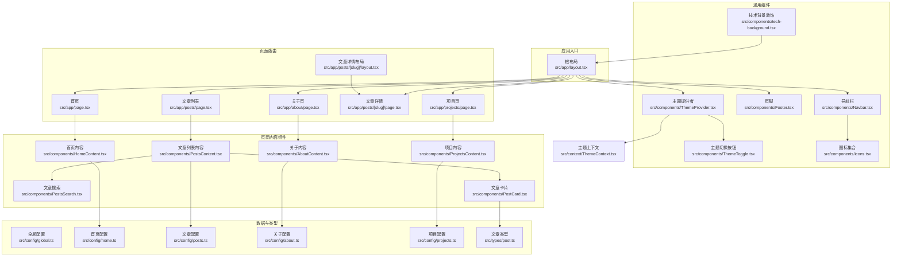
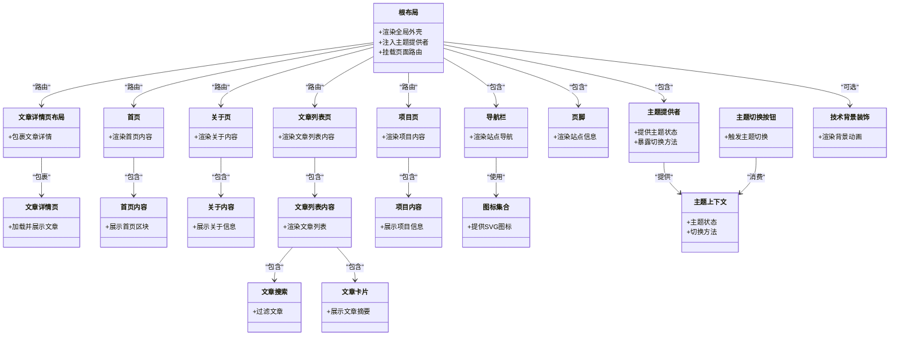
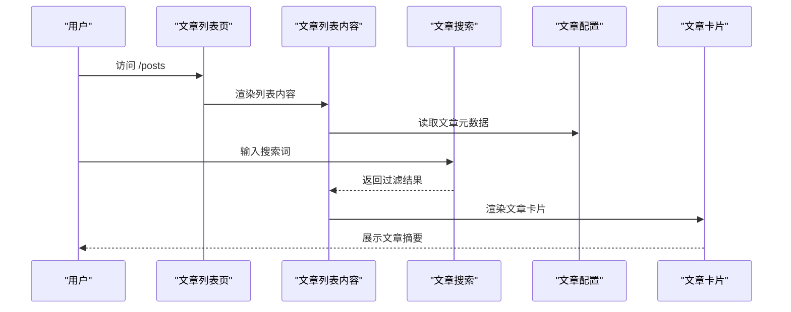
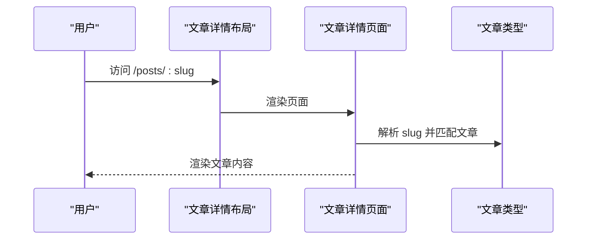
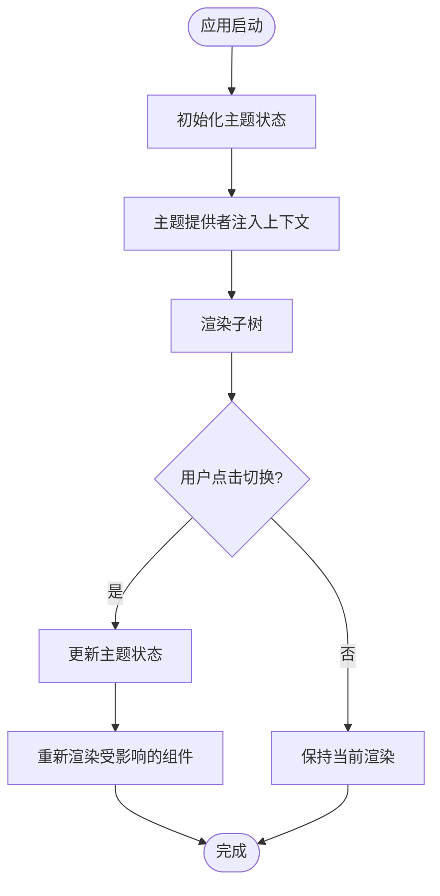
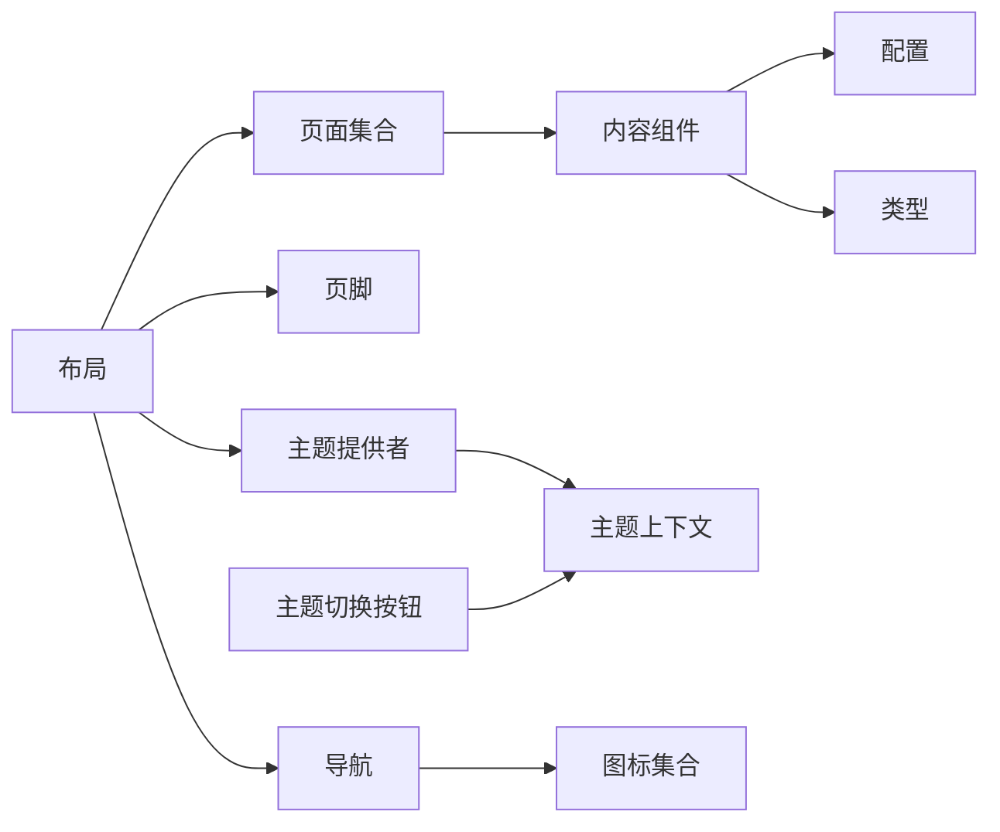

# 组件层次结构

<cite>
**本文引用的文件**   
- [src/app/layout.tsx](file://src/app/layout.tsx)
- [src/app/page.tsx](file://src/app/page.tsx)
- [src/app/about/page.tsx](file://src/app/about/page.tsx)
- [src/app/posts/page.tsx](file://src/app/posts/page.tsx)
- [src/app/posts/[slug]/layout.tsx](file://src/app/posts/[slug]/layout.tsx)
- [src/app/posts/[slug]/page.tsx](file://src/app/posts/[slug]/page.tsx)
- [src/app/projects/page.tsx](file://src/app/projects/page.tsx)
- [src/components/Navbar.tsx](file://src/components/Navbar.tsx)
- [src/components/Footer.tsx](file://src/components/Footer.tsx)
- [src/components/HomeContent.tsx](file://src/components/HomeContent.tsx)
- [src/components/AboutContent.tsx](file://src/components/AboutContent.tsx)
- [src/components/PostsContent.tsx](file://src/components/PostsContent.tsx)
- [src/components/PostsSearch.tsx](file://src/components/PostsSearch.tsx)
- [src/components/PostCard.tsx](file://src/components/PostCard.tsx)
- [src/components/ProjectsContent.tsx](file://src/components/ProjectsContent.tsx)
- [src/components/ThemeToggle.tsx](file://src/components/ThemeToggle.tsx)
- [src/components/ThemeProvider.tsx](file://src/components/ThemeProvider.tsx)
- [src/components/icons.tsx](file://src/components/icons.tsx)
- [src/components/tech-background.tsx](file://src/components/tech-background.tsx)
- [src/context/ThemeContext.tsx](file://src/context/ThemeContext.tsx)
- [src/config/global.ts](file://src/config/global.ts)
- [src/config/home.ts](file://src/config/home.ts)
- [src/config/posts.ts](file://src/config/posts.ts)
- [src/config/about.ts](file://src/config/about.ts)
- [src/config/projects.ts](file://src/config/projects.ts)
- [src/types/post.ts](file://src/types/post.ts)
</cite>

## 目录
1. [简介](#简介)
2. [项目结构](#项目结构)
3. [核心组件](#核心组件)
4. [架构总览](#架构总览)
5. [详细组件分析](#详细组件分析)
6. [依赖分析](#依赖分析)
7. [性能考虑](#性能考虑)
8. [故障排查指南](#故障排查指南)
9. [结论](#结论)
10. [附录](#附录)

## 简介
本文件面向博客项目的 React 组件体系，目标是：
- 梳理从根布局到页面再到基础 UI 的完整层级关系
- 明确各层职责与数据流向
- 说明组合模式与状态提升策略
- 提供组件依赖图与渲染流程图
- 给出重构与优化建议

## 项目结构
本项目采用 Next.js App Router 组织页面与布局，组件集中在 src/components，配置集中于 src/config，类型定义在 src/types，主题上下文在 src/context。

图表来源
- [src/app/layout.tsx](file://src/app/layout.tsx)
- [src/app/page.tsx](file://src/app/page.tsx)
- [src/app/about/page.tsx](file://src/app/about/page.tsx)
- [src/app/posts/page.tsx](file://src/app/posts/page.tsx)
- [src/app/posts/[slug]/layout.tsx](file://src/app/posts/[slug]/layout.tsx)
- [src/app/posts/[slug]/page.tsx](file://src/app/posts/[slug]/page.tsx)
- [src/app/projects/page.tsx](file://src/app/projects/page.tsx)
- [src/components/Navbar.tsx](file://src/components/Navbar.tsx)
- [src/components/Footer.tsx](file://src/components/Footer.tsx)
- [src/components/HomeContent.tsx](file://src/components/HomeContent.tsx)
- [src/components/AboutContent.tsx](file://src/components/AboutContent.tsx)
- [src/components/PostsContent.tsx](file://src/components/PostsContent.tsx)
- [src/components/PostsSearch.tsx](file://src/components/PostsSearch.tsx)
- [src/components/PostCard.tsx](file://src/components/PostCard.tsx)
- [src/components/ProjectsContent.tsx](file://src/components/ProjectsContent.tsx)
- [src/components/ThemeToggle.tsx](file://src/components/ThemeToggle.tsx)
- [src/components/ThemeProvider.tsx](file://src/components/ThemeProvider.tsx)
- [src/components/icons.tsx](file://src/components/icons.tsx)
- [src/components/tech-background.tsx](file://src/components/tech-background.tsx)
- [src/context/ThemeContext.tsx](file://src/context/ThemeContext.tsx)
- [src/config/global.ts](file://src/config/global.ts)
- [src/config/home.ts](file://src/config/home.ts)
- [src/config/posts.ts](file://src/config/posts.ts)
- [src/config/about.ts](file://src/config/about.ts)
- [src/config/projects.ts](file://src/config/projects.ts)
- [src/types/post.ts](file://src/types/post.ts)

章节来源
- [src/app/layout.tsx](file://src/app/layout.tsx)
- [src/app/page.tsx](file://src/app/page.tsx)
- [src/app/about/page.tsx](file://src/app/about/page.tsx)
- [src/app/posts/page.tsx](file://src/app/posts/page.tsx)
- [src/app/posts/[slug]/layout.tsx](file://src/app/posts/[slug]/layout.tsx)
- [src/app/posts/[slug]/page.tsx](file://src/app/posts/[slug]/page.tsx)
- [src/app/projects/page.tsx](file://src/app/projects/page.tsx)

## 核心组件
- 根布局组件
  - 职责：包裹全局样式、导航、页脚、主题提供者；挂载所有页面路由。
  - 关键依赖：导航、页脚、主题提供者、全局配置。
- 页面组件
  - 首页：承载首页内容组件与背景装饰。
  - 关于页：承载关于内容组件。
  - 文章列表页：承载文章列表内容与搜索组件。
  - 文章详情页：由动态路由布局与页面组成，负责加载并展示单篇文章。
  - 项目页：承载项目内容组件。
- 通用 UI 组件
  - 导航栏、页脚、主题切换按钮、图标集合、技术背景装饰。
- 页面内容组件
  - 首页内容、关于内容、文章列表内容、文章搜索、文章卡片、项目内容。
- 主题系统
  - 主题提供者与主题上下文，为全树提供主题状态与切换能力。
- 配置与类型
  - 各模块配置集中管理，文章类型统一声明。

章节来源
- [src/components/Navbar.tsx](file://src/components/Navbar.tsx)
- [src/components/Footer.tsx](file://src/components/Footer.tsx)
- [src/components/HomeContent.tsx](file://src/components/HomeContent.tsx)
- [src/components/AboutContent.tsx](file://src/components/AboutContent.tsx)
- [src/components/PostsContent.tsx](file://src/components/PostsContent.tsx)
- [src/components/PostsSearch.tsx](file://src/components/PostsSearch.tsx)
- [src/components/PostCard.tsx](file://src/components/PostCard.tsx)
- [src/components/ProjectsContent.tsx](file://src/components/ProjectsContent.tsx)
- [src/components/ThemeToggle.tsx](file://src/components/ThemeToggle.tsx)
- [src/components/ThemeProvider.tsx](file://src/components/ThemeProvider.tsx)
- [src/components/icons.tsx](file://src/components/icons.tsx)
- [src/components/tech-background.tsx](file://src/components/tech-background.tsx)
- [src/context/ThemeContext.tsx](file://src/context/ThemeContext.tsx)
- [src/config/global.ts](file://src/config/global.ts)
- [src/config/home.ts](file://src/config/home.ts)
- [src/config/posts.ts](file://src/config/posts.ts)
- [src/config/about.ts](file://src/config/about.ts)
- [src/config/projects.ts](file://src/config/projects.ts)
- [src/types/post.ts](file://src/types/post.ts)

## 架构总览
整体采用“布局-页面-内容-UI”的分层组合模式：
- 布局层：负责全局外壳（导航、页脚、主题）。
- 页面层：按路由组织，聚合对应内容组件。
- 内容层：封装业务展示逻辑，消费配置与类型。
- UI 层：无状态或弱状态的原子化组件（图标、按钮等）。

图表来源
- [src/app/layout.tsx](file://src/app/layout.tsx)
- [src/app/page.tsx](file://src/app/page.tsx)
- [src/app/about/page.tsx](file://src/app/about/page.tsx)
- [src/app/posts/page.tsx](file://src/app/posts/page.tsx)
- [src/app/posts/[slug]/layout.tsx](file://src/app/posts/[slug]/layout.tsx)
- [src/app/posts/[slug]/page.tsx](file://src/app/posts/[slug]/page.tsx)
- [src/app/projects/page.tsx](file://src/app/projects/page.tsx)
- [src/components/Navbar.tsx](file://src/components/Navbar.tsx)
- [src/components/Footer.tsx](file://src/components/Footer.tsx)
- [src/components/HomeContent.tsx](file://src/components/HomeContent.tsx)
- [src/components/AboutContent.tsx](file://src/components/AboutContent.tsx)
- [src/components/PostsContent.tsx](file://src/components/PostsContent.tsx)
- [src/components/PostsSearch.tsx](file://src/components/PostsSearch.tsx)
- [src/components/PostCard.tsx](file://src/components/PostCard.tsx)
- [src/components/ProjectsContent.tsx](file://src/components/ProjectsContent.tsx)
- [src/components/ThemeToggle.tsx](file://src/components/ThemeToggle.tsx)
- [src/components/ThemeProvider.tsx](file://src/components/ThemeProvider.tsx)
- [src/components/icons.tsx](file://src/components/icons.tsx)
- [src/components/tech-background.tsx](file://src/components/tech-background.tsx)
- [src/context/ThemeContext.tsx](file://src/context/ThemeContext.tsx)

## 详细组件分析

### 根布局与全局外壳
- 职责
  - 提供站点级外壳：导航、页脚、主题提供者。
  - 注册所有页面路由，确保全局样式与元信息生效。
- 数据流
  - 主题状态由主题提供者维护，子树通过上下文读取与更新。
  - 导航与页脚作为纯展示组件，接收必要 props。
- 生命周期与副作用
  - 在客户端首次渲染时初始化主题持久化（如本地存储）与动画资源。
- 组合模式
  - 以“容器+内容”的方式组合页面，避免在布局中承载业务逻辑。

章节来源
- [src/app/layout.tsx](file://src/app/layout.tsx)
- [src/components/Navbar.tsx](file://src/components/Navbar.tsx)
- [src/components/Footer.tsx](file://src/components/Footer.tsx)
- [src/components/ThemeProvider.tsx](file://src/components/ThemeProvider.tsx)
- [src/context/ThemeContext.tsx](file://src/context/ThemeContext.tsx)

### 首页
- 职责
  - 聚合首页内容与技术背景装饰，呈现站点概览。
- 数据流
  - 从首页配置读取静态文案与链接。
- 渲染流程
  - 页面组件 -> 首页内容组件 -> 配置数据 -> 基础 UI 组件。

章节来源
- [src/app/page.tsx](file://src/app/page.tsx)
- [src/components/HomeContent.tsx](file://src/components/HomeContent.tsx)
- [src/components/tech-background.tsx](file://src/components/tech-background.tsx)
- [src/config/home.ts](file://src/config/home.ts)

### 关于页
- 职责
  - 展示个人介绍、经历等信息。
- 数据流
  - 从关于配置读取结构化数据，渲染为内容区块。

章节来源
- [src/app/about/page.tsx](file://src/app/about/page.tsx)
- [src/components/AboutContent.tsx](file://src/components/AboutContent.tsx)
- [src/config/about.ts](file://src/config/about.ts)

### 文章列表页
- 职责
  - 展示文章索引，支持关键词搜索与分页（如有）。
- 数据流
  - 从文章配置获取文章元数据，搜索状态可提升到列表内容组件。
- 交互流程
  - 用户输入 -> 搜索组件过滤 -> 列表内容重渲染 -> 文章卡片展示。

图表来源
- [src/app/posts/page.tsx](file://src/app/posts/page.tsx)
- [src/components/PostsContent.tsx](file://src/components/PostsContent.tsx)
- [src/components/PostsSearch.tsx](file://src/components/PostsSearch.tsx)
- [src/components/PostCard.tsx](file://src/components/PostCard.tsx)
- [src/config/posts.ts](file://src/config/posts.ts)

章节来源
- [src/app/posts/page.tsx](file://src/app/posts/page.tsx)
- [src/components/PostsContent.tsx](file://src/components/PostsContent.tsx)
- [src/components/PostsSearch.tsx](file://src/components/PostsSearch.tsx)
- [src/components/PostCard.tsx](file://src/components/PostCard.tsx)
- [src/config/posts.ts](file://src/config/posts.ts)

### 文章详情页
- 职责
  - 根据 slug 加载并渲染单篇文章内容。
- 数据流
  - 动态路由参数 -> 文章详情布局 -> 文章详情页面 -> 内容渲染。
- 渲染流程
  - 布局负责外层壳（导航、页脚），页面负责具体文章内容。

图表来源
- [src/app/posts/[slug]/layout.tsx](file://src/app/posts/[slug]/layout.tsx)
- [src/app/posts/[slug]/page.tsx](file://src/app/posts/[slug]/page.tsx)
- [src/types/post.ts](file://src/types/post.ts)

章节来源
- [src/app/posts/[slug]/layout.tsx](file://src/app/posts/[slug]/layout.tsx)
- [src/app/posts/[slug]/page.tsx](file://src/app/posts/[slug]/page.tsx)
- [src/types/post.ts](file://src/types/post.ts)

### 项目页
- 职责
  - 展示项目信息，通常由项目内容组件聚合配置数据。
- 数据流
  - 项目配置 -> 项目内容组件 -> 基础 UI 组件。

章节来源
- [src/app/projects/page.tsx](file://src/app/projects/page.tsx)
- [src/components/ProjectsContent.tsx](file://src/components/ProjectsContent.tsx)
- [src/config/projects.ts](file://src/config/projects.ts)

### 主题系统与状态提升
- 主题提供者
  - 在根布局中提供主题状态与切换方法，保证整棵子树共享。
- 主题切换按钮
  - 调用上下文中的切换方法，触发重新渲染。
- 状态提升策略
  - 将主题状态提升至最顶层，避免在各页面重复维护。
  - 若未来需要扩展更多全局状态（如语言、字体大小），可沿用同一上下文或拆分多个上下文。

图表来源
- [src/components/ThemeProvider.tsx](file://src/components/ThemeProvider.tsx)
- [src/components/ThemeToggle.tsx](file://src/components/ThemeToggle.tsx)
- [src/context/ThemeContext.tsx](file://src/context/ThemeContext.tsx)

章节来源
- [src/components/ThemeProvider.tsx](file://src/components/ThemeProvider.tsx)
- [src/components/ThemeToggle.tsx](file://src/components/ThemeToggle.tsx)
- [src/context/ThemeContext.tsx](file://src/context/ThemeContext.tsx)

### 导航栏与图标
- 导航栏
  - 负责站点内导航链接与响应式菜单（如有）。
- 图标集合
  - 提供统一的 SVG 图标组件，减少重复代码。

章节来源
- [src/components/Navbar.tsx](file://src/components/Navbar.tsx)
- [src/components/icons.tsx](file://src/components/icons.tsx)

### 页脚
- 职责
  - 展示版权、联系方式、社交链接等站点尾部信息。
- 数据流
  - 从全局配置读取站点信息。

章节来源
- [src/components/Footer.tsx](file://src/components/Footer.tsx)
- [src/config/global.ts](file://src/config/global.ts)

## 依赖分析
- 组件耦合度
  - 页面组件仅依赖对应的内容组件与配置，耦合度低。
  - 通用 UI 组件尽量无状态，便于复用。
- 直接依赖
  - 页面 -> 内容组件 -> 配置/类型
  - 布局 -> 导航/页脚/主题提供者
- 间接依赖
  - 主题切换按钮通过上下文影响任意消费主题的组件。
- 潜在循环依赖
  - 当前结构未发现循环导入；建议保持单向依赖：布局 > 页面 > 内容 > UI。

图表来源
- [src/app/layout.tsx](file://src/app/layout.tsx)
- [src/components/Navbar.tsx](file://src/components/Navbar.tsx)
- [src/components/Footer.tsx](file://src/components/Footer.tsx)
- [src/components/ThemeProvider.tsx](file://src/components/ThemeProvider.tsx)
- [src/components/ThemeToggle.tsx](file://src/components/ThemeToggle.tsx)
- [src/context/ThemeContext.tsx](file://src/context/ThemeContext.tsx)
- [src/config/global.ts](file://src/config/global.ts)
- [src/config/home.ts](file://src/config/home.ts)
- [src/config/posts.ts](file://src/config/posts.ts)
- [src/config/about.ts](file://src/config/about.ts)
- [src/config/projects.ts](file://src/config/projects.ts)
- [src/types/post.ts](file://src/types/post.ts)

章节来源
- [src/app/layout.tsx](file://src/app/layout.tsx)
- [src/components/Navbar.tsx](file://src/components/Navbar.tsx)
- [src/components/Footer.tsx](file://src/components/Footer.tsx)
- [src/components/ThemeProvider.tsx](file://src/components/ThemeProvider.tsx)
- [src/components/ThemeToggle.tsx](file://src/components/ThemeToggle.tsx)
- [src/context/ThemeContext.tsx](file://src/context/ThemeContext.tsx)
- [src/config/global.ts](file://src/config/global.ts)
- [src/config/home.ts](file://src/config/home.ts)
- [src/config/posts.ts](file://src/config/posts.ts)
- [src/config/about.ts](file://src/config/about.ts)
- [src/config/projects.ts](file://src/config/projects.ts)
- [src/types/post.ts](file://src/types/post.ts)

## 性能考虑
- 懒加载与按需引入
  - 对大型动画或第三方库进行动态导入，减少首屏体积。
- 列表渲染优化
  - 文章列表使用稳定 key，必要时对长列表做虚拟滚动。
- 状态最小化
  - 仅在需要的组件内维护状态，避免不必要的重渲染。
- 主题切换优化
  - 将主题状态提升到顶层，避免逐层传递 props。
- 图片与媒体
  - 使用合适的尺寸与格式，启用浏览器缓存与 CDN。

[本节为通用指导，不直接分析具体文件]

## 故障排查指南
- 主题未生效
  - 检查主题提供者是否位于根布局，确认主题上下文是否正确消费。
- 文章无法显示
  - 校验 slug 与文章配置的映射关系，确认类型定义与实际数据一致。
- 搜索无效
  - 检查搜索组件的状态提升位置与过滤逻辑是否正确。
- 导航跳转异常
  - 确认路由路径与导航项配置一致，避免硬编码导致不一致。

章节来源
- [src/components/ThemeProvider.tsx](file://src/components/ThemeProvider.tsx)
- [src/context/ThemeContext.tsx](file://src/context/ThemeContext.tsx)
- [src/app/posts/[slug]/page.tsx](file://src/app/posts/[slug]/page.tsx)
- [src/components/PostsSearch.tsx](file://src/components/PostsSearch.tsx)
- [src/components/Navbar.tsx](file://src/components/Navbar.tsx)

## 结论
本博客项目采用清晰的“布局-页面-内容-UI”分层与组合模式，配合主题上下文实现全局状态管理。通过合理的状态提升与单向数据流，保证了组件的可维护性与可扩展性。后续可在列表渲染、资源加载与状态粒度方面继续优化，进一步提升性能与体验。

[本节为总结，不直接分析具体文件]

## 附录
- 重构与优化原则
  - 单一职责：每个组件只关注一个功能点。
  - 组合优于继承：通过 props 与插槽组合行为，避免深层继承。
  - 状态就近：将状态尽可能放在最近的父组件，减少跨层传递。
  - 可测试性：将业务逻辑抽离为纯函数或自定义 Hook，便于单元测试。
  - 可访问性：为交互组件提供键盘支持与语义化标签。

[本节为通用指导，不直接分析具体文件]