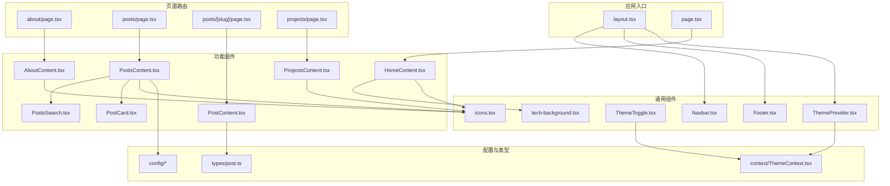
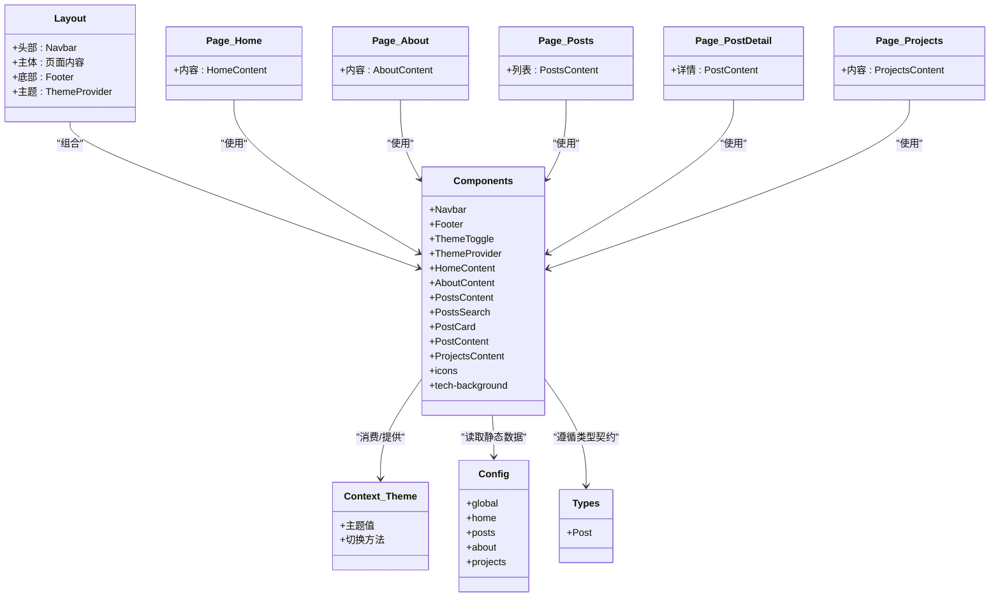
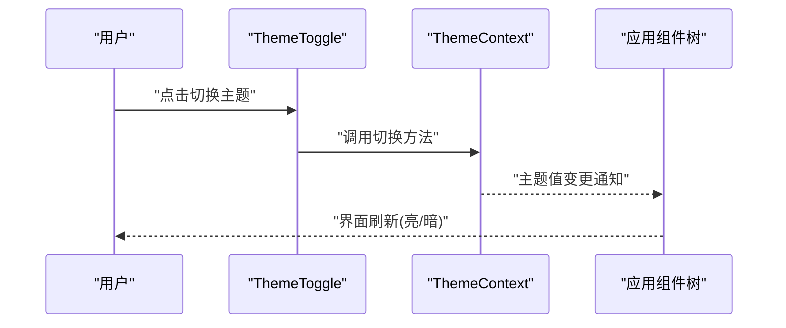
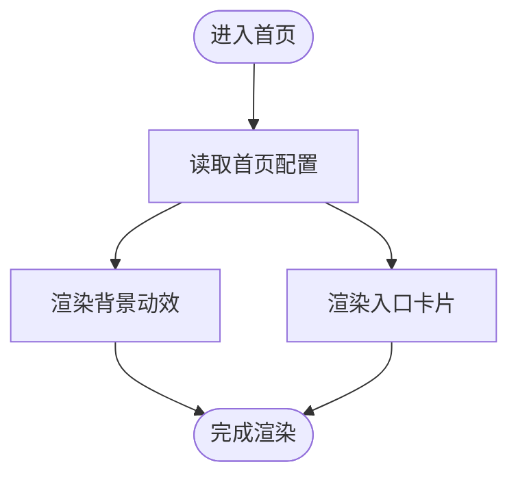
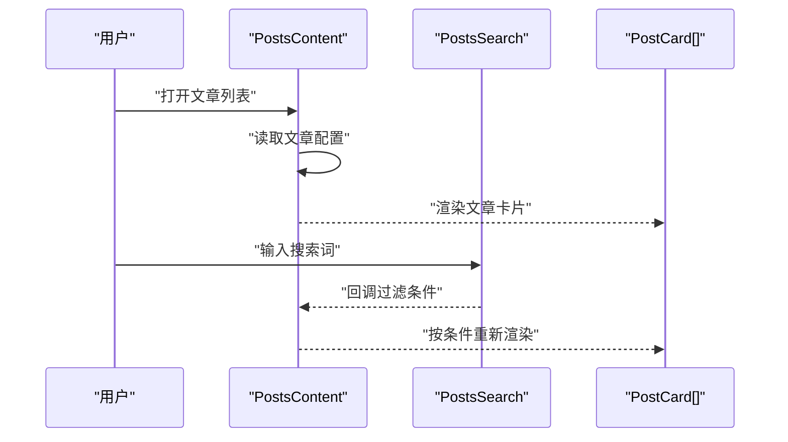
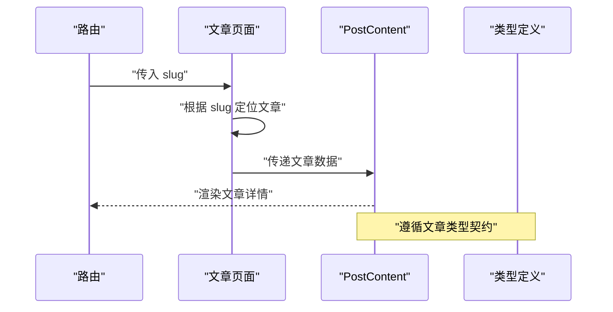
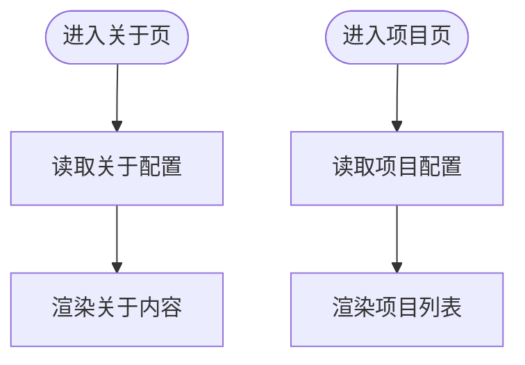
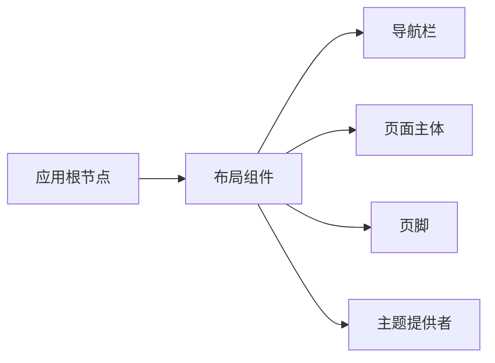
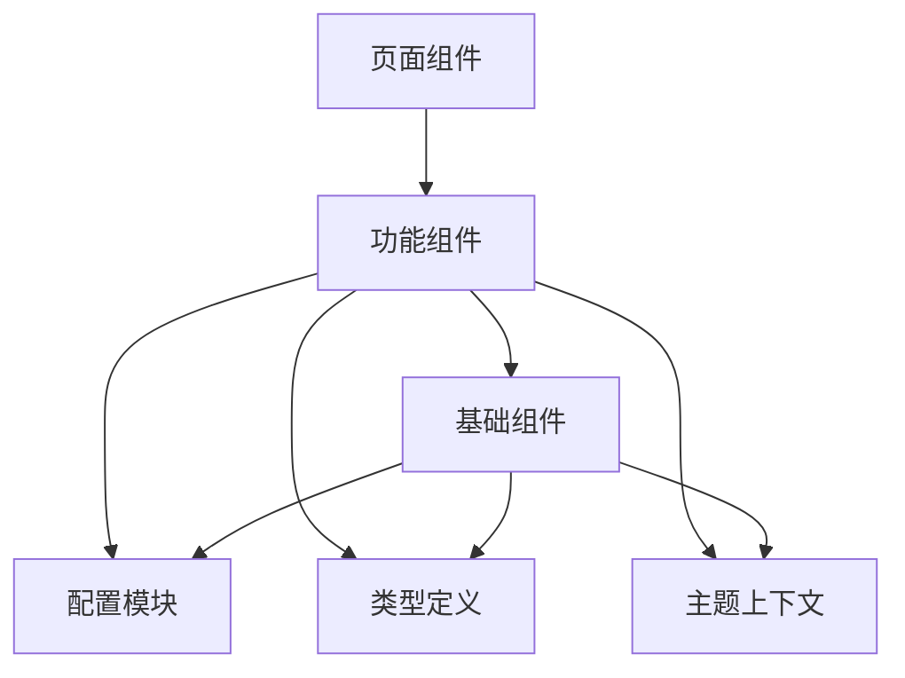

# 组件架构设计

<cite>
**本文引用的文件**   
- [src/app/layout.tsx](file://src/app/layout.tsx)
- [src/app/page.tsx](file://src/app/page.tsx)
- [src/app/about/page.tsx](file://src/app/about/page.tsx)
- [src/app/posts/page.tsx](file://src/app/posts/page.tsx)
- [src/app/posts/[slug]/page.tsx](file://src/app/posts/[slug]/page.tsx)
- [src/app/posts/[slug]/PostContent.tsx](file://src/app/posts/[slug]/PostContent.tsx)
- [src/app/projects/page.tsx](file://src/app/projects/page.tsx)
- [src/components/Navbar.tsx](file://src/components/Navbar.tsx)
- [src/components/Footer.tsx](file://src/components/Footer.tsx)
- [src/components/HomeContent.tsx](file://src/components/HomeContent.tsx)
- [src/components/AboutContent.tsx](file://src/components/AboutContent.tsx)
- [src/components/PostsContent.tsx](file://src/components/PostsContent.tsx)
- [src/components/PostsSearch.tsx](file://src/components/PostsSearch.tsx)
- [src/components/PostCard.tsx](file://src/components/PostCard.tsx)
- [src/components/ProjectsContent.tsx](file://src/components/ProjectsContent.tsx)
- [src/components/ThemeToggle.tsx](file://src/components/ThemeToggle.tsx)
- [src/components/ThemeProvider.tsx](file://src/components/ThemeProvider.tsx)
- [src/components/icons.tsx](file://src/components/icons.tsx)
- [src/components/tech-background.tsx](file://src/components/tech-background.tsx)
- [src/context/ThemeContext.tsx](file://src/context/ThemeContext.tsx)
- [src/config/global.ts](file://src/config/global.ts)
- [src/config/home.ts](file://src/config/home.ts)
- [src/config/posts.ts](file://src/config/posts.ts)
- [src/config/about.ts](file://src/config/about.ts)
- [src/config/projects.ts](file://src/config/projects.ts)
- [src/types/post.ts](file://src/types/post.ts)
</cite>

## 目录
1. [简介](#简介)
2. [项目结构](#项目结构)
3. [核心组件](#核心组件)
4. [架构总览](#架构总览)
5. [详细组件分析](#详细组件分析)
6. [依赖关系分析](#依赖关系分析)
7. [性能考虑](#性能考虑)
8. [故障排查指南](#故障排查指南)
9. [结论](#结论)
10. [附录](#附录)

## 简介
本文件面向博客项目的 React 组件体系，系统化梳理组件层次、职责边界、数据流与状态管理策略，并提供可复用的接口约定、测试策略与性能优化建议。文档以 Next.js App Router 为运行环境，围绕页面组件、功能组件与基础 UI 组件三层展开，结合 Context API 实现主题等全局状态的跨层级传递。

## 项目结构
本项目采用“按功能域 + 分层”的组织方式：
- 页面层（app）：路由入口与页面组装，负责数据获取与布局组合
- 组件层（components）：可复用 UI 与业务片段，按职责拆分为基础、功能与页面级容器
- 上下文（context）：全局状态（如主题）的提供者与消费者
- 配置（config）：静态内容与站点元信息
- 类型（types）：共享类型定义

图表来源
- [src/app/layout.tsx](file://src/app/layout.tsx)
- [src/app/page.tsx](file://src/app/page.tsx)
- [src/app/about/page.tsx](file://src/app/about/page.tsx)
- [src/app/posts/page.tsx](file://src/app/posts/page.tsx)
- [src/app/posts/[slug]/page.tsx](file://src/app/posts/[slug]/page.tsx)
- [src/app/projects/page.tsx](file://src/app/projects/page.tsx)
- [src/components/Navbar.tsx](file://src/components/Navbar.tsx)
- [src/components/Footer.tsx](file://src/components/Footer.tsx)
- [src/components/HomeContent.tsx](file://src/components/HomeContent.tsx)
- [src/components/AboutContent.tsx](file://src/components/AboutContent.tsx)
- [src/components/PostsContent.tsx](file://src/components/PostsContent.tsx)
- [src/components/PostsSearch.tsx](file://src/components/PostsSearch.tsx)
- [src/components/PostCard.tsx](file://src/components/PostCard.tsx)
- [src/components/ProjectsContent.tsx](file://src/components/ProjectsContent.tsx)
- [src/components/ThemeToggle.tsx](file://src/components/ThemeToggle.tsx)
- [src/components/ThemeProvider.tsx](file://src/components/ThemeProvider.tsx)
- [src/components/icons.tsx](file://src/components/icons.tsx)
- [src/components/tech-background.tsx](file://src/components/tech-background.tsx)
- [src/context/ThemeContext.tsx](file://src/context/ThemeContext.tsx)
- [src/config/global.ts](file://src/config/global.ts)
- [src/config/home.ts](file://src/config/home.ts)
- [src/config/posts.ts](file://src/config/posts.ts)
- [src/config/about.ts](file://src/config/about.ts)
- [src/config/projects.ts](file://src/config/projects.ts)
- [src/types/post.ts](file://src/types/post.ts)

章节来源
- [src/app/layout.tsx](file://src/app/layout.tsx)
- [src/app/page.tsx](file://src/app/page.tsx)
- [src/app/about/page.tsx](file://src/app/about/page.tsx)
- [src/app/posts/page.tsx](file://src/app/posts/page.tsx)
- [src/app/posts/[slug]/page.tsx](file://src/app/posts/[slug]/page.tsx)
- [src/app/projects/page.tsx](file://src/app/projects/page.tsx)
- [src/components/Navbar.tsx](file://src/components/Navbar.tsx)
- [src/components/Footer.tsx](file://src/components/Footer.tsx)
- [src/components/HomeContent.tsx](file://src/components/HomeContent.tsx)
- [src/components/AboutContent.tsx](file://src/components/AboutContent.tsx)
- [src/components/PostsContent.tsx](file://src/components/PostsContent.tsx)
- [src/components/PostsSearch.tsx](file://src/components/PostsSearch.tsx)
- [src/components/PostCard.tsx](file://src/components/PostCard.tsx)
- [src/components/ProjectsContent.tsx](file://src/components/ProjectsContent.tsx)
- [src/components/ThemeToggle.tsx](file://src/components/ThemeToggle.tsx)
- [src/components/ThemeProvider.tsx](file://src/components/ThemeProvider.tsx)
- [src/components/icons.tsx](file://src/components/icons.tsx)
- [src/components/tech-background.tsx](file://src/components/tech-background.tsx)
- [src/context/ThemeContext.tsx](file://src/context/ThemeContext.tsx)
- [src/config/global.ts](file://src/config/global.ts)
- [src/config/home.ts](file://src/config/home.ts)
- [src/config/posts.ts](file://src/config/posts.ts)
- [src/config/about.ts](file://src/config/about.ts)
- [src/config/projects.ts](file://src/config/projects.ts)
- [src/types/post.ts](file://src/types/post.ts)

## 核心组件
- 布局与导航
  - Navbar：顶部导航与链接集合，承载站点结构与跳转
  - Footer：底部信息与版权展示
  - ThemeToggle：主题切换按钮，消费主题上下文
  - ThemeProvider：主题上下文提供者，维护当前主题并广播变更
- 页面内容组件
  - HomeContent：首页内容聚合，包含背景动画与入口卡片
  - AboutContent：关于页内容渲染
  - PostsContent：文章列表与搜索过滤
  - PostContent：单篇文章详情渲染
  - ProjectsContent：项目展示
- 基础与辅助
  - PostCard：文章卡片，用于列表项展示
  - icons：图标集合组件
  - tech-background：技术背景动效组件

职责划分原则
- 页面组件：仅做路由装配与数据拼装，不承载复杂交互
- 功能组件：封装具体业务逻辑（如搜索、筛选、格式化）
- 基础组件：纯展示或最小交互，尽量无副作用

章节来源
- [src/components/Navbar.tsx](file://src/components/Navbar.tsx)
- [src/components/Footer.tsx](file://src/components/Footer.tsx)
- [src/components/ThemeToggle.tsx](file://src/components/ThemeToggle.tsx)
- [src/components/ThemeProvider.tsx](file://src/components/ThemeProvider.tsx)
- [src/components/HomeContent.tsx](file://src/components/HomeContent.tsx)
- [src/components/AboutContent.tsx](file://src/components/AboutContent.tsx)
- [src/components/PostsContent.tsx](file://src/components/PostsContent.tsx)
- [src/components/PostsSearch.tsx](file://src/components/PostsSearch.tsx)
- [src/components/PostCard.tsx](file://src/components/PostCard.tsx)
- [src/components/PostContent.tsx](file://src/app/posts/[slug]/PostContent.tsx)
- [src/components/ProjectsContent.tsx](file://src/components/ProjectsContent.tsx)
- [src/components/icons.tsx](file://src/components/icons.tsx)
- [src/components/tech-background.tsx](file://src/components/tech-background.tsx)

## 架构总览
整体采用“页面容器 -> 功能组件 -> 基础组件”的分层模式，配合 Context 提供全局主题能力；配置模块集中管理静态内容，类型模块统一数据结构契约。

图表来源
- [src/app/layout.tsx](file://src/app/layout.tsx)
- [src/app/page.tsx](file://src/app/page.tsx)
- [src/app/about/page.tsx](file://src/app/about/page.tsx)
- [src/app/posts/page.tsx](file://src/app/posts/page.tsx)
- [src/app/posts/[slug]/page.tsx](file://src/app/posts/[slug]/page.tsx)
- [src/app/projects/page.tsx](file://src/app/projects/page.tsx)
- [src/components/Navbar.tsx](file://src/components/Navbar.tsx)
- [src/components/Footer.tsx](file://src/components/Footer.tsx)
- [src/components/ThemeToggle.tsx](file://src/components/ThemeToggle.tsx)
- [src/components/ThemeProvider.tsx](file://src/components/ThemeProvider.tsx)
- [src/components/HomeContent.tsx](file://src/components/HomeContent.tsx)
- [src/components/AboutContent.tsx](file://src/components/AboutContent.tsx)
- [src/components/PostsContent.tsx](file://src/components/PostsContent.tsx)
- [src/components/PostsSearch.tsx](file://src/components/PostsSearch.tsx)
- [src/components/PostCard.tsx](file://src/components/PostCard.tsx)
- [src/components/PostContent.tsx](file://src/app/posts/[slug]/PostContent.tsx)
- [src/components/ProjectsContent.tsx](file://src/components/ProjectsContent.tsx)
- [src/components/icons.tsx](file://src/components/icons.tsx)
- [src/components/tech-background.tsx](file://src/components/tech-background.tsx)
- [src/context/ThemeContext.tsx](file://src/context/ThemeContext.tsx)
- [src/config/global.ts](file://src/config/global.ts)
- [src/config/home.ts](file://src/config/home.ts)
- [src/config/posts.ts](file://src/config/posts.ts)
- [src/config/about.ts](file://src/config/about.ts)
- [src/config/projects.ts](file://src/config/projects.ts)
- [src/types/post.ts](file://src/types/post.ts)

## 详细组件分析

### 主题上下文与主题切换
- 角色分工
  - ThemeProvider：在应用根节点提供主题值与切换函数
  - ThemeToggle：触发切换，更新主题状态
  - 其他组件：通过上下文读取当前主题，驱动样式与行为
- 数据流
  - 用户点击切换 -> 调用切换函数 -> 更新上下文 -> 订阅者重渲染
- 适用场景
  - 全站主题、暗色模式、多语言等全局状态

图表来源
- [src/components/ThemeToggle.tsx](file://src/components/ThemeToggle.tsx)
- [src/components/ThemeProvider.tsx](file://src/components/ThemeProvider.tsx)
- [src/context/ThemeContext.tsx](file://src/context/ThemeContext.tsx)

章节来源
- [src/components/ThemeToggle.tsx](file://src/components/ThemeToggle.tsx)
- [src/components/ThemeProvider.tsx](file://src/components/ThemeProvider.tsx)
- [src/context/ThemeContext.tsx](file://src/context/ThemeContext.tsx)

### 首页内容组件
- 职责
  - 聚合首页所需子组件（背景动效、入口卡片等）
  - 从配置模块加载静态数据
- 数据流
  - 读取配置 -> 组装内容 -> 渲染子组件
- 性能要点
  - 对大体积动效组件按需加载或懒加载
  - 避免在每次渲染中创建新对象作为 props

图表来源
- [src/components/HomeContent.tsx](file://src/components/HomeContent.tsx)
- [src/config/home.ts](file://src/config/home.ts)
- [src/components/tech-background.tsx](file://src/components/tech-background.tsx)

章节来源
- [src/components/HomeContent.tsx](file://src/components/HomeContent.tsx)
- [src/config/home.ts](file://src/config/home.ts)
- [src/components/tech-background.tsx](file://src/components/tech-background.tsx)

### 文章列表与搜索
- 职责
  - 列表渲染：基于配置生成文章卡片
  - 搜索过滤：根据关键词过滤文章
- 数据流
  - 配置数据 -> 列表组件 -> 搜索输入 -> 过滤结果 -> 重新渲染
- 交互流程

图表来源
- [src/components/PostsContent.tsx](file://src/components/PostsContent.tsx)
- [src/components/PostsSearch.tsx](file://src/components/PostsSearch.tsx)
- [src/components/PostCard.tsx](file://src/components/PostCard.tsx)
- [src/config/posts.ts](file://src/config/posts.ts)

章节来源
- [src/components/PostsContent.tsx](file://src/components/PostsContent.tsx)
- [src/components/PostsSearch.tsx](file://src/components/PostsSearch.tsx)
- [src/components/PostCard.tsx](file://src/components/PostCard.tsx)
- [src/config/posts.ts](file://src/config/posts.ts)

### 文章详情页
- 职责
  - 解析 slug 参数，定位文章
  - 渲染文章内容与元信息
- 数据流
  - 路由参数 -> 定位文章 -> 渲染详情
- 类型契约
  - 文章实体遵循统一类型定义，确保字段一致

图表来源
- [src/app/posts/[slug]/page.tsx](file://src/app/posts/[slug]/page.tsx)
- [src/app/posts/[slug]/PostContent.tsx](file://src/app/posts/[slug]/PostContent.tsx)
- [src/types/post.ts](file://src/types/post.ts)

章节来源
- [src/app/posts/[slug]/page.tsx](file://src/app/posts/[slug]/page.tsx)
- [src/app/posts/[slug]/PostContent.tsx](file://src/app/posts/[slug]/PostContent.tsx)
- [src/types/post.ts](file://src/types/post.ts)

### 关于与项目页
- 关于页
  - 从关于配置加载内容并渲染
- 项目页
  - 从项目配置加载项目清单并渲染
- 共同点
  - 均为“配置驱动”的内容型页面，便于非技术人员维护

图表来源
- [src/app/about/page.tsx](file://src/app/about/page.tsx)
- [src/components/AboutContent.tsx](file://src/components/AboutContent.tsx)
- [src/config/about.ts](file://src/config/about.ts)
- [src/app/projects/page.tsx](file://src/app/projects/page.tsx)
- [src/components/ProjectsContent.tsx](file://src/components/ProjectsContent.tsx)
- [src/config/projects.ts](file://src/config/projects.ts)

章节来源
- [src/app/about/page.tsx](file://src/app/about/page.tsx)
- [src/components/AboutContent.tsx](file://src/components/AboutContent.tsx)
- [src/config/about.ts](file://src/config/about.ts)
- [src/app/projects/page.tsx](file://src/app/projects/page.tsx)
- [src/components/ProjectsContent.tsx](file://src/components/ProjectsContent.tsx)
- [src/config/projects.ts](file://src/config/projects.ts)

### 布局与导航
- 布局
  - 包裹全局 Header/Footer 与主题提供者
  - 注入全局样式与字体资源
- 导航
  - 提供站点内主要路由入口
  - 响应式菜单与当前路由高亮

图表来源
- [src/app/layout.tsx](file://src/app/layout.tsx)
- [src/components/Navbar.tsx](file://src/components/Navbar.tsx)
- [src/components/Footer.tsx](file://src/components/Footer.tsx)
- [src/components/ThemeProvider.tsx](file://src/components/ThemeProvider.tsx)

章节来源
- [src/app/layout.tsx](file://src/app/layout.tsx)
- [src/components/Navbar.tsx](file://src/components/Navbar.tsx)
- [src/components/Footer.tsx](file://src/components/Footer.tsx)
- [src/components/ThemeProvider.tsx](file://src/components/ThemeProvider.tsx)

## 依赖关系分析
- 页面到组件
  - 各页面仅依赖对应功能组件，保持低耦合
- 组件到配置
  - 内容型组件通过配置模块获取静态数据，避免硬编码
- 组件到类型
  - 所有结构化数据遵循 types 定义，保障一致性
- 组件到上下文
  - 主题相关组件依赖 ThemeContext，其他组件通过上下文消费主题

图表来源
- [src/app/page.tsx](file://src/app/page.tsx)
- [src/app/about/page.tsx](file://src/app/about/page.tsx)
- [src/app/posts/page.tsx](file://src/app/posts/page.tsx)
- [src/app/posts/[slug]/page.tsx](file://src/app/posts/[slug]/page.tsx)
- [src/app/projects/page.tsx](file://src/app/projects/page.tsx)
- [src/components/HomeContent.tsx](file://src/components/HomeContent.tsx)
- [src/components/AboutContent.tsx](file://src/components/AboutContent.tsx)
- [src/components/PostsContent.tsx](file://src/components/PostsContent.tsx)
- [src/components/PostContent.tsx](file://src/app/posts/[slug]/PostContent.tsx)
- [src/components/ProjectsContent.tsx](file://src/components/ProjectsContent.tsx)
- [src/components/PostCard.tsx](file://src/components/PostCard.tsx)
- [src/components/icons.tsx](file://src/components/icons.tsx)
- [src/components/tech-background.tsx](file://src/components/tech-background.tsx)
- [src/context/ThemeContext.tsx](file://src/context/ThemeContext.tsx)
- [src/config/global.ts](file://src/config/global.ts)
- [src/config/home.ts](file://src/config/home.ts)
- [src/config/posts.ts](file://src/config/posts.ts)
- [src/config/about.ts](file://src/config/about.ts)
- [src/config/projects.ts](file://src/config/projects.ts)
- [src/types/post.ts](file://src/types/post.ts)

章节来源
- [src/app/page.tsx](file://src/app/page.tsx)
- [src/app/about/page.tsx](file://src/app/about/page.tsx)
- [src/app/posts/page.tsx](file://src/app/posts/page.tsx)
- [src/app/posts/[slug]/page.tsx](file://src/app/posts/[slug]/page.tsx)
- [src/app/projects/page.tsx](file://src/app/projects/page.tsx)
- [src/components/HomeContent.tsx](file://src/components/HomeContent.tsx)
- [src/components/AboutContent.tsx](file://src/components/AboutContent.tsx)
- [src/components/PostsContent.tsx](file://src/components/PostsContent.tsx)
- [src/components/PostContent.tsx](file://src/app/posts/[slug]/PostContent.tsx)
- [src/components/ProjectsContent.tsx](file://src/components/ProjectsContent.tsx)
- [src/components/PostCard.tsx](file://src/components/PostCard.tsx)
- [src/components/icons.tsx](file://src/components/icons.tsx)
- [src/components/tech-background.tsx](file://src/components/tech-background.tsx)
- [src/context/ThemeContext.tsx](file://src/context/ThemeContext.tsx)
- [src/config/global.ts](file://src/config/global.ts)
- [src/config/home.ts](file://src/config/home.ts)
- [src/config/posts.ts](file://src/config/posts.ts)
- [src/config/about.ts](file://src/config/about.ts)
- [src/config/projects.ts](file://src/config/projects.ts)
- [src/types/post.ts](file://src/types/post.ts)

## 性能考虑
- 渲染优化
  - 列表项使用稳定 key，避免不必要的重排
  - 将频繁变化的状态下沉至最小必要组件，减少重渲染范围
- 资源加载
  - 大体积动效与图片按需加载或延迟加载
  - 图标与公共组件抽取为独立模块，利于缓存与 Tree Shaking
- 计算与过滤
  - 搜索过滤结果进行防抖处理，降低高频输入导致的重复计算
  - 对不可变数据进行浅比较，必要时使用记忆化策略
- 主题切换
  - 主题变更仅影响必要节点，避免整棵树重渲染
- 构建与打包
  - 合理拆分路由与组件，利用代码分割提升首屏性能

[本节为通用指导，无需源码引用]

## 故障排查指南
- 主题未生效
  - 检查是否在应用根节点正确包裹主题提供者
  - 确认主题切换函数是否被调用且状态已更新
- 文章列表为空
  - 核对文章配置是否完整，字段是否与类型定义一致
  - 检查搜索过滤条件是否过于严格
- 详情页无法渲染
  - 校验 slug 是否正确映射到文章
  - 确认文章数据是否符合类型约束
- 导航跳转异常
  - 检查路由路径与导航项配置是否匹配
  - 确认布局组件是否正确挂载导航与页脚

章节来源
- [src/components/ThemeToggle.tsx](file://src/components/ThemeToggle.tsx)
- [src/components/ThemeProvider.tsx](file://src/components/ThemeProvider.tsx)
- [src/context/ThemeContext.tsx](file://src/context/ThemeContext.tsx)
- [src/components/PostsContent.tsx](file://src/components/PostsContent.tsx)
- [src/components/PostsSearch.tsx](file://src/components/PostsSearch.tsx)
- [src/components/PostCard.tsx](file://src/components/PostCard.tsx)
- [src/app/posts/[slug]/page.tsx](file://src/app/posts/[slug]/page.tsx)
- [src/app/posts/[slug]/PostContent.tsx](file://src/app/posts/[slug]/PostContent.tsx)
- [src/components/Navbar.tsx](file://src/components/Navbar.tsx)
- [src/components/Footer.tsx](file://src/components/Footer.tsx)
- [src/types/post.ts](file://src/types/post.ts)
- [src/config/posts.ts](file://src/config/posts.ts)

## 结论
本博客项目采用清晰的分层组件架构：页面负责装配，功能组件承载业务逻辑，基础组件专注展示与最小交互。通过配置模块与类型定义保证数据一致性，借助 Context 实现全局主题管理。该结构具备良好的可扩展性与可维护性，适合持续迭代与团队协作。

[本节为总结性内容，无需源码引用]

## 附录

### 组件分类与职责矩阵
- 基础组件
  - 图标、背景动效、通用 UI 元素
  - 特点：无副作用、可复用、受控于父组件
- 功能组件
  - 文章列表、搜索、文章详情、项目展示
  - 特点：组合基础组件、处理局部状态与交互
- 页面组件
  - 首页、关于、文章列表、文章详情、项目
  - 特点：路由入口、数据拼装、布局组合

[本节为概念性说明，无需源码引用]

### 可复用组件接口约定
- 命名规范
  - 组件名使用 PascalCase，文件名与组件名保持一致
- Props 约定
  - 明确必填与可选字段，提供默认值
  - 事件回调使用 onXxx 命名，返回 Promise 时需处理错误
- 主题适配
  - 组件内部通过上下文读取主题，避免外部透传主题属性
- 可访问性
  - 关键交互元素具备语义化标签与键盘可达性

[本节为规范说明，无需源码引用]

### 组件测试策略
- 单元测试
  - 针对基础组件进行快照与交互断言
  - 模拟上下文与配置数据，验证渲染结果
- 集成测试
  - 覆盖功能组件的数据流与交互（如搜索过滤）
- 端到端测试
  - 验证页面路由与关键业务流程（如文章详情加载）

[本节为测试策略说明，无需源码引用]

### 开发规范与最佳实践
- 文件组织
  - 页面与组件分离，配置与类型独立管理
- 代码风格
  - 使用 TypeScript 强类型约束，避免 any
- 性能优先
  - 谨慎引入第三方库，优先本地实现轻量方案
- 文档与注释
  - 为复杂组件补充 README 与示例用法

[本节为规范说明，无需源码引用]