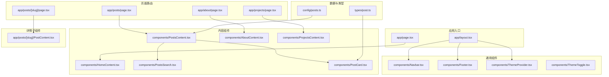
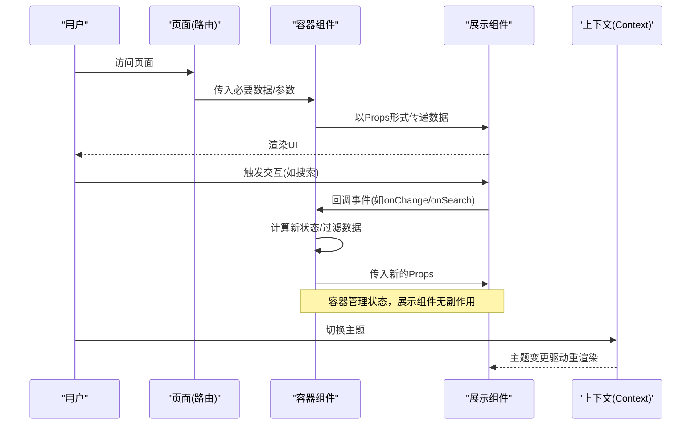
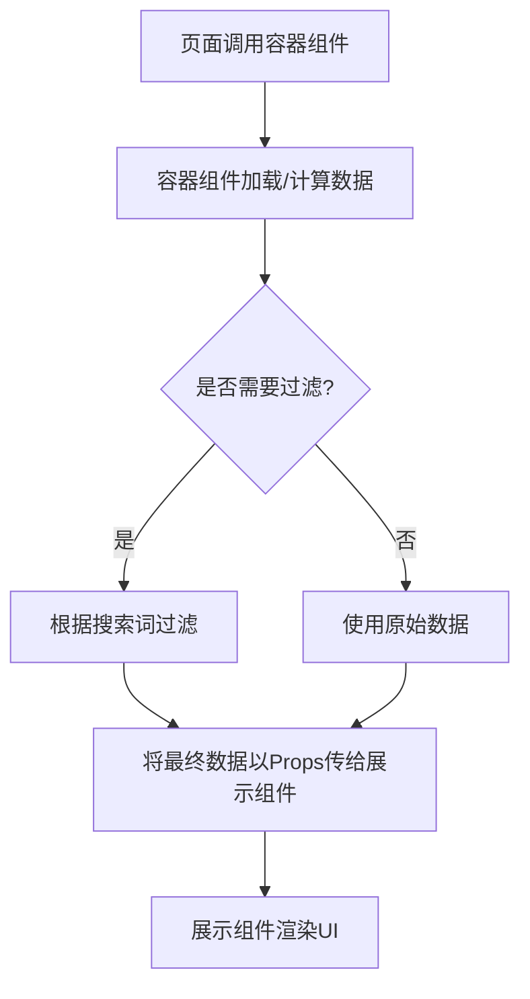
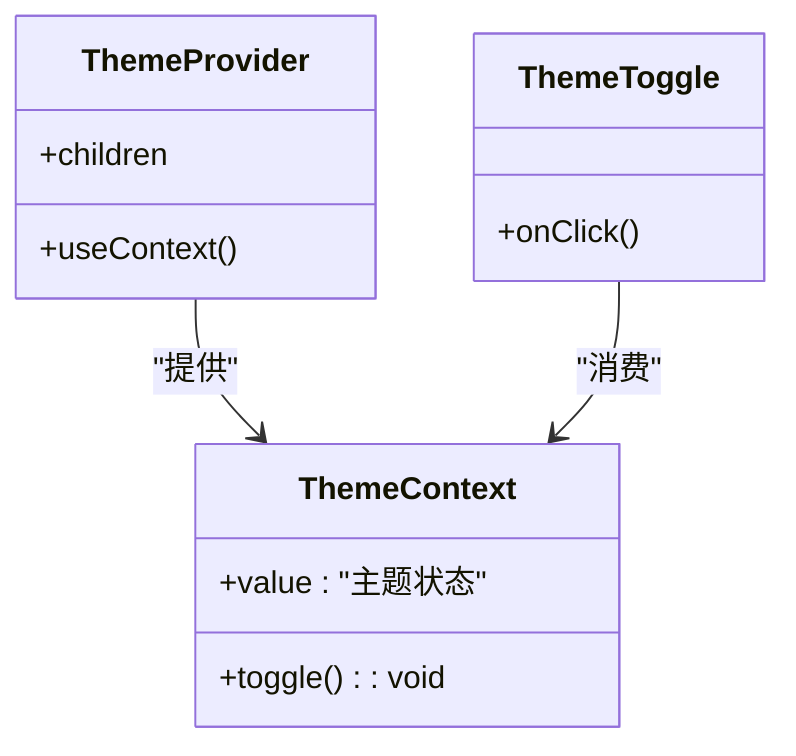
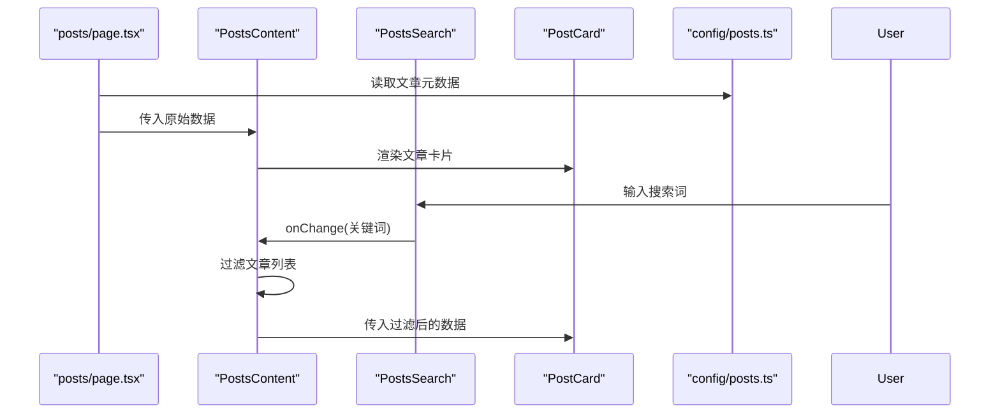
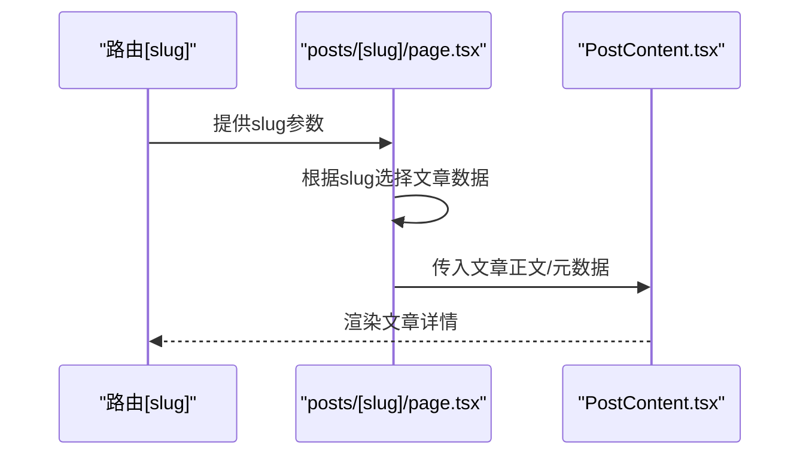
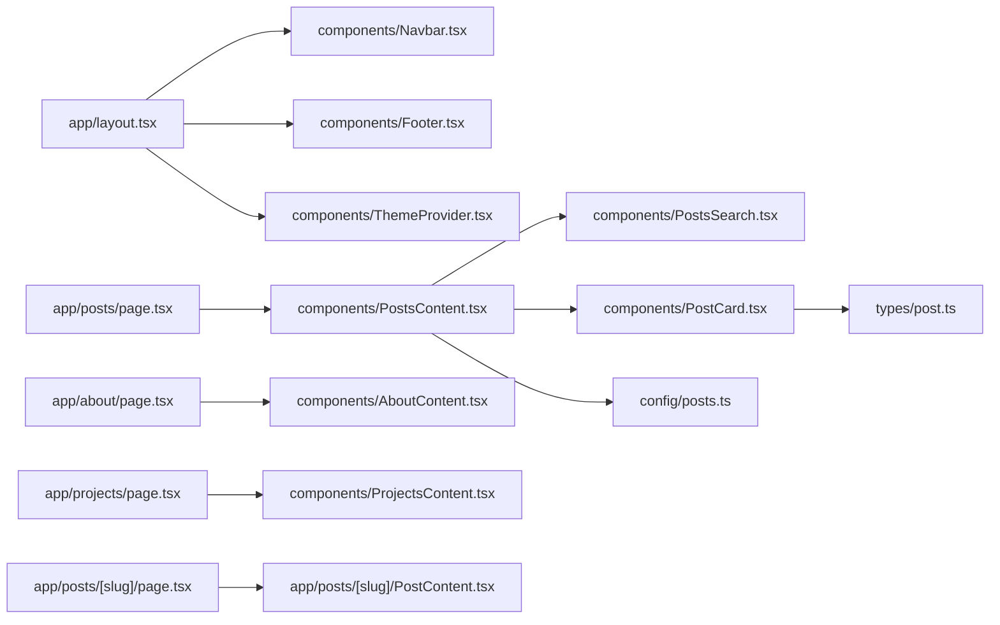

# 组件设计模式

<cite>
**本文引用的文件**   
- [src/components/Navbar.tsx](file://src/components/Navbar.tsx)
- [src/components/Footer.tsx](file://src/components/Footer.tsx)
- [src/components/PostCard.tsx](file://src/components/PostCard.tsx)
- [src/components/PostsContent.tsx](file://src/components/PostsContent.tsx)
- [src/components/PostsSearch.tsx](file://src/components/PostsSearch.tsx)
- [src/components/HomeContent.tsx](file://src/components/HomeContent.tsx)
- [src/components/AboutContent.tsx](file://src/components/AboutContent.tsx)
- [src/components/ProjectsContent.tsx](file://src/components/ProjectsContent.tsx)
- [src/components/ThemeToggle.tsx](file://src/components/ThemeToggle.tsx)
- [src/components/ThemeProvider.tsx](file://src/components/ThemeProvider.tsx)
- [src/context/ThemeContext.tsx](file://src/context/ThemeContext.tsx)
- [src/app/layout.tsx](file://src/app/layout.tsx)
- [src/app/page.tsx](file://src/app/page.tsx)
- [src/app/posts/page.tsx](file://src/app/posts/page.tsx)
- [src/app/about/page.tsx](file://src/app/about/page.tsx)
- [src/app/projects/page.tsx](file://src/app/projects/page.tsx)
- [src/app/posts/[slug]/page.tsx](file://src/app/posts/[slug]/page.tsx)
- [src/app/posts/[slug]/PostContent.tsx](file://src/app/posts/[slug]/PostContent.tsx)
- [src/config/posts.ts](file://src/config/posts.ts)
- [src/types/post.ts](file://src/types/post.ts)
</cite>

## 目录
1. [简介](#简介)
2. [项目结构](#项目结构)
3. [核心组件](#核心组件)
4. [架构总览](#架构总览)
5. [详细组件分析](#详细组件分析)
6. [依赖关系分析](#依赖关系分析)
7. [性能考量](#性能考量)
8. [故障排查指南](#故障排查指南)
9. [结论](#结论)
10. [附录](#附录)

## 简介
本文件面向博客项目的 React 组件设计与实现，聚焦以下主题：
- 容器组件与展示组件分离
- 高阶组件（HOC）
- Render Props
- 自定义 Hooks
- 组件接口设计与 Props 传递规范
- 状态管理与 Context API 的使用场景
- 可测试性与可维护性设计
- 组件复用与扩展指导原则

目标是帮助读者快速理解项目中已采用的模式、如何正确使用现有组件，以及如何在后续迭代中保持一致的设计风格。

## 项目结构
本项目采用 Next.js App Router 组织页面与路由，组件集中在 src/components，上下文在 src/context，配置与类型定义分别在 src/config 与 src/types。页面层主要承担数据获取与布局职责，业务逻辑下沉至组件与 hooks。

图表来源
- [src/app/layout.tsx](file://src/app/layout.tsx)
- [src/app/page.tsx](file://src/app/page.tsx)
- [src/app/posts/page.tsx](file://src/app/posts/page.tsx)
- [src/app/about/page.tsx](file://src/app/about/page.tsx)
- [src/app/projects/page.tsx](file://src/app/projects/page.tsx)
- [src/app/posts/[slug]/page.tsx](file://src/app/posts/[slug]/page.tsx)
- [src/app/posts/[slug]/PostContent.tsx](file://src/app/posts/[slug]/PostContent.tsx)
- [src/components/Navbar.tsx](file://src/components/Navbar.tsx)
- [src/components/Footer.tsx](file://src/components/Footer.tsx)
- [src/components/ThemeProvider.tsx](file://src/components/ThemeProvider.tsx)
- [src/components/ThemeToggle.tsx](file://src/components/ThemeToggle.tsx)
- [src/components/HomeContent.tsx](file://src/components/HomeContent.tsx)
- [src/components/PostsContent.tsx](file://src/components/PostsContent.tsx)
- [src/components/PostsSearch.tsx](file://src/components/PostsSearch.tsx)
- [src/components/PostCard.tsx](file://src/components/PostCard.tsx)
- [src/components/AboutContent.tsx](file://src/components/AboutContent.tsx)
- [src/components/ProjectsContent.tsx](file://src/components/ProjectsContent.tsx)
- [src/config/posts.ts](file://src/config/posts.ts)
- [src/types/post.ts](file://src/types/post.ts)

章节来源
- [src/app/layout.tsx](file://src/app/layout.tsx)
- [src/app/page.tsx](file://src/app/page.tsx)
- [src/app/posts/page.tsx](file://src/app/posts/page.tsx)
- [src/app/about/page.tsx](file://src/app/about/page.tsx)
- [src/app/projects/page.tsx](file://src/app/projects/page.tsx)
- [src/app/posts/[slug]/page.tsx](file://src/app/posts/[slug]/page.tsx)
- [src/app/posts/[slug]/PostContent.tsx](file://src/app/posts/[slug]/PostContent.tsx)
- [src/components/Navbar.tsx](file://src/components/Navbar.tsx)
- [src/components/Footer.tsx](file://src/components/Footer.tsx)
- [src/components/ThemeProvider.tsx](file://src/components/ThemeProvider.tsx)
- [src/components/ThemeToggle.tsx](file://src/components/ThemeToggle.tsx)
- [src/components/HomeContent.tsx](file://src/components/HomeContent.tsx)
- [src/components/PostsContent.tsx](file://src/components/PostsContent.tsx)
- [src/components/PostsSearch.tsx](file://src/components/PostsSearch.tsx)
- [src/components/PostCard.tsx](file://src/components/PostCard.tsx)
- [src/components/AboutContent.tsx](file://src/components/AboutContent.tsx)
- [src/components/ProjectsContent.tsx](file://src/components/ProjectsContent.tsx)
- [src/config/posts.ts](file://src/config/posts.ts)
- [src/types/post.ts](file://src/types/post.ts)

## 核心组件
本节概述关键组件的职责与交互方式，并说明其遵循的容器/展示分离、Props 契约与可扩展点。

- 导航与全局布局
  - 导航栏与页脚为纯展示组件，负责渲染菜单与版权信息，不持有业务状态。
  - 主题提供者包裹根布局，提供全局主题能力；主题切换按钮通过上下文读取与更新主题。

- 首页与列表页
  - 首页内容组件仅接收静态或配置数据，用于渲染首屏信息。
  - 文章列表页作为容器，负责从配置加载文章元数据，并将数据传递给展示组件进行渲染。
  - 搜索框为受控输入组件，将查询词向上抛出，由容器组件驱动过滤结果。

- 文章卡片与详情页
  - 文章卡片为纯展示组件，根据传入的文章元数据进行渲染。
  - 详情页页面负责解析路由参数并加载文章内容，再交由详情子组件渲染。

- 关于与项目页
  - 关于与项目内容组件均为展示型，接收配置数据渲染对应区块。

章节来源
- [src/components/Navbar.tsx](file://src/components/Navbar.tsx)
- [src/components/Footer.tsx](file://src/components/Footer.tsx)
- [src/components/ThemeProvider.tsx](file://src/components/ThemeProvider.tsx)
- [src/components/ThemeToggle.tsx](file://src/components/ThemeToggle.tsx)
- [src/components/HomeContent.tsx](file://src/components/HomeContent.tsx)
- [src/components/PostsContent.tsx](file://src/components/PostsContent.tsx)
- [src/components/PostsSearch.tsx](file://src/components/PostsSearch.tsx)
- [src/components/PostCard.tsx](file://src/components/PostCard.tsx)
- [src/components/AboutContent.tsx](file://src/components/AboutContent.tsx)
- [src/components/ProjectsContent.tsx](file://src/components/ProjectsContent.tsx)
- [src/app/posts/[slug]/PostContent.tsx](file://src/app/posts/[slug]/PostContent.tsx)

## 架构总览
下图展示了页面到组件的数据流向与职责边界：页面层负责数据获取与路由参数处理，组件层专注渲染与用户交互，上下文提供跨层级共享状态。

图表来源
- [src/app/posts/page.tsx](file://src/app/posts/page.tsx)
- [src/components/PostsContent.tsx](file://src/components/PostsContent.tsx)
- [src/components/PostsSearch.tsx](file://src/components/PostsSearch.tsx)
- [src/components/PostCard.tsx](file://src/components/PostCard.tsx)
- [src/context/ThemeContext.tsx](file://src/context/ThemeContext.tsx)

## 详细组件分析

### 容器组件与展示组件分离
- 容器组件
  - 职责：数据获取、状态管理、事件处理、派生数据计算。
  - 示例：文章列表容器负责从配置加载文章元数据，并根据搜索词过滤后传给展示组件。
- 展示组件
  - 职责：基于 Props 渲染 UI，尽量无副作用，易于单元测试。
  - 示例：文章卡片只关心文章元数据，不包含任何网络请求或本地存储逻辑。

图表来源
- [src/app/posts/page.tsx](file://src/app/posts/page.tsx)
- [src/components/PostsContent.tsx](file://src/components/PostsContent.tsx)
- [src/components/PostsSearch.tsx](file://src/components/PostsSearch.tsx)
- [src/components/PostCard.tsx](file://src/components/PostCard.tsx)

章节来源
- [src/app/posts/page.tsx](file://src/app/posts/page.tsx)
- [src/components/PostsContent.tsx](file://src/components/PostsContent.tsx)
- [src/components/PostsSearch.tsx](file://src/components/PostsSearch.tsx)
- [src/components/PostCard.tsx](file://src/components/PostCard.tsx)

### 高阶组件（HOC）
- 适用场景：对多个组件注入相同能力（例如日志、权限、主题适配）。
- 建议：优先使用自定义 Hooks 替代 HOC，以获得更好的类型推导与组合性；若必须使用 HOC，请保持单一职责与稳定签名。

章节来源
- [src/components/ThemeProvider.tsx](file://src/components/ThemeProvider.tsx)
- [src/context/ThemeContext.tsx](file://src/context/ThemeContext.tsx)

### Render Props
- 适用场景：需要灵活定制渲染逻辑但共享行为时。
- 建议：在复杂情况下优先考虑自定义 Hooks + 组合式组件；Render Props 可作为过渡方案。

章节来源
- [src/components/PostsSearch.tsx](file://src/components/PostsSearch.tsx)
- [src/components/PostsContent.tsx](file://src/components/PostsContent.tsx)

### 自定义 Hooks
- 推荐实践：将状态与副作用封装进 hooks，暴露最小化 API，便于复用与测试。
- 示例方向：
  - 搜索过滤 hook：接收原始列表与关键词，返回过滤后的列表与更新函数。
  - 主题 hook：封装主题读取与切换逻辑，供任意组件消费。

章节来源
- [src/components/PostsSearch.tsx](file://src/components/PostsSearch.tsx)
- [src/components/ThemeToggle.tsx](file://src/components/ThemeToggle.tsx)
- [src/context/ThemeContext.tsx](file://src/context/ThemeContext.tsx)

### 组件接口设计与 Props 传递规范
- 命名与类型
  - 使用 TypeScript 定义 Props 接口，明确必填/可选字段与默认值。
  - 对外暴露稳定的属性名，避免内部实现细节泄漏。
- 组合优于继承
  - 通过 children、插槽或 render 函数扩展展示组件。
- 事件回调
  - 使用 onXxx 命名约定，回调参数应包含最小必要信息。
- 不可变更新
  - 容器组件内使用不可变更新策略，避免直接修改 props/state。

章节来源
- [src/components/PostCard.tsx](file://src/components/PostCard.tsx)
- [src/components/PostsSearch.tsx](file://src/components/PostsSearch.tsx)
- [src/components/PostsContent.tsx](file://src/components/PostsContent.tsx)
- [src/types/post.ts](file://src/types/post.ts)

### 状态管理模式与 Context API
- 上下文使用
  - 主题状态通过 Context 提供，避免逐层透传 props。
  - 主题切换按钮订阅上下文变化，触发重渲染。
- 何时使用
  - 适合低频更新的全局状态（如主题、语言）。
  - 高频更新的状态建议使用局部状态或更细粒度的 context/hook。

图表来源
- [src/context/ThemeContext.tsx](file://src/context/ThemeContext.tsx)
- [src/components/ThemeProvider.tsx](file://src/components/ThemeProvider.tsx)
- [src/components/ThemeToggle.tsx](file://src/components/ThemeToggle.tsx)

章节来源
- [src/context/ThemeContext.tsx](file://src/context/ThemeContext.tsx)
- [src/components/ThemeProvider.tsx](file://src/components/ThemeProvider.tsx)
- [src/components/ThemeToggle.tsx](file://src/components/ThemeToggle.tsx)

### 文章列表与搜索流程
- 数据源：文章元数据来自配置文件。
- 流程：页面加载 -> 容器组件读取配置 -> 展示组件渲染列表 -> 用户输入搜索词 -> 容器组件过滤 -> 重新渲染。

图表来源
- [src/app/posts/page.tsx](file://src/app/posts/page.tsx)
- [src/components/PostsContent.tsx](file://src/components/PostsContent.tsx)
- [src/components/PostsSearch.tsx](file://src/components/PostsSearch.tsx)
- [src/components/PostCard.tsx](file://src/components/PostCard.tsx)
- [src/config/posts.ts](file://src/config/posts.ts)

章节来源
- [src/app/posts/page.tsx](file://src/app/posts/page.tsx)
- [src/components/PostsContent.tsx](file://src/components/PostsContent.tsx)
- [src/components/PostsSearch.tsx](file://src/components/PostsSearch.tsx)
- [src/components/PostCard.tsx](file://src/components/PostCard.tsx)
- [src/config/posts.ts](file://src/config/posts.ts)

### 详情页渲染流程
- 路由参数解析：页面组件解析 slug。
- 数据加载：根据 slug 定位文章并准备内容。
- 渲染：将内容交给详情子组件渲染。

图表来源
- [src/app/posts/[slug]/page.tsx](file://src/app/posts/[slug]/page.tsx)
- [src/app/posts/[slug]/PostContent.tsx](file://src/app/posts/[slug]/PostContent.tsx)

章节来源
- [src/app/posts/[slug]/page.tsx](file://src/app/posts/[slug]/page.tsx)
- [src/app/posts/[slug]/PostContent.tsx](file://src/app/posts/[slug]/PostContent.tsx)

## 依赖关系分析
- 页面到组件
  - 页面组件依赖内容组件与通用组件，形成“轻页面、重组件”的结构。
- 组件到上下文
  - 主题相关组件依赖主题上下文，其他展示组件尽量不感知上下文。
- 组件到配置/类型
  - 列表与详情组件依赖配置与类型定义，保证数据结构一致。

图表来源
- [src/app/layout.tsx](file://src/app/layout.tsx)
- [src/app/posts/page.tsx](file://src/app/posts/page.tsx)
- [src/app/about/page.tsx](file://src/app/about/page.tsx)
- [src/app/projects/page.tsx](file://src/app/projects/page.tsx)
- [src/app/posts/[slug]/page.tsx](file://src/app/posts/[slug]/page.tsx)
- [src/components/Navbar.tsx](file://src/components/Navbar.tsx)
- [src/components/Footer.tsx](file://src/components/Footer.tsx)
- [src/components/ThemeProvider.tsx](file://src/components/ThemeProvider.tsx)
- [src/components/PostsContent.tsx](file://src/components/PostsContent.tsx)
- [src/components/PostsSearch.tsx](file://src/components/PostsSearch.tsx)
- [src/components/PostCard.tsx](file://src/components/PostCard.tsx)
- [src/components/AboutContent.tsx](file://src/components/AboutContent.tsx)
- [src/components/ProjectsContent.tsx](file://src/components/ProjectsContent.tsx)
- [src/app/posts/[slug]/PostContent.tsx](file://src/app/posts/[slug]/PostContent.tsx)
- [src/config/posts.ts](file://src/config/posts.ts)
- [src/types/post.ts](file://src/types/post.ts)

章节来源
- [src/app/layout.tsx](file://src/app/layout.tsx)
- [src/app/posts/page.tsx](file://src/app/posts/page.tsx)
- [src/app/about/page.tsx](file://src/app/about/page.tsx)
- [src/app/projects/page.tsx](file://src/app/projects/page.tsx)
- [src/app/posts/[slug]/page.tsx](file://src/app/posts/[slug]/page.tsx)
- [src/components/Navbar.tsx](file://src/components/Navbar.tsx)
- [src/components/Footer.tsx](file://src/components/Footer.tsx)
- [src/components/ThemeProvider.tsx](file://src/components/ThemeProvider.tsx)
- [src/components/PostsContent.tsx](file://src/components/PostsContent.tsx)
- [src/components/PostsSearch.tsx](file://src/components/PostsSearch.tsx)
- [src/components/PostCard.tsx](file://src/components/PostCard.tsx)
- [src/components/AboutContent.tsx](file://src/components/AboutContent.tsx)
- [src/components/ProjectsContent.tsx](file://src/components/ProjectsContent.tsx)
- [src/app/posts/[slug]/PostContent.tsx](file://src/app/posts/[slug]/PostContent.tsx)
- [src/config/posts.ts](file://src/config/posts.ts)
- [src/types/post.ts](file://src/types/post.ts)

## 性能考量
- 减少不必要的重渲染
  - 将频繁变化的状态留在容器组件，展示组件尽量纯函数化。
  - 对大型列表使用虚拟滚动或分页，避免一次性渲染过多节点。
- 合理拆分组件
  - 将独立模块拆分为小组件，提升缓存命中与增量更新效率。
- 避免在渲染路径执行昂贵计算
  - 使用记忆化或惰性计算，必要时引入 memo 或 useMemo。
- 主题切换优化
  - 将主题状态提升到最小必要的上下文范围，避免全树重渲染。

## 故障排查指南
- 主题未生效
  - 检查主题提供者是否包裹了根布局，确保上下文消费者位于提供者之下。
- 搜索无效
  - 确认搜索回调是否正确触发，容器组件是否根据关键词正确过滤数据。
- 详情页无法显示
  - 校验路由参数解析逻辑与文章数据匹配关系，确保 slug 与数据键一致。
- 类型错误
  - 核对文章类型定义与配置数据的一致性，确保新增字段同步更新类型。

章节来源
- [src/components/ThemeProvider.tsx](file://src/components/ThemeProvider.tsx)
- [src/components/ThemeToggle.tsx](file://src/components/ThemeToggle.tsx)
- [src/components/PostsSearch.tsx](file://src/components/PostsSearch.tsx)
- [src/components/PostsContent.tsx](file://src/components/PostsContent.tsx)
- [src/app/posts/[slug]/page.tsx](file://src/app/posts/[slug]/page.tsx)
- [src/types/post.ts](file://src/types/post.ts)

## 结论
本项目遵循清晰的容器/展示分离原则，结合 Context 提供轻量全局状态，配合配置与类型定义保障数据一致性。建议在后续开发中继续：
- 用自定义 Hooks 封装可复用逻辑
- 严格定义组件 Props 接口，保持向后兼容
- 通过单元测试覆盖容器逻辑与展示渲染
- 逐步引入性能优化手段（分页、懒加载、记忆化）

## 附录
- 最佳实践清单
  - 容器组件：集中状态与副作用，暴露最小 API。
  - 展示组件：纯函数、无副作用、强类型 Props。
  - 事件命名：onXxx 回调，参数最小化且语义清晰。
  - 组合优先：children、插槽、render 函数扩展。
  - 上下文使用：低频全局状态，避免过度拆分。
  - 可测试性：容器逻辑可单测，展示组件快照/断言渲染。
  - 可维护性：稳定接口、文档化 Props、类型先行。
  - 复用与扩展：抽象公共逻辑为 hooks，组件按职责拆分。