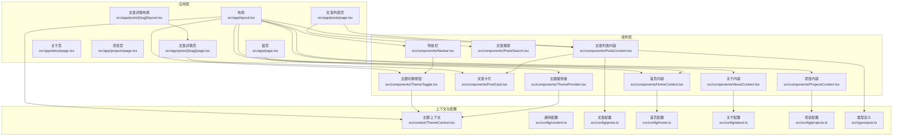
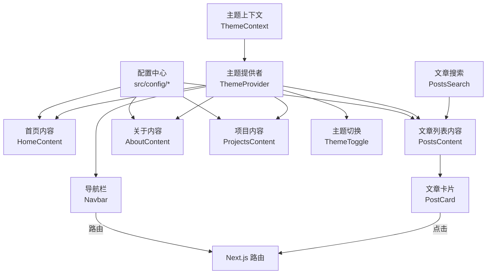
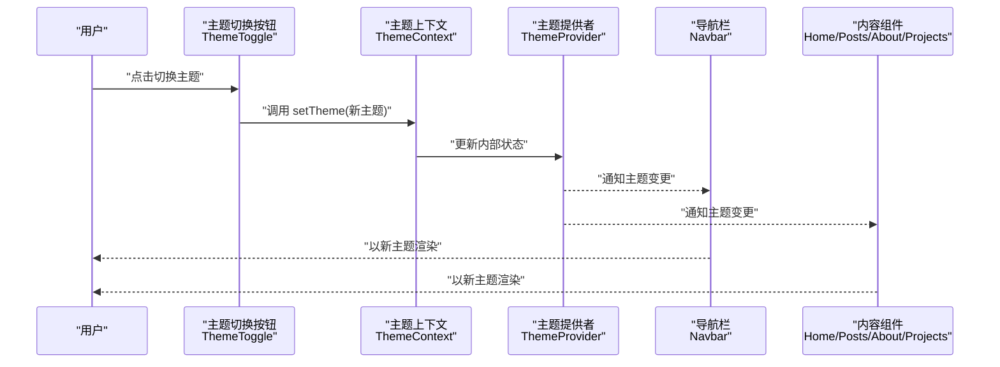
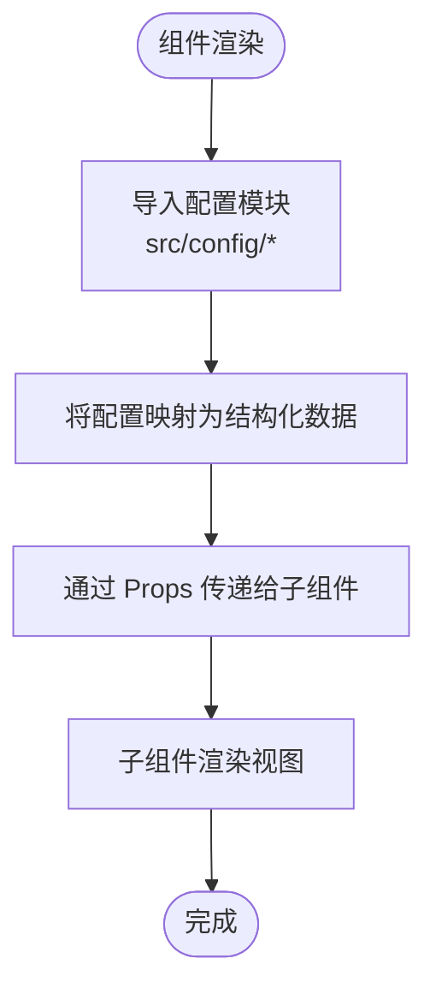
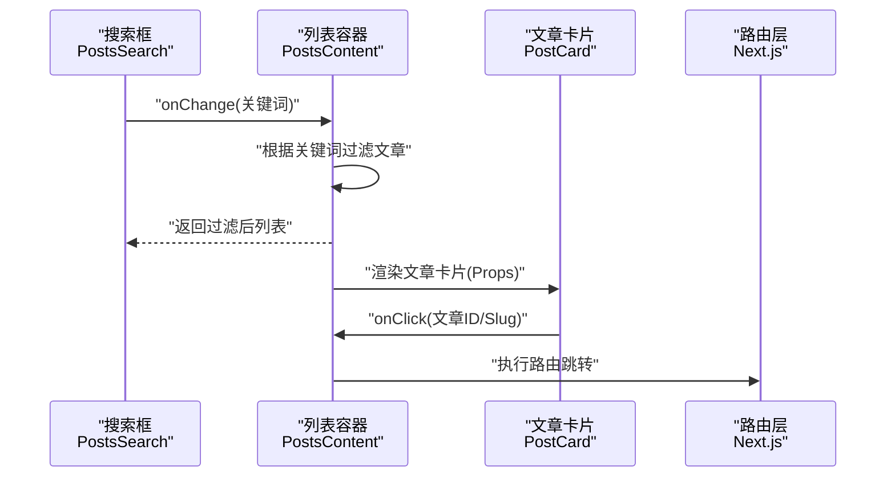
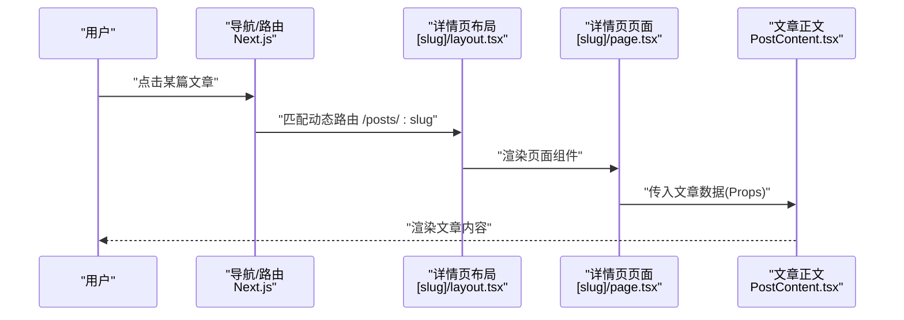
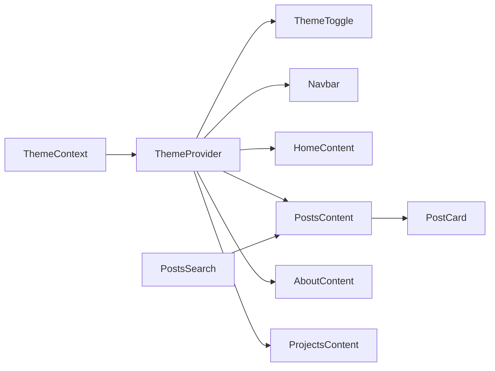

# 组件通信机制

<cite>
**本文引用的文件**   
- [src/app/layout.tsx](file://src/app/layout.tsx)
- [src/components/ThemeProvider.tsx](file://src/components/ThemeProvider.tsx)
- [src/context/ThemeContext.tsx](file://src/context/ThemeContext.tsx)
- [src/components/ThemeToggle.tsx](file://src/components/ThemeToggle.tsx)
- [src/components/Navbar.tsx](file://src/components/Navbar.tsx)
- [src/components/HomeContent.tsx](file://src/components/HomeContent.tsx)
- [src/components/PostsContent.tsx](file://src/components/PostsContent.tsx)
- [src/components/PostCard.tsx](file://src/components/PostCard.tsx)
- [src/components/PostsSearch.tsx](file://src/components/PostsSearch.tsx)
- [src/components/AboutContent.tsx](file://src/components/AboutContent.tsx)
- [src/components/ProjectsContent.tsx](file://src/components/ProjectsContent.tsx)
- [src/config/content.ts](file://src/config/content.ts)
- [src/config/posts.ts](file://src/config/posts.ts)
- [src/config/home.ts](file://src/config/home.ts)
- [src/config/about.ts](file://src/config/about.ts)
- [src/config/projects.ts](file://src/config/projects.ts)
- [src/types/post.ts](file://src/types/post.ts)
- [src/app/page.tsx](file://src/app/page.tsx)
- [src/app/posts/page.tsx](file://src/app/posts/page.tsx)
- [src/app/posts/[slug]/page.tsx](file://src/app/posts/[slug]/page.tsx)
- [src/app/posts/[slug]/layout.tsx](file://src/app/posts/[slug]/layout.tsx)
- [src/app/posts/[slug]/PostContent.tsx](file://src/app/posts/[slug]/PostContent.tsx)
</cite>

## 目录
1. [简介](#简介)
2. [项目结构](#项目结构)
3. [核心组件](#核心组件)
4. [架构总览](#架构总览)
5. [详细组件分析](#详细组件分析)
6. [依赖关系分析](#依赖关系分析)
7. [性能考虑](#性能考虑)
8. [故障排查指南](#故障排查指南)
9. [结论](#结论)
10. [附录](#附录)

## 简介
本文件聚焦于博客项目的“组件通信机制”，系统性阐述以下主题：
- React 组件间的数据传递与状态同步方式：Props 传递、事件回调、Context API、全局状态管理。
- 主题系统的实现原理与数据流（深色/浅色切换）。
- 配置驱动的开发模式与数据共享机制（集中式配置、类型约束、按需消费）。
- 异步数据获取与缓存策略（静态生成、客户端请求、缓存方案）。
- 架构图与时序图，帮助快速理解整体通信路径。
- 性能优化与内存泄漏防护的最佳实践。

## 项目结构
本项目采用 Next.js App Router 组织页面与布局，组件按功能划分在 src/components，主题上下文位于 src/context，配置集中在 src/config，类型定义位于 src/types。

图表来源
- [src/app/layout.tsx](file://src/app/layout.tsx)
- [src/components/Navbar.tsx](file://src/components/Navbar.tsx)
- [src/components/HomeContent.tsx](file://src/components/HomeContent.tsx)
- [src/components/PostsContent.tsx](file://src/components/PostsContent.tsx)
- [src/components/PostCard.tsx](file://src/components/PostCard.tsx)
- [src/components/PostsSearch.tsx](file://src/components/PostsSearch.tsx)
- [src/components/AboutContent.tsx](file://src/components/AboutContent.tsx)
- [src/components/ProjectsContent.tsx](file://src/components/ProjectsContent.tsx)
- [src/components/ThemeToggle.tsx](file://src/components/ThemeToggle.tsx)
- [src/components/ThemeProvider.tsx](file://src/components/ThemeProvider.tsx)
- [src/context/ThemeContext.tsx](file://src/context/ThemeContext.tsx)
- [src/config/content.ts](file://src/config/content.ts)
- [src/config/posts.ts](file://src/config/posts.ts)
- [src/config/home.ts](file://src/config/home.ts)
- [src/config/about.ts](file://src/config/about.ts)
- [src/config/projects.ts](file://src/config/projects.ts)
- [src/types/post.ts](file://src/types/post.ts)

章节来源
- [src/app/layout.tsx](file://src/app/layout.tsx)
- [src/app/page.tsx](file://src/app/page.tsx)
- [src/app/posts/page.tsx](file://src/app/posts/page.tsx)
- [src/app/posts/[slug]/layout.tsx](file://src/app/posts/[slug]/layout.tsx)
- [src/app/posts/[slug]/page.tsx](file://src/app/posts/[slug]/page.tsx)

## 核心组件
- 主题提供者与上下文
  - 职责：维护主题状态（如深色/浅色），提供切换能力，并通过 Context 向子树广播。
  - 关键接口：主题值对象、切换函数、订阅者消费。
  - 典型用法：在根布局包裹 Provider，子组件通过 Hook 读取与触发更新。
- 主题切换按钮
  - 职责：暴露 UI 交互，调用上下文提供的切换函数。
  - 通信方式：事件回调 + Context 消费。
- 导航栏
  - 职责：展示站点导航，可能包含主题开关入口。
  - 通信方式：接收路由信息（由 Next.js 注入），可选消费主题上下文以适配样式。
- 内容组件（首页、文章列表、关于、项目）
  - 职责：渲染页面主体内容，从配置模块或动态数据源获取数据。
  - 通信方式：Props 传入静态数据；若需用户交互（如搜索），使用本地状态或父级提升状态。
- 文章卡片
  - 职责：展示单篇文章摘要，支持点击跳转。
  - 通信方式：Props 传入文章元数据；点击事件回调交由父级处理路由跳转。
- 文章搜索
  - 职责：对文章列表进行过滤。
  - 通信方式：本地状态保存查询词；将过滤结果通过 Props 传递给列表容器。

章节来源
- [src/components/ThemeProvider.tsx](file://src/components/ThemeProvider.tsx)
- [src/context/ThemeContext.tsx](file://src/context/ThemeContext.tsx)
- [src/components/ThemeToggle.tsx](file://src/components/ThemeToggle.tsx)
- [src/components/Navbar.tsx](file://src/components/Navbar.tsx)
- [src/components/HomeContent.tsx](file://src/components/HomeContent.tsx)
- [src/components/PostsContent.tsx](file://src/components/PostsContent.tsx)
- [src/components/PostCard.tsx](file://src/components/PostCard.tsx)
- [src/components/PostsSearch.tsx](file://src/components/PostsSearch.tsx)
- [src/components/AboutContent.tsx](file://src/components/AboutContent.tsx)
- [src/components/ProjectsContent.tsx](file://src/components/ProjectsContent.tsx)

## 架构总览
下图展示了“配置驱动 + 上下文 + 组件通信”的整体协作关系。

图表来源
- [src/config/content.ts](file://src/config/content.ts)
- [src/config/posts.ts](file://src/config/posts.ts)
- [src/config/home.ts](file://src/config/home.ts)
- [src/config/about.ts](file://src/config/about.ts)
- [src/config/projects.ts](file://src/config/projects.ts)
- [src/components/ThemeProvider.tsx](file://src/components/ThemeProvider.tsx)
- [src/context/ThemeContext.tsx](file://src/context/ThemeContext.tsx)
- [src/components/Navbar.tsx](file://src/components/Navbar.tsx)
- [src/components/ThemeToggle.tsx](file://src/components/ThemeToggle.tsx)
- [src/components/HomeContent.tsx](file://src/components/HomeContent.tsx)
- [src/components/PostsContent.tsx](file://src/components/PostsContent.tsx)
- [src/components/PostCard.tsx](file://src/components/PostCard.tsx)
- [src/components/PostsSearch.tsx](file://src/components/PostsSearch.tsx)
- [src/components/AboutContent.tsx](file://src/components/AboutContent.tsx)
- [src/components/ProjectsContent.tsx](file://src/components/ProjectsContent.tsx)

## 详细组件分析

### 主题系统（Provider/Context/Toggle）
- 设计要点
  - 单一事实来源：主题状态仅存在于 Context 中，避免多处重复状态导致不一致。
  - 最小化重渲染：将切换函数与当前主题值合并到稳定的对象，减少不必要的消费者重渲染。
  - 持久化：可结合浏览器存储实现主题偏好持久化（可选增强）。
- 数据流
  - 用户在 ThemeToggle 触发切换 -> 调用 Context 提供的 setter -> Provider 更新状态 -> 所有订阅者（包括 Navbar、各内容组件）收到新主题并重新渲染。
- 时序图

图表来源
- [src/components/ThemeToggle.tsx](file://src/components/ThemeToggle.tsx)
- [src/context/ThemeContext.tsx](file://src/context/ThemeContext.tsx)
- [src/components/ThemeProvider.tsx](file://src/components/ThemeProvider.tsx)
- [src/components/Navbar.tsx](file://src/components/Navbar.tsx)
- [src/components/HomeContent.tsx](file://src/components/HomeContent.tsx)
- [src/components/PostsContent.tsx](file://src/components/PostsContent.tsx)
- [src/components/AboutContent.tsx](file://src/components/AboutContent.tsx)
- [src/components/ProjectsContent.tsx](file://src/components/ProjectsContent.tsx)

章节来源
- [src/components/ThemeProvider.tsx](file://src/components/ThemeProvider.tsx)
- [src/context/ThemeContext.tsx](file://src/context/ThemeContext.tsx)
- [src/components/ThemeToggle.tsx](file://src/components/ThemeToggle.tsx)
- [src/components/Navbar.tsx](file://src/components/Navbar.tsx)

### 配置驱动的内容渲染
- 设计要点
  - 集中式配置：将文案、链接、文章元信息等放入 src/config，便于维护与多语言扩展。
  - 类型约束：通过 src/types 保证数据结构稳定，降低运行时错误。
  - 按需消费：各页面组件只引入所需配置，避免无关依赖。
- 数据流
  - 页面组件在渲染时导入对应配置 -> 映射为 JSX -> 通过 Props 下发给子组件（如 PostCard）。
- 流程图

图表来源
- [src/config/home.ts](file://src/config/home.ts)
- [src/config/posts.ts](file://src/config/posts.ts)
- [src/config/about.ts](file://src/config/about.ts)
- [src/config/projects.ts](file://src/config/projects.ts)
- [src/types/post.ts](file://src/types/post.ts)
- [src/components/HomeContent.tsx](file://src/components/HomeContent.tsx)
- [src/components/PostsContent.tsx](file://src/components/PostsContent.tsx)
- [src/components/PostCard.tsx](file://src/components/PostCard.tsx)
- [src/components/AboutContent.tsx](file://src/components/AboutContent.tsx)
- [src/components/ProjectsContent.tsx](file://src/components/ProjectsContent.tsx)

章节来源
- [src/config/content.ts](file://src/config/content.ts)
- [src/config/posts.ts](file://src/config/posts.ts)
- [src/config/home.ts](file://src/config/home.ts)
- [src/config/about.ts](file://src/config/about.ts)
- [src/config/projects.ts](file://src/config/projects.ts)
- [src/types/post.ts](file://src/types/post.ts)
- [src/components/HomeContent.tsx](file://src/components/HomeContent.tsx)
- [src/components/PostsContent.tsx](file://src/components/PostsContent.tsx)
- [src/components/PostCard.tsx](file://src/components/PostCard.tsx)
- [src/components/AboutContent.tsx](file://src/components/AboutContent.tsx)
- [src/components/ProjectsContent.tsx](file://src/components/ProjectsContent.tsx)

### 文章列表与搜索（父子通信）
- 设计要点
  - 搜索输入在 PostsSearch 中维护本地状态，将过滤后的结果通过 Props 回传给 PostsContent。
  - PostsContent 负责将文章数据映射为多个 PostCard，并将点击事件回调上抛至页面层处理路由跳转。
- 时序图

图表来源
- [src/components/PostsSearch.tsx](file://src/components/PostsSearch.tsx)
- [src/components/PostsContent.tsx](file://src/components/PostsContent.tsx)
- [src/components/PostCard.tsx](file://src/components/PostCard.tsx)
- [src/app/posts/page.tsx](file://src/app/posts/page.tsx)

章节来源
- [src/components/PostsSearch.tsx](file://src/components/PostsSearch.tsx)
- [src/components/PostsContent.tsx](file://src/components/PostsContent.tsx)
- [src/components/PostCard.tsx](file://src/components/PostCard.tsx)
- [src/app/posts/page.tsx](file://src/app/posts/page.tsx)

### 文章详情页（布局与内容）
- 设计要点
  - 使用 Next.js 动态路由 [slug] 解析文章标识。
  - layout.tsx 负责包裹公共区域（如导航、主题等），page.tsx 负责加载文章数据并渲染 PostContent。
- 时序图

图表来源
- [src/app/posts/[slug]/layout.tsx](file://src/app/posts/[slug]/layout.tsx)
- [src/app/posts/[slug]/page.tsx](file://src/app/posts/[slug]/page.tsx)
- [src/app/posts/[slug]/PostContent.tsx](file://src/app/posts/[slug]/PostContent.tsx)

章节来源
- [src/app/posts/[slug]/layout.tsx](file://src/app/posts/[slug]/layout.tsx)
- [src/app/posts/[slug]/page.tsx](file://src/app/posts/[slug]/page.tsx)
- [src/app/posts/[slug]/PostContent.tsx](file://src/app/posts/[slug]/PostContent.tsx)

## 依赖关系分析
- 组件耦合度
  - 主题系统通过 Context 解耦，任意层级均可消费，耦合度低。
  - 列表与卡片之间通过 Props 和回调通信，职责清晰，易于测试。
- 外部依赖
  - Next.js 路由与页面生命周期用于数据获取与导航。
  - Tailwind CSS 配合主题类名实现样式切换（可选）。
- 潜在循环依赖
  - 当前结构未出现循环引用；建议保持配置与组件单向依赖。

图表来源
- [src/context/ThemeContext.tsx](file://src/context/ThemeContext.tsx)
- [src/components/ThemeProvider.tsx](file://src/components/ThemeProvider.tsx)
- [src/components/ThemeToggle.tsx](file://src/components/ThemeToggle.tsx)
- [src/components/Navbar.tsx](file://src/components/Navbar.tsx)
- [src/components/HomeContent.tsx](file://src/components/HomeContent.tsx)
- [src/components/PostsContent.tsx](file://src/components/PostsContent.tsx)
- [src/components/PostCard.tsx](file://src/components/PostCard.tsx)
- [src/components/PostsSearch.tsx](file://src/components/PostsSearch.tsx)
- [src/components/AboutContent.tsx](file://src/components/AboutContent.tsx)
- [src/components/ProjectsContent.tsx](file://src/components/ProjectsContent.tsx)

章节来源
- [src/context/ThemeContext.tsx](file://src/context/ThemeContext.tsx)
- [src/components/ThemeProvider.tsx](file://src/components/ThemeProvider.tsx)
- [src/components/ThemeToggle.tsx](file://src/components/ThemeToggle.tsx)
- [src/components/Navbar.tsx](file://src/components/Navbar.tsx)
- [src/components/HomeContent.tsx](file://src/components/HomeContent.tsx)
- [src/components/PostsContent.tsx](file://src/components/PostsContent.tsx)
- [src/components/PostCard.tsx](file://src/components/PostCard.tsx)
- [src/components/PostsSearch.tsx](file://src/components/PostsSearch.tsx)
- [src/components/AboutContent.tsx](file://src/components/AboutContent.tsx)
- [src/components/ProjectsContent.tsx](file://src/components/ProjectsContent.tsx)

## 性能考虑
- 减少不必要重渲染
  - 将频繁变化的回调用 useMemo/useCallback 稳定化，避免子组件因引用变化而重渲染。
  - 拆分细粒度组件，使局部状态变更影响范围最小化。
- 列表渲染优化
  - 为列表项提供稳定的 key，避免无意义重建。
  - 大数据量场景下考虑虚拟滚动或分页。
- 主题切换优化
  - 将主题值与 setter 合并为单一对象，减少订阅者数量。
  - 必要时对主题相关样式做懒加载或按需注入。
- 内存泄漏防护
  - 在 useEffect 中清理定时器、事件监听器与订阅。
  - 取消未完成的网络请求（AbortController）。
  - 避免在组件卸载后更新状态（检查 isMounted 或使用忽略已卸载状态的封装）。
- 首屏与缓存
  - 静态页面优先使用 Next.js 的静态生成与增量再生成。
  - 客户端数据请求使用 SWR/React Query 等库实现请求去重、缓存与后台刷新。

## 故障排查指南
- 主题不生效
  - 确认 Provider 是否包裹了需要主题的组件树。
  - 检查是否在服务端渲染阶段访问了浏览器专属 API（如 localStorage）。
- 搜索无效
  - 核对搜索输入 onChange 是否正确触发并更新父级状态。
  - 检查过滤逻辑边界条件（空字符串、大小写、特殊字符）。
- 文章跳转失败
  - 校验 slug 是否与路由参数一致。
  - 确认详情页是否存在且正确接收 props。
- 性能问题定位
  - 使用 React DevTools Profiler 观察重渲染热点。
  - 检查是否有大对象作为 props 直接传递，考虑浅比较或拆分。

章节来源
- [src/components/ThemeToggle.tsx](file://src/components/ThemeToggle.tsx)
- [src/components/PostsSearch.tsx](file://src/components/PostsSearch.tsx)
- [src/components/PostsContent.tsx](file://src/components/PostsContent.tsx)
- [src/app/posts/[slug]/page.tsx](file://src/app/posts/[slug]/page.tsx)

## 结论
本项目通过“配置驱动 + Context 主题 + Props/回调通信”的组合，实现了清晰的组件分层与数据流向。主题系统独立且可复用，内容渲染基于集中式配置，保证了可维护性与可扩展性。在此基础上，可通过引入更完善的缓存与请求管理方案进一步提升性能与用户体验。

## 附录
- 术语说明
  - Props：父组件向子组件传递的数据与行为。
  - Context：跨层级共享的全局状态与能力。
  - 回调：子组件向父组件上报事件的方式。
  - 静态生成：构建期预渲染页面以提升首屏性能。
- 最佳实践清单
  - 单一事实来源：全局状态尽量收敛到 Context 或状态库。
  - 明确数据边界：组件只关心自身需要的数据，避免过度耦合。
  - 可测试性：将业务逻辑与 UI 分离，便于单元测试。
  - 渐进增强：先确保基础通信正确，再逐步引入缓存与并发控制。