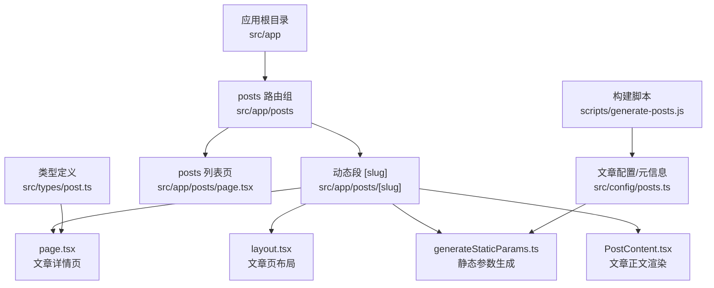
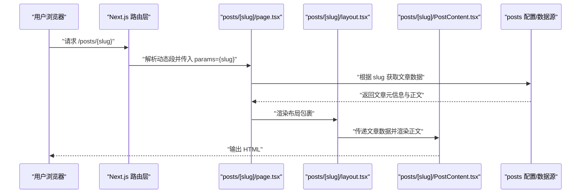
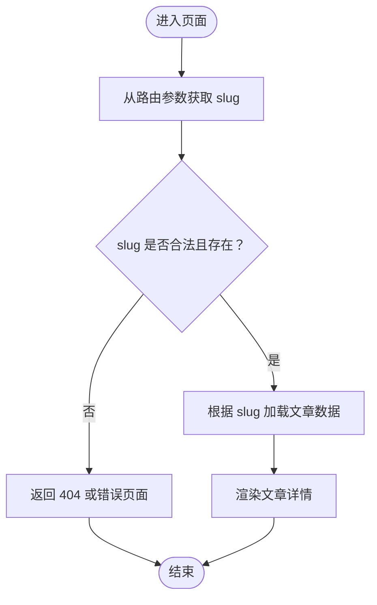
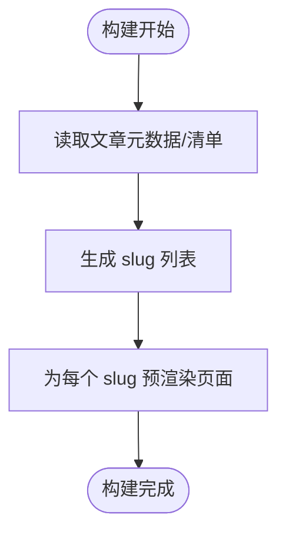
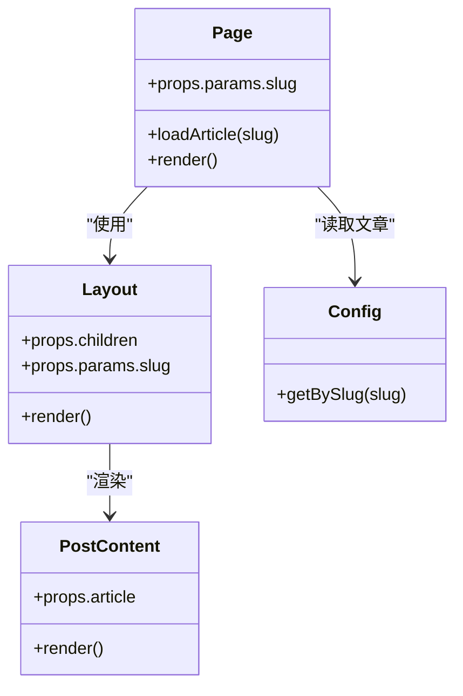
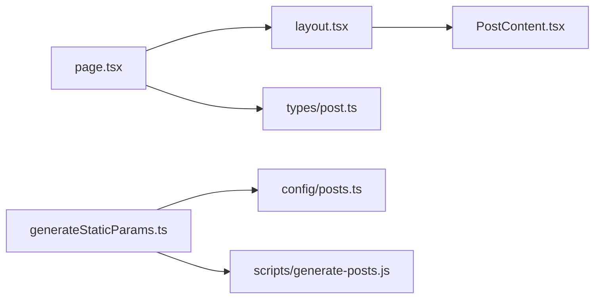

# 动态路由处理

<cite>
**本文引用的文件**   
- [src/app/posts/[slug]/page.tsx](file://src/app/posts/[slug]/page.tsx)
- [src/app/posts/[slug]/layout.tsx](file://src/app/posts/[slug]/layout.tsx)
- [src/app/posts/[slug]/generateStaticParams.ts](file://src/app/posts/[slug]/generateStaticParams.ts)
- [src/app/posts/[slug]/PostContent.tsx](file://src/app/posts/[slug]/PostContent.tsx)
- [src/app/posts/page.tsx](file://src/app/posts/page.tsx)
- [src/types/post.ts](file://src/types/post.ts)
- [src/config/posts.ts](file://src/config/posts.ts)
- [scripts/generate-posts.js](file://scripts/generate-posts.js)
</cite>

## 目录
1. [简介](#简介)
2. [项目结构](#项目结构)
3. [核心组件](#核心组件)
4. [架构总览](#架构总览)
5. [详细组件分析](#详细组件分析)
6. [依赖分析](#依赖分析)
7. [性能考虑](#性能考虑)
8. [故障排查指南](#故障排查指南)
9. [结论](#结论)
10. [附录](#附录)

## 简介
本文件聚焦于博客项目的动态路由处理，围绕 Next.js App Router 的方括号语法 [slug] 展开，系统阐述其实现原理、参数获取与校验、静态生成优化（generateStaticParams）、类型定义与安全验证策略，并提供文章详情页面的完整实现示例。同时给出性能与缓存建议、错误处理与 404 页面定制方案，帮助读者在生产环境中稳定高效地运行动态内容路由。

## 项目结构
本项目采用基于文件系统的路由约定：
- 动态段使用方括号命名，例如 posts/[slug] 表示“文章列表”下的任意 slug 路径。
- 每个动态段目录下可包含 page.tsx、layout.tsx、generateStaticParams.ts 等文件，分别负责渲染、布局与静态参数生成。
- 文章数据来源于 Markdown 文件与配置，构建期通过脚本生成或读取配置以产出静态参数。

图表来源
- [src/app/posts/[slug]/page.tsx](file://src/app/posts/[slug]/page.tsx)
- [src/app/posts/[slug]/layout.tsx](file://src/app/posts/[slug]/layout.tsx)
- [src/app/posts/[slug]/generateStaticParams.ts](file://src/app/posts/[slug]/generateStaticParams.ts)
- [src/app/posts/[slug]/PostContent.tsx](file://src/app/posts/[slug]/PostContent.tsx)
- [src/app/posts/page.tsx](file://src/app/posts/page.tsx)
- [src/types/post.ts](file://src/types/post.ts)
- [src/config/posts.ts](file://src/config/posts.ts)
- [scripts/generate-posts.js](file://scripts/generate-posts.js)

章节来源
- [src/app/posts/[slug]/page.tsx](file://src/app/posts/[slug]/page.tsx)
- [src/app/posts/[slug]/layout.tsx](file://src/app/posts/[slug]/layout.tsx)
- [src/app/posts/[slug]/generateStaticParams.ts](file://src/app/posts/[slug]/generateStaticParams.ts)
- [src/app/posts/[slug]/PostContent.tsx](file://src/app/posts/[slug]/PostContent.tsx)
- [src/app/posts/page.tsx](file://src/app/posts/page.tsx)
- [src/types/post.ts](file://src/types/post.ts)
- [src/config/posts.ts](file://src/config/posts.ts)
- [scripts/generate-posts.js](file://scripts/generate-posts.js)

## 核心组件
- 动态路由段 [slug]
  - 作用：匹配 /posts/{任意字符串} 形式的 URL，将 {任意字符串} 作为 slug 参数注入到该目录下的组件中。
  - 典型用法：在 page.tsx 中通过路由对象获取 params.slug，并据此加载对应文章内容。
- 静态参数生成 generateStaticParams
  - 作用：在构建时返回所有可能的 slug 列表，使 Next.js 预渲染对应的文章详情页，提升首屏性能与 SEO。
  - 数据来源：通常来自文章清单配置或构建脚本生成的元数据。
- 文章详情页 page.tsx
  - 职责：接收 slug，解析并渲染文章标题、正文、元信息等；必要时进行参数校验与错误处理。
- 文章布局 layout.tsx
  - 职责：为文章详情页提供统一骨架（导航、侧边栏、面包屑等），并可复用加载状态与错误边界。
- 文章正文 PostContent.tsx
  - 职责：根据解析后的文章数据渲染富文本内容，支持主题切换、代码高亮等。

章节来源
- [src/app/posts/[slug]/page.tsx](file://src/app/posts/[slug]/page.tsx)
- [src/app/posts/[slug]/layout.tsx](file://src/app/posts/[slug]/layout.tsx)
- [src/app/posts/[slug]/generateStaticParams.ts](file://src/app/posts/[slug]/generateStaticParams.ts)
- [src/app/posts/[slug]/PostContent.tsx](file://src/app/posts/[slug]/PostContent.tsx)

## 架构总览
下图展示了从浏览器访问到文章渲染的关键流程，包括静态参数生成、路由匹配、参数获取与渲染。

图表来源
- [src/app/posts/[slug]/page.tsx](file://src/app/posts/[slug]/page.tsx)
- [src/app/posts/[slug]/layout.tsx](file://src/app/posts/[slug]/layout.tsx)
- [src/app/posts/[slug]/PostContent.tsx](file://src/app/posts/[slug]/PostContent.tsx)
- [src/config/posts.ts](file://src/config/posts.ts)

## 详细组件分析

### 方括号语法 [slug] 的实现原理与使用方法
- 原理
  - Next.js App Router 将文件名中的方括号视为动态段，[slug] 会捕获路径中对应位置的片段作为参数。
  - 在运行时，路由对象会将 params 注入到该目录下的组件函数中，其中 params.slug 即为匹配的字符串。
- 使用方法
  - 在 page.tsx 中解构 params 并使用 params.slug 定位文章。
  - 在 layout.tsx 中同样可以读取 params，用于面包屑、标题或上下文共享。
  - 在 generateStaticParams.ts 中返回所有可能的 slug 值，驱动构建期预渲染。

章节来源
- [src/app/posts/[slug]/page.tsx](file://src/app/posts/[slug]/page.tsx)
- [src/app/posts/[slug]/layout.tsx](file://src/app/posts/[slug]/layout.tsx)
- [src/app/posts/[slug]/generateStaticParams.ts](file://src/app/posts/[slug]/generateStaticParams.ts)

### 动态参数在页面组件中的获取与验证
- 获取方式
  - 在 page.tsx 和 layout.tsx 中通过 props.params 获取 slug。
- 验证建议
  - 对 slug 进行基础格式校验（如仅允许字母、数字、连字符）。
  - 检查 slug 是否存在于文章清单中，不存在则返回 404。
  - 若需要更严格的安全策略，可对输入做白名单过滤与长度限制。

图表来源
- [src/app/posts/[slug]/page.tsx](file://src/app/posts/[slug]/page.tsx)

章节来源
- [src/app/posts/[slug]/page.tsx](file://src/app/posts/[slug]/page.tsx)

### generateStaticParams 的作用与静态生成优化
- 作用
  - 在构建阶段返回所有可能的 slug 数组，Next.js 会为每个 slug 预渲染一个静态页面。
- 数据来源
  - 可从文章配置或构建脚本产物中读取，确保与真实文章集合一致。
- 优化点
  - 减少首次访问时的服务器端渲染开销。
  - 提升 SEO 与首屏性能。
  - 结合 CDN 缓存可获得更好的全局分发效果。

图表来源
- [src/app/posts/[slug]/generateStaticParams.ts](file://src/app/posts/[slug]/generateStaticParams.ts)
- [src/config/posts.ts](file://src/config/posts.ts)
- [scripts/generate-posts.js](file://scripts/generate-posts.js)

章节来源
- [src/app/posts/[slug]/generateStaticParams.ts](file://src/app/posts/[slug]/generateStaticParams.ts)
- [src/config/posts.ts](file://src/config/posts.ts)
- [scripts/generate-posts.js](file://scripts/generate-posts.js)

### 路由参数的类型定义与安全验证
- 类型定义
  - 建议在 types/post.ts 中定义文章数据结构与路由参数类型，确保 TypeScript 能正确推断 params.slug 的类型。
- 安全验证
  - 对 slug 进行白名单校验，避免非法字符与路径穿越风险。
  - 对文章数据进行最小化暴露，避免泄露敏感字段。
  - 在渲染前进行完整性校验（如必填字段存在性检查）。

章节来源
- [src/types/post.ts](file://src/types/post.ts)
- [src/app/posts/[slug]/page.tsx](file://src/app/posts/[slug]/page.tsx)

### 文章详情页面的完整实现示例
以下为一个完整的文章详情页实现要点说明（不包含具体代码）：
- 路由与参数
  - 在 page.tsx 中从 params 获取 slug，并进行基础校验。
- 数据加载
  - 根据 slug 从配置或数据源中查找文章元信息与正文。
- 渲染逻辑
  - 在 layout.tsx 中提供统一的页面框架。
  - 在 PostContent.tsx 中渲染标题、摘要、正文、标签等。
- 错误与 404
  - 当 slug 不存在或数据缺失时，返回 404 或自定义错误页面。
- 静态生成
  - 在 generateStaticParams.ts 中导出所有 slug，驱动构建期预渲染。

图表来源
- [src/app/posts/[slug]/page.tsx](file://src/app/posts/[slug]/page.tsx)
- [src/app/posts/[slug]/layout.tsx](file://src/app/posts/[slug]/layout.tsx)
- [src/app/posts/[slug]/PostContent.tsx](file://src/app/posts/[slug]/PostContent.tsx)
- [src/config/posts.ts](file://src/config/posts.ts)

章节来源
- [src/app/posts/[slug]/page.tsx](file://src/app/posts/[slug]/page.tsx)
- [src/app/posts/[slug]/layout.tsx](file://src/app/posts/[slug]/layout.tsx)
- [src/app/posts/[slug]/PostContent.tsx](file://src/app/posts/[slug]/PostContent.tsx)
- [src/config/posts.ts](file://src/config/posts.ts)

## 依赖分析
- 模块关系
  - page.tsx 依赖 layout.tsx 与 PostContent.tsx 完成页面渲染。
  - generateStaticParams.ts 依赖文章配置或构建脚本产物，保证静态参数与实际文章一致。
  - 类型定义 post.ts 被各组件引用，保障类型安全。
- 外部依赖
  - 构建脚本 generate-posts.js 可能用于生成或同步文章清单，供 generateStaticParams 使用。

图表来源
- [src/app/posts/[slug]/page.tsx](file://src/app/posts/[slug]/page.tsx)
- [src/app/posts/[slug]/layout.tsx](file://src/app/posts/[slug]/layout.tsx)
- [src/app/posts/[slug]/PostContent.tsx](file://src/app/posts/[slug]/PostContent.tsx)
- [src/app/posts/[slug]/generateStaticParams.ts](file://src/app/posts/[slug]/generateStaticParams.ts)
- [src/types/post.ts](file://src/types/post.ts)
- [src/config/posts.ts](file://src/config/posts.ts)
- [scripts/generate-posts.js](file://scripts/generate-posts.js)

章节来源
- [src/app/posts/[slug]/page.tsx](file://src/app/posts/[slug]/page.tsx)
- [src/app/posts/[slug]/layout.tsx](file://src/app/posts/[slug]/layout.tsx)
- [src/app/posts/[slug]/PostContent.tsx](file://src/app/posts/[slug]/PostContent.tsx)
- [src/app/posts/[slug]/generateStaticParams.ts](file://src/app/posts/[slug]/generateStaticParams.ts)
- [src/types/post.ts](file://src/types/post.ts)
- [src/config/posts.ts](file://src/config/posts.ts)
- [scripts/generate-posts.js](file://scripts/generate-posts.js)

## 性能考虑
- 静态生成优先
  - 使用 generateStaticParams 预渲染所有文章详情页，降低运行时成本。
- 数据加载优化
  - 在构建期聚合文章元数据，避免运行时重复 IO。
  - 对大体积正文按需懒加载或分块渲染。
- 缓存策略
  - 利用 Next.js 内置缓存与 CDN 缓存，合理设置响应头与过期时间。
  - 对频繁访问的文章详情页启用强缓存，对更新频率高的内容使用短缓存或增量再生成。
- 资源优化
  - 图片与媒体资源使用现代格式与压缩，配合懒加载与占位图。
  - 代码分割与按需引入，减小包体。

## 故障排查指南
- 常见问题
  - 404 页面未生效：确认动态路由下是否正确处理不存在的 slug，并确保 404 页面位于合适位置。
  - 静态参数缺失：检查 generateStaticParams 的数据源是否与真实文章一致。
  - 类型错误：确认 types/post.ts 的定义与组件使用的字段一致。
- 调试建议
  - 在 page.tsx 中打印或记录 params 与加载结果，快速定位问题。
  - 在 layout.tsx 中添加通用错误边界，捕获渲染异常并展示友好提示。
- 错误处理
  - 对数据缺失、解析失败、网络异常等情况进行统一处理，返回合适的状态码与用户提示。

章节来源
- [src/app/posts/[slug]/page.tsx](file://src/app/posts/[slug]/page.tsx)
- [src/app/posts/[slug]/layout.tsx](file://src/app/posts/[slug]/layout.tsx)

## 结论
通过方括号语法 [slug] 与 generateStaticParams，本项目实现了高效、可扩展的动态路由体系。结合严格的类型定义与安全校验、合理的缓存与性能优化策略，以及完善的错误处理与 404 定制方案，能够在生产环境中提供稳定、快速的阅读体验。

## 附录
- 相关页面与组件
  - 文章列表页：src/app/posts/page.tsx
  - 文章详情页：src/app/posts/[slug]/page.tsx
  - 文章布局：src/app/posts/[slug]/layout.tsx
  - 文章正文：src/app/posts/[slug]/PostContent.tsx
  - 静态参数生成：src/app/posts/[slug]/generateStaticParams.ts
  - 类型定义：src/types/post.ts
  - 文章配置：src/config/posts.ts
  - 构建脚本：scripts/generate-posts.js