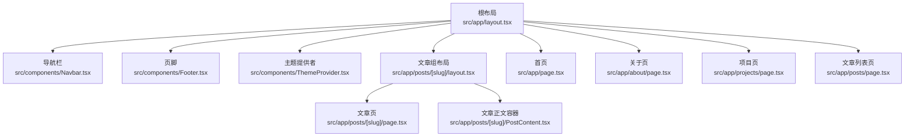
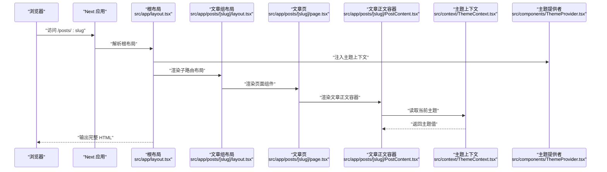
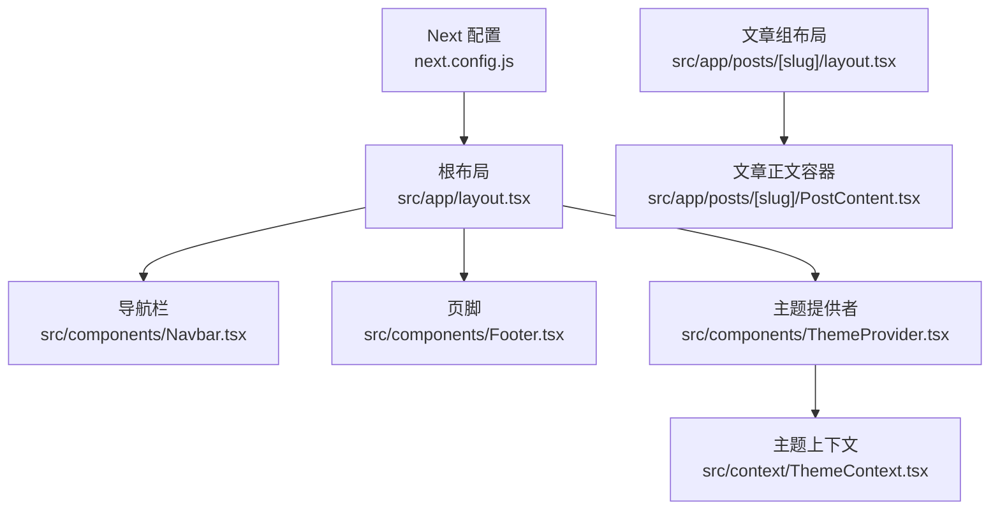

# 布局系统架构

<cite>
**本文引用的文件**   
- [src/app/layout.tsx](file://src/app/layout.tsx)
- [src/app/posts/[slug]/layout.tsx](file://src/app/posts/[slug]/layout.tsx)
- [src/components/Navbar.tsx](file://src/components/Navbar.tsx)
- [src/components/Footer.tsx](file://src/components/Footer.tsx)
- [src/context/ThemeContext.tsx](file://src/context/ThemeContext.tsx)
- [src/components/ThemeProvider.tsx](file://src/components/ThemeProvider.tsx)
- [src/components/ThemeToggle.tsx](file://src/components/ThemeToggle.tsx)
- [src/app/page.tsx](file://src/app/page.tsx)
- [src/app/about/page.tsx](file://src/app/about/page.tsx)
- [src/app/projects/page.tsx](file://src/app/projects/page.tsx)
- [src/app/posts/page.tsx](file://src/app/posts/page.tsx)
- [src/app/posts/[slug]/page.tsx](file://src/app/posts/[slug]/page.tsx)
- [src/app/posts/[slug]/PostContent.tsx](file://src/app/posts/[slug]/PostContent.tsx)
- [next.config.js](file://next.config.js)
</cite>

## 目录
1. [简介](#简介)
2. [项目结构](#项目结构)
3. [核心组件](#核心组件)
4. [架构总览](#架构总览)
5. [详细组件分析](#详细组件分析)
6. [依赖关系分析](#依赖关系分析)
7. [性能考虑](#性能考虑)
8. [故障排查指南](#故障排查指南)
9. [结论](#结论)
10. [附录](#附录)

## 简介
本文件聚焦博客项目的布局系统，系统性阐述根布局与嵌套布局的结构、数据传递机制、全局组件集成方式、布局间的数据共享与状态管理、布局重用模式与性能优化、布局切换与条件渲染的实现，以及自定义布局的最佳实践与扩展指南。文档以 Next.js App Router 的布局约定为基础，结合项目中实际的路由与组件组织进行说明。

## 项目结构
本项目采用基于路由分组的布局策略：
- 根布局位于应用根目录，负责包裹全站通用元素（如导航栏、页脚、主题上下文等）。
- 功能模块通过各自的路由分组提供局部布局，例如文章详情页在 posts 路由组内定义自己的布局，用于承载文章特有的侧边信息或交互。
- 页面级组件仅负责内容渲染，布局层负责结构与全局装配。

图表来源
- [src/app/layout.tsx](file://src/app/layout.tsx)
- [src/app/posts/[slug]/layout.tsx](file://src/app/posts/[slug]/layout.tsx)
- [src/components/Navbar.tsx](file://src/components/Navbar.tsx)
- [src/components/Footer.tsx](file://src/components/Footer.tsx)
- [src/components/ThemeProvider.tsx](file://src/components/ThemeProvider.tsx)
- [src/app/page.tsx](file://src/app/page.tsx)
- [src/app/about/page.tsx](file://src/app/about/page.tsx)
- [src/app/projects/page.tsx](file://src/app/projects/page.tsx)
- [src/app/posts/page.tsx](file://src/app/posts/page.tsx)
- [src/app/posts/[slug]/page.tsx](file://src/app/posts/[slug]/page.tsx)
- [src/app/posts/[slug]/PostContent.tsx](file://src/app/posts/[slug]/PostContent.tsx)

章节来源
- [src/app/layout.tsx](file://src/app/layout.tsx)
- [src/app/posts/[slug]/layout.tsx](file://src/app/posts/[slug]/layout.tsx)
- [src/components/Navbar.tsx](file://src/components/Navbar.tsx)
- [src/components/Footer.tsx](file://src/components/Footer.tsx)
- [src/components/ThemeProvider.tsx](file://src/components/ThemeProvider.tsx)
- [src/app/page.tsx](file://src/app/page.tsx)
- [src/app/about/page.tsx](file://src/app/about/page.tsx)
- [src/app/projects/page.tsx](file://src/app/projects/page.tsx)
- [src/app/posts/page.tsx](file://src/app/posts/page.tsx)
- [src/app/posts/[slug]/page.tsx](file://src/app/posts/[slug]/page.tsx)
- [src/app/posts/[slug]/PostContent.tsx](file://src/app/posts/[slug]/PostContent.tsx)

## 核心组件
- 根布局组件
  - 职责：挂载全局 UI（导航栏、页脚）、注入全局状态（主题）、渲染 children（子路由树）。
  - 数据传递：通过 React Context 向后代组件提供主题状态；通过 props.children 将路由内容注入到布局中。
- 文章组布局
  - 职责：为文章详情路由提供额外的结构（例如侧边栏、元信息区域），并复用根布局的全局能力。
  - 数据传递：接收来自路由参数的动态数据（如 slug），并将其传递给文章正文容器。
- 全局组件
  - 导航栏：作为根布局的子节点常驻，负责站点导航与入口。
  - 页脚：作为根布局的子节点常驻，展示站点信息与版权。
- 主题相关
  - 主题提供者：封装主题状态与切换逻辑，供全局使用。
  - 主题切换按钮：在任意位置触发主题切换。

章节来源
- [src/app/layout.tsx](file://src/app/layout.tsx)
- [src/app/posts/[slug]/layout.tsx](file://src/app/posts/[slug]/layout.tsx)
- [src/components/Navbar.tsx](file://src/components/Navbar.tsx)
- [src/components/Footer.tsx](file://src/components/Footer.tsx)
- [src/components/ThemeProvider.tsx](file://src/components/ThemeProvider.tsx)
- [src/components/ThemeToggle.tsx](file://src/components/ThemeToggle.tsx)

## 架构总览
下图展示了从浏览器请求到最终渲染的布局层次与数据流向，包括根布局与文章组布局的嵌套关系，以及全局组件与主题上下文的集成点。

图表来源
- [src/app/layout.tsx](file://src/app/layout.tsx)
- [src/app/posts/[slug]/layout.tsx](file://src/app/posts/[slug]/layout.tsx)
- [src/app/posts/[slug]/page.tsx](file://src/app/posts/[slug]/page.tsx)
- [src/app/posts/[slug]/PostContent.tsx](file://src/app/posts/[slug]/PostContent.tsx)
- [src/context/ThemeContext.tsx](file://src/context/ThemeContext.tsx)
- [src/components/ThemeProvider.tsx](file://src/components/ThemeProvider.tsx)

## 详细组件分析

### 根布局组件
- 结构要点
  - 作为所有页面的外层容器，确保导航栏与页脚在全站可见。
  - 通过主题提供者包裹整个应用，使主题状态可被任意后代组件消费。
  - 使用 children 占位符渲染具体路由页面。
- 数据传递机制
  - 通过 Context 提供主题状态，避免逐层 prop 透传。
  - 通过路由参数与布局组合，将动态数据（如文章 slug）向下传递至页面与内容组件。
- 条件渲染与布局切换
  - 可在根布局中根据路由路径或查询参数决定显示/隐藏某些全局区块（例如仅在特定页面显示额外横幅）。
  - 推荐将条件判断集中在布局层，保持页面组件专注内容。
- 性能考量
  - 将稳定的全局组件（导航栏、页脚）置于根布局，减少重复创建开销。
  - 对主题状态更新进行必要的节流或记忆化，避免不必要的重渲染。

章节来源
- [src/app/layout.tsx](file://src/app/layout.tsx)
- [src/components/ThemeProvider.tsx](file://src/components/ThemeProvider.tsx)
- [src/context/ThemeContext.tsx](file://src/context/ThemeContext.tsx)

### 文章组布局（嵌套布局）
- 层次结构与继承关系
  - 文章组布局嵌套在根布局之下，继承根布局的全局能力（导航栏、页脚、主题）。
  - 在文章详情路由下，该布局负责组装文章特有的结构（如侧边栏、目录、分享按钮等）。
- 数据传递
  - 从路由参数获取 slug，并传递给文章正文容器，实现“布局层聚合数据、页面层渲染内容”的职责分离。
- 条件渲染
  - 可根据是否存在 slug 或其他查询参数，决定是否渲染侧边栏或提示文案。
- 性能优化
  - 将文章相关的静态资源与计算结果尽量提升到构建期或缓存层，降低运行时成本。
  - 对大型侧边栏或目录组件进行懒加载或按需渲染。

章节来源
- [src/app/posts/[slug]/layout.tsx](file://src/app/posts/[slug]/layout.tsx)
- [src/app/posts/[slug]/page.tsx](file://src/app/posts/[slug]/page.tsx)
- [src/app/posts/[slug]/PostContent.tsx](file://src/app/posts/[slug]/PostContent.tsx)

### 全局组件（导航栏、页脚）
- 集成方式
  - 在根布局中直接引入并渲染，确保全站一致性与最小化重复代码。
- 状态共享
  - 导航栏可通过主题上下文读取当前主题，从而切换图标或样式。
  - 页脚可展示动态站点信息（如版本、年份），这些信息可从配置或上下文注入。
- 可重用性
  - 将导航项、链接集合抽象为配置对象，便于在不同布局或页面中复用。
- 性能建议
  - 避免在导航栏中进行昂贵的计算或网络请求；必要时使用客户端缓存或预取。

章节来源
- [src/components/Navbar.tsx](file://src/components/Navbar.tsx)
- [src/components/Footer.tsx](file://src/components/Footer.tsx)
- [src/components/ThemeToggle.tsx](file://src/components/ThemeToggle.tsx)

### 主题上下文与提供者
- 角色分工
  - 主题提供者：维护主题状态并提供切换方法，通常包含持久化逻辑（如写入本地存储）。
  - 主题上下文：暴露主题值与切换函数，供任意组件消费。
- 数据流
  - 根布局在顶层注入提供者，确保所有后代组件均可读取与更新主题。
- 最佳实践
  - 将主题初始值在服务端与客户端保持一致，避免闪烁。
  - 对频繁更新的切换操作进行防抖或节流，减少重渲染。

章节来源
- [src/components/ThemeProvider.tsx](file://src/components/ThemeProvider.tsx)
- [src/context/ThemeContext.tsx](file://src/context/ThemeContext.tsx)

### 页面组件与内容容器
- 页面组件
  - 负责组装业务所需的数据与布局，并将具体渲染委托给内容容器。
- 内容容器
  - 专注于渲染文章内容，可独立测试与复用。
- 数据共享
  - 通过布局层传入的 props 与上下文共享主题状态，避免层层透传。

章节来源
- [src/app/posts/[slug]/page.tsx](file://src/app/posts/[slug]/page.tsx)
- [src/app/posts/[slug]/PostContent.tsx](file://src/app/posts/[slug]/PostContent.tsx)

### 其他页面（首页、关于、项目、文章列表）
- 这些页面均受根布局包裹，自动获得导航栏、页脚与主题能力。
- 若需要特殊布局，可在对应路由组内新增 layout.tsx 进行覆盖或增强。

章节来源
- [src/app/page.tsx](file://src/app/page.tsx)
- [src/app/about/page.tsx](file://src/app/about/page.tsx)
- [src/app/projects/page.tsx](file://src/app/projects/page.tsx)
- [src/app/posts/page.tsx](file://src/app/posts/page.tsx)

## 依赖关系分析
- 组件耦合
  - 根布局强依赖主题提供者与全局组件（导航栏、页脚）。
  - 文章组布局依赖路由参数与文章正文容器。
- 外部依赖
  - Next.js 应用配置影响构建与运行时的行为（如路径别名、插件等），间接影响布局渲染。

图表来源
- [src/app/layout.tsx](file://src/app/layout.tsx)
- [src/components/Navbar.tsx](file://src/components/Navbar.tsx)
- [src/components/Footer.tsx](file://src/components/Footer.tsx)
- [src/components/ThemeProvider.tsx](file://src/components/ThemeProvider.tsx)
- [src/context/ThemeContext.tsx](file://src/context/ThemeContext.tsx)
- [src/app/posts/[slug]/layout.tsx](file://src/app/posts/[slug]/layout.tsx)
- [src/app/posts/[slug]/PostContent.tsx](file://src/app/posts/[slug]/PostContent.tsx)
- [next.config.js](file://next.config.js)

章节来源
- [src/app/layout.tsx](file://src/app/layout.tsx)
- [src/app/posts/[slug]/layout.tsx](file://src/app/posts/[slug]/layout.tsx)
- [src/components/Navbar.tsx](file://src/components/Navbar.tsx)
- [src/components/Footer.tsx](file://src/components/Footer.tsx)
- [src/components/ThemeProvider.tsx](file://src/components/ThemeProvider.tsx)
- [src/context/ThemeContext.tsx](file://src/context/ThemeContext.tsx)
- [src/app/posts/[slug]/PostContent.tsx](file://src/app/posts/[slug]/PostContent.tsx)
- [next.config.js](file://next.config.js)

## 性能考虑
- 布局层级最小化
  - 仅在必要处添加嵌套布局，避免过深的组件树导致渲染开销增加。
- 稳定组件提升
  - 将不常变化的全局组件（导航栏、页脚）保持在根布局，减少重建。
- 条件渲染优化
  - 使用布尔标志与路由参数控制显隐，避免在高频更新路径上进行复杂计算。
- 主题切换优化
  - 对主题切换事件进行节流或防抖，减少不必要的重渲染。
- 资源加载
  - 图片与动画等资源按需加载，避免阻塞首屏渲染。

[本节为通用指导，无需列出具体文件来源]

## 故障排查指南
- 主题未生效
  - 检查是否在根布局正确注入了主题提供者。
  - 确认主题上下文是否被正确消费，且无多个提供者冲突。
- 导航栏或页脚缺失
  - 确认根布局是否正确渲染了这些全局组件。
  - 检查是否有局部布局覆盖了根布局但未保留全局组件。
- 文章详情布局异常
  - 验证文章组布局是否正确接收并传递 slug 参数。
  - 检查文章正文容器是否依赖了正确的上下文或 props。
- 条件渲染不生效
  - 检查路由参数与查询字符串是否正确解析。
  - 确认条件分支逻辑是否与预期一致。

章节来源
- [src/app/layout.tsx](file://src/app/layout.tsx)
- [src/app/posts/[slug]/layout.tsx](file://src/app/posts/[slug]/layout.tsx)
- [src/components/ThemeProvider.tsx](file://src/components/ThemeProvider.tsx)
- [src/context/ThemeContext.tsx](file://src/context/ThemeContext.tsx)

## 结论
本布局系统以根布局为核心，结合路由组内的嵌套布局，实现了全站一致的 UI 结构与灵活的内容定制。通过主题上下文实现跨组件状态共享，配合合理的条件渲染与性能优化策略，保证了良好的用户体验与可维护性。建议在后续扩展中遵循“布局层装配、页面层渲染、内容层专注”的原则，持续优化组件粒度与数据流。

[本节为总结性内容，无需列出具体文件来源]

## 附录

### 自定义布局最佳实践与扩展指南
- 新增局部布局
  - 在目标路由组内创建 layout.tsx，并在其中复用根布局的全局能力（导航栏、页脚、主题）。
  - 将页面特定的结构（侧边栏、工具栏）放入局部布局，保持页面组件简洁。
- 数据传递规范
  - 优先使用 props 传递路由相关数据，使用上下文传递跨组件状态（如主题）。
  - 避免在深层组件中直接访问路由参数，应在布局层提取并下传。
- 条件渲染策略
  - 在布局层集中处理条件逻辑，依据路由、查询参数或用户偏好控制显隐。
  - 将复杂的条件分支抽取为独立的 Hook 或工具函数，提高可读性与可测试性。
- 性能优化清单
  - 使用 React.memo 包裹纯展示型组件。
  - 对大体积内容进行懒加载或分页渲染。
  - 避免在渲染路径中进行同步 I/O 或昂贵计算。
- 可扩展性设计
  - 将导航项、页脚信息等配置化，便于多站点或多主题复用。
  - 为全局组件提供插槽或属性接口，支持不同布局下的差异化呈现。

[本节为概念性指导，无需列出具体文件来源]