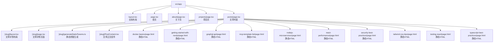
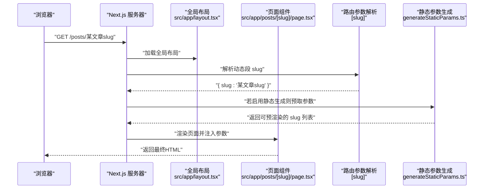
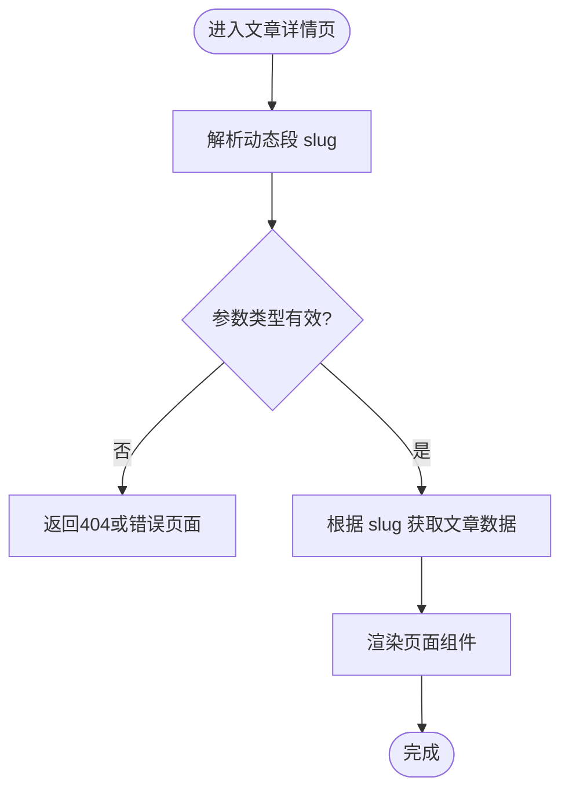
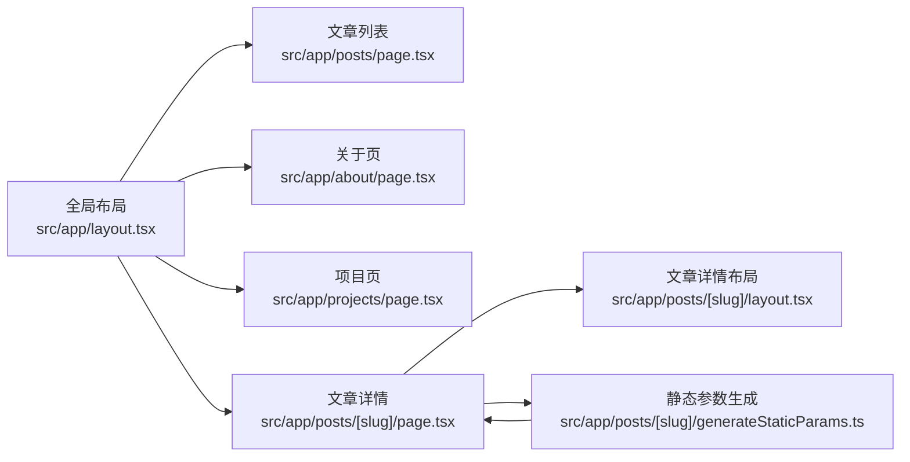

# 文件路由系统

<cite>
**本文引用的文件**   
- [src/app/layout.tsx](file://src/app/layout.tsx)
- [src/app/page.tsx](file://src/app/page.tsx)
- [src/app/about/page.tsx](file://src/app/about/page.tsx)
- [src/app/projects/page.tsx](file://src/app/projects/page.tsx)
- [src/app/posts/page.tsx](file://src/app/posts/page.tsx)
- [src/app/posts/[slug]/layout.tsx](file://src/app/posts/[slug]/layout.tsx)
- [src/app/posts/[slug]/page.tsx](file://src/app/posts/[slug]/page.tsx)
- [src/app/posts/[slug]/generateStaticParams.ts](file://src/app/posts/[slug]/generateStaticParams.ts)
- [src/app/posts/[slug]/PostContent.tsx](file://src/app/posts/[slug]/PostContent.tsx)
- [src/app/posts/docker-basics/page.html](file://src/app/posts/docker-basics/page.html)
- [src/app/posts/getting-started-with-nextjs/page.html](file://src/app/posts/getting-started-with-nextjs/page.html)
- [src/app/posts/graphql-api/page.html](file://src/app/posts/graphql-api/page.html)
- [src/app/posts/mcp-template-list/page.html](file://src/app/posts/mcp-template-list/page.html)
- [src/app/posts/nodejs-microservices/page.html](file://src/app/posts/nodejs-microservices/page.html)
- [src/app/posts/react-performance/page.html](file://src/app/posts/react-performance/page.html)
- [src/app/posts/security-best-practices/page.html](file://src/app/posts/security-best-practices/page.html)
- [src/app/posts/tailwind-css-tips/page.html](file://src/app/posts/tailwind-css-tips/page.html)
- [src/app/posts/testing-react/page.html](file://src/app/posts/testing-react/page.html)
- [src/app/posts/typescript-best-practices/page.html](file://src/app/posts/typescript-best-practices/page.html)
- [next.config.js](file://next.config.js)
</cite>

## 目录
1. [简介](#简介)
2. [项目结构](#项目结构)
3. [核心组件](#核心组件)
4. [架构总览](#架构总览)
5. [详细组件分析](#详细组件分析)
6. [依赖分析](#依赖分析)
7. [性能考虑](#性能考虑)
8. [故障排查指南](#故障排查指南)
9. [结论](#结论)
10. [附录](#附录)

## 简介
本文件路由系统基于 Next.js App Router，采用“文件系统即路由”的约定。通过 src/app 目录下的文件与文件夹组织，自动生成 URL 路由、布局继承、动态路由参数解析以及静态生成能力。本文面向博客项目的路由设计，详细说明命名约定、目录规则、URL 映射、页面导出规范、默认布局继承、动态路由类型安全、优先级与冲突解决，以及自定义路由行为的最佳实践。

## 项目结构
App Router 的核心位于 src/app 目录。根级 layout.tsx 提供全局布局；各功能模块以子目录形式组织，每个页面由 page.tsx 定义；动态路由使用方括号命名（如 [slug]）；静态 HTML 页面可直接放置于对应路径下作为静态资源路由。

图表来源
- [src/app/layout.tsx](file://src/app/layout.tsx)
- [src/app/page.tsx](file://src/app/page.tsx)
- [src/app/about/page.tsx](file://src/app/about/page.tsx)
- [src/app/projects/page.tsx](file://src/app/projects/page.tsx)
- [src/app/posts/page.tsx](file://src/app/posts/page.tsx)
- [src/app/posts/[slug]/layout.tsx](file://src/app/posts/[slug]/layout.tsx)
- [src/app/posts/[slug]/page.tsx](file://src/app/posts/[slug]/page.tsx)
- [src/app/posts/[slug]/generateStaticParams.ts](file://src/app/posts/[slug]/generateStaticParams.ts)
- [src/app/posts/[slug]/PostContent.tsx](file://src/app/posts/[slug]/PostContent.tsx)
- [src/app/posts/docker-basics/page.html](file://src/app/posts/docker-basics/page.html)
- [src/app/posts/getting-started-with-nextjs/page.html](file://src/app/posts/getting-started-with-nextjs/page.html)
- [src/app/posts/graphql-api/page.html](file://src/app/posts/graphql-api/page.html)
- [src/app/posts/mcp-template-list/page.html](file://src/app/posts/mcp-template-list/page.html)
- [src/app/posts/nodejs-microservices/page.html](file://src/app/posts/nodejs-microservices/page.html)
- [src/app/posts/react-performance/page.html](file://src/app/posts/react-performance/page.html)
- [src/app/posts/security-best-practices/page.html](file://src/app/posts/security-best-practices/page.html)
- [src/app/posts/tailwind-css-tips/page.html](file://src/app/posts/tailwind-css-tips/page.html)
- [src/app/posts/testing-react/page.html](file://src/app/posts/testing-react/page.html)
- [src/app/posts/typescript-best-practices/page.html](file://src/app/posts/typescript-best-practices/page.html)

章节来源
- [src/app/layout.tsx](file://src/app/layout.tsx)
- [src/app/page.tsx](file://src/app/page.tsx)
- [src/app/about/page.tsx](file://src/app/about/page.tsx)
- [src/app/projects/page.tsx](file://src/app/projects/page.tsx)
- [src/app/posts/page.tsx](file://src/app/posts/page.tsx)
- [src/app/posts/[slug]/layout.tsx](file://src/app/posts/[slug]/layout.tsx)
- [src/app/posts/[slug]/page.tsx](file://src/app/posts/[slug]/page.tsx)
- [src/app/posts/[slug]/generateStaticParams.ts](file://src/app/posts/[slug]/generateStaticParams.ts)
- [src/app/posts/[slug]/PostContent.tsx](file://src/app/posts/[slug]/PostContent.tsx)
- [src/app/posts/docker-basics/page.html](file://src/app/posts/docker-basics/page.html)
- [src/app/posts/getting-started-with-nextjs/page.html](file://src/app/posts/getting-started-with-nextjs/page.html)
- [src/app/posts/graphql-api/page.html](file://src/app/posts/graphql-api/page.html)
- [src/app/posts/mcp-template-list/page.html](file://src/app/posts/mcp-template-list/page.html)
- [src/app/posts/nodejs-microservices/page.html](file://src/app/posts/nodejs-microservices/page.html)
- [src/app/posts/react-performance/page.html](file://src/app/posts/react-performance/page.html)
- [src/app/posts/security-best-practices/page.html](file://src/app/posts/security-best-practices/page.html)
- [src/app/posts/tailwind-css-tips/page.html](file://src/app/posts/tailwind-css-tips/page.html)
- [src/app/posts/testing-react/page.html](file://src/app/posts/testing-react/page.html)
- [src/app/posts/typescript-best-practices/page.html](file://src/app/posts/typescript-best-practices/page.html)

## 核心组件
- 全局布局：src/app/layout.tsx 为整个应用提供默认布局，所有页面将自动包裹在该布局中，除非在子目录覆盖。
- 首页：src/app/page.tsx 对应站点根路径 /。
- 关于页：src/app/about/page.tsx 对应 /about。
- 项目页：src/app/projects/page.tsx 对应 /projects。
- 文章列表：src/app/posts/page.tsx 对应 /posts。
- 文章详情动态路由：src/app/posts/[slug]/page.tsx 对应 /posts/:slug，其中 slug 为动态段。
- 文章详情布局：src/app/posts/[slug]/layout.tsx 为文章详情提供局部布局。
- 静态参数生成：src/app/posts/[slug]/generateStaticParams.ts 用于预渲染文章详情页的静态参数。
- 文章正文组件：src/app/posts/[slug]/PostContent.tsx 负责渲染具体文章内容。
- 静态 HTML 页面：src/app/posts/<article-slug>/page.html 直接作为静态页面路由。

章节来源
- [src/app/layout.tsx](file://src/app/layout.tsx)
- [src/app/page.tsx](file://src/app/page.tsx)
- [src/app/about/page.tsx](file://src/app/about/page.tsx)
- [src/app/projects/page.tsx](file://src/app/projects/page.tsx)
- [src/app/posts/page.tsx](file://src/app/posts/page.tsx)
- [src/app/posts/[slug]/layout.tsx](file://src/app/posts/[slug]/layout.tsx)
- [src/app/posts/[slug]/page.tsx](file://src/app/posts/[slug]/page.tsx)
- [src/app/posts/[slug]/generateStaticParams.ts](file://src/app/posts/[slug]/generateStaticParams.ts)
- [src/app/posts/[slug]/PostContent.tsx](file://src/app/posts/[slug]/PostContent.tsx)

## 架构总览
下图展示了请求从浏览器到页面组件的调用链，包括全局布局、页面组件与动态路由参数的传递过程。

图表来源
- [src/app/layout.tsx](file://src/app/layout.tsx)
- [src/app/posts/[slug]/page.tsx](file://src/app/posts/[slug]/page.tsx)
- [src/app/posts/[slug]/generateStaticParams.ts](file://src/app/posts/[slug]/generateStaticParams.ts)

## 详细组件分析

### 静态页面与 URL 映射
- 根路径：src/app/page.tsx → /
- 关于页：src/app/about/page.tsx → /about
- 项目页：src/app/projects/page.tsx → /projects
- 文章列表：src/app/posts/page.tsx → /posts
- 文章详情（动态）：src/app/posts/[slug]/page.tsx → /posts/:slug
- 静态 HTML 页面示例：
  - src/app/posts/docker-basics/page.html → /posts/docker-basics
  - src/app/posts/getting-started-with-nextjs/page.html → /posts/getting-started-with-nextjs
  - src/app/posts/graphql-api/page.html → /posts/graphql-api
  - src/app/posts/mcp-template-list/page.html → /posts/mcp-template-list
  - src/app/posts/nodejs-microservices/page.html → /posts/nodejs-microservices
  - src/app/posts/react-performance/page.html → /posts/react-performance
  - src/app/posts/security-best-practices/page.html → /posts/security-best-practices
  - src/app/posts/tailwind-css-tips/page.html → /posts/tailwind-css-tips
  - src/app/posts/testing-react/page.html → /posts/testing-react
  - src/app/posts/typescript-best-practices/page.html → /posts/typescript-best-practices

章节来源
- [src/app/page.tsx](file://src/app/page.tsx)
- [src/app/about/page.tsx](file://src/app/about/page.tsx)
- [src/app/projects/page.tsx](file://src/app/projects/page.tsx)
- [src/app/posts/page.tsx](file://src/app/posts/page.tsx)
- [src/app/posts/[slug]/page.tsx](file://src/app/posts/[slug]/page.tsx)
- [src/app/posts/docker-basics/page.html](file://src/app/posts/docker-basics/page.html)
- [src/app/posts/getting-started-with-nextjs/page.html](file://src/app/posts/getting-started-with-nextjs/page.html)
- [src/app/posts/graphql-api/page.html](file://src/app/posts/graphql-api/page.html)
- [src/app/posts/mcp-template-list/page.html](file://src/app/posts/mcp-template-list/page.html)
- [src/app/posts/nodejs-microservices/page.html](file://src/app/posts/nodejs-microservices/page.html)
- [src/app/posts/react-performance/page.html](file://src/app/posts/react-performance/page.html)
- [src/app/posts/security-best-practices/page.html](file://src/app/posts/security-best-practices/page.html)
- [src/app/posts/tailwind-css-tips/page.html](file://src/app/posts/tailwind-css-tips/page.html)
- [src/app/posts/testing-react/page.html](file://src/app/posts/testing-react/page.html)
- [src/app/posts/typescript-best-practices/page.html](file://src/app/posts/typescript-best-practices/page.html)

### 页面组件导出规范与默认布局继承
- 页面组件需导出一个 React 组件作为默认导出，供 App Router 渲染。
- 默认布局继承机制：
  - 全局布局：src/app/layout.tsx 为所有页面提供默认外壳。
  - 局部布局：src/app/posts/[slug]/layout.tsx 为文章详情区域提供独立布局，覆盖全局布局在该段的作用范围。
- 页面与布局的关系遵循嵌套原则：子目录的 layout.tsx 会包裹其同级及子级的 page.tsx。

章节来源
- [src/app/layout.tsx](file://src/app/layout.tsx)
- [src/app/posts/[slug]/layout.tsx](file://src/app/posts/[slug]/layout.tsx)
- [src/app/posts/[slug]/page.tsx](file://src/app/posts/[slug]/page.tsx)

### 动态路由参数自动解析与类型安全
- 动态段命名：使用方括号表示，例如 [slug]。
- 参数访问：页面组件可通过 props 获取 params，包含 { slug }。
- 类型安全：在 TypeScript 项目中，建议为页面组件声明 props 类型，确保 params 字段存在且类型正确。
- 静态参数生成：通过 generateStaticParams.ts 返回 slug 列表，可在构建时预渲染对应的文章详情页，提升首屏性能与 SEO。

图表来源
- [src/app/posts/[slug]/page.tsx](file://src/app/posts/[slug]/page.tsx)
- [src/app/posts/[slug]/generateStaticParams.ts](file://src/app/posts/[slug]/generateStaticParams.ts)

章节来源
- [src/app/posts/[slug]/page.tsx](file://src/app/posts/[slug]/page.tsx)
- [src/app/posts/[slug]/generateStaticParams.ts](file://src/app/posts/[slug]/generateStaticParams.ts)

### 路由优先级与冲突解决机制
- 精确匹配优先：静态路径优先于动态路径。例如 posts/docker-basics 会优先匹配静态 page.html，而不是 [slug] 的动态路由。
- 层级就近原则：越靠近请求路径的 layout.tsx 越先生效。
- 冲突处理：当同一目录下同时存在静态文件与动态段时，静态文件优先。
- 扩展名支持：App Router 支持 .tsx/.ts 等页面文件，以及 .html 静态页面。

章节来源
- [src/app/posts/[slug]/page.tsx](file://src/app/posts/[slug]/page.tsx)
- [src/app/posts/docker-basics/page.html](file://src/app/posts/docker-basics/page.html)

### 自定义路由行为最佳实践
- 使用 generateStaticParams 进行预渲染：适用于内容稳定的文章列表，减少运行时开销。
- 使用局部布局隔离复杂页面：在 posts/[slug]/layout.tsx 中实现文章详情的专属布局与元信息设置。
- 统一错误处理：对无效 slug 返回 404 页面，避免未定义行为。
- 配置增强：如需自定义路由行为或中间件，可在 next.config.js 中进行相关配置。

章节来源
- [src/app/posts/[slug]/generateStaticParams.ts](file://src/app/posts/[slug]/generateStaticParams.ts)
- [src/app/posts/[slug]/layout.tsx](file://src/app/posts/[slug]/layout.tsx)
- [next.config.js](file://next.config.js)

## 依赖分析
- 页面与布局的耦合关系：
  - 全局布局被所有页面共享。
  - 文章详情布局仅作用于 posts/[slug] 及其子级。
- 静态参数生成与页面渲染的协作：
  - generateStaticParams.ts 提供 slug 列表，页面组件据此渲染具体文章。
- 静态 HTML 与动态路由的共存：
  - 静态 page.html 优先于动态 [slug] 路由，避免冲突。

图表来源
- [src/app/layout.tsx](file://src/app/layout.tsx)
- [src/app/posts/page.tsx](file://src/app/posts/page.tsx)
- [src/app/about/page.tsx](file://src/app/about/page.tsx)
- [src/app/projects/page.tsx](file://src/app/projects/page.tsx)
- [src/app/posts/[slug]/page.tsx](file://src/app/posts/[slug]/page.tsx)
- [src/app/posts/[slug]/layout.tsx](file://src/app/posts/[slug]/layout.tsx)
- [src/app/posts/[slug]/generateStaticParams.ts](file://src/app/posts/[slug]/generateStaticParams.ts)

## 性能考虑
- 预渲染与增量静态再生：对于内容更新频率较低的文章，使用 generateStaticParams 进行构建期预渲染，可减少运行时成本。
- 布局复用：合理拆分布局，避免不必要的重渲染。
- 静态 HTML 页面：对于不需要服务端逻辑的内容，直接使用 page.html 可获得更快的响应。
- 资源优化：结合 Next.js 的图片与脚本优化策略，降低首屏加载时间。

## 故障排查指南
- 404 问题：检查动态路由参数是否有效，确认是否存在对应的静态 HTML 或动态页面。
- 布局未生效：确认当前路径下是否存在更近的 layout.tsx，以及全局布局是否正确导出。
- 静态参数缺失：检查 generateStaticParams.ts 是否返回了正确的 slug 列表。
- 路由冲突：确认静态 page.html 与动态 [slug] 的路径是否重叠，必要时调整文件名或路由结构。

## 结论
本博客项目基于 Next.js App Router 实现了清晰的文件路由体系：通过 src/app 目录组织页面与布局，利用动态段与静态 HTML 并存的方式满足多样化需求。配合 generateStaticParams 与局部布局，既保证了性能又提升了可维护性。遵循本文的命名约定、映射规则与最佳实践，可快速扩展新的页面与功能。

## 附录
- 常见文件到 URL 的映射速查：
  - src/app/page.tsx → /
  - src/app/about/page.tsx → /about
  - src/app/projects/page.tsx → /projects
  - src/app/posts/page.tsx → /posts
  - src/app/posts/[slug]/page.tsx → /posts/:slug
  - src/app/posts/<article-slug>/page.html → /posts/<article-slug>