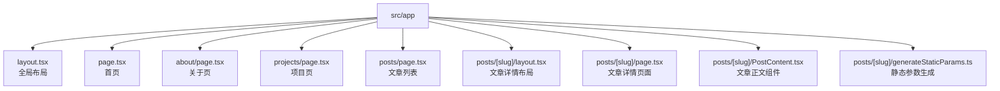
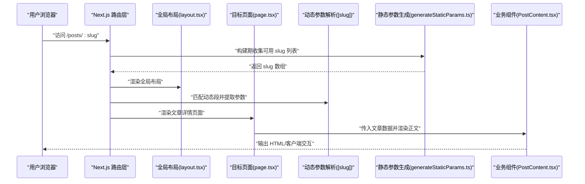
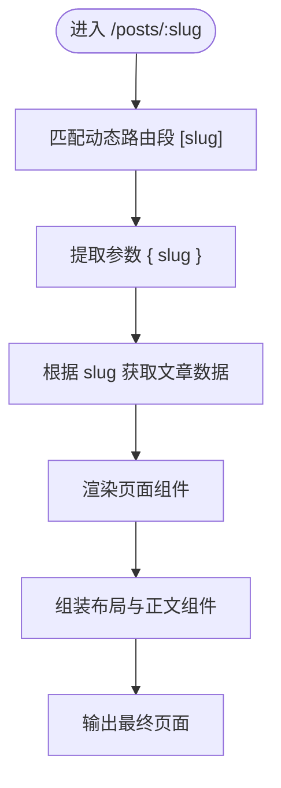
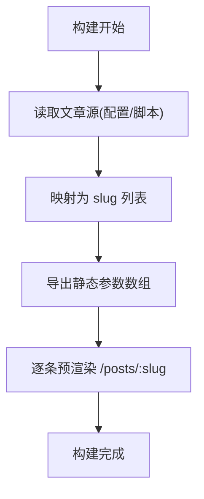
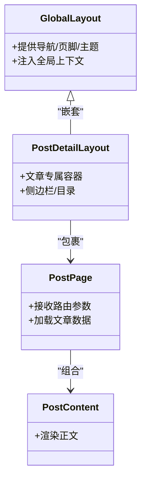
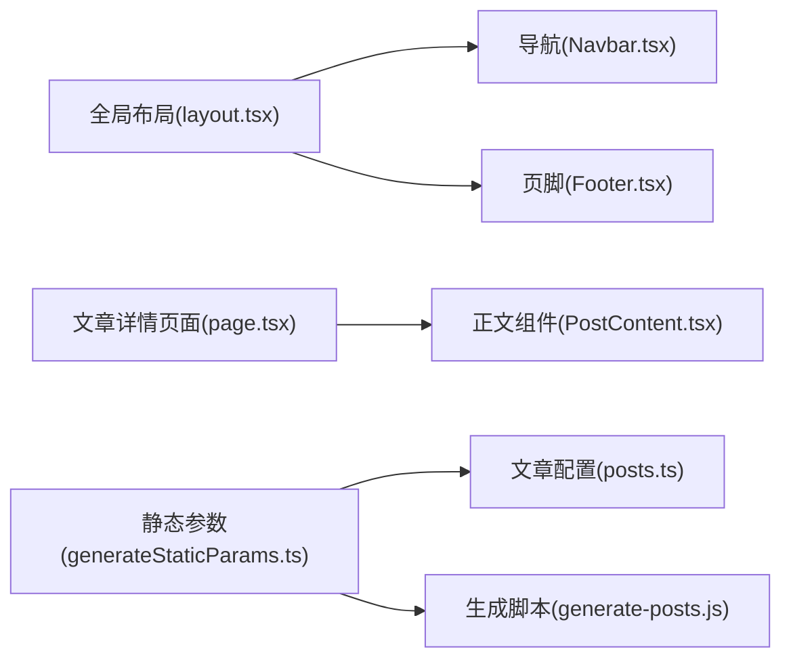

# 路由架构设计

<cite>
**本文引用的文件**   
- [src/app/layout.tsx](file://src/app/layout.tsx)
- [src/app/page.tsx](file://src/app/page.tsx)
- [src/app/about/page.tsx](file://src/app/about/page.tsx)
- [src/app/projects/page.tsx](file://src/app/projects/page.tsx)
- [src/app/posts/page.tsx](file://src/app/posts/page.tsx)
- [src/app/posts/[slug]/layout.tsx](file://src/app/posts/[slug]/layout.tsx)
- [src/app/posts/[slug]/page.tsx](file://src/app/posts/[slug]/page.tsx)
- [src/app/posts/[slug]/PostContent.tsx](file://src/app/posts/[slug]/PostContent.tsx)
- [src/app/posts/[slug]/generateStaticParams.ts](file://src/app/posts/[slug]/generateStaticParams.ts)
- [src/components/Navbar.tsx](file://src/components/Navbar.tsx)
- [src/components/Footer.tsx](file://src/components/Footer.tsx)
- [src/components/PostsSearch.tsx](file://src/components/PostsSearch.tsx)
- [src/config/posts.ts](file://src/config/posts.ts)
- [scripts/generate-posts.js](file://scripts/generate-posts.js)
</cite>

## 目录
1. [简介](#简介)
2. [项目结构](#项目结构)
3. [核心组件](#核心组件)
4. [架构总览](#架构总览)
5. [详细组件分析](#详细组件分析)
6. [依赖关系分析](#依赖关系分析)
7. [性能考量](#性能考量)
8. [故障排查指南](#故障排查指南)
9. [结论](#结论)
10. [附录](#附录)

## 简介
本文件面向博客项目的 Next.js App Router 路由架构，系统性阐述文件路由约定、动态路由处理、嵌套布局组织、页面组件模式与参数传递机制；解释静态参数生成（generateStaticParams）的工作原理与优化策略；说明布局层次结构与数据共享方式；并提供 SEO 友好的 URL 设计建议、扩展与自定义最佳实践。文档包含关键流程与关系的可视化图示，帮助读者快速理解并高效维护路由体系。

## 项目结构
本项目采用 Next.js App Router 的目录即路由模型：
- src/app 为应用根目录，每个子目录对应一个路由段
- page.tsx 表示可访问的页面
- layout.tsx 表示该段及其子段的布局
- [slug] 等方括号目录表示动态路由段
- generateStaticParams.ts 用于在构建期预渲染特定动态路由的参数集合

图表来源
- [src/app/layout.tsx](file://src/app/layout.tsx)
- [src/app/page.tsx](file://src/app/page.tsx)
- [src/app/about/page.tsx](file://src/app/about/page.tsx)
- [src/app/projects/page.tsx](file://src/app/projects/page.tsx)
- [src/app/posts/page.tsx](file://src/app/posts/page.tsx)
- [src/app/posts/[slug]/layout.tsx](file://src/app/posts/[slug]/layout.tsx)
- [src/app/posts/[slug]/page.tsx](file://src/app/posts/[slug]/page.tsx)
- [src/app/posts/[slug]/PostContent.tsx](file://src/app/posts/[slug]/PostContent.tsx)
- [src/app/posts/[slug]/generateStaticParams.ts](file://src/app/posts/[slug]/generateStaticParams.ts)

章节来源
- [src/app/layout.tsx](file://src/app/layout.tsx)
- [src/app/page.tsx](file://src/app/page.tsx)
- [src/app/about/page.tsx](file://src/app/about/page.tsx)
- [src/app/projects/page.tsx](file://src/app/projects/page.tsx)
- [src/app/posts/page.tsx](file://src/app/posts/page.tsx)
- [src/app/posts/[slug]/layout.tsx](file://src/app/posts/[slug]/layout.tsx)
- [src/app/posts/[slug]/page.tsx](file://src/app/posts/[slug]/page.tsx)
- [src/app/posts/[slug]/PostContent.tsx](file://src/app/posts/[slug]/PostContent.tsx)
- [src/app/posts/[slug]/generateStaticParams.ts](file://src/app/posts/[slug]/generateStaticParams.ts)

## 核心组件
- 全局布局（src/app/layout.tsx）
  - 职责：提供站点级外壳（如导航、主题、全局样式），包裹所有页面内容
  - 特点：作为根布局，影响整站渲染与上下文注入
- 首页（src/app/page.tsx）
  - 职责：站点入口，展示概览或引导信息
- 关于页（src/app/about/page.tsx）
  - 职责：展示个人/团队介绍
- 项目页（src/app/projects/page.tsx）
  - 职责：展示项目清单与链接
- 文章列表（src/app/posts/page.tsx）
  - 职责：聚合文章索引，支持搜索与分页（如有）
- 文章详情布局（src/app/posts/[slug]/layout.tsx）
  - 职责：为文章详情页提供统一容器（如侧边栏、面包屑、评论入口）
- 文章详情页面（src/app/posts/[slug]/page.tsx）
  - 职责：根据动态参数 slug 加载并渲染具体文章
- 文章正文组件（src/app/posts/[slug]/PostContent.tsx）
  - 职责：负责文章内容的解析与呈现
- 静态参数生成（src/app/posts/[slug]/generateStaticParams.ts）
  - 职责：在构建期产出 slug 集合，驱动预渲染

章节来源
- [src/app/layout.tsx](file://src/app/layout.tsx)
- [src/app/page.tsx](file://src/app/page.tsx)
- [src/app/about/page.tsx](file://src/app/about/page.tsx)
- [src/app/projects/page.tsx](file://src/app/projects/page.tsx)
- [src/app/posts/page.tsx](file://src/app/posts/page.tsx)
- [src/app/posts/[slug]/layout.tsx](file://src/app/posts/[slug]/layout.tsx)
- [src/app/posts/[slug]/page.tsx](file://src/app/posts/[slug]/page.tsx)
- [src/app/posts/[slug]/PostContent.tsx](file://src/app/posts/[slug]/PostContent.tsx)
- [src/app/posts/[slug]/generateStaticParams.ts](file://src/app/posts/[slug]/generateStaticParams.ts)

## 架构总览
App Router 将“目录结构”直接映射为“URL 路径”，通过布局与页面的组合实现嵌套渲染。下图展示了从浏览器请求到最终渲染的关键路径与组件协作。

图表来源
- [src/app/layout.tsx](file://src/app/layout.tsx)
- [src/app/posts/[slug]/layout.tsx](file://src/app/posts/[slug]/layout.tsx)
- [src/app/posts/[slug]/page.tsx](file://src/app/posts/[slug]/page.tsx)
- [src/app/posts/[slug]/PostContent.tsx](file://src/app/posts/[slug]/PostContent.tsx)
- [src/app/posts/[slug]/generateStaticParams.ts](file://src/app/posts/[slug]/generateStaticParams.ts)

## 详细组件分析

### 文件路由约定与层级
- 静态路由
  - / → src/app/page.tsx
  - /about → src/app/about/page.tsx
  - /projects → src/app/projects/page.tsx
  - /posts → src/app/posts/page.tsx
- 动态路由
  - /posts/:slug → src/app/posts/[slug]/page.tsx
- 嵌套布局
  - 全局布局：src/app/layout.tsx
  - 文章详情布局：src/app/posts/[slug]/layout.tsx

章节来源
- [src/app/page.tsx](file://src/app/page.tsx)
- [src/app/about/page.tsx](file://src/app/about/page.tsx)
- [src/app/projects/page.tsx](file://src/app/projects/page.tsx)
- [src/app/posts/page.tsx](file://src/app/posts/page.tsx)
- [src/app/posts/[slug]/layout.tsx](file://src/app/posts/[slug]/layout.tsx)
- [src/app/posts/[slug]/page.tsx](file://src/app/posts/[slug]/page.tsx)

### 动态路由与参数传递
- 动态段定义：使用 [slug] 目录名声明动态段
- 参数获取：页面组件通过路由参数对象读取 slug
- 数据加载：页面组件依据 slug 拉取文章元信息与正文
- 组件拆分：页面仅负责装配与数据流，正文渲染下沉至 PostContent 组件

图表来源
- [src/app/posts/[slug]/page.tsx](file://src/app/posts/[slug]/page.tsx)
- [src/app/posts/[slug]/PostContent.tsx](file://src/app/posts/[slug]/PostContent.tsx)

章节来源
- [src/app/posts/[slug]/page.tsx](file://src/app/posts/[slug]/page.tsx)
- [src/app/posts/[slug]/PostContent.tsx](file://src/app/posts/[slug]/PostContent.tsx)

### 静态参数生成（generateStaticParams）
- 作用：在构建阶段为动态路由生成一组可用的参数集合，从而触发预渲染
- 典型流程：
  - 读取文章源（配置文件或脚本生成的数据）
  - 导出 slug 列表
  - 由 Next.js 为每个 slug 生成对应的静态页面
- 性能收益：首屏更快、SEO 友好、减少运行时开销

图表来源
- [src/app/posts/[slug]/generateStaticParams.ts](file://src/app/posts/[slug]/generateStaticParams.ts)
- [src/config/posts.ts](file://src/config/posts.ts)
- [scripts/generate-posts.js](file://scripts/generate-posts.js)

章节来源
- [src/app/posts/[slug]/generateStaticParams.ts](file://src/app/posts/[slug]/generateStaticParams.ts)
- [src/config/posts.ts](file://src/config/posts.ts)
- [scripts/generate-posts.js](file://scripts/generate-posts.js)

### 布局组件层次与数据共享
- 全局布局（src/app/layout.tsx）
  - 提供全站通用元素（导航、页脚、主题切换等）
  - 适合注入跨页面共享状态（例如主题、语言）
- 文章详情布局（src/app/posts/[slug]/layout.tsx）
  - 为文章详情页提供专属容器（如侧边目录、相关文章推荐）
- 数据共享机制
  - 通过 React Context 或布局 props 向下传递
  - 避免在每层重复拉取相同数据，提升缓存命中率

图表来源
- [src/app/layout.tsx](file://src/app/layout.tsx)
- [src/app/posts/[slug]/layout.tsx](file://src/app/posts/[slug]/layout.tsx)
- [src/app/posts/[slug]/page.tsx](file://src/app/posts/[slug]/page.tsx)
- [src/app/posts/[slug]/PostContent.tsx](file://src/app/posts/[slug]/PostContent.tsx)

章节来源
- [src/app/layout.tsx](file://src/app/layout.tsx)
- [src/app/posts/[slug]/layout.tsx](file://src/app/posts/[slug]/layout.tsx)
- [src/app/posts/[slug]/page.tsx](file://src/app/posts/[slug]/page.tsx)
- [src/app/posts/[slug]/PostContent.tsx](file://src/app/posts/[slug]/PostContent.tsx)

### 页面组件组织模式
- 单一职责：页面组件只负责路由装配与数据编排
- 展示分离：复杂 UI 下沉到独立组件（如 PostContent）
- 复用性：列表项、卡片、搜索等公共逻辑抽取为可复用组件（如 PostsSearch）

章节来源
- [src/app/posts/page.tsx](file://src/app/posts/page.tsx)
- [src/components/PostsSearch.tsx](file://src/components/PostsSearch.tsx)
- [src/app/posts/[slug]/PostContent.tsx](file://src/app/posts/[slug]/PostContent.tsx)

### SEO 友好的 URL 结构设计
- 语义化路径：使用名词+短横线分隔（如 posts/my-first-post）
- 唯一标识：slug 应稳定且具可读性，避免随机字符串
- 规范化：确保同一内容只有一个 canonical URL，避免重复抓取
- 元信息：在页面中设置标题、描述、Open Graph 等元标签（可在布局或页面中集中管理）

[本节为概念性指导，不直接分析具体文件]

### 路由扩展与自定义最佳实践
- 新增静态页面：在 src/app 下新建目录并添加 page.tsx
- 新增动态路由：创建 [param] 目录并在其下实现 page.tsx 与 generateStaticParams.ts
- 新增嵌套布局：在同一路径下新增 layout.tsx，注意保持层级清晰
- 参数校验：对动态参数进行前置校验与错误分支处理
- 性能优化：优先使用 generateStaticParams 预渲染；必要时结合增量静态再生（ISR）
- 可维护性：将路由相关常量与配置集中在 config 目录，便于统一管理

章节来源
- [src/app/posts/[slug]/generateStaticParams.ts](file://src/app/posts/[slug]/generateStaticParams.ts)
- [src/config/posts.ts](file://src/config/posts.ts)

## 依赖关系分析
- 组件耦合
  - 页面组件依赖布局组件提供的上下文与 UI 骨架
  - 正文组件依赖页面传入的文章数据
- 外部依赖
  - 文章数据来源于配置或脚本生成产物
  - 导航与页脚为全局布局的子组件

图表来源
- [src/app/layout.tsx](file://src/app/layout.tsx)
- [src/components/Navbar.tsx](file://src/components/Navbar.tsx)
- [src/components/Footer.tsx](file://src/components/Footer.tsx)
- [src/app/posts/[slug]/page.tsx](file://src/app/posts/[slug]/page.tsx)
- [src/app/posts/[slug]/PostContent.tsx](file://src/app/posts/[slug]/PostContent.tsx)
- [src/app/posts/[slug]/generateStaticParams.ts](file://src/app/posts/[slug]/generateStaticParams.ts)
- [src/config/posts.ts](file://src/config/posts.ts)
- [scripts/generate-posts.js](file://scripts/generate-posts.js)

章节来源
- [src/app/layout.tsx](file://src/app/layout.tsx)
- [src/components/Navbar.tsx](file://src/components/Navbar.tsx)
- [src/components/Footer.tsx](file://src/components/Footer.tsx)
- [src/app/posts/[slug]/page.tsx](file://src/app/posts/[slug]/page.tsx)
- [src/app/posts/[slug]/PostContent.tsx](file://src/app/posts/[slug]/PostContent.tsx)
- [src/app/posts/[slug]/generateStaticParams.ts](file://src/app/posts/[slug]/generateStaticParams.ts)
- [src/config/posts.ts](file://src/config/posts.ts)
- [scripts/generate-posts.js](file://scripts/generate-posts.js)

## 性能考量
- 构建期预渲染
  - 使用 generateStaticParams 批量生成静态页面，降低首屏延迟
- 数据获取优化
  - 在页面或布局中就近获取数据，减少不必要的网络往返
  - 对热点数据实施缓存（内存/边缘缓存）
- 组件粒度
  - 将大体积正文渲染拆分为独立组件，利于按需加载与懒执行
- 资源优化
  - 图片与动画等资源按需加载，避免阻塞关键渲染路径

[本节为通用性能建议，不直接分析具体文件]

## 故障排查指南
- 动态路由未命中
  - 检查 [slug] 目录命名与页面文件是否存在
  - 确认 generateStaticParams 是否导出有效 slug 列表
- 页面空白或报错
  - 核对页面组件是否正确接收并解构路由参数
  - 检查数据加载失败时的降级与错误边界
- 构建缓慢
  - 评估 generateStaticParams 的数据源规模，考虑分页或增量生成
  - 将重型计算移出构建期，或使用脚本预生成数据文件

章节来源
- [src/app/posts/[slug]/generateStaticParams.ts](file://src/app/posts/[slug]/generateStaticParams.ts)
- [src/app/posts/[slug]/page.tsx](file://src/app/posts/[slug]/page.tsx)

## 结论
本博客项目基于 Next.js App Router 实现了清晰的路由分层与组件组织：以目录映射路由、以布局承载共享、以页面编排数据、以组件专注展示。通过 generateStaticParams 在构建期预渲染文章详情，兼顾了性能与 SEO。遵循本文的最佳实践与排障建议，可进一步提升可维护性与用户体验。

[本节为总结性内容，不直接分析具体文件]

## 附录
- 常用路径对照
  - 首页：/
  - 关于：/about
  - 项目：/projects
  - 文章列表：/posts
  - 文章详情：/posts/:slug
- 关键文件定位
  - 全局布局：src/app/layout.tsx
  - 文章详情布局：src/app/posts/[slug]/layout.tsx
  - 文章详情页面：src/app/posts/[slug]/page.tsx
  - 文章正文组件：src/app/posts/[slug]/PostContent.tsx
  - 静态参数生成：src/app/posts/[slug]/generateStaticParams.ts
  - 文章配置：src/config/posts.ts
  - 生成脚本：scripts/generate-posts.js

[本节为参考信息，不直接分析具体文件]