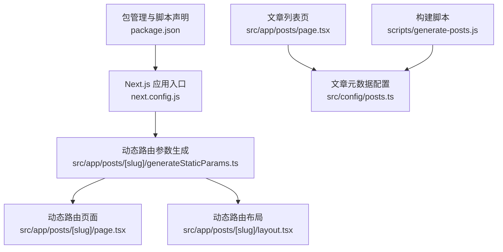
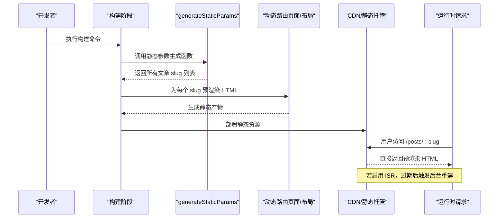
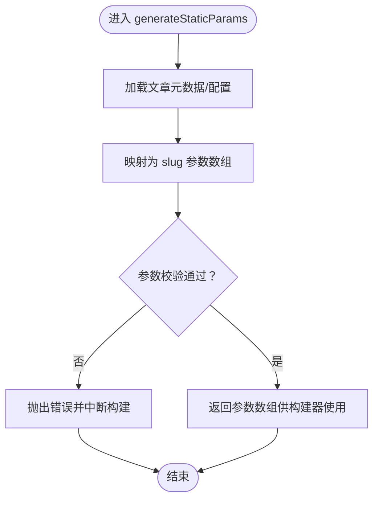
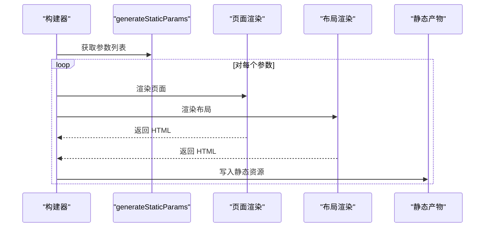
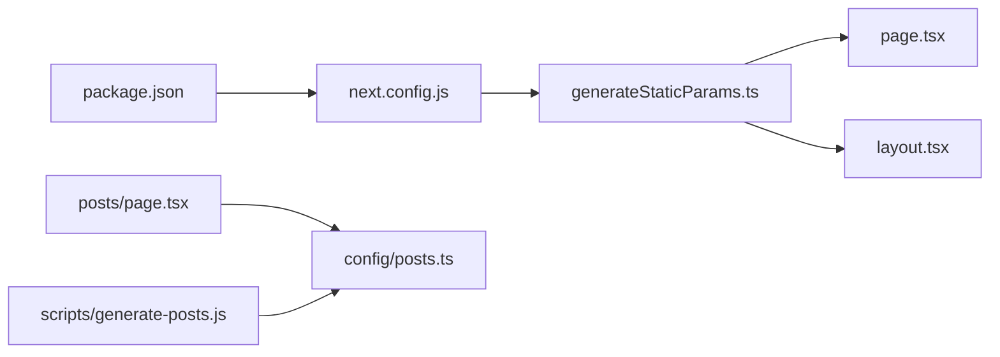

# 静态生成优化

<cite>
**本文引用的文件**   
- [next.config.js](file://next.config.js)
- [package.json](file://package.json)
- [src/app/posts/[slug]/generateStaticParams.ts](file://src/app/posts/[slug]/generateStaticParams.ts)
- [src/app/posts/[slug]/page.tsx](file://src/app/posts/[slug]/page.tsx)
- [src/app/posts/[slug]/layout.tsx](file://src/app/posts/[slug]/layout.tsx)
- [src/app/posts/page.tsx](file://src/app/posts/page.tsx)
- [scripts/generate-posts.js](file://scripts/generate-posts.js)
- [src/config/posts.ts](file://src/config/posts.ts)
</cite>

## 目录
1. [简介](#简介)
2. [项目结构](#项目结构)
3. [核心组件](#核心组件)
4. [架构总览](#架构总览)
5. [详细组件分析](#详细组件分析)
6. [依赖关系分析](#依赖关系分析)
7. [性能考量](#性能考量)
8. [故障排查指南](#故障排查指南)
9. [结论](#结论)
10. [附录](#附录)

## 简介
本文件面向博客项目的静态生成优化，围绕以下目标展开：
- 解释 generateStaticParams 的工作原理与性能优势
- 说明预渲染过程与时间线优化
- 描述增量静态再生成（ISR）的配置与使用
- 解释构建时的资源优化与代码分割
- 提供静态生成的监控与调试方法
- 说明缓存策略与版本控制集成
- 给出大规模站点静态生成的最佳实践

## 项目结构
本项目采用 Next.js App Router 组织页面与路由。关键路径包括：
- 动态路由参数定义与静态参数生成：src/app/posts/[slug]/generateStaticParams.ts
- 动态路由页面与布局：src/app/posts/[slug]/page.tsx、src/app/posts/[slug]/layout.tsx
- 文章列表页：src/app/posts/page.tsx
- 构建配置与脚本：next.config.js、scripts/generate-posts.js
- 内容元数据与配置：src/config/posts.ts、package.json

图表来源
- [next.config.js](file://next.config.js)
- [src/app/posts/[slug]/generateStaticParams.ts](file://src/app/posts/[slug]/generateStaticParams.ts)
- [src/app/posts/[slug]/page.tsx](file://src/app/posts/[slug]/page.tsx)
- [src/app/posts/[slug]/layout.tsx](file://src/app/posts/[slug]/layout.tsx)
- [src/app/posts/page.tsx](file://src/app/posts/page.tsx)
- [scripts/generate-posts.js](file://scripts/generate-posts.js)
- [src/config/posts.ts](file://src/config/posts.ts)
- [package.json](file://package.json)

章节来源
- [next.config.js](file://next.config.js)
- [src/app/posts/[slug]/generateStaticParams.ts](file://src/app/posts/[slug]/generateStaticParams.ts)
- [src/app/posts/[slug]/page.tsx](file://src/app/posts/[slug]/page.tsx)
- [src/app/posts/[slug]/layout.tsx](file://src/app/posts/[slug]/layout.tsx)
- [src/app/posts/page.tsx](file://src/app/posts/page.tsx)
- [scripts/generate-posts.js](file://scripts/generate-posts.js)
- [src/config/posts.ts](file://src/config/posts.ts)
- [package.json](file://package.json)

## 核心组件
- 静态参数生成器：负责在构建期产出所有文章 slug 的静态参数，驱动 Next.js 预渲染对应页面。
- 动态路由页面与布局：消费静态参数，渲染文章内容与通用布局。
- 文章列表页：聚合文章元数据，用于首页或列表展示。
- 构建脚本：辅助生成或同步文章资源与元数据。
- 构建配置：包含 ISR、输出格式、压缩等优化选项。
- 包管理：定义构建与运行脚本。

章节来源
- [src/app/posts/[slug]/generateStaticParams.ts](file://src/app/posts/[slug]/generateStaticParams.ts)
- [src/app/posts/[slug]/page.tsx](file://src/app/posts/[slug]/page.tsx)
- [src/app/posts/[slug]/layout.tsx](file://src/app/posts/[slug]/layout.tsx)
- [src/app/posts/page.tsx](file://src/app/posts/page.tsx)
- [scripts/generate-posts.js](file://scripts/generate-posts.js)
- [next.config.js](file://next.config.js)
- [package.json](file://package.json)

## 架构总览
下图展示了从构建到运行的静态生成流程，以及 ISR 的更新路径。

图表来源
- [src/app/posts/[slug]/generateStaticParams.ts](file://src/app/posts/[slug]/generateStaticParams.ts)
- [src/app/posts/[slug]/page.tsx](file://src/app/posts/[slug]/page.tsx)
- [src/app/posts/[slug]/layout.tsx](file://src/app/posts/[slug]/layout.tsx)
- [next.config.js](file://next.config.js)

## 详细组件分析

### generateStaticParams 工作原理与性能优势
- 作用时机：构建期执行，产出所有动态路由所需的参数集合，驱动 Next.js 为每个参数生成独立静态页面。
- 数据来源：通常读取文章元数据或文件系统，确保参数集与实际内容一致。
- 性能优势：
  - 构建期一次性计算参数，避免运行时开销
  - 并行预渲染多个页面，充分利用多核 CPU
  - 减少首屏请求延迟，提升 SEO 与用户体验
- 可扩展性：当文章数量增长时，可通过分片或增量构建策略降低单次构建压力。

图表来源
- [src/app/posts/[slug]/generateStaticParams.ts](file://src/app/posts/[slug]/generateStaticParams.ts)
- [src/config/posts.ts](file://src/config/posts.ts)

章节来源
- [src/app/posts/[slug]/generateStaticParams.ts](file://src/app/posts/[slug]/generateStaticParams.ts)
- [src/config/posts.ts](file://src/config/posts.ts)

### 预渲染过程与时间线优化
- 预渲染阶段：
  - 解析 generateStaticParams 返回的参数
  - 为每个参数并行执行页面与布局的渲染逻辑
  - 输出静态 HTML/CSS/JS 资源
- 时间线优化建议：
  - 将 I/O 操作（如读取文件、拉取远端数据）置于构建期，避免运行时阻塞
  - 对大体积资源进行懒加载与按需引入
  - 合理拆分页面与组件，减小单包体积
  - 利用浏览器缓存与 CDN 边缘缓存

图表来源
- [src/app/posts/[slug]/generateStaticParams.ts](file://src/app/posts/[slug]/generateStaticParams.ts)
- [src/app/posts/[slug]/page.tsx](file://src/app/posts/[slug]/page.tsx)
- [src/app/posts/[slug]/layout.tsx](file://src/app/posts/[slug]/layout.tsx)

章节来源
- [src/app/posts/[slug]/page.tsx](file://src/app/posts/[slug]/page.tsx)
- [src/app/posts/[slug]/layout.tsx](file://src/app/posts/[slug]/layout.tsx)
- [src/app/posts/[slug]/generateStaticParams.ts](file://src/app/posts/[slug]/generateStaticParams.ts)

### 增量静态再生成（ISR）配置与使用
- 配置要点：
  - 在构建配置中开启 ISR 相关选项，设置 revalidate 时间间隔
  - 结合输出格式与缓存头，确保 CDN 正确缓存与失效
- 使用方式：
  - 首次构建生成静态页面
  - 达到 revalidate 时间后，后台异步重建受影响页面
  - 用户请求命中旧缓存，直到新页面就绪
- 注意事项：
  - 合理设置 revalidate，平衡新鲜度与构建成本
  - 对于高频更新内容，可考虑更短的 revalidate 或事件驱动的增量重建

章节来源
- [next.config.js](file://next.config.js)

### 构建时的资源优化与代码分割
- 资源优化：
  - 启用图片与字体优化，自动转换与压缩
  - 使用 CSS 提取与最小化，减少样式体积
  - 禁用不必要的 polyfill 与调试信息
- 代码分割：
  - 按路由与组件粒度进行分割，实现按需加载
  - 将第三方库拆分为独立 chunk，提高缓存命中率
  - 对大型模块使用动态导入，降低首屏负载

章节来源
- [next.config.js](file://next.config.js)
- [package.json](file://package.json)

### 静态生成的监控与调试方法
- 构建日志：
  - 关注 generateStaticParams 的执行时间与错误堆栈
  - 检查并行渲染阶段的耗时分布
- 产物分析：
  - 分析 bundle 大小与依赖树，定位大包模块
  - 验证静态资源是否被正确缓存与复用
- 运行时观测：
  - 观察 CDN 命中率与回源率
  - 监控页面 LCP、FID、CLS 等核心指标

章节来源
- [src/app/posts/[slug]/generateStaticParams.ts](file://src/app/posts/[slug]/generateStaticParams.ts)
- [next.config.js](file://next.config.js)

### 缓存策略与版本控制集成
- 缓存策略：
  - 为静态资源设置长期缓存与强校验头
  - 对 HTML 页面设置较短缓存或按需失效
  - 利用 CDN 边缘缓存与智能刷新
- 版本控制集成：
  - 在 CI/CD 中固化构建产物，确保可重复发布
  - 使用语义化版本号与变更日志，便于回滚与追踪
  - 构建前清理缓存目录，避免脏构建

章节来源
- [next.config.js](file://next.config.js)
- [package.json](file://package.json)

### 大规模站点静态生成的最佳实践
- 构建优化：
  - 分片构建与增量构建，缩短冷启动时间
  - 并行化 I/O 与渲染任务，充分利用多核
  - 缓存中间产物与依赖，加速后续构建
- 内容治理：
  - 统一元数据模型与校验规则，保证参数一致性
  - 对大文档进行分页或懒加载，降低单页体积
- 发布与运维：
  - 灰度发布与蓝绿部署，降低风险
  - 建立告警与回滚机制，保障稳定性

章节来源
- [scripts/generate-posts.js](file://scripts/generate-posts.js)
- [src/config/posts.ts](file://src/config/posts.ts)
- [next.config.js](file://next.config.js)

## 依赖关系分析
下图展示了主要模块之间的依赖与交互关系。

图表来源
- [package.json](file://package.json)
- [next.config.js](file://next.config.js)
- [src/app/posts/[slug]/generateStaticParams.ts](file://src/app/posts/[slug]/generateStaticParams.ts)
- [src/app/posts/[slug]/page.tsx](file://src/app/posts/[slug]/page.tsx)
- [src/app/posts/[slug]/layout.tsx](file://src/app/posts/[slug]/layout.tsx)
- [src/app/posts/page.tsx](file://src/app/posts/page.tsx)
- [src/config/posts.ts](file://src/config/posts.ts)
- [scripts/generate-posts.js](file://scripts/generate-posts.js)

章节来源
- [package.json](file://package.json)
- [next.config.js](file://next.config.js)
- [src/app/posts/[slug]/generateStaticParams.ts](file://src/app/posts/[slug]/generateStaticParams.ts)
- [src/app/posts/[slug]/page.tsx](file://src/app/posts/[slug]/page.tsx)
- [src/app/posts/[slug]/layout.tsx](file://src/app/posts/[slug]/layout.tsx)
- [src/app/posts/page.tsx](file://src/app/posts/page.tsx)
- [src/config/posts.ts](file://src/config/posts.ts)
- [scripts/generate-posts.js](file://scripts/generate-posts.js)

## 性能考量
- 构建期并行：最大化并发渲染，缩短整体构建时间
- 资源体积：优先使用现代格式与压缩，减少传输开销
- 缓存命中：合理设置缓存头，提升 CDN 命中率
- 首屏体验：关键路径内联必要资源，非关键资源延迟加载
- 监控指标：关注构建时长、产物大小、LCP/CLS/FID 等

[本节为通用指导，不直接分析具体文件]

## 故障排查指南
- 常见问题：
  - 参数生成失败：检查数据源与校验逻辑
  - 构建超时：评估并行度与 I/O 瓶颈
  - 缓存未生效：核对响应头与 CDN 配置
- 定位步骤：
  - 查看构建日志中的错误堆栈与耗时
  - 分析产物结构与依赖图
  - 在本地复现并逐步缩小范围
- 恢复策略：
  - 清理缓存与临时目录
  - 降级并行度或分片构建
  - 回滚至稳定版本并逐步修复

章节来源
- [src/app/posts/[slug]/generateStaticParams.ts](file://src/app/posts/[slug]/generateStaticParams.ts)
- [next.config.js](file://next.config.js)

## 结论
通过合理的静态参数生成、预渲染与 ISR 配置，配合构建期资源优化与完善的监控调试手段，可以在保证内容新鲜度的同时显著提升站点性能与可维护性。针对大规模站点，建议采用分片与增量构建、严格的缓存策略与灰度发布流程，以达成高可用与高性能的目标。

[本节为总结性内容，不直接分析具体文件]

## 附录
- 术语说明：
  - 静态生成：构建期生成完整 HTML 页面
  - ISR：增量静态再生成，按需更新静态页面
  - 代码分割：将应用拆分为多个可独立加载的块
- 参考路径：
  - 静态参数生成：[src/app/posts/[slug]/generateStaticParams.ts](file://src/app/posts/[slug]/generateStaticParams.ts)
  - 动态路由页面：[src/app/posts/[slug]/page.tsx](file://src/app/posts/[slug]/page.tsx)
  - 动态路由布局：[src/app/posts/[slug]/layout.tsx](file://src/app/posts/[slug]/layout.tsx)
  - 文章列表页：[src/app/posts/page.tsx](file://src/app/posts/page.tsx)
  - 构建配置：[next.config.js](file://next.config.js)
  - 构建脚本：[scripts/generate-posts.js](file://scripts/generate-posts.js)
  - 元数据配置：[src/config/posts.ts](file://src/config/posts.ts)
  - 包管理：[package.json](file://package.json)