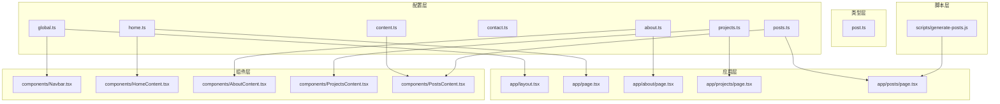
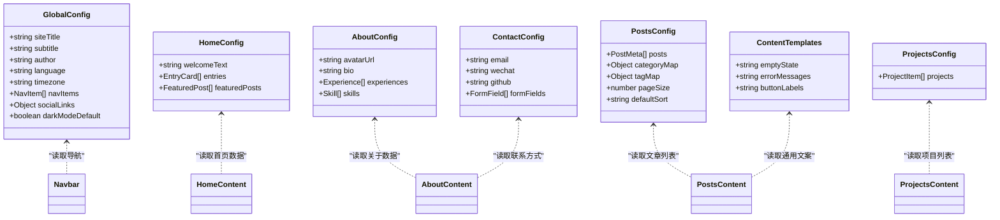
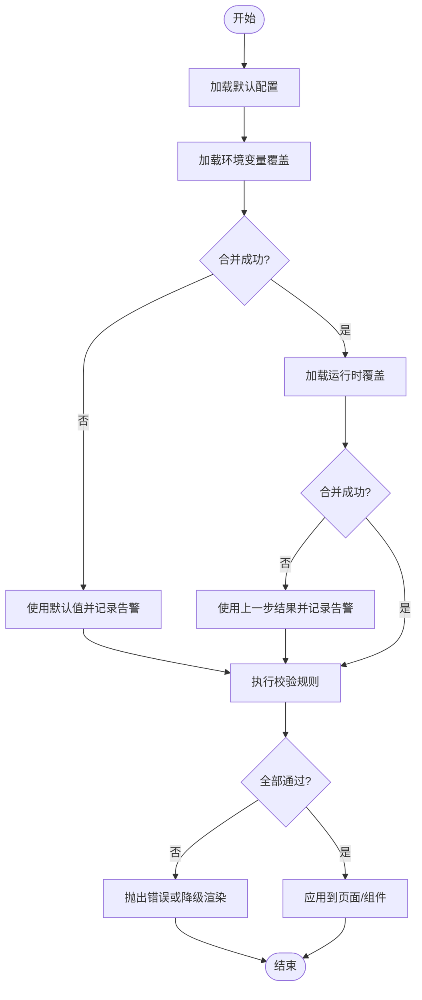
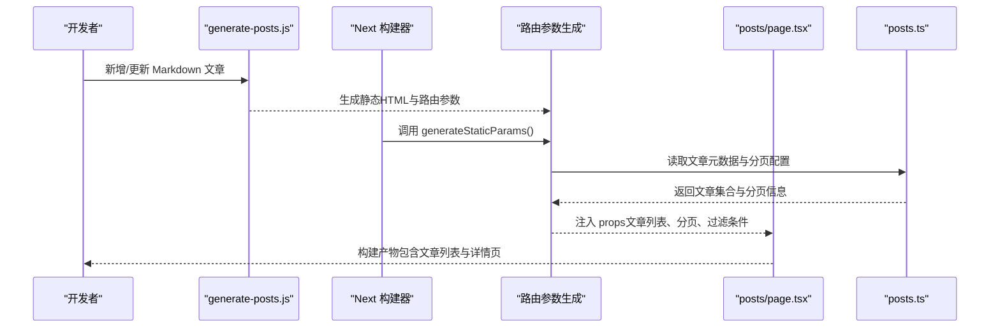
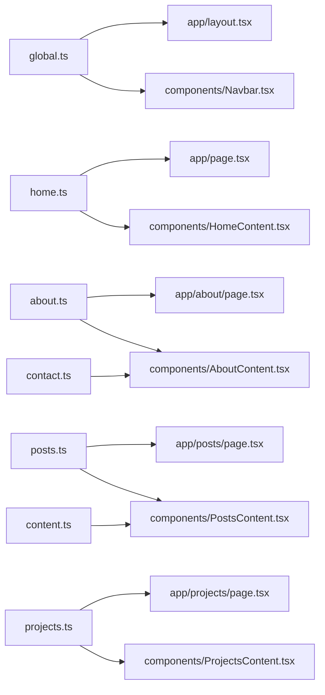

# 配置系统设计

<cite>
**本文引用的文件**   
- [src/config/global.ts](file://src/config/global.ts)
- [src/config/home.ts](file://src/config/home.ts)
- [src/config/about.ts](file://src/config/about.ts)
- [src/config/contact.ts](file://src/config/contact.ts)
- [src/config/posts.ts](file://src/config/posts.ts)
- [src/config/projects.ts](file://src/config/projects.ts)
- [src/config/content.ts](file://src/config/content.ts)
- [src/types/post.ts](file://src/types/post.ts)
- [src/app/layout.tsx](file://src/app/layout.tsx)
- [src/app/page.tsx](file://src/app/page.tsx)
- [src/app/about/page.tsx](file://src/app/about/page.tsx)
- [src/app/projects/page.tsx](file://src/app/projects/page.tsx)
- [src/app/posts/page.tsx](file://src/app/posts/page.tsx)
- [src/components/Navbar.tsx](file://src/components/Navbar.tsx)
- [src/components/HomeContent.tsx](file://src/components/HomeContent.tsx)
- [src/components/AboutContent.tsx](file://src/components/AboutContent.tsx)
- [src/components/ProjectsContent.tsx](file://src/components/ProjectsContent.tsx)
- [src/components/PostsContent.tsx](file://src/components/PostsContent.tsx)
- [scripts/generate-posts.js](file://scripts/generate-posts.js)
- [next.config.js](file://next.config.js)
</cite>

## 目录
1. [简介](#简介)
2. [项目结构](#项目结构)
3. [核心组件](#核心组件)
4. [架构总览](#架构总览)
5. [详细组件分析](#详细组件分析)
6. [依赖关系分析](#依赖关系分析)
7. [性能考虑](#性能考虑)
8. [故障排查指南](#故障排查指南)
9. [结论](#结论)
10. [附录](#附录)

## 简介
本设计文档围绕博客项目的“集中化配置管理”展开，目标是：
- 明确配置文件的组织结构与数据类型定义
- 说明配置项的继承与覆盖机制
- 解释配置驱动的页面生成与动态内容渲染流程
- 给出配置的验证规则与默认值处理策略
- 描述热重载与开发体验优化方案
- 提供配置架构图、模块依赖图以及版本管理与迁移策略
- 提供扩展与自定义的配置开发指南

## 项目结构
本项目采用“按领域拆分 + 集中聚合”的配置组织方式。所有业务域配置集中在 src/config 下，类型定义集中于 src/types，页面与组件通过导入配置进行渲染。脚本层负责将 Markdown 内容转换为静态 HTML 并输出到 app/posts 对应路由。

图表来源
- [src/config/global.ts](file://src/config/global.ts)
- [src/config/home.ts](file://src/config/home.ts)
- [src/config/about.ts](file://src/config/about.ts)
- [src/config/contact.ts](file://src/config/contact.ts)
- [src/config/posts.ts](file://src/config/posts.ts)
- [src/config/projects.ts](file://src/config/projects.ts)
- [src/config/content.ts](file://src/config/content.ts)
- [src/types/post.ts](file://src/types/post.ts)
- [src/app/layout.tsx](file://src/app/layout.tsx)
- [src/app/page.tsx](file://src/app/page.tsx)
- [src/app/about/page.tsx](file://src/app/about/page.tsx)
- [src/app/projects/page.tsx](file://src/app/projects/page.tsx)
- [src/app/posts/page.tsx](file://src/app/posts/page.tsx)
- [src/components/Navbar.tsx](file://src/components/Navbar.tsx)
- [src/components/HomeContent.tsx](file://src/components/HomeContent.tsx)
- [src/components/AboutContent.tsx](file://src/components/AboutContent.tsx)
- [src/components/ProjectsContent.tsx](file://src/components/ProjectsContent.tsx)
- [src/components/PostsContent.tsx](file://src/components/PostsContent.tsx)
- [scripts/generate-posts.js](file://scripts/generate-posts.js)

章节来源
- [src/config/global.ts](file://src/config/global.ts)
- [src/config/home.ts](file://src/config/home.ts)
- [src/config/about.ts](file://src/config/about.ts)
- [src/config/contact.ts](file://src/config/contact.ts)
- [src/config/posts.ts](file://src/config/posts.ts)
- [src/config/projects.ts](file://src/config/projects.ts)
- [src/config/content.ts](file://src/config/content.ts)
- [src/types/post.ts](file://src/types/post.ts)
- [src/app/layout.tsx](file://src/app/layout.tsx)
- [src/app/page.tsx](file://src/app/page.tsx)
- [src/app/about/page.tsx](file://src/app/about/page.tsx)
- [src/app/projects/page.tsx](file://src/app/projects/page.tsx)
- [src/app/posts/page.tsx](file://src/app/posts/page.tsx)
- [src/components/Navbar.tsx](file://src/components/Navbar.tsx)
- [src/components/HomeContent.tsx](file://src/components/HomeContent.tsx)
- [src/components/AboutContent.tsx](file://src/components/AboutContent.tsx)
- [src/components/ProjectsContent.tsx](file://src/components/ProjectsContent.tsx)
- [src/components/PostsContent.tsx](file://src/components/PostsContent.tsx)
- [scripts/generate-posts.js](file://scripts/generate-posts.js)

## 核心组件
- 全局配置（站点元信息、导航、主题等）
  - 职责：提供站点级常量、导航菜单、SEO 基础信息、主题开关等
  - 典型字段：站点标题、副标题、作者、语言、时区、导航条目、社交链接、主题偏好
  - 使用位置：布局、导航、页脚等全局组件
- 首页配置（首屏文案、入口卡片、推荐文章等）
  - 职责：控制首页展示内容与交互
  - 典型字段：欢迎语、功能入口、精选文章列表
  - 使用位置：首页页面与首页内容组件
- 关于页配置（个人介绍、时间线、技能标签等）
  - 职责：驱动关于页面的结构化展示
  - 典型字段：头像、简介、经历、技能、联系方式
  - 使用位置：关于页页面与内容组件
- 联系配置（表单字段、邮箱、即时通讯等）
  - 职责：统一对外联系方式与表单校验提示
  - 典型字段：邮箱、微信、GitHub、表单字段定义
  - 使用位置：关于页或独立联系区域
- 文章配置（文章列表、分类、标签、排序、分页等）
  - 职责：驱动文章列表、搜索、过滤、分页与摘要
  - 典型字段：文章集合、分类映射、标签映射、默认排序、分页大小
  - 使用位置：文章列表页与文章详情相关逻辑
- 项目配置（项目列表、技术栈、演示链接等）
  - 职责：驱动项目展示与筛选
  - 典型字段：项目数组、状态、技术栈、链接
  - 使用位置：项目页与内容组件
- 内容模板配置（通用文案、占位符、国际化键等）
  - 职责：抽取跨页面重复文案与占位文本
  - 典型字段：错误提示、空状态文案、按钮文案
  - 使用位置：各内容组件

章节来源
- [src/config/global.ts](file://src/config/global.ts)
- [src/config/home.ts](file://src/config/home.ts)
- [src/config/about.ts](file://src/config/about.ts)
- [src/config/contact.ts](file://src/config/contact.ts)
- [src/config/posts.ts](file://src/config/posts.ts)
- [src/config/projects.ts](file://src/config/projects.ts)
- [src/config/content.ts](file://src/config/content.ts)

## 架构总览
配置系统采用“分层 + 聚合”的架构：
- 类型层：在 src/types 中定义强类型约束，确保配置数据结构稳定
- 配置层：在 src/config 中按领域拆分配置对象，并提供导出接口
- 应用层：页面与组件按需导入配置，完成数据绑定与渲染
- 脚本层：构建期将 Markdown 转为静态 HTML，配合 posts 配置生成路由参数

图表来源
- [src/config/global.ts](file://src/config/global.ts)
- [src/config/home.ts](file://src/config/home.ts)
- [src/config/about.ts](file://src/config/about.ts)
- [src/config/contact.ts](file://src/config/contact.ts)
- [src/config/posts.ts](file://src/config/posts.ts)
- [src/config/projects.ts](file://src/config/projects.ts)
- [src/config/content.ts](file://src/config/content.ts)
- [src/components/Navbar.tsx](file://src/components/Navbar.tsx)
- [src/components/HomeContent.tsx](file://src/components/HomeContent.tsx)
- [src/components/AboutContent.tsx](file://src/components/AboutContent.tsx)
- [src/components/ProjectsContent.tsx](file://src/components/ProjectsContent.tsx)
- [src/components/PostsContent.tsx](file://src/components/PostsContent.tsx)

## 详细组件分析

### 配置加载与合并流程（继承与覆盖）
- 设计目标
  - 支持“默认配置 + 环境覆盖 + 运行时覆盖”的多层合并
  - 保证关键配置不可缺失，非关键配置具备合理默认值
- 实现要点
  - 默认配置：位于各域配置文件内，作为最终生效的基础
  - 环境覆盖：通过环境变量注入（如站点域名、API 地址、第三方密钥等），在构建期或运行期替换
  - 运行时覆盖：由上层页面或组件传入局部覆盖对象，用于 A/B 测试或个性化展示
- 合并顺序（优先级从低到高）
  - 默认配置 → 环境覆盖 → 运行时覆盖
- 校验与回退
  - 对必填字段进行存在性与类型校验
  - 校验失败时记录警告并使用默认值，避免阻断渲染

图表来源
- [src/config/global.ts](file://src/config/global.ts)
- [src/config/home.ts](file://src/config/home.ts)
- [src/config/about.ts](file://src/config/about.ts)
- [src/config/contact.ts](file://src/config/contact.ts)
- [src/config/posts.ts](file://src/config/posts.ts)
- [src/config/projects.ts](file://src/config/projects.ts)
- [src/config/content.ts](file://src/config/content.ts)

章节来源
- [src/config/global.ts](file://src/config/global.ts)
- [src/config/home.ts](file://src/config/home.ts)
- [src/config/about.ts](file://src/config/about.ts)
- [src/config/contact.ts](file://src/config/contact.ts)
- [src/config/posts.ts](file://src/config/posts.ts)
- [src/config/projects.ts](file://src/config/projects.ts)
- [src/config/content.ts](file://src/config/content.ts)

### 配置驱动的页面生成与动态渲染
- 文章列表页
  - 输入：posts 配置（文章元数据、分类、标签、排序、分页）
  - 处理：根据配置计算分页、过滤、排序；结合 generateStaticParams 生成静态路由参数
  - 输出：文章列表页与详情页路由
- 首页与关于页
  - 输入：home 与 about 配置
  - 处理：将结构化数据映射为 UI 区块
  - 输出：静态渲染的首屏与关于内容
- 项目页
  - 输入：projects 配置
  - 处理：按技术栈或状态筛选展示
  - 输出：项目卡片与详情

图表来源
- [scripts/generate-posts.js](file://scripts/generate-posts.js)
- [src/app/posts/page.tsx](file://src/app/posts/page.tsx)
- [src/config/posts.ts](file://src/config/posts.ts)

章节来源
- [scripts/generate-posts.js](file://scripts/generate-posts.js)
- [src/app/posts/page.tsx](file://src/app/posts/page.tsx)
- [src/config/posts.ts](file://src/config/posts.ts)

### 配置的数据类型与校验规则
- 类型定义
  - 在 src/types/post.ts 中定义文章元数据、分类、标签等结构
  - 在各配置文件中遵循类型约束，避免运行时错误
- 校验规则建议
  - 必填性：站点标题、作者、导航条目、文章 ID 等必须存在
  - 唯一性：文章 slug、分类 key、标签 key 应唯一
  - 格式：URL、邮箱、日期等需符合正则或内置校验
  - 范围：分页大小、最大显示数量应在合理区间
- 默认值处理
  - 对可选字段提供合理的默认值，确保页面可降级渲染
  - 当校验失败时，记录告警并回退到默认值，不中断构建

章节来源
- [src/types/post.ts](file://src/types/post.ts)
- [src/config/posts.ts](file://src/config/posts.ts)

### 配置的热重载与开发体验优化
- 开发期热重载
  - 修改 src/config 下的配置后，Next 开发服务器自动刷新页面
  - 建议在配置变更时仅触发受影响组件的增量更新，减少全量重绘
- 本地调试增强
  - 提供配置预览面板，快速查看当前生效的配置快照
  - 在控制台输出配置差异与告警信息，便于定位问题
- 构建期优化
  - 将纯静态配置在构建期内联，减少运行时开销
  - 对大体积配置进行分块加载，按需引入

章节来源
- [src/config/global.ts](file://src/config/global.ts)
- [src/config/home.ts](file://src/config/home.ts)
- [src/config/about.ts](file://src/config/about.ts)
- [src/config/contact.ts](file://src/config/contact.ts)
- [src/config/posts.ts](file://src/config/posts.ts)
- [src/config/projects.ts](file://src/config/projects.ts)
- [src/config/content.ts](file://src/config/content.ts)

### 配置的版本管理与迁移策略
- 版本化
  - 为配置对象增加版本号字段，便于兼容旧版本数据
  - 在升级时根据版本号执行迁移函数，将旧结构转换为新结构
- 迁移策略
  - 向后兼容：保留旧字段至少一个主版本周期，并在日志中标记弃用
  - 渐进式迁移：优先在新环境中启用新结构，逐步推广至生产
  - 回滚预案：保留旧配置快照，出现问题时可快速回滚
- 发布检查清单
  - 确认所有必填字段存在且类型正确
  - 确认迁移脚本通过单元测试
  - 确认构建产物不包含敏感信息

章节来源
- [src/config/global.ts](file://src/config/global.ts)
- [src/config/posts.ts](file://src/config/posts.ts)

### 配置扩展与自定义开发指南
- 新增配置域
  - 在 src/config 下新建配置文件，定义数据结构与默认值
  - 在 src/types 中补充类型定义，确保类型安全
  - 在页面或组件中按需导入并使用
- 覆盖机制
  - 通过环境变量注入站点级覆盖（如域名、密钥）
  - 通过运行时参数注入页面级覆盖（如 A/B 实验）
- 最佳实践
  - 单一职责：每个配置文件只关注一个领域
  - 最小暴露：仅导出必要的字段，隐藏内部实现细节
  - 可观测性：在关键路径添加日志与指标，便于监控

章节来源
- [src/config/global.ts](file://src/config/global.ts)
- [src/config/home.ts](file://src/config/home.ts)
- [src/config/about.ts](file://src/config/about.ts)
- [src/config/contact.ts](file://src/config/contact.ts)
- [src/config/posts.ts](file://src/config/posts.ts)
- [src/config/projects.ts](file://src/config/projects.ts)
- [src/config/content.ts](file://src/config/content.ts)
- [src/types/post.ts](file://src/types/post.ts)

## 依赖关系分析
配置层与应用层的依赖关系如下：
- 全局配置被布局与导航组件依赖
- 首页配置被首页页面与内容组件依赖
- 关于与联系配置被关于页与内容组件依赖
- 文章配置被文章列表页与内容组件依赖
- 项目配置被项目页与内容组件依赖
- 内容模板配置被多个内容组件共享

图表来源
- [src/config/global.ts](file://src/config/global.ts)
- [src/config/home.ts](file://src/config/home.ts)
- [src/config/about.ts](file://src/config/about.ts)
- [src/config/contact.ts](file://src/config/contact.ts)
- [src/config/posts.ts](file://src/config/posts.ts)
- [src/config/projects.ts](file://src/config/projects.ts)
- [src/config/content.ts](file://src/config/content.ts)
- [src/app/layout.tsx](file://src/app/layout.tsx)
- [src/app/page.tsx](file://src/app/page.tsx)
- [src/app/about/page.tsx](file://src/app/about/page.tsx)
- [src/app/projects/page.tsx](file://src/app/projects/page.tsx)
- [src/app/posts/page.tsx](file://src/app/posts/page.tsx)
- [src/components/Navbar.tsx](file://src/components/Navbar.tsx)
- [src/components/HomeContent.tsx](file://src/components/HomeContent.tsx)
- [src/components/AboutContent.tsx](file://src/components/AboutContent.tsx)
- [src/components/ProjectsContent.tsx](file://src/components/ProjectsContent.tsx)
- [src/components/PostsContent.tsx](file://src/components/PostsContent.tsx)

章节来源
- [src/config/global.ts](file://src/config/global.ts)
- [src/config/home.ts](file://src/config/home.ts)
- [src/config/about.ts](file://src/config/about.ts)
- [src/config/contact.ts](file://src/config/contact.ts)
- [src/config/posts.ts](file://src/config/posts.ts)
- [src/config/projects.ts](file://src/config/projects.ts)
- [src/config/content.ts](file://src/config/content.ts)
- [src/app/layout.tsx](file://src/app/layout.tsx)
- [src/app/page.tsx](file://src/app/page.tsx)
- [src/app/about/page.tsx](file://src/app/about/page.tsx)
- [src/app/projects/page.tsx](file://src/app/projects/page.tsx)
- [src/app/posts/page.tsx](file://src/app/posts/page.tsx)
- [src/components/Navbar.tsx](file://src/components/Navbar.tsx)
- [src/components/HomeContent.tsx](file://src/components/HomeContent.tsx)
- [src/components/AboutContent.tsx](file://src/components/AboutContent.tsx)
- [src/components/ProjectsContent.tsx](file://src/components/ProjectsContent.tsx)
- [src/components/PostsContent.tsx](file://src/components/PostsContent.tsx)

## 性能考虑
- 构建期内联静态配置，减少运行时解析成本
- 对大体积配置进行分块与懒加载，仅在需要时引入
- 使用稳定的引用与缓存策略，避免不必要的重新渲染
- 在开发模式开启配置差异日志，在生产模式关闭冗余日志

[本节为通用指导，无需特定文件来源]

## 故障排查指南
- 常见问题
  - 配置缺失或类型错误导致渲染异常
  - 环境变量未正确注入导致站点行为不一致
  - 文章路由参数生成失败导致 404
- 排查步骤
  - 检查配置文件的必填字段与类型定义是否一致
  - 确认环境变量在开发与生产环境均已设置
  - 查看构建日志中的告警与错误信息
  - 使用配置预览面板对比期望与实际生效值
- 恢复策略
  - 回滚到上一个稳定版本的配置快照
  - 临时禁用有问题的配置项，使用默认值保障可用性

章节来源
- [src/config/global.ts](file://src/config/global.ts)
- [src/config/posts.ts](file://src/config/posts.ts)
- [scripts/generate-posts.js](file://scripts/generate-posts.js)

## 结论
本配置系统以“分层 + 聚合”为核心，实现了清晰的职责划分与良好的可扩展性。通过类型约束、校验与默认值机制，保障了配置的安全性与稳定性；通过继承与覆盖机制，满足了多环境与个性化的需求；通过构建期脚本与静态路由生成，提升了开发效率与用户体验。后续可在可观测性、自动化测试与迁移工具方面持续完善。

[本节为总结性内容，无需特定文件来源]

## 附录
- 术语表
  - 配置域：按业务划分的配置集合，如全局、首页、文章等
  - 覆盖：在默认配置基础上进行的替换或追加
  - 迁移：将旧版配置结构转换为新版结构的处理过程
- 参考文件
  - 配置定义：src/config/*
  - 类型定义：src/types/post.ts
  - 页面与组件：src/app/*, src/components/*
  - 构建脚本：scripts/generate-posts.js
  - 框架配置：next.config.js

章节来源
- [src/config/global.ts](file://src/config/global.ts)
- [src/config/home.ts](file://src/config/home.ts)
- [src/config/about.ts](file://src/config/about.ts)
- [src/config/contact.ts](file://src/config/contact.ts)
- [src/config/posts.ts](file://src/config/posts.ts)
- [src/config/projects.ts](file://src/config/projects.ts)
- [src/config/content.ts](file://src/config/content.ts)
- [src/types/post.ts](file://src/types/post.ts)
- [src/app/layout.tsx](file://src/app/layout.tsx)
- [src/app/page.tsx](file://src/app/page.tsx)
- [src/app/about/page.tsx](file://src/app/about/page.tsx)
- [src/app/projects/page.tsx](file://src/app/projects/page.tsx)
- [src/app/posts/page.tsx](file://src/app/posts/page.tsx)
- [src/components/Navbar.tsx](file://src/components/Navbar.tsx)
- [src/components/HomeContent.tsx](file://src/components/HomeContent.tsx)
- [src/components/AboutContent.tsx](file://src/components/AboutContent.tsx)
- [src/components/ProjectsContent.tsx](file://src/components/ProjectsContent.tsx)
- [src/components/PostsContent.tsx](file://src/components/PostsContent.tsx)
- [scripts/generate-posts.js](file://scripts/generate-posts.js)
- [next.config.js](file://next.config.js)