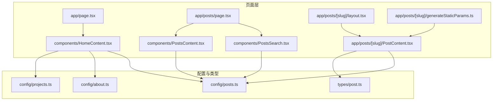
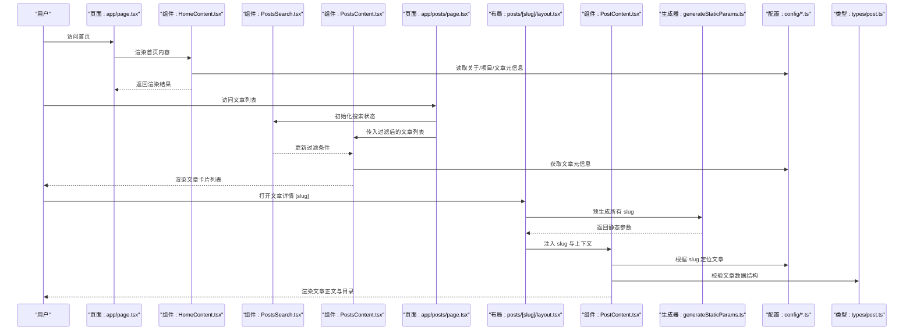
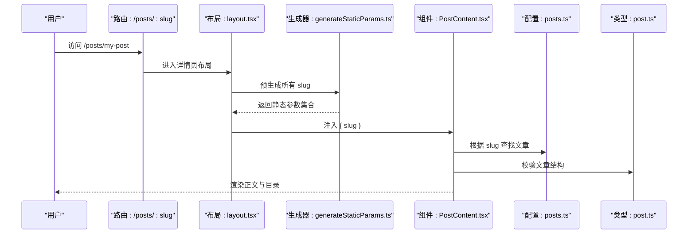
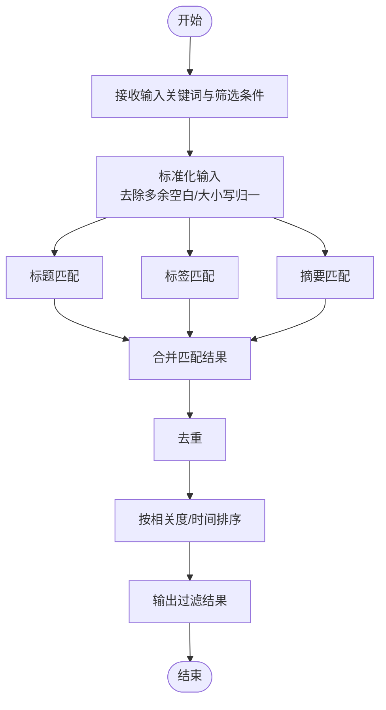
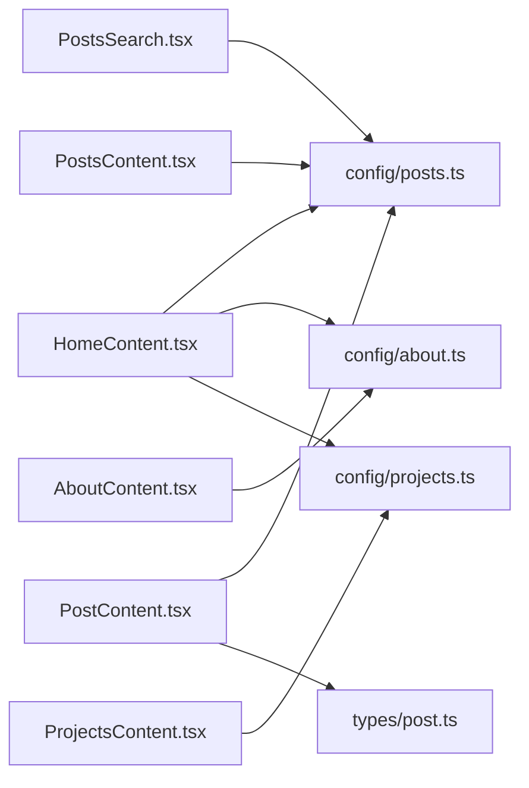

# 功能组件

<cite>
**本文引用的文件**   
- [HomeContent.tsx](file://src/components/HomeContent.tsx)
- [PostsSearch.tsx](file://src/components/PostsSearch.tsx)
- [PostsContent.tsx](file://src/components/PostsContent.tsx)
- [AboutContent.tsx](file://src/components/AboutContent.tsx)
- [ProjectsContent.tsx](file://src/components/ProjectsContent.tsx)
- [PostContent.tsx](file://src/app/posts/[slug]/PostContent.tsx)
- [posts.ts](file://src/config/posts.ts)
- [about.ts](file://src/config/about.ts)
- [projects.ts](file://src/config/projects.ts)
- [post.ts](file://src/types/post.ts)
- [page.tsx](file://src/app/page.tsx)
- [page.tsx](file://src/app/posts/page.tsx)
- [layout.tsx](file://src/app/posts/[slug]/layout.tsx)
- [generateStaticParams.ts](file://src/app/posts/[slug]/generateStaticParams.ts)
</cite>

## 目录
1. [简介](#简介)
2. [项目结构](#项目结构)
3. [核心组件](#核心组件)
4. [架构总览](#架构总览)
5. [详细组件分析](#详细组件分析)
6. [依赖关系分析](#依赖关系分析)
7. [性能考虑](#性能考虑)
8. [故障排查指南](#故障排查指南)
9. [结论](#结论)
10. [附录](#附录)

## 简介
本技术文档聚焦于博客应用中的六大功能型组件：首页内容(HomeContent)、文章搜索(PostsSearch)、文章内容列表(PostsContent)、关于内容(AboutContent)、项目内容(ProjectsContent)与文章详情(PostContent)。文档从业务逻辑、数据处理流程、状态管理、组件通信、事件处理与交互、配置与扩展、性能优化、错误处理与异常恢复等维度进行系统化说明，并辅以架构图、类图、时序图和流程图，帮助新开发者快速理解与集成这些组件。

## 项目结构
该仓库采用 Next.js App Router 组织页面路由，功能组件集中于 src/components，静态数据通过 src/config 下的配置文件提供，类型定义位于 src/types。文章详情页使用动态路由 [slug]，并通过 generateStaticParams 预生成静态参数。

图表来源
- [page.tsx](file://src/app/page.tsx)
- [HomeContent.tsx](file://src/components/HomeContent.tsx)
- [page.tsx](file://src/app/posts/page.tsx)
- [PostsSearch.tsx](file://src/components/PostsSearch.tsx)
- [PostsContent.tsx](file://src/components/PostsContent.tsx)
- [layout.tsx](file://src/app/posts/[slug]/layout.tsx)
- [PostContent.tsx](file://src/app/posts/[slug]/PostContent.tsx)
- [generateStaticParams.ts](file://src/app/posts/[slug]/generateStaticParams.ts)
- [posts.ts](file://src/config/posts.ts)
- [about.ts](file://src/config/about.ts)
- [projects.ts](file://src/config/projects.ts)
- [post.ts](file://src/types/post.ts)

章节来源
- [page.tsx](file://src/app/page.tsx)
- [page.tsx](file://src/app/posts/page.tsx)
- [layout.tsx](file://src/app/posts/[slug]/layout.tsx)
- [generateStaticParams.ts](file://src/app/posts/[slug]/generateStaticParams.ts)

## 核心组件
本节概述各组件的职责边界与协作方式：
- HomeContent：聚合首页展示所需的数据（如置顶文章、关于摘要、项目概览），负责渲染入口区域与关键信息卡片。
- PostsSearch：提供关键词过滤与分类筛选能力，维护本地搜索状态，向父级或同级组件输出过滤结果。
- PostsContent：基于 PostsSearch 的过滤条件渲染文章列表，支持分页/懒加载（视实现而定）和点击跳转至文章详情。
- AboutContent：渲染关于页内容，数据来源为 about 配置，包含个人简介、技能栈、经历时间线等。
- ProjectsContent：渲染项目列表，数据来源为 projects 配置，支持按标签/技术栈筛选与外部链接跳转。
- PostContent：根据 URL 中的 slug 解析文章元信息与正文，负责 Markdown 渲染、目录导航、阅读进度条等增强体验。

章节来源
- [HomeContent.tsx](file://src/components/HomeContent.tsx)
- [PostsSearch.tsx](file://src/components/PostsSearch.tsx)
- [PostsContent.tsx](file://src/components/PostsContent.tsx)
- [AboutContent.tsx](file://src/components/AboutContent.tsx)
- [ProjectsContent.tsx](file://src/components/ProjectsContent.tsx)
- [PostContent.tsx](file://src/app/posts/[slug]/PostContent.tsx)

## 架构总览
下图展示了页面到组件再到配置与类型的数据流向，以及文章详情的静态参数生成过程。

图表来源
- [page.tsx](file://src/app/page.tsx)
- [HomeContent.tsx](file://src/components/HomeContent.tsx)
- [page.tsx](file://src/app/posts/page.tsx)
- [PostsSearch.tsx](file://src/components/PostsSearch.tsx)
- [PostsContent.tsx](file://src/components/PostsContent.tsx)
- [layout.tsx](file://src/app/posts/[slug]/layout.tsx)
- [PostContent.tsx](file://src/app/posts/[slug]/PostContent.tsx)
- [generateStaticParams.ts](file://src/app/posts/[slug]/generateStaticParams.ts)
- [posts.ts](file://src/config/posts.ts)
- [about.ts](file://src/config/about.ts)
- [projects.ts](file://src/config/projects.ts)
- [post.ts](file://src/types/post.ts)

## 详细组件分析

### 首页内容(HomeContent)
- 职责与业务逻辑
  - 聚合首页所需的关键信息：例如精选文章、关于摘要、项目概览等。
  - 将来自多个配置模块的数据组合后渲染为区块卡片。
- 数据处理流程
  - 从 posts、about、projects 配置中拉取必要字段。
  - 对数据进行轻量清洗与排序（如按发布时间、是否置顶）。
- 状态管理
  - 作为无状态展示组件，主要接收 props；若需要交互（如切换主题、滚动锚点），可通过回调向上通知。
- 组件通信
  - 通过 props 向下传递数据，通过回调函数与父页面通信。
- 事件与交互
  - 点击卡片跳转到对应页面（文章列表、关于、项目）。
- 配置与扩展
  - 新增首页区块时，可在配置文件中追加条目，并在组件中增加相应渲染分支。
- 性能优化
  - 避免在渲染过程中进行昂贵计算；必要时对大块数据进行 memo 化。
- 错误处理
  - 当配置缺失或格式异常时，降级显示占位内容并记录日志。

章节来源
- [HomeContent.tsx](file://src/components/HomeContent.tsx)
- [posts.ts](file://src/config/posts.ts)
- [about.ts](file://src/config/about.ts)
- [projects.ts](file://src/config/projects.ts)

### 文章搜索(PostsSearch)
- 职责与业务逻辑
  - 提供关键词搜索与分类筛选，维护本地搜索状态。
- 数据处理流程
  - 监听输入变化，对文章标题、标签、摘要进行模糊匹配。
  - 合并多条件（关键词 + 分类）得到最终过滤结果。
- 状态管理
  - 使用本地状态保存关键词与筛选条件；可配合受控模式由父组件同步。
- 组件通信
  - 通过回调向父组件推送过滤结果或当前筛选条件。
- 事件与交互
  - 输入框 onChange、下拉选择 onChange、清空按钮 onClick。
- 配置与扩展
  - 筛选维度来源于 posts 配置的分类字段；可扩展更多筛选条件。
- 性能优化
  - 防抖输入以减少频繁过滤；对大型列表使用惰性渲染或虚拟列表。
- 错误处理
  - 对非法输入进行容错处理，确保不会抛出异常导致渲染中断。

章节来源
- [PostsSearch.tsx](file://src/components/PostsSearch.tsx)
- [posts.ts](file://src/config/posts.ts)

### 文章内容(PostsContent)
- 职责与业务逻辑
  - 根据 PostsSearch 的过滤结果渲染文章卡片列表。
  - 支持分页/无限滚动（视实现）、点击跳转至文章详情。
- 数据处理流程
  - 从 posts 配置获取文章元信息，结合过滤条件生成列表。
- 状态管理
  - 通常无内部复杂状态，主要依赖 props 驱动渲染。
- 组件通信
  - 接收过滤后的文章数组与跳转回调。
- 事件与交互
  - 卡片点击触发路由跳转；可选加载更多。
- 配置与扩展
  - 卡片样式与字段映射可通过 props 或主题配置定制。
- 性能优化
  - 列表项 memo 化；图片懒加载；按需渲染长列表。
- 错误处理
  - 空列表友好提示；网络或数据异常时回退到默认视图。

章节来源
- [PostsContent.tsx](file://src/components/PostsContent.tsx)
- [PostsSearch.tsx](file://src/components/PostsSearch.tsx)
- [posts.ts](file://src/config/posts.ts)

### 关于内容(AboutContent)
- 职责与业务逻辑
  - 渲染关于页的个人简介、技能、经历时间线等。
- 数据处理流程
  - 从 about 配置读取结构化数据，转换为 UI 区块。
- 状态管理
  - 无状态展示为主；如需展开/折叠，可使用本地状态。
- 组件通信
  - 通过 props 接收配置数据；必要时与父页面共享主题或语言设置。
- 事件与交互
  - 时间线展开/收起、外链跳转。
- 配置与扩展
  - 新增经历或技能只需在 about 配置中追加条目。
- 性能优化
  - 大段文本分块渲染；图片懒加载。
- 错误处理
  - 配置缺失时显示占位内容；外链失败给出提示。

章节来源
- [AboutContent.tsx](file://src/components/AboutContent.tsx)
- [about.ts](file://src/config/about.ts)

### 项目内容(ProjectsContent)
- 职责与业务逻辑
  - 渲染项目列表，支持按标签/技术栈筛选与跳转。
- 数据处理流程
  - 从 projects 配置读取项目元信息，按筛选条件过滤。
- 状态管理
  - 本地维护筛选条件；可持久化到 URL 查询参数以便分享。
- 组件通信
  - 通过 props 接收项目数据与筛选回调。
- 事件与交互
  - 标签筛选、项目卡片点击跳转。
- 配置与扩展
  - 新增项目或标签仅需更新 projects 配置。
- 性能优化
  - 列表项 memo 化；图片懒加载；筛选结果缓存。
- 错误处理
  - 空项目集友好提示；外链不可达时降级处理。

章节来源
- [ProjectsContent.tsx](file://src/components/ProjectsContent.tsx)
- [projects.ts](file://src/config/projects.ts)

### 文章详情(PostContent)
- 职责与业务逻辑
  - 根据 URL 中的 slug 定位文章，渲染正文与目录导航。
- 数据处理流程
  - 通过 generateStaticParams 预生成所有 slug；在页面渲染阶段根据 slug 从 posts 配置获取文章元信息与正文路径。
- 状态管理
  - 可能包含目录高亮、阅读进度、主题切换等局部状态。
- 组件通信
  - 从 layout 注入 slug 与全局上下文；自身不直接依赖父组件状态。
- 事件与交互
  - 目录锚点滚动、复制代码、回到顶部。
- 配置与扩展
  - 自定义目录生成策略、代码高亮主题、阅读进度阈值等。
- 性能优化
  - 正文分段渲染；目录节点懒渲染；图片懒加载。
- 错误处理
  - 文章不存在时返回 404 页面；Markdown 解析失败时降级显示纯文本。

章节来源
- [PostContent.tsx](file://src/app/posts/[slug]/PostContent.tsx)
- [layout.tsx](file://src/app/posts/[slug]/layout.tsx)
- [generateStaticParams.ts](file://src/app/posts/[slug]/generateStaticParams.ts)
- [posts.ts](file://src/config/posts.ts)
- [post.ts](file://src/types/post.ts)

#### 文章详情渲染时序

图表来源
- [layout.tsx](file://src/app/posts/[slug]/layout.tsx)
- [generateStaticParams.ts](file://src/app/posts/[slug]/generateStaticParams.ts)
- [PostContent.tsx](file://src/app/posts/[slug]/PostContent.tsx)
- [posts.ts](file://src/config/posts.ts)
- [post.ts](file://src/types/post.ts)

#### 搜索过滤算法流程

图表来源
- [PostsSearch.tsx](file://src/components/PostsSearch.tsx)
- [posts.ts](file://src/config/posts.ts)

## 依赖关系分析
- 组件与配置
  - HomeContent、PostsSearch、PostsContent、PostContent 均依赖 posts 配置；AboutContent 依赖 about 配置；ProjectsContent 依赖 projects 配置。
- 组件与类型
  - PostContent 严格遵循 post 类型定义，确保文章数据结构一致。
- 页面与组件
  - 首页与文章列表页分别承载 HomeContent 与 PostsSearch/PostsContent；文章详情页由 layout 与 PostContent 协同完成。

图表来源
- [HomeContent.tsx](file://src/components/HomeContent.tsx)
- [PostsSearch.tsx](file://src/components/PostsSearch.tsx)
- [PostsContent.tsx](file://src/components/PostsContent.tsx)
- [AboutContent.tsx](file://src/components/AboutContent.tsx)
- [ProjectsContent.tsx](file://src/components/ProjectsContent.tsx)
- [PostContent.tsx](file://src/app/posts/[slug]/PostContent.tsx)
- [posts.ts](file://src/config/posts.ts)
- [about.ts](file://src/config/about.ts)
- [projects.ts](file://src/config/projects.ts)
- [post.ts](file://src/types/post.ts)

章节来源
- [HomeContent.tsx](file://src/components/HomeContent.tsx)
- [PostsSearch.tsx](file://src/components/PostsSearch.tsx)
- [PostsContent.tsx](file://src/components/PostsContent.tsx)
- [AboutContent.tsx](file://src/components/AboutContent.tsx)
- [ProjectsContent.tsx](file://src/components/ProjectsContent.tsx)
- [PostContent.tsx](file://src/app/posts/[slug]/PostContent.tsx)
- [posts.ts](file://src/config/posts.ts)
- [about.ts](file://src/config/about.ts)
- [projects.ts](file://src/config/projects.ts)
- [post.ts](file://src/types/post.ts)

## 性能考虑
- 列表渲染优化
  - 对文章卡片与项目卡片使用 memo 化减少重复渲染。
  - 长列表采用虚拟滚动或分页加载，降低首屏压力。
- 搜索性能
  - 输入防抖，避免每次按键都触发全量过滤。
  - 对大型数据集建立倒排索引或预计算相关度分数。
- 图片与资源
  - 图片懒加载与响应式尺寸，减少带宽占用。
- 静态生成
  - 文章详情通过 generateStaticParams 预生成，提升访问速度。
- 状态最小化
  - 尽量将状态上提或外置，避免不必要的重渲染。

[本节为通用性能建议，无需特定文件引用]

## 故障排查指南
- 常见问题
  - 文章无法找到：检查 generateStaticParams 是否正确生成 slug，确认 posts 配置中存在对应条目。
  - 搜索无结果：确认关键词与标签字段是否存在，检查过滤逻辑的大小写与空白处理。
  - 列表不更新：确认 PostsSearch 的过滤结果是否正确传递给 PostsContent，检查 props 变更是否触发重渲染。
  - 详情页目录错位：检查目录生成逻辑与正文结构是否匹配。
- 调试建议
  - 在关键组件内打印输入与中间状态，确认数据流是否符合预期。
  - 使用浏览器开发者工具的网络面板检查静态资源加载情况。
- 错误恢复
  - 对缺失配置或解析失败的场景提供降级视图，保证用户体验。
  - 对外链跳转增加错误捕获与友好提示。

章节来源
- [generateStaticParams.ts](file://src/app/posts/[slug]/generateStaticParams.ts)
- [PostContent.tsx](file://src/app/posts/[slug]/PostContent.tsx)
- [PostsSearch.tsx](file://src/components/PostsSearch.tsx)
- [PostsContent.tsx](file://src/components/PostsContent.tsx)

## 结论
上述六大功能组件围绕“配置驱动 + 页面编排”的模式构建，职责清晰、耦合度低。通过统一的类型定义与配置结构，保证了数据的一致性与可维护性。在性能方面，借助静态生成、列表优化与搜索防抖等手段，实现了良好的首屏与交互体验。建议在后续迭代中继续完善错误监控与埋点，进一步提升稳定性与可观测性。

[本节为总结性内容，无需特定文件引用]

## 附录
- 开发集成步骤
  - 在配置文件中新增数据条目（文章/关于/项目）。
  - 在对应组件中接入新字段并进行渲染。
  - 在页面层引入组件并传入必要 props。
  - 运行构建验证静态参数生成与路由可用性。
- 最佳实践
  - 保持配置与类型同步更新。
  - 组件尽量无副作用，将副作用置于页面或布局层。
  - 对复杂交互进行单元测试与端到端测试覆盖。

[本节为通用指导，无需特定文件引用]