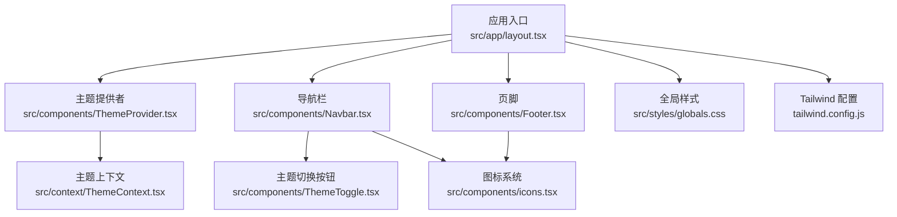
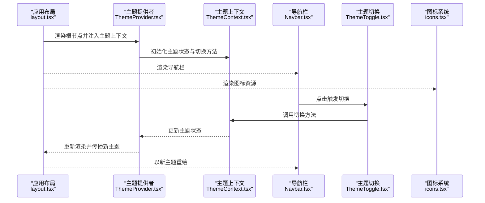
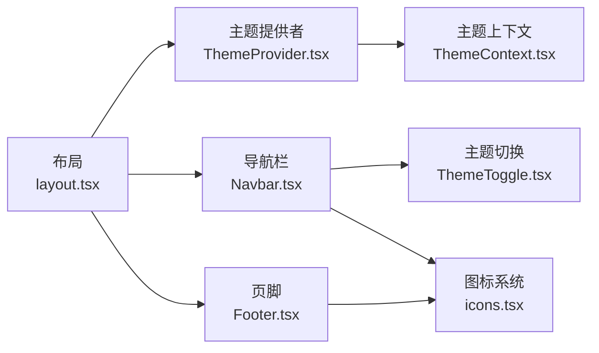

# 基础组件

<cite>
**本文引用的文件**   
- [Navbar.tsx](file://src/components/Navbar.tsx)
- [Footer.tsx](file://src/components/Footer.tsx)
- [ThemeToggle.tsx](file://src/components/ThemeToggle.tsx)
- [icons.tsx](file://src/components/icons.tsx)
- [ThemeProvider.tsx](file://src/components/ThemeProvider.tsx)
- [ThemeContext.tsx](file://src/context/ThemeContext.tsx)
- [layout.tsx](file://src/app/layout.tsx)
- [globals.css](file://src/styles/globals.css)
- [tailwind.config.js](file://tailwind.config.js)
</cite>

## 目录
1. [简介](#简介)
2. [项目结构](#项目结构)
3. [核心组件](#核心组件)
4. [架构总览](#架构总览)
5. [详细组件分析](#详细组件分析)
6. [依赖分析](#依赖分析)
7. [性能考虑](#性能考虑)
8. [故障排查指南](#故障排查指南)
9. [结论](#结论)
10. [附录](#附录)

## 简介
本文件面向新开发者与使用者，系统化梳理并文档化以下基础 UI 组件：导航栏（Navbar）、页脚（Footer）、主题切换（ThemeToggle）以及图标系统（Icons）。内容覆盖 Props 接口、事件处理器、自定义配置、响应式设计与无障碍访问支持、样式定制与主题集成、动画与交互体验、性能优化与浏览器兼容性，并提供扩展与二次开发的最佳实践。

## 项目结构
本项目采用 Next.js + React + TypeScript 技术栈，基础组件集中于 src/components 目录，主题上下文位于 src/context，全局样式与 Tailwind 配置分别位于 src/styles 与根目录。布局入口在 src/app/layout.tsx 中引入主题提供者与全局样式。

图表来源
- [layout.tsx](file://src/app/layout.tsx)
- [ThemeProvider.tsx](file://src/components/ThemeProvider.tsx)
- [ThemeContext.tsx](file://src/context/ThemeContext.tsx)
- [Navbar.tsx](file://src/components/Navbar.tsx)
- [Footer.tsx](file://src/components/Footer.tsx)
- [ThemeToggle.tsx](file://src/components/ThemeToggle.tsx)
- [icons.tsx](file://src/components/icons.tsx)
- [globals.css](file://src/styles/globals.css)
- [tailwind.config.js](file://tailwind.config.js)

章节来源
- [layout.tsx](file://src/app/layout.tsx)
- [ThemeProvider.tsx](file://src/components/ThemeProvider.tsx)
- [ThemeContext.tsx](file://src/context/ThemeContext.tsx)
- [Navbar.tsx](file://src/components/Navbar.tsx)
- [Footer.tsx](file://src/components/Footer.tsx)
- [ThemeToggle.tsx](file://src/components/ThemeToggle.tsx)
- [icons.tsx](file://src/components/icons.tsx)
- [globals.css](file://src/styles/globals.css)
- [tailwind.config.js](file://tailwind.config.js)

## 核心组件
本节概述各基础组件的职责与协作关系：
- Navbar：顶部导航区域，包含站点标识、主导航链接、移动端菜单开关与主题切换按钮。
- Footer：底部信息区，展示版权、社交链接等。
- ThemeToggle：用于切换当前主题（亮/暗），并与主题上下文联动。
- Icons：统一的图标渲染组件集合，提供一致的尺寸、颜色与无障碍属性。

章节来源
- [Navbar.tsx](file://src/components/Navbar.tsx)
- [Footer.tsx](file://src/components/Footer.tsx)
- [ThemeToggle.tsx](file://src/components/ThemeToggle.tsx)
- [icons.tsx](file://src/components/icons.tsx)

## 架构总览
主题系统通过 Context 提供当前主题状态与切换方法，页面级布局包裹主题提供者，确保所有子组件可读取与更新主题。导航栏与页脚作为常驻布局组件，使用图标系统统一视觉语言，并通过 Tailwind 实现响应式与主题色适配。

图表来源
- [layout.tsx](file://src/app/layout.tsx)
- [ThemeProvider.tsx](file://src/components/ThemeProvider.tsx)
- [ThemeContext.tsx](file://src/context/ThemeContext.tsx)
- [Navbar.tsx](file://src/components/Navbar.tsx)
- [ThemeToggle.tsx](file://src/components/ThemeToggle.tsx)
- [icons.tsx](file://src/components/icons.tsx)

## 详细组件分析

### 导航栏（Navbar）
职责与特性
- 展示站点标识与主导航链接，支持移动端折叠菜单。
- 集成主题切换按钮与图标系统。
- 通过 Tailwind 实现响应式布局与过渡动画。
- 提供键盘可达性与屏幕阅读器友好标签。

Props 接口（建议定义）
- brandHref: string — 品牌链接地址
- brandLabel: string — 品牌图片/文本的无障碍标签
- links: Array<{ label: string; href: string }> — 导航项列表
- mobileMenuOpen: boolean — 控制移动端菜单展开状态
- onToggleMobileMenu: (open: boolean) => void — 切换菜单回调
- themeToggleProps?: Partial<ThemeToggleProps> — 透传至主题切换按钮的配置

事件处理器
- onToggleMobileMenu：由外部状态驱动，避免内部维护状态导致不同步。
- 可选 onBrandClick：品牌点击处理（如返回主页或埋点）。

响应式设计
- 桌面端水平排列；移动端隐藏主菜单，显示汉堡按钮。
- 使用 Tailwind 断点控制显隐与间距。

无障碍访问
- 为汉堡按钮设置 aria-expanded 与 aria-controls。
- 为品牌与链接设置语义化标签与可聚焦性。

样式定制与主题集成
- 使用 Tailwind 类名与 CSS 变量进行主题色、背景与边框定制。
- 通过主题上下文获取当前主题，动态调整样式。

动画与交互
- 菜单展开/收起使用过渡动画。
- 悬停与焦点态提供清晰反馈。

最佳实践
- 将导航数据集中管理，便于维护与国际化。
- 避免在组件内维护复杂状态，尽量受控于父组件。

章节来源
- [Navbar.tsx](file://src/components/Navbar.tsx)
- [ThemeToggle.tsx](file://src/components/ThemeToggle.tsx)
- [icons.tsx](file://src/components/icons.tsx)
- [tailwind.config.js](file://tailwind.config.js)

### 页脚（Footer）
职责与特性
- 展示版权信息与社交链接。
- 使用图标系统渲染社交图标。
- 响应式布局与主题适配。

Props 接口（建议定义）
- copyrightText: string — 版权文案
- socialLinks: Array<{ icon: string; href: string; label: string }> — 社交链接列表
- className?: string — 自定义类名

事件处理器
- 无业务事件，仅链接跳转。

响应式设计
- 多列布局在小屏下自动堆叠。

无障碍访问
- 为每个社交链接提供明确的 aria-label。
- 使用语义化 footer 元素。

样式定制与主题集成
- 通过 Tailwind 与 CSS 变量控制配色与间距。
- 遵循主题系统的明暗对比度要求。

最佳实践
- 将社交链接与文案抽离到配置文件，便于维护。
- 对外暴露 className 以便局部覆盖样式。

章节来源
- [Footer.tsx](file://src/components/Footer.tsx)
- [icons.tsx](file://src/components/icons.tsx)
- [tailwind.config.js](file://tailwind.config.js)

### 主题切换（ThemeToggle）
职责与特性
- 提供切换亮/暗主题的交互控件。
- 与主题上下文联动，持久化用户偏好。
- 提供键盘操作与屏幕阅读器提示。

Props 接口（建议定义）
- size?: "sm" | "md" | "lg" — 尺寸
- showLabel?: boolean — 是否显示文字标签
- className?: string — 自定义类名
- onChange?: (theme: "light" | "dark") => void — 切换回调

事件处理器
- onClick：切换主题并触发 onChange。
- onKeyDown：支持 Enter/Space 触发切换。

响应式设计
- 小屏下可隐藏文字标签，仅保留图标。

无障碍访问
- 按钮具备 role="button" 与 aria-pressed 状态。
- 提供 aria-label 描述当前主题。

动画与交互
- 切换时图标旋转或淡入淡出。
- 焦点态与悬停态清晰可见。

最佳实践
- 优先从主题上下文读取当前主题，避免重复状态。
- 将用户偏好存储于 localStorage，并在首次加载时同步到上下文。

章节来源
- [ThemeToggle.tsx](file://src/components/ThemeToggle.tsx)
- [ThemeContext.tsx](file://src/context/ThemeContext.tsx)
- [icons.tsx](file://src/components/icons.tsx)

### 图标系统（Icons）
职责与特性
- 统一图标渲染入口，保证一致尺寸、颜色与无障碍属性。
- 支持按名称选择图标，并可传入额外属性。

Props 接口（建议定义）
- name: string — 图标名称
- size?: number — 尺寸（px）
- color?: string — 颜色（继承或指定）
- className?: string — 自定义类名
- title?: string — 标题（用于无障碍）
- desc?: string — 描述（用于无障碍）

事件处理器
- 无事件，纯展示型组件。

响应式设计
- 通过 size 与 Tailwind 类名适配不同场景。

无障碍访问
- 默认 role="img"，title/desc 提升可读性。
- 装饰性图标可设置 aria-hidden="true"。

样式定制与主题集成
- 颜色可通过 color 或 CSS 变量继承主题色。
- 与 Tailwind 的 text-* 与 bg-* 类配合使用。

最佳实践
- 集中维护图标映射表，避免硬编码路径。
- 对大型 SVG 使用懒加载或 Sprite 方案。

章节来源
- [icons.tsx](file://src/components/icons.tsx)
- [tailwind.config.js](file://tailwind.config.js)

## 依赖分析
组件间依赖关系如下：
- Navbar 依赖 ThemeToggle 与 Icons。
- Footer 依赖 Icons。
- ThemeToggle 依赖 ThemeContext。
- 布局层（layout.tsx）引入 ThemeProvider 与全局样式。

图表来源
- [layout.tsx](file://src/app/layout.tsx)
- [ThemeProvider.tsx](file://src/components/ThemeProvider.tsx)
- [ThemeContext.tsx](file://src/context/ThemeContext.tsx)
- [Navbar.tsx](file://src/components/Navbar.tsx)
- [Footer.tsx](file://src/components/Footer.tsx)
- [ThemeToggle.tsx](file://src/components/ThemeToggle.tsx)
- [icons.tsx](file://src/components/icons.tsx)

章节来源
- [layout.tsx](file://src/app/layout.tsx)
- [ThemeProvider.tsx](file://src/components/ThemeProvider.tsx)
- [ThemeContext.tsx](file://src/context/ThemeContext.tsx)
- [Navbar.tsx](file://src/components/Navbar.tsx)
- [Footer.tsx](file://src/components/Footer.tsx)
- [ThemeToggle.tsx](file://src/components/ThemeToggle.tsx)
- [icons.tsx](file://src/components/icons.tsx)

## 性能考虑
- 减少重排与重绘：使用 Tailwind 原子类与 CSS 变量，避免频繁内联样式计算。
- 状态提升：将导航菜单展开状态提升至父组件，避免不必要的子树重渲染。
- 图标优化：按需加载图标，或使用 SVG Sprite 减少请求数量。
- 主题切换：仅在必要时更新 DOM，避免全量刷新。
- 首屏优化：将非关键样式与脚本延迟加载，确保关键渲染路径最短。

[本节为通用指导，不直接分析具体文件]

## 故障排查指南
常见问题与定位步骤
- 主题未生效
  - 检查布局是否包裹主题提供者。
  - 确认主题上下文是否正确传递与更新。
  - 验证 CSS 变量与 Tailwind 配置是否匹配。
- 图标不显示
  - 核对图标名称映射是否存在。
  - 检查 SVG 资源路径与权限。
- 移动端菜单无法打开
  - 确认受控状态是否正确绑定与更新。
  - 检查 aria-expanded 与对应容器的显隐逻辑。
- 无障碍提示缺失
  - 为交互元素补充 aria-label、role 与 tabindex。
  - 为图标补充 title/desc 或设置为装饰性。

章节来源
- [layout.tsx](file://src/app/layout.tsx)
- [ThemeProvider.tsx](file://src/components/ThemeProvider.tsx)
- [ThemeContext.tsx](file://src/context/ThemeContext.tsx)
- [Navbar.tsx](file://src/components/Navbar.tsx)
- [Footer.tsx](file://src/components/Footer.tsx)
- [ThemeToggle.tsx](file://src/components/ThemeToggle.tsx)
- [icons.tsx](file://src/components/icons.tsx)

## 结论
本组件体系围绕“可复用、可定制、可访问”的目标构建。通过主题上下文与 Tailwind 的组合，实现了跨组件的主题一致性；通过受控状态与语义化标记，提升了交互与无障碍体验。建议在后续迭代中继续完善类型定义、测试用例与文档示例，以提升可维护性与开发者体验。

[本节为总结性内容，不直接分析具体文件]

## 附录

### 主题系统与样式定制要点
- 主题变量
  - 在 CSS 变量中定义明暗两套配色，供组件通过 var() 引用。
- Tailwind 集成
  - 在 tailwind.config.js 中扩展主题色与字体族，确保组件样式与主题一致。
- 全局样式
  - 在 globals.css 中定义基础排版、滚动条与过渡效果。

章节来源
- [globals.css](file://src/styles/globals.css)
- [tailwind.config.js](file://tailwind.config.js)

### 使用模式与最佳实践（示例指引）
- 在布局中引入主题提供者与全局样式，确保主题可用。
- 在页面中组合 Navbar 与 Footer，并将导航数据集中管理。
- 使用 ThemeToggle 与图标系统完成主题切换与视觉表达。
- 通过 className 与 props 对组件进行局部定制，保持高内聚低耦合。

章节来源
- [layout.tsx](file://src/app/layout.tsx)
- [Navbar.tsx](file://src/components/Navbar.tsx)
- [Footer.tsx](file://src/components/Footer.tsx)
- [ThemeToggle.tsx](file://src/components/ThemeToggle.tsx)
- [icons.tsx](file://src/components/icons.tsx)