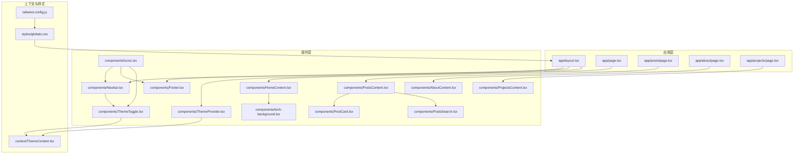
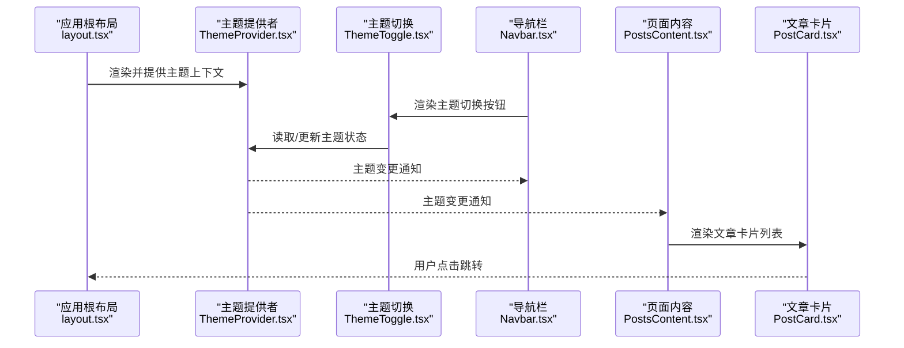
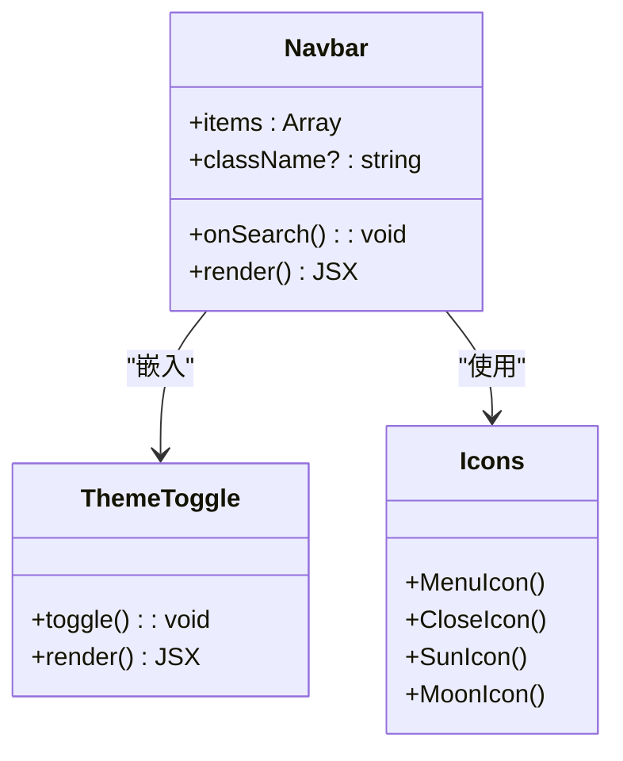
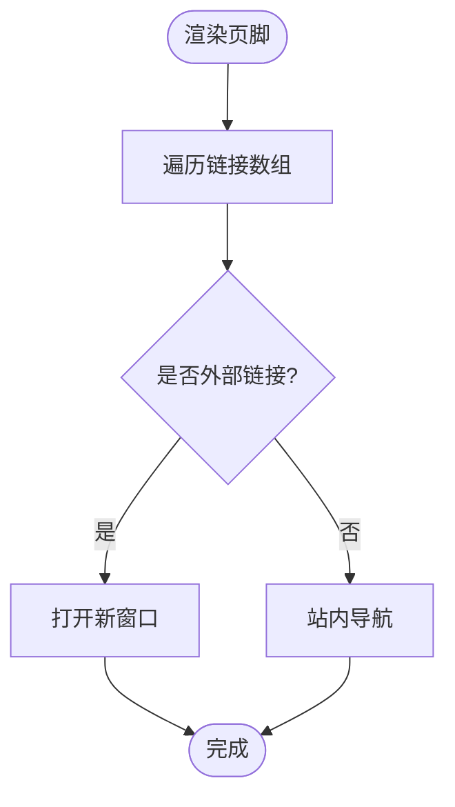
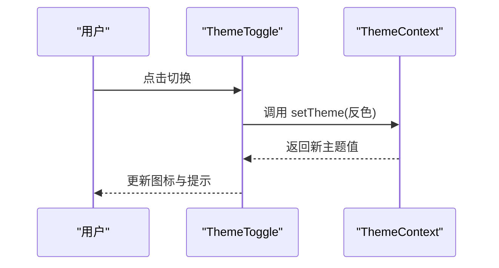
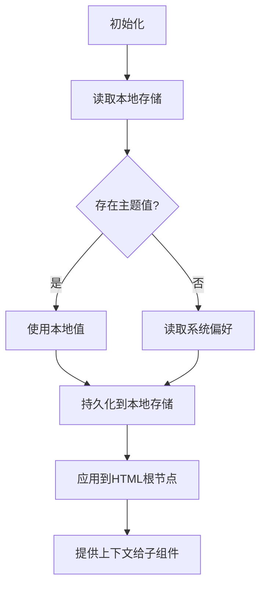
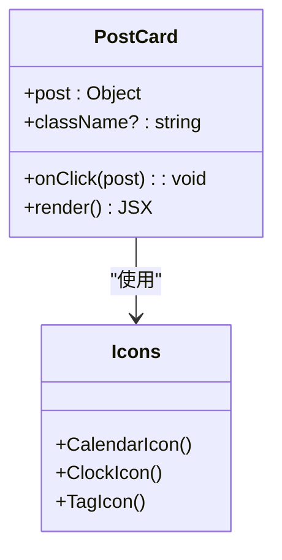
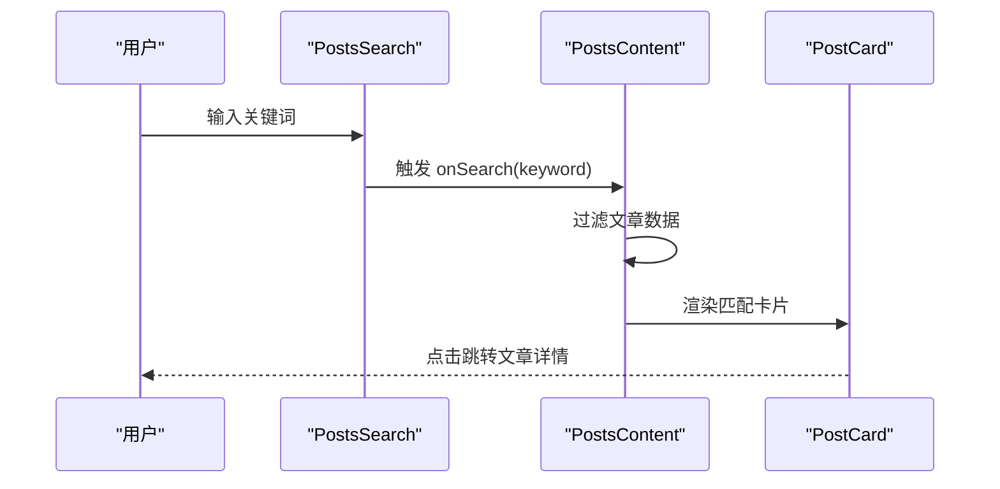
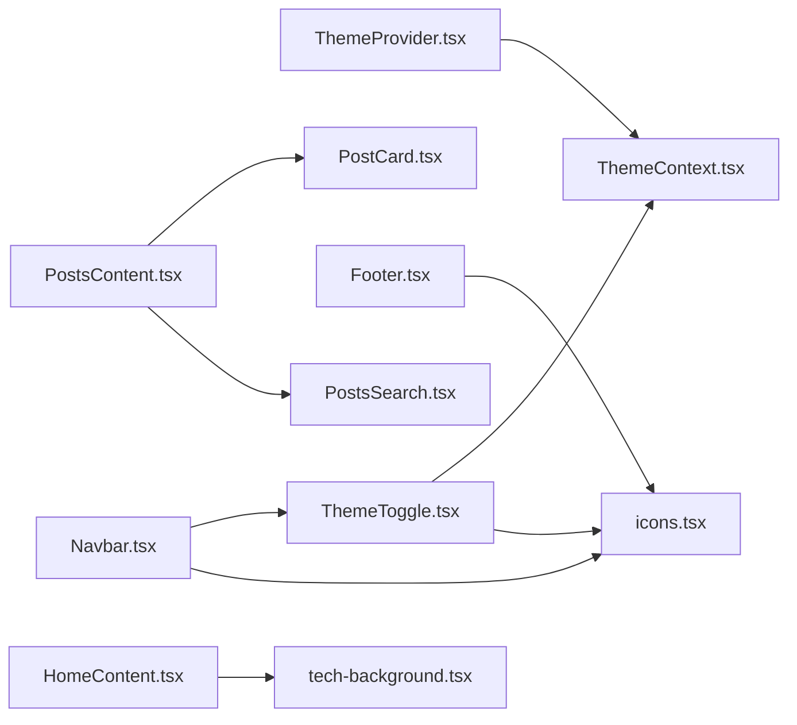

# 用户界面组件

<cite>
**本文引用的文件**   
- [Navbar.tsx](file://src/components/Navbar.tsx)
- [Footer.tsx](file://src/components/Footer.tsx)
- [ThemeToggle.tsx](file://src/components/ThemeToggle.tsx)
- [ThemeProvider.tsx](file://src/components/ThemeProvider.tsx)
- [PostCard.tsx](file://src/components/PostCard.tsx)
- [PostsSearch.tsx](file://src/components/PostsSearch.tsx)
- [AboutContent.tsx](file://src/components/AboutContent.tsx)
- [HomeContent.tsx](file://src/components/HomeContent.tsx)
- [ProjectsContent.tsx](file://src/components/ProjectsContent.tsx)
- [PostsContent.tsx](file://src/components/PostsContent.tsx)
- [icons.tsx](file://src/components/icons.tsx)
- [tech-background.tsx](file://src/components/tech-background.tsx)
- [ThemeContext.tsx](file://src/context/ThemeContext.tsx)
- [layout.tsx](file://src/app/layout.tsx)
- [page.tsx](file://src/app/page.tsx)
- [posts/page.tsx](file://src/app/posts/page.tsx)
- [about/page.tsx](file://src/app/about/page.tsx)
- [projects/page.tsx](file://src/app/projects/page.tsx)
- [globals.css](file://src/styles/globals.css)
- [tailwind.config.js](file://tailwind.config.js)
</cite>

## 目录
1. [简介](#简介)
2. [项目结构](#项目结构)
3. [核心组件](#核心组件)
4. [架构总览](#架构总览)
5. [详细组件分析](#详细组件分析)
6. [依赖关系分析](#依赖关系分析)
7. [性能考虑](#性能考虑)
8. [故障排查指南](#故障排查指南)
9. [结论](#结论)
10. [附录](#附录)

## 简介
本文件面向新开发者与维护者，系统化梳理博客项目的用户界面组件体系。内容覆盖导航栏、页脚、主题切换、文章卡片等基础与常用组件的设计理念、实现要点、Props 接口、事件处理器、自定义选项、响应式设计与无障碍访问支持、样式定制与主题系统集成、组合使用最佳实践、动画与交互体验、性能优化与浏览器兼容性处理，以及扩展开发指导。文档以“渐进式复杂度”组织，既适合快速上手，也便于深入查阅。

## 项目结构
本项目采用 Next.js App Router 与 React 组件化架构。UI 组件集中于 src/components，主题上下文位于 src/context，页面布局与路由入口在 src/app，全局样式与 Tailwind 配置在根目录与 styles 下。

图表来源
- [layout.tsx](file://src/app/layout.tsx)
- [page.tsx](file://src/app/page.tsx)
- [posts/page.tsx](file://src/app/posts/page.tsx)
- [about/page.tsx](file://src/app/about/page.tsx)
- [projects/page.tsx](file://src/app/projects/page.tsx)
- [Navbar.tsx](file://src/components/Navbar.tsx)
- [Footer.tsx](file://src/components/Footer.tsx)
- [ThemeToggle.tsx](file://src/components/ThemeToggle.tsx)
- [ThemeProvider.tsx](file://src/components/ThemeProvider.tsx)
- [PostCard.tsx](file://src/components/PostCard.tsx)
- [PostsSearch.tsx](file://src/components/PostsSearch.tsx)
- [AboutContent.tsx](file://src/components/AboutContent.tsx)
- [HomeContent.tsx](file://src/components/HomeContent.tsx)
- [ProjectsContent.tsx](file://src/components/ProjectsContent.tsx)
- [PostsContent.tsx](file://src/components/PostsContent.tsx)
- [icons.tsx](file://src/components/icons.tsx)
- [tech-background.tsx](file://src/components/tech-background.tsx)
- [ThemeContext.tsx](file://src/context/ThemeContext.tsx)
- [globals.css](file://src/styles/globals.css)
- [tailwind.config.js](file://tailwind.config.js)

章节来源
- [layout.tsx](file://src/app/layout.tsx)
- [page.tsx](file://src/app/page.tsx)
- [posts/page.tsx](file://src/app/posts/page.tsx)
- [about/page.tsx](file://src/app/about/page.tsx)
- [projects/page.tsx](file://src/app/projects/page.tsx)
- [Navbar.tsx](file://src/components/Navbar.tsx)
- [Footer.tsx](file://src/components/Footer.tsx)
- [ThemeToggle.tsx](file://src/components/ThemeToggle.tsx)
- [ThemeProvider.tsx](file://src/components/ThemeProvider.tsx)
- [PostCard.tsx](file://src/components/PostCard.tsx)
- [PostsSearch.tsx](file://src/components/PostsSearch.tsx)
- [AboutContent.tsx](file://src/components/AboutContent.tsx)
- [HomeContent.tsx](file://src/components/HomeContent.tsx)
- [ProjectsContent.tsx](file://src/components/ProjectsContent.tsx)
- [PostsContent.tsx](file://src/components/PostsContent.tsx)
- [icons.tsx](file://src/components/icons.tsx)
- [tech-background.tsx](file://src/components/tech-background.tsx)
- [ThemeContext.tsx](file://src/context/ThemeContext.tsx)
- [globals.css](file://src/styles/globals.css)
- [tailwind.config.js](file://tailwind.config.js)

## 核心组件
本节概述各组件的职责与协作方式，为后续详细分析奠定基础。

- 导航栏（Navbar）：提供站点导航、移动端折叠菜单、搜索入口与主题切换按钮；负责响应式断点与键盘可访问性。
- 页脚（Footer）：展示版权信息、社交链接与辅助导航；遵循语义化标签与无障碍属性。
- 主题切换（ThemeToggle）：基于主题上下文切换明暗主题，提供图标与提示文本。
- 主题提供者（ThemeProvider）：挂载主题上下文，持久化主题到本地存储，并同步至 HTML 根节点。
- 文章卡片（PostCard）：展示文章摘要、封面图、标签与阅读时长；支持点击跳转与键盘操作。
- 文章列表与搜索（PostsContent、PostsSearch）：聚合文章数据、分页/筛选、搜索输入与结果渲染。
- 页面内容组件（HomeContent、AboutContent、ProjectsContent）：承载首页、关于、项目页面的主要内容区块。
- 图标库（icons.tsx）：统一 SVG 图标组件，供导航、按钮与装饰元素复用。
- 技术背景（tech-background.tsx）：用于首页的动效背景容器，按需加载以减少首屏开销。

章节来源
- [Navbar.tsx](file://src/components/Navbar.tsx)
- [Footer.tsx](file://src/components/Footer.tsx)
- [ThemeToggle.tsx](file://src/components/ThemeToggle.tsx)
- [ThemeProvider.tsx](file://src/components/ThemeProvider.tsx)
- [PostCard.tsx](file://src/components/PostCard.tsx)
- [PostsContent.tsx](file://src/components/PostsContent.tsx)
- [PostsSearch.tsx](file://src/components/PostsSearch.tsx)
- [HomeContent.tsx](file://src/components/HomeContent.tsx)
- [AboutContent.tsx](file://src/components/AboutContent.tsx)
- [ProjectsContent.tsx](file://src/components/ProjectsContent.tsx)
- [icons.tsx](file://src/components/icons.tsx)
- [tech-background.tsx](file://src/components/tech-background.tsx)

## 架构总览
主题系统通过 Context 驱动，Provider 在应用根布局中注入，所有子组件均可消费主题状态。导航与页脚作为全局布局的一部分，包裹页面内容区域。文章列表由 PostsContent 编排，内部组合 PostCard 与 PostsSearch。

图表来源
- [layout.tsx](file://src/app/layout.tsx)
- [ThemeProvider.tsx](file://src/components/ThemeProvider.tsx)
- [ThemeToggle.tsx](file://src/components/ThemeToggle.tsx)
- [Navbar.tsx](file://src/components/Navbar.tsx)
- [PostsContent.tsx](file://src/components/PostsContent.tsx)
- [PostCard.tsx](file://src/components/PostCard.tsx)

## 详细组件分析

### 导航栏（Navbar）
职责与特性
- 顶部固定或粘性定位，包含站点 Logo、主导航项、搜索入口与主题切换。
- 移动端提供汉堡菜单，展开/收起具备焦点管理与键盘可达性。
- 根据当前路由高亮活跃项，支持平滑滚动到锚点。

关键 Props 与事件
- 导航项数组：包含标题、链接、是否外部链接等字段。
- 搜索回调：当触发搜索时回调父级处理函数。
- 主题切换：集成 ThemeToggle，无需额外 props。
- 自定义类名：允许外层传入 Tailwind 类名进行覆盖。

响应式与无障碍
- 使用断点控制折叠行为，确保小屏幕可读性与触控友好。
- 为菜单按钮与链接设置 aria-label、role 与 tabindex，支持键盘 Tab/Enter/Escape。

样式与主题
- 通过 Tailwind 类名与 CSS 变量实现明暗主题适配。
- 背景透明度与阴影在不同主题下自动切换。

图表来源
- [Navbar.tsx](file://src/components/Navbar.tsx)
- [ThemeToggle.tsx](file://src/components/ThemeToggle.tsx)
- [icons.tsx](file://src/components/icons.tsx)

章节来源
- [Navbar.tsx](file://src/components/Navbar.tsx)
- [ThemeToggle.tsx](file://src/components/ThemeToggle.tsx)
- [icons.tsx](file://src/components/icons.tsx)

### 页脚（Footer）
职责与特性
- 展示版权信息、站点说明、社交链接与辅助导航。
- 语义化结构（footer、nav、ul/li），利于 SEO 与无障碍。

关键 Props 与事件
- 链接数组：包含名称、URL、是否外部链接等。
- 版权文案：支持多语言或动态替换。
- 社交图标：复用 icons.tsx 中的图标组件。

响应式与无障碍
- 在小屏幕上纵向排列，在大屏幕上横向分布。
- 链接具备合适的 aria-label，图标按钮提供描述文本。

图表来源
- [Footer.tsx](file://src/components/Footer.tsx)
- [icons.tsx](file://src/components/icons.tsx)

章节来源
- [Footer.tsx](file://src/components/Footer.tsx)
- [icons.tsx](file://src/components/icons.tsx)

### 主题切换（ThemeToggle）
职责与特性
- 提供明/暗主题切换按钮，显示对应图标与提示文本。
- 与主题上下文联动，切换后即时生效。

关键 Props 与事件
- 无强制 props，默认从上下文读取状态。
- 可选 className 用于微调外观。

响应式与无障碍
- 按钮尺寸满足触控要求，提供 aria-pressed 与 aria-label。
- 键盘 Enter/Space 可触发切换。

图表来源
- [ThemeToggle.tsx](file://src/components/ThemeToggle.tsx)
- [ThemeContext.tsx](file://src/context/ThemeContext.tsx)

章节来源
- [ThemeToggle.tsx](file://src/components/ThemeToggle.tsx)
- [ThemeContext.tsx](file://src/context/ThemeContext.tsx)

### 主题提供者（ThemeProvider）
职责与特性
- 在应用启动时初始化主题，优先读取本地存储，其次回退到系统偏好。
- 将主题写入 HTML 根节点 data-theme 或 class，以便 CSS/Tailwind 响应。
- 暴露 setTheme 方法供子组件调用。

关键 API
- 提供 theme 与 setTheme 两个值。
- 监听系统主题变化，保持同步。

图表来源
- [ThemeProvider.tsx](file://src/components/ThemeProvider.tsx)
- [ThemeContext.tsx](file://src/context/ThemeContext.tsx)

章节来源
- [ThemeProvider.tsx](file://src/components/ThemeProvider.tsx)
- [ThemeContext.tsx](file://src/context/ThemeContext.tsx)

### 文章卡片（PostCard）
职责与特性
- 展示文章封面、标题、摘要、标签、发布时间与阅读时长。
- 支持点击跳转至文章详情页，支持键盘操作。

关键 Props 与事件
- 文章对象：包含 slug、title、summary、cover、tags、date、readTime 等。
- 点击回调：可选，用于自定义跳转逻辑。
- 自定义类名：允许覆盖默认样式。

响应式与无障碍
- 图片懒加载与占位符，提升首屏性能。
- 链接具备 aria-label，图片提供 alt 文本。

图表来源
- [PostCard.tsx](file://src/components/PostCard.tsx)
- [icons.tsx](file://src/components/icons.tsx)

章节来源
- [PostCard.tsx](file://src/components/PostCard.tsx)
- [icons.tsx](file://src/components/icons.tsx)

### 文章列表与搜索（PostsContent、PostsSearch）
职责与特性
- PostsContent：聚合文章数据、分页/筛选、错误边界与骨架屏。
- PostsSearch：提供搜索输入、防抖过滤、清空与快捷键支持。

关键 Props 与事件
- 文章数据源：数组或异步获取函数。
- 搜索回调：输入变化时触发过滤。
- 分页参数：每页数量、当前页码。

响应式与无障碍
- 搜索框支持 Enter 提交、Esc 清空。
- 列表项具备 role="listitem"，搜索结果具备 aria-live 提示。

图表来源
- [PostsSearch.tsx](file://src/components/PostsSearch.tsx)
- [PostsContent.tsx](file://src/components/PostsContent.tsx)
- [PostCard.tsx](file://src/components/PostCard.tsx)

章节来源
- [PostsSearch.tsx](file://src/components/PostsSearch.tsx)
- [PostsContent.tsx](file://src/components/PostsContent.tsx)
- [PostCard.tsx](file://src/components/PostCard.tsx)

### 页面内容组件（HomeContent、AboutContent、ProjectsContent）
职责与特性
- HomeContent：首页内容区块，可能包含技术背景动效、精选文章与引导入口。
- AboutContent：关于页面内容，展示个人介绍、技能与经历。
- ProjectsContent：项目展示，包含项目卡片与链接。

关键 Props 与事件
- 数据源：静态配置或异步加载。
- 交互：如展开/收起、模态框、跳转等。

响应式与无障碍
- 大段文本提供段落结构与标题层级。
- 图片与图标具备替代文本，交互控件具备键盘可达性。

章节来源
- [HomeContent.tsx](file://src/components/HomeContent.tsx)
- [AboutContent.tsx](file://src/components/AboutContent.tsx)
- [ProjectsContent.tsx](file://src/components/ProjectsContent.tsx)

### 图标库（icons.tsx）
职责与特性
- 统一的 SVG 图标组件集合，支持尺寸、颜色与无障碍属性。
- 被导航、页脚、主题切换与卡片广泛复用。

关键 API
- 每个图标导出为独立组件，接受 className 与 aria-hidden 等属性。

章节来源
- [icons.tsx](file://src/components/icons.tsx)

### 技术背景（tech-background.tsx）
职责与特性
- 首页背景动效容器，按需加载以减少首屏开销。
- 提供开关与占位符，避免布局抖动。

关键 Props 与事件
- 启用开关：控制是否渲染动效。
- 自定义容器类名：用于调整布局与遮罩。

章节来源
- [tech-background.tsx](file://src/components/tech-background.tsx)

## 依赖关系分析
组件间依赖清晰，主题上下文贯穿全局，图标库被多处复用，页面内容组件组合基础组件形成完整页面。

图表来源
- [ThemeProvider.tsx](file://src/components/ThemeProvider.tsx)
- [ThemeContext.tsx](file://src/context/ThemeContext.tsx)
- [ThemeToggle.tsx](file://src/components/ThemeToggle.tsx)
- [Navbar.tsx](file://src/components/Navbar.tsx)
- [Footer.tsx](file://src/components/Footer.tsx)
- [icons.tsx](file://src/components/icons.tsx)
- [PostsContent.tsx](file://src/components/PostsContent.tsx)
- [PostCard.tsx](file://src/components/PostCard.tsx)
- [PostsSearch.tsx](file://src/components/PostsSearch.tsx)
- [HomeContent.tsx](file://src/components/HomeContent.tsx)
- [tech-background.tsx](file://src/components/tech-background.tsx)

章节来源
- [ThemeProvider.tsx](file://src/components/ThemeProvider.tsx)
- [ThemeContext.tsx](file://src/context/ThemeContext.tsx)
- [ThemeToggle.tsx](file://src/components/ThemeToggle.tsx)
- [Navbar.tsx](file://src/components/Navbar.tsx)
- [Footer.tsx](file://src/components/Footer.tsx)
- [icons.tsx](file://src/components/icons.tsx)
- [PostsContent.tsx](file://src/components/PostsContent.tsx)
- [PostCard.tsx](file://src/components/PostCard.tsx)
- [PostsSearch.tsx](file://src/components/PostsSearch.tsx)
- [HomeContent.tsx](file://src/components/HomeContent.tsx)
- [tech-background.tsx](file://src/components/tech-background.tsx)

## 性能考虑
- 图片与媒体
  - 使用懒加载与占位符，减少首屏资源体积。
  - 对大图进行压缩与格式转换（WebP/AVIF）。
- 代码分割与按需加载
  - 将重型组件（如动效背景）按需加载，避免阻塞首屏。
  - 利用路由级拆分与 Suspense 边界。
- 搜索与过滤
  - 输入防抖与节流，避免频繁重渲染。
  - 大数据集时使用虚拟列表或分页。
- 主题切换
  - 仅更新必要 DOM，避免全量重绘。
  - 使用 CSS 变量与 Tailwind 的 dark 模式策略，减少 JS 计算。
- 动画与交互
  - 使用 GPU 加速的属性（transform、opacity）进行动画。
  - 避免在高频事件中执行昂贵计算。

[本节为通用性能建议，不直接分析具体文件]

## 故障排查指南
- 主题未生效
  - 检查 Provider 是否在根布局中正确挂载。
  - 确认 HTML 根节点是否正确写入 data-theme 或 class。
  - 验证本地存储键名与类型一致性。
- 导航菜单无法展开
  - 检查移动端断点与样式冲突。
  - 确认焦点管理与键盘事件绑定。
- 搜索无结果
  - 核对搜索词大小写与空格处理。
  - 检查数据源字段是否与搜索逻辑一致。
- 图片加载失败
  - 确认路径与构建产物输出目录。
  - 检查网络请求与跨域策略。

章节来源
- [layout.tsx](file://src/app/layout.tsx)
- [ThemeProvider.tsx](file://src/components/ThemeProvider.tsx)
- [ThemeContext.tsx](file://src/context/ThemeContext.tsx)
- [Navbar.tsx](file://src/components/Navbar.tsx)
- [PostsSearch.tsx](file://src/components/PostsSearch.tsx)
- [PostCard.tsx](file://src/components/PostCard.tsx)

## 结论
本组件体系围绕“可组合、可主题化、可访问、高性能”的目标设计。通过主题上下文与 Tailwind 的协同，实现了灵活的样式定制；通过语义化与 ARIA 属性，保障了无障碍访问；通过按需加载与防抖优化，提升了用户体验。建议在新增页面或功能时，优先复用现有基础组件，保持风格与行为的一致性。

[本节为总结性内容，不直接分析具体文件]

## 附录

### 组件组合最佳实践
- 在页面级组合基础组件，避免深层嵌套导致的样式覆盖困难。
- 将业务数据与展示组件解耦，通过 Props 传递数据与回调。
- 使用统一的图标库与主题变量，确保视觉一致性。
- 为复杂交互提供测试用例，覆盖键盘与屏幕阅读器场景。

[本节为概念性指导，不直接分析具体文件]

### 样式定制与主题系统集成
- 通过 Tailwind 的 dark 模式与 CSS 变量实现主题切换。
- 在 Provider 中集中管理主题状态，子组件通过上下文消费。
- 使用 className 透传机制，允许外层覆盖默认样式。

章节来源
- [globals.css](file://src/styles/globals.css)
- [tailwind.config.js](file://tailwind.config.js)
- [ThemeProvider.tsx](file://src/components/ThemeProvider.tsx)
- [ThemeContext.tsx](file://src/context/ThemeContext.tsx)

### 动画效果与交互体验
- 使用轻量动画库或原生 CSS 过渡，避免过度动画影响性能。
- 为关键交互提供反馈（如加载指示、成功提示）。
- 保证动画可被用户偏好设置禁用（prefers-reduced-motion）。

[本节为概念性指导，不直接分析具体文件]

### 浏览器兼容性处理
- 针对旧版浏览器提供降级方案（如 Polyfill、回退样式）。
- 使用现代语法的同时，确保构建工具链兼容目标环境。
- 在主题切换中检测 localStorage 可用性，避免运行时错误。

[本节为概念性指导，不直接分析具体文件]

### 新开发者扩展指南
- 新增组件时，遵循现有命名与目录约定。
- 为新组件编写最小可用示例，并在相关页面中组合使用。
- 为组件添加必要的注释与 Props 类型定义，提升可维护性。
- 在 Pull Request 中包含基本测试与无障碍检查。

[本节为概念性指导，不直接分析具体文件]