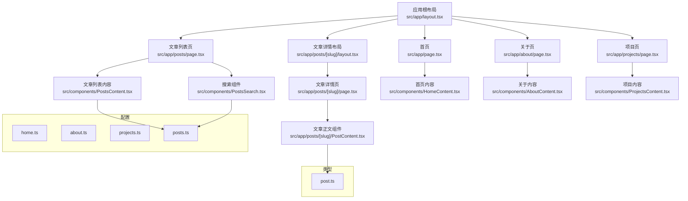
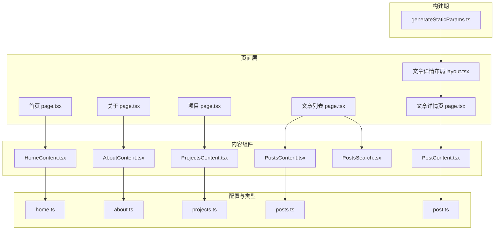
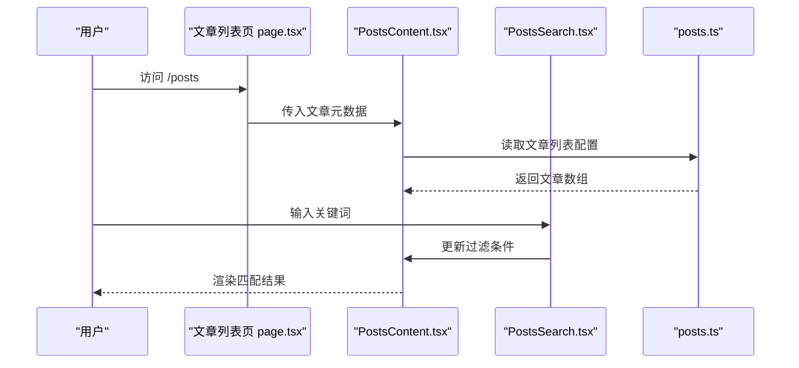
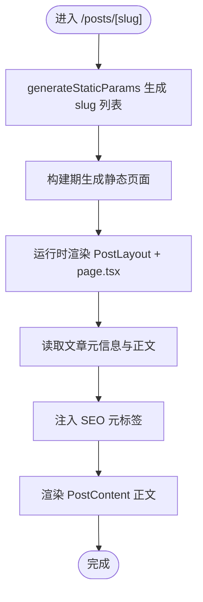
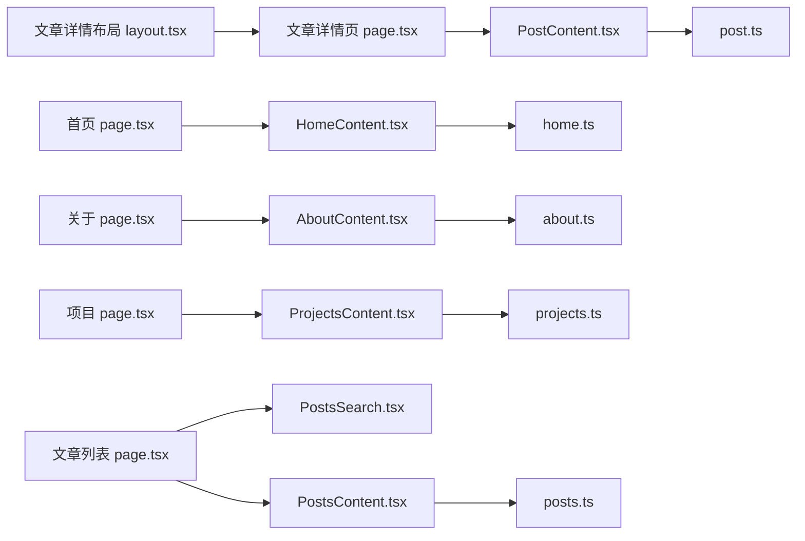

# 页面组件

<cite>
**本文引用的文件**   
- [src/app/page.tsx](file://src/app/page.tsx)
- [src/app/about/page.tsx](file://src/app/about/page.tsx)
- [src/app/projects/page.tsx](file://src/app/projects/page.tsx)
- [src/app/posts/page.tsx](file://src/app/posts/page.tsx)
- [src/app/posts/[slug]/layout.tsx](file://src/app/posts/[slug]/layout.tsx)
- [src/app/posts/[slug]/page.tsx](file://src/app/posts/[slug]/page.tsx)
- [src/app/posts/[slug]/PostContent.tsx](file://src/app/posts/[slug]/PostContent.tsx)
- [src/app/posts/[slug]/generateStaticParams.ts](file://src/app/posts/[slug]/generateStaticParams.ts)
- [src/components/HomeContent.tsx](file://src/components/HomeContent.tsx)
- [src/components/AboutContent.tsx](file://src/components/AboutContent.tsx)
- [src/components/ProjectsContent.tsx](file://src/components/ProjectsContent.tsx)
- [src/components/PostsContent.tsx](file://src/components/PostsContent.tsx)
- [src/components/PostsSearch.tsx](file://src/components/PostsSearch.tsx)
- [src/config/home.ts](file://src/config/home.ts)
- [src/config/about.ts](file://src/config/about.ts)
- [src/config/projects.ts](file://src/config/projects.ts)
- [src/config/posts.ts](file://src/config/posts.ts)
- [src/types/post.ts](file://src/types/post.ts)
- [next.config.js](file://next.config.js)
</cite>

## 目录
1. [简介](#简介)
2. [项目结构](#项目结构)
3. [核心组件](#核心组件)
4. [架构总览](#架构总览)
5. [详细组件分析](#详细组件分析)
6. [依赖分析](#依赖分析)
7. [性能考虑](#性能考虑)
8. [故障排查指南](#故障排查指南)
9. [结论](#结论)
10. [附录](#附录)

## 简介
本章节面向新开发者，系统化梳理博客项目的页面级组件设计与实现，覆盖首页、关于页、项目页、文章列表页与文章详情布局（PostLayout）等。文档重点包括：
- 路由配置与数据获取策略
- 渲染流程与状态管理
- SEO 优化与元标签配置
- 组合模式与复用策略
- 响应式适配与移动端优化
- 加载性能与缓存策略
- 开发与调试指导

## 项目结构
本项目采用 Next.js App Router 的目录即路由约定，页面位于 src/app 下，内容型子页面通过动态路由 [slug] 组织；通用 UI 与业务逻辑下沉到 src/components，静态内容与配置集中在 src/config，类型定义在 src/types。

图表来源
- [src/app/page.tsx](file://src/app/page.tsx)
- [src/app/about/page.tsx](file://src/app/about/page.tsx)
- [src/app/projects/page.tsx](file://src/app/projects/page.tsx)
- [src/app/posts/page.tsx](file://src/app/posts/page.tsx)
- [src/app/posts/[slug]/layout.tsx](file://src/app/posts/[slug]/layout.tsx)
- [src/app/posts/[slug]/page.tsx](file://src/app/posts/[slug]/page.tsx)
- [src/app/posts/[slug]/PostContent.tsx](file://src/app/posts/[slug]/PostContent.tsx)
- [src/components/HomeContent.tsx](file://src/components/HomeContent.tsx)
- [src/components/AboutContent.tsx](file://src/components/AboutContent.tsx)
- [src/components/ProjectsContent.tsx](file://src/components/ProjectsContent.tsx)
- [src/components/PostsContent.tsx](file://src/components/PostsContent.tsx)
- [src/components/PostsSearch.tsx](file://src/components/PostsSearch.tsx)
- [src/config/home.ts](file://src/config/home.ts)
- [src/config/about.ts](file://src/config/about.ts)
- [src/config/projects.ts](file://src/config/projects.ts)
- [src/config/posts.ts](file://src/config/posts.ts)
- [src/types/post.ts](file://src/types/post.ts)

章节来源
- [src/app/page.tsx](file://src/app/page.tsx)
- [src/app/about/page.tsx](file://src/app/about/page.tsx)
- [src/app/projects/page.tsx](file://src/app/projects/page.tsx)
- [src/app/posts/page.tsx](file://src/app/posts/page.tsx)
- [src/app/posts/[slug]/layout.tsx](file://src/app/posts/[slug]/layout.tsx)
- [src/app/posts/[slug]/page.tsx](file://src/app/posts/[slug]/page.tsx)
- [src/app/posts/[slug]/PostContent.tsx](file://src/app/posts/[slug]/PostContent.tsx)
- [src/components/HomeContent.tsx](file://src/components/HomeContent.tsx)
- [src/components/AboutContent.tsx](file://src/components/AboutContent.tsx)
- [src/components/ProjectsContent.tsx](file://src/components/ProjectsContent.tsx)
- [src/components/PostsContent.tsx](file://src/components/PostsContent.tsx)
- [src/components/PostsSearch.tsx](file://src/components/PostsSearch.tsx)
- [src/config/home.ts](file://src/config/home.ts)
- [src/config/about.ts](file://src/config/about.ts)
- [src/config/projects.ts](file://src/config/projects.ts)
- [src/config/posts.ts](file://src/config/posts.ts)
- [src/types/post.ts](file://src/types/post.ts)

## 核心组件
本节概述各页面与其对应内容组件的职责边界与协作方式。

- 首页（Page）
  - 职责：作为入口路由，承载首页内容组件与基础 SEO 元信息。
  - 数据：通常来自本地配置或轻量 API，避免首屏阻塞。
  - 交互：以展示为主，可能包含导航跳转与主题切换。
  - 参考路径：[src/app/page.tsx](file://src/app/page.tsx)、[src/components/HomeContent.tsx](file://src/components/HomeContent.tsx)、[src/config/home.ts](file://src/config/home.ts)

- 关于页面（About）
  - 职责：展示个人介绍、经历与联系方式等内容。
  - 数据：主要来自 about 配置与联系信息配置。
  - 交互：可包含社交链接、主题切换等。
  - 参考路径：[src/app/about/page.tsx](file://src/app/about/page.tsx)、[src/components/AboutContent.tsx](file://src/components/AboutContent.tsx)、[src/config/about.ts](file://src/config/about.ts)、[src/config/contact.ts](file://src/config/contact.ts)

- 项目页面（Projects）
  - 职责：展示项目卡片、筛选与跳转。
  - 数据：来自 projects 配置。
  - 交互：支持按标签/分类筛选、跳转外链或详情页。
  - 参考路径：[src/app/projects/page.tsx](file://src/app/projects/page.tsx)、[src/components/ProjectsContent.tsx](file://src/components/ProjectsContent.tsx)、[src/config/projects.ts](file://src/config/projects.ts)

- 文章列表页面（Posts）
  - 职责：聚合文章摘要、分页/搜索、排序。
  - 数据：来自 posts 配置与 Markdown 元信息。
  - 交互：搜索过滤、分页、跳转至文章详情。
  - 参考路径：[src/app/posts/page.tsx](file://src/app/posts/page.tsx)、[src/components/PostsContent.tsx](file://src/components/PostsContent.tsx)、[src/components/PostsSearch.tsx](file://src/components/PostsSearch.tsx)、[src/config/posts.ts](file://src/config/posts.ts)

- 文章详情布局（PostLayout）
  - 职责：为所有文章详情页提供统一外壳（导航、侧边栏、SEO 元信息等）。
  - 数据：从路由参数 slug 解析文章标识，配合 generateStaticParams 预取。
  - 交互：返回统一的布局包裹与上下文。
  - 参考路径：[src/app/posts/[slug]/layout.tsx](file://src/app/posts/[slug]/layout.tsx)、[src/app/posts/[slug]/generateStaticParams.ts](file://src/app/posts/[slug]/generateStaticParams.ts)

章节来源
- [src/app/page.tsx](file://src/app/page.tsx)
- [src/components/HomeContent.tsx](file://src/components/HomeContent.tsx)
- [src/config/home.ts](file://src/config/home.ts)
- [src/app/about/page.tsx](file://src/app/about/page.tsx)
- [src/components/AboutContent.tsx](file://src/components/AboutContent.tsx)
- [src/config/about.ts](file://src/config/about.ts)
- [src/config/contact.ts](file://src/config/contact.ts)
- [src/app/projects/page.tsx](file://src/app/projects/page.tsx)
- [src/components/ProjectsContent.tsx](file://src/components/ProjectsContent.tsx)
- [src/config/projects.ts](file://src/config/projects.ts)
- [src/app/posts/page.tsx](file://src/app/posts/page.tsx)
- [src/components/PostsContent.tsx](file://src/components/PostsContent.tsx)
- [src/components/PostsSearch.tsx](file://src/components/PostsSearch.tsx)
- [src/config/posts.ts](file://src/config/posts.ts)
- [src/app/posts/[slug]/layout.tsx](file://src/app/posts/[slug]/layout.tsx)
- [src/app/posts/[slug]/generateStaticParams.ts](file://src/app/posts/[slug]/generateStaticParams.ts)

## 架构总览
下图展示了页面层与内容组件、配置与类型的关系，以及文章详情的生成时构建流程。

图表来源
- [src/app/page.tsx](file://src/app/page.tsx)
- [src/app/about/page.tsx](file://src/app/about/page.tsx)
- [src/app/projects/page.tsx](file://src/app/projects/page.tsx)
- [src/app/posts/page.tsx](file://src/app/posts/page.tsx)
- [src/app/posts/[slug]/layout.tsx](file://src/app/posts/[slug]/layout.tsx)
- [src/app/posts/[slug]/page.tsx](file://src/app/posts/[slug]/page.tsx)
- [src/app/posts/[slug]/PostContent.tsx](file://src/app/posts/[slug]/PostContent.tsx)
- [src/app/posts/[slug]/generateStaticParams.ts](file://src/app/posts/[slug]/generateStaticParams.ts)
- [src/components/HomeContent.tsx](file://src/components/HomeContent.tsx)
- [src/components/AboutContent.tsx](file://src/components/AboutContent.tsx)
- [src/components/ProjectsContent.tsx](file://src/components/ProjectsContent.tsx)
- [src/components/PostsContent.tsx](file://src/components/PostsContent.tsx)
- [src/components/PostsSearch.tsx](file://src/components/PostsSearch.tsx)
- [src/config/home.ts](file://src/config/home.ts)
- [src/config/about.ts](file://src/config/about.ts)
- [src/config/projects.ts](file://src/config/projects.ts)
- [src/config/posts.ts](file://src/config/posts.ts)
- [src/types/post.ts](file://src/types/post.ts)

## 详细组件分析

### 首页（Page）
- 路由与渲染
  - 路由：根路径 /
  - 渲染：服务端渲染（SSR），优先输出首屏 HTML，随后客户端水合。
- 数据获取
  - 数据来源：本地配置 home.ts，必要时结合轻量 API。
  - 策略：同步读取配置，避免网络请求阻塞首屏。
- 状态与交互
  - 状态：主题、语言等全局状态由上下文提供。
  - 交互：导航跳转、主题切换、滚动定位等。
- SEO 与元标签
  - 标题、描述、关键词、Open Graph 与 Twitter Card 元信息在页面或布局中设置。
- 组合与复用
  - 通过 HomeContent 组件承载具体展示逻辑，便于测试与复用。
- 响应式与移动端
  - 基于 Tailwind 断点控制布局与字号间距。
- 性能与缓存
  - 静态配置零 IO，首屏快；可开启浏览器缓存与资源压缩。

章节来源
- [src/app/page.tsx](file://src/app/page.tsx)
- [src/components/HomeContent.tsx](file://src/components/HomeContent.tsx)
- [src/config/home.ts](file://src/config/home.ts)

### 关于页面（About）
- 路由与渲染
  - 路由：/about
  - 渲染：SSR，利于 SEO。
- 数据获取
  - 数据来源：about.ts 与 contact.ts 配置。
  - 策略：同步读取，无外部依赖。
- 状态与交互
  - 社交链接点击、主题切换、平滑滚动。
- SEO 与元标签
  - 针对“关于”场景定制标题与描述，补充结构化数据（如 Person）。
- 组合与复用
  - AboutContent 负责内容拼装，便于替换文案与扩展模块。
- 响应式与移动端
  - 图片自适应、网格布局在小屏降级为单列。
- 性能与缓存
  - 纯静态内容，适合长期缓存。

章节来源
- [src/app/about/page.tsx](file://src/app/about/page.tsx)
- [src/components/AboutContent.tsx](file://src/components/AboutContent.tsx)
- [src/config/about.ts](file://src/config/about.ts)
- [src/config/contact.ts](file://src/config/contact.ts)

### 项目页面（Projects）
- 路由与渲染
  - 路由：/projects
  - 渲染：SSR。
- 数据获取
  - 数据来源：projects.ts 配置。
  - 策略：同步读取，按需懒加载图片。
- 状态与交互
  - 筛选（按标签/技术栈）、排序、跳转外链。
- SEO 与元标签
  - 为每个项目生成 Open Graph 预览图与描述。
- 组合与复用
  - ProjectsContent 封装卡片渲染与筛选逻辑，可被其他页面复用。
- 响应式与移动端
  - 卡片网格在移动端堆叠显示，触控友好。
- 性能与缓存
  - 图片使用 next/image 或懒加载；配置变更触发增量构建。

章节来源
- [src/app/projects/page.tsx](file://src/app/projects/page.tsx)
- [src/components/ProjectsContent.tsx](file://src/components/ProjectsContent.tsx)
- [src/config/projects.ts](file://src/config/projects.ts)

### 文章列表页面（Posts）
- 路由与渲染
  - 路由：/posts
  - 渲染：SSR，利于索引。
- 数据获取
  - 数据来源：posts.ts 配置与 Markdown 元信息。
  - 策略：构建期聚合文章元数据，运行时仅做前端过滤与分页。
- 状态与交互
  - 搜索框实时过滤、分页切换、排序。
- SEO 与元标签
  - 列表页标题与描述聚焦“全部文章”，并为分页 URL 设置 canonical。
- 组合与复用
  - PostsContent 负责列表渲染，PostsSearch 负责搜索交互。
- 响应式与移动端
  - 搜索栏在小屏折叠，结果列表纵向排列。
- 性能与缓存
  - 列表数据在构建期生成，运行时无 IO；搜索在前端完成，延迟低。

图表来源
- [src/app/posts/page.tsx](file://src/app/posts/page.tsx)
- [src/components/PostsContent.tsx](file://src/components/PostsContent.tsx)
- [src/components/PostsSearch.tsx](file://src/components/PostsSearch.tsx)
- [src/config/posts.ts](file://src/config/posts.ts)

章节来源
- [src/app/posts/page.tsx](file://src/app/posts/page.tsx)
- [src/components/PostsContent.tsx](file://src/components/PostsContent.tsx)
- [src/components/PostsSearch.tsx](file://src/components/PostsSearch.tsx)
- [src/config/posts.ts](file://src/config/posts.ts)

### 文章详情布局（PostLayout）与详情页
- 路由与渲染
  - 路由：/posts/[slug]
  - 渲染：SSR + 静态生成（SSG）结合，利用 generateStaticParams 预生成。
- 数据获取
  - 数据来源：根据 slug 解析文章标识，读取对应 Markdown 与元信息。
  - 策略：构建期生成所有 slug 列表，运行时直接渲染已生成的页面。
- 状态与交互
  - 阅读进度条、目录导航、主题切换、分享按钮。
- SEO 与元标签
  - 动态设置标题、描述、OG 图像、canonical、结构化数据（Article）。
- 组合与复用
  - PostLayout 提供统一外壳，PostContent 专注正文渲染。
- 响应式与移动端
  - 目录在移动端收起为抽屉，正文字号与行高适配小屏。
- 性能与缓存
  - 静态页面命中 CDN 缓存；图片懒加载与代码分割减少包体。

图表来源
- [src/app/posts/[slug]/layout.tsx](file://src/app/posts/[slug]/layout.tsx)
- [src/app/posts/[slug]/page.tsx](file://src/app/posts/[slug]/page.tsx)
- [src/app/posts/[slug]/PostContent.tsx](file://src/app/posts/[slug]/PostContent.tsx)
- [src/app/posts/[slug]/generateStaticParams.ts](file://src/app/posts/[slug]/generateStaticParams.ts)

章节来源
- [src/app/posts/[slug]/layout.tsx](file://src/app/posts/[slug]/layout.tsx)
- [src/app/posts/[slug]/page.tsx](file://src/app/posts/[slug]/page.tsx)
- [src/app/posts/[slug]/PostContent.tsx](file://src/app/posts/[slug]/PostContent.tsx)
- [src/app/posts/[slug]/generateStaticParams.ts](file://src/app/posts/[slug]/generateStaticParams.ts)

## 依赖分析
页面组件与配置、类型之间的依赖关系如下：

图表来源
- [src/app/page.tsx](file://src/app/page.tsx)
- [src/app/about/page.tsx](file://src/app/about/page.tsx)
- [src/app/projects/page.tsx](file://src/app/projects/page.tsx)
- [src/app/posts/page.tsx](file://src/app/posts/page.tsx)
- [src/app/posts/[slug]/layout.tsx](file://src/app/posts/[slug]/layout.tsx)
- [src/app/posts/[slug]/page.tsx](file://src/app/posts/[slug]/page.tsx)
- [src/app/posts/[slug]/PostContent.tsx](file://src/app/posts/[slug]/PostContent.tsx)
- [src/components/HomeContent.tsx](file://src/components/HomeContent.tsx)
- [src/components/AboutContent.tsx](file://src/components/AboutContent.tsx)
- [src/components/ProjectsContent.tsx](file://src/components/ProjectsContent.tsx)
- [src/components/PostsContent.tsx](file://src/components/PostsContent.tsx)
- [src/components/PostsSearch.tsx](file://src/components/PostsSearch.tsx)
- [src/config/home.ts](file://src/config/home.ts)
- [src/config/about.ts](file://src/config/about.ts)
- [src/config/projects.ts](file://src/config/projects.ts)
- [src/config/posts.ts](file://src/config/posts.ts)
- [src/types/post.ts](file://src/types/post.ts)

章节来源
- [src/app/page.tsx](file://src/app/page.tsx)
- [src/app/about/page.tsx](file://src/app/about/page.tsx)
- [src/app/projects/page.tsx](file://src/app/projects/page.tsx)
- [src/app/posts/page.tsx](file://src/app/posts/page.tsx)
- [src/app/posts/[slug]/layout.tsx](file://src/app/posts/[slug]/layout.tsx)
- [src/app/posts/[slug]/page.tsx](file://src/app/posts/[slug]/page.tsx)
- [src/app/posts/[slug]/PostContent.tsx](file://src/app/posts/[slug]/PostContent.tsx)
- [src/components/HomeContent.tsx](file://src/components/HomeContent.tsx)
- [src/components/AboutContent.tsx](file://src/components/AboutContent.tsx)
- [src/components/ProjectsContent.tsx](file://src/components/ProjectsContent.tsx)
- [src/components/PostsContent.tsx](file://src/components/PostsContent.tsx)
- [src/components/PostsSearch.tsx](file://src/components/PostsSearch.tsx)
- [src/config/home.ts](file://src/config/home.ts)
- [src/config/about.ts](file://src/config/about.ts)
- [src/config/projects.ts](file://src/config/projects.ts)
- [src/config/posts.ts](file://src/config/posts.ts)
- [src/types/post.ts](file://src/types/post.ts)

## 性能考虑
- 构建期生成
  - 使用 generateStaticParams 预生成文章详情页，降低运行时开销并提升缓存命中率。
- 资源优化
  - 图片懒加载、按需引入图标与样式，减小首屏体积。
- 缓存策略
  - 静态页面与资源启用强缓存；API 响应设置合理 Cache-Control。
- 渲染优化
  - 列表页采用虚拟滚动或分页；长文目录懒加载。
- 监控与度量
  - 关注 LCP、CLS、INP 指标，结合浏览器 DevTools 进行定位。

## 故障排查指南
- 路由不生效
  - 检查文件名与目录是否符合 App Router 约定；确认动态路由参数命名一致。
- 文章无法打开
  - 校验 generateStaticParams 是否生成对应 slug；确认 Markdown 文件存在且元信息完整。
- SEO 未生效
  - 检查页面或布局中的元标签是否正确注入；确认 canonical 与 OG 字段齐全。
- 搜索无结果
  - 确认 posts 配置中的数据字段与搜索键名一致；检查前端过滤逻辑。
- 构建失败
  - 查看控制台错误定位；确认 types 与 config 的类型一致性。

## 结论
本项目通过清晰的页面分层、配置驱动的内容模型与构建期静态生成，实现了高性能、易维护的博客站点。页面组件遵循组合与复用原则，配合完善的 SEO 与响应式策略，为新开发者提供了良好的扩展基座。

## 附录
- 开发建议
  - 新增页面：在 src/app 下创建目录与 page.tsx，并在布局中注册导航。
  - 新增文章：在 posts 目录添加 Markdown，并在 posts.ts 中登记元信息。
  - 新增配置：在 src/config 下新增配置文件，保持类型安全。
- 调试技巧
  - 使用 Next.js 内置的性能面板与 React DevTools 定位问题。
  - 对关键路径添加日志与埋点，辅助线上问题复现。