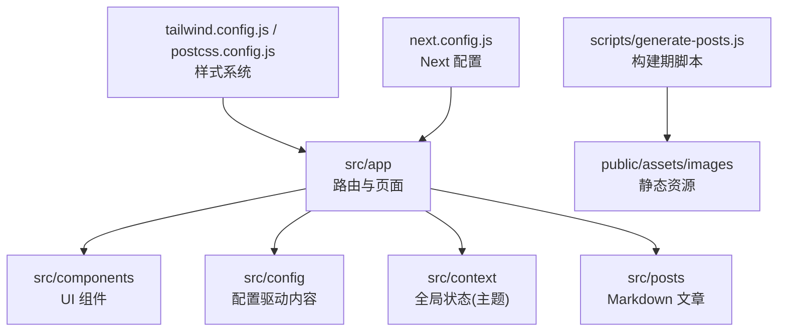
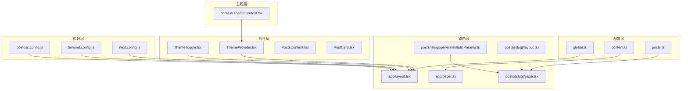
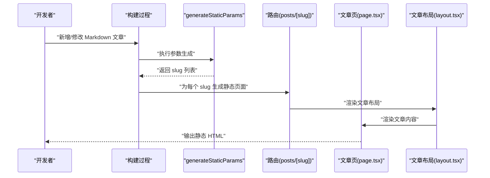
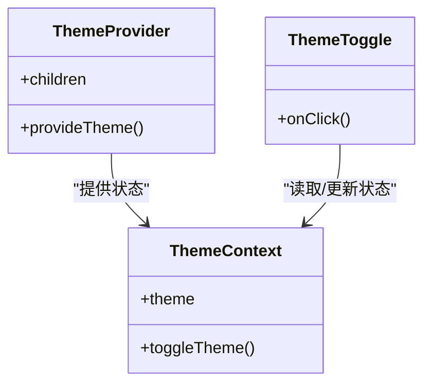
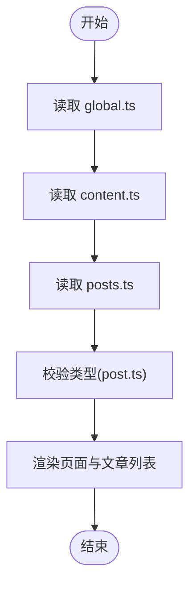
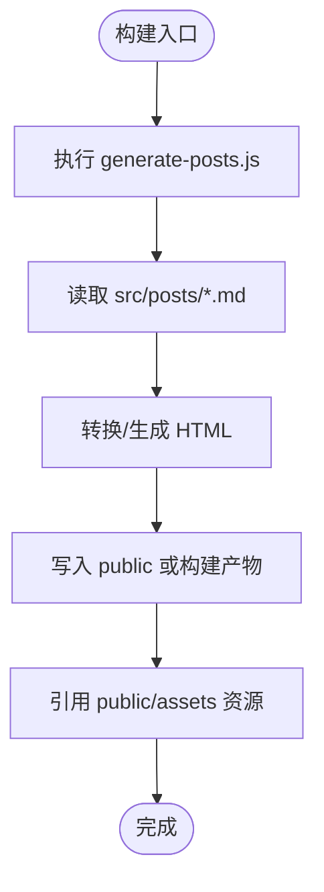
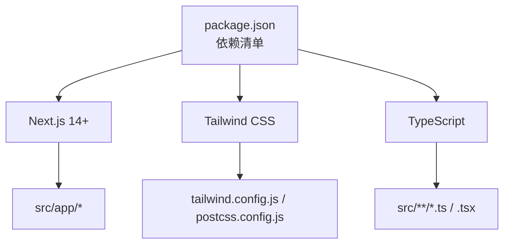

# 项目概述

<cite>
**本文引用的文件**   
- [README.md](file://README.md)
- [package.json](file://package.json)
- [next.config.js](file://next.config.js)
- [tailwind.config.js](file://tailwind.config.js)
- [postcss.config.js](file://postcss.config.js)
- [tsconfig.json](file://tsconfig.json)
- [src/app/layout.tsx](file://src/app/layout.tsx)
- [src/app/page.tsx](file://src/app/page.tsx)
- [src/app/posts/[slug]/layout.tsx](file://src/app/posts/[slug]/layout.tsx)
- [src/app/posts/[slug]/page.tsx](file://src/app/posts/[slug]/page.tsx)
- [src/app/posts/[slug]/generateStaticParams.ts](file://src/app/posts/[slug]/generateStaticParams.ts)
- [src/components/ThemeProvider.tsx](file://src/components/ThemeProvider.tsx)
- [src/components/ThemeToggle.tsx](file://src/components/ThemeToggle.tsx)
- [src/context/ThemeContext.tsx](file://src/context/ThemeContext.tsx)
- [src/config/global.ts](file://src/config/global.ts)
- [src/config/content.ts](file://src/config/content.ts)
- [src/config/posts.ts](file://src/config/posts.ts)
- [src/types/post.ts](file://src/types/post.ts)
- [scripts/generate-posts.js](file://scripts/generate-posts.js)
</cite>

## 目录
1. [简介](#简介)
2. [项目结构](#项目结构)
3. [核心组件](#核心组件)
4. [架构总览](#架构总览)
5. [详细组件分析](#详细组件分析)
6. [依赖分析](#依赖分析)
7. [性能考虑](#性能考虑)
8. [故障排查指南](#故障排查指南)
9. [结论](#结论)
10. [附录](#附录)

## 简介
本项目是一个基于 Next.js 14+ 的个人技术博客网站，采用 App Router 与静态站点生成（SSG）策略，提供主题切换、文章管理与内容配置驱动等能力。整体设计遵循“配置驱动 + 组件化”的理念：通过集中式配置文件管理站点元信息、导航与文章列表；通过可复用的 React 组件构建页面与交互；通过 Next.js 的 generateStaticParams 在构建期预渲染文章页，实现高性能的首屏加载与良好的 SEO。

该项目的目标读者包括：
- 初学者：快速理解 Next.js 博客的基本结构与开发流程
- 有经验的开发者：了解 SSG 路由参数生成、主题上下文、Tailwind 样式体系与配置驱动的内容组织方式

核心价值与使用场景：
- 个人技术分享与知识沉淀
- 面向读者的快速阅读体验（预渲染、主题切换、搜索筛选）
- 低维护成本的内容生产（Markdown 文章 + 脚本辅助生成）

## 项目结构
项目采用 Next.js App Router 的分层组织方式：
- src/app：应用路由与页面布局（含动态路由 posts/[slug]）
- src/components：UI 组件（导航、主题、文章卡片、搜索等）
- src/config：配置驱动的内容与站点元数据
- src/context：全局状态（如主题）
- src/posts：Markdown 文章源文件
- scripts：构建期脚本（如批量生成文章 HTML）
- public：静态资源（图片、动画、CSS）
- 根级配置文件：Next.js、Tailwind、PostCSS、TypeScript 等

图表来源
- [src/app/layout.tsx:1-200](file://src/app/layout.tsx#L1-L200)
- [src/app/page.tsx:1-200](file://src/app/page.tsx#L1-L200)
- [src/app/posts/[slug]/layout.tsx:1-200](file://src/app/posts/[slug]/layout.tsx#L1-L200)
- [src/app/posts/[slug]/page.tsx:1-200](file://src/app/posts/[slug]/page.tsx#L1-L200)
- [src/app/posts/[slug]/generateStaticParams.ts:1-200](file://src/app/posts/[slug]/generateStaticParams.ts#L1-L200)
- [src/components/ThemeProvider.tsx:1-200](file://src/components/ThemeProvider.tsx#L1-L200)
- [src/components/ThemeToggle.tsx:1-200](file://src/components/ThemeToggle.tsx#L1-L200)
- [src/context/ThemeContext.tsx:1-200](file://src/context/ThemeContext.tsx#L1-L200)
- [src/config/global.ts:1-200](file://src/config/global.ts#L1-L200)
- [src/config/content.ts:1-200](file://src/config/content.ts#L1-L200)
- [src/config/posts.ts:1-200](file://src/config/posts.ts#L1-L200)
- [scripts/generate-posts.js:1-200](file://scripts/generate-posts.js#L1-L200)
- [tailwind.config.js:1-200](file://tailwind.config.js#L1-L200)
- [postcss.config.js:1-200](file://postcss.config.js#L1-L200)
- [next.config.js:1-200](file://next.config.js#L1-L200)

章节来源
- [README.md:1-200](file://README.md#L1-L200)
- [package.json:1-200](file://package.json#L1-L200)
- [next.config.js:1-200](file://next.config.js#L1-L200)
- [tailwind.config.js:1-200](file://tailwind.config.js#L1-L200)
- [postcss.config.js:1-200](file://postcss.config.js#L1-L200)
- [tsconfig.json:1-200](file://tsconfig.json#L1-L200)

## 核心组件
- 应用布局与根页面
  - 根布局负责注入全局样式、主题提供者与导航框架
  - 首页聚合展示站点信息与入口
- 文章系统
  - 动态路由 posts/[slug] 用于渲染单篇文章
  - generateStaticParams 在构建期枚举所有 slug，生成静态页面
  - 文章源文件位于 src/posts，支持 Markdown 并通过脚本或工具链转换为可渲染内容
- 主题系统
  - ThemeProvider 与 ThemeContext 提供全局主题状态
  - ThemeToggle 提供用户切换主题的交互入口
- 配置驱动
  - global.ts、content.ts、posts.ts 等集中管理站点元信息、导航与文章列表
- 类型定义
  - types/post.ts 为文章数据结构提供 TypeScript 类型约束

章节来源
- [src/app/layout.tsx:1-200](file://src/app/layout.tsx#L1-L200)
- [src/app/page.tsx:1-200](file://src/app/page.tsx#L1-L200)
- [src/app/posts/[slug]/layout.tsx:1-200](file://src/app/posts/[slug]/layout.tsx#L1-L200)
- [src/app/posts/[slug]/page.tsx:1-200](file://src/app/posts/[slug]/page.tsx#L1-L200)
- [src/app/posts/[slug]/generateStaticParams.ts:1-200](file://src/app/posts/[slug]/generateStaticParams.ts#L1-L200)
- [src/components/ThemeProvider.tsx:1-200](file://src/components/ThemeProvider.tsx#L1-L200)
- [src/components/ThemeToggle.tsx:1-200](file://src/components/ThemeToggle.tsx#L1-L200)
- [src/context/ThemeContext.tsx:1-200](file://src/context/ThemeContext.tsx#L1-L200)
- [src/config/global.ts:1-200](file://src/config/global.ts#L1-L200)
- [src/config/content.ts:1-200](file://src/config/content.ts#L1-L200)
- [src/config/posts.ts:1-200](file://src/config/posts.ts#L1-L200)
- [src/types/post.ts:1-200](file://src/types/post.ts#L1-L200)

## 架构总览
本项目的架构围绕“配置驱动 + 组件化 + SSG”展开：
- 配置层：集中管理站点元信息、导航、文章列表与通用文案
- 组件层：以 React 组件为单位组织 UI 与交互逻辑，强调复用与组合
- 路由层：App Router 提供声明式路由，动态路由结合 generateStaticParams 进行构建期预渲染
- 主题层：通过 Context 提供全局主题状态，配合 Tailwind 实现明暗主题切换
- 构建层：Next.js 构建产物包含预渲染的静态页面，提升首屏性能与 SEO

图表来源
- [src/config/global.ts:1-200](file://src/config/global.ts#L1-L200)
- [src/config/content.ts:1-200](file://src/config/content.ts#L1-L200)
- [src/config/posts.ts:1-200](file://src/config/posts.ts#L1-L200)
- [src/components/ThemeProvider.tsx:1-200](file://src/components/ThemeProvider.tsx#L1-L200)
- [src/components/ThemeToggle.tsx:1-200](file://src/components/ThemeToggle.tsx#L1-L200)
- [src/components/PostsContent.tsx:1-200](file://src/components/PostsContent.tsx#L1-L200)
- [src/components/PostCard.tsx:1-200](file://src/components/PostCard.tsx#L1-L200)
- [src/app/layout.tsx:1-200](file://src/app/layout.tsx#L1-L200)
- [src/app/page.tsx:1-200](file://src/app/page.tsx#L1-L200)
- [src/app/posts/[slug]/layout.tsx:1-200](file://src/app/posts/[slug]/layout.tsx#L1-L200)
- [src/app/posts/[slug]/page.tsx:1-200](file://src/app/posts/[slug]/page.tsx#L1-L200)
- [src/app/posts/[slug]/generateStaticParams.ts:1-200](file://src/app/posts/[slug]/generateStaticParams.ts#L1-L200)
- [src/context/ThemeContext.tsx:1-200](file://src/context/ThemeContext.tsx#L1-L200)
- [next.config.js:1-200](file://next.config.js#L1-L200)
- [tailwind.config.js:1-200](file://tailwind.config.js#L1-L200)
- [postcss.config.js:1-200](file://postcss.config.js#L1-L200)

## 详细组件分析

### 文章系统与静态生成流程
- 动态路由 posts/[slug] 通过 generateStaticParams 在构建期获取所有文章 slug，并生成对应的静态页面
- 文章页 layout 与 page 分别负责文章容器与内容渲染
- 文章源文件位于 src/posts，可通过脚本或工具链转换为可渲染内容

图表来源
- [src/app/posts/[slug]/generateStaticParams.ts:1-200](file://src/app/posts/[slug]/generateStaticParams.ts#L1-L200)
- [src/app/posts/[slug]/layout.tsx:1-200](file://src/app/posts/[slug]/layout.tsx#L1-L200)
- [src/app/posts/[slug]/page.tsx:1-200](file://src/app/posts/[slug]/page.tsx#L1-L200)

章节来源
- [src/app/posts/[slug]/generateStaticParams.ts:1-200](file://src/app/posts/[slug]/generateStaticParams.ts#L1-L200)
- [src/app/posts/[slug]/layout.tsx:1-200](file://src/app/posts/[slug]/layout.tsx#L1-L200)
- [src/app/posts/[slug]/page.tsx:1-200](file://src/app/posts/[slug]/page.tsx#L1-L200)

### 主题系统与上下文状态
- ThemeProvider 作为主题提供者，包裹应用根布局
- ThemeContext 提供主题状态与切换方法
- ThemeToggle 提供用户交互入口，触发主题切换

图表来源
- [src/components/ThemeProvider.tsx:1-200](file://src/components/ThemeProvider.tsx#L1-L200)
- [src/context/ThemeContext.tsx:1-200](file://src/context/ThemeContext.tsx#L1-L200)
- [src/components/ThemeToggle.tsx:1-200](file://src/components/ThemeToggle.tsx#L1-L200)

章节来源
- [src/components/ThemeProvider.tsx:1-200](file://src/components/ThemeProvider.tsx#L1-L200)
- [src/context/ThemeContext.tsx:1-200](file://src/context/ThemeContext.tsx#L1-L200)
- [src/components/ThemeToggle.tsx:1-200](file://src/components/ThemeToggle.tsx#L1-L200)

### 配置驱动的内容组织
- global.ts：站点元信息、导航项等
- content.ts：通用文案与内容片段
- posts.ts：文章列表与元数据
- types/post.ts：文章数据结构类型定义

图表来源
- [src/config/global.ts:1-200](file://src/config/global.ts#L1-L200)
- [src/config/content.ts:1-200](file://src/config/content.ts#L1-L200)
- [src/config/posts.ts:1-200](file://src/config/posts.ts#L1-L200)
- [src/types/post.ts:1-200](file://src/types/post.ts#L1-L200)

章节来源
- [src/config/global.ts:1-200](file://src/config/global.ts#L1-L200)
- [src/config/content.ts:1-200](file://src/config/content.ts#L1-L200)
- [src/config/posts.ts:1-200](file://src/config/posts.ts#L1-L200)
- [src/types/post.ts:1-200](file://src/types/post.ts#L1-L200)

### 构建期脚本与静态资源
- scripts/generate-posts.js：在构建期处理文章源文件，生成静态 HTML 或辅助资源
- public/assets：存放图片、动画等静态资源，供页面引用

图表来源
- [scripts/generate-posts.js:1-200](file://scripts/generate-posts.js#L1-L200)

章节来源
- [scripts/generate-posts.js:1-200](file://scripts/generate-posts.js#L1-L200)

## 依赖分析
- Next.js 14+：提供 App Router、SSG、服务端渲染能力
- Tailwind CSS：原子化样式方案，配合 PostCSS 构建
- TypeScript：类型安全与更好的开发体验
- 其他依赖：参见 package.json

图表来源
- [package.json:1-200](file://package.json#L1-L200)
- [next.config.js:1-200](file://next.config.js#L1-L200)
- [tailwind.config.js:1-200](file://tailwind.config.js#L1-L200)
- [postcss.config.js:1-200](file://postcss.config.js#L1-L200)
- [tsconfig.json:1-200](file://tsconfig.json#L1-L200)

章节来源
- [package.json:1-200](file://package.json#L1-L200)
- [next.config.js:1-200](file://next.config.js#L1-L200)
- [tailwind.config.js:1-200](file://tailwind.config.js#L1-L200)
- [postcss.config.js:1-200](file://postcss.config.js#L1-L200)
- [tsconfig.json:1-200](file://tsconfig.json#L1-L200)

## 性能考虑
- 静态站点生成（SSG）：通过 generateStaticParams 在构建期预渲染文章页，减少运行时开销，提升首屏加载速度
- 组件拆分与按需渲染：将导航、主题、文章卡片等拆分为独立组件，提高可维护性与渲染效率
- 样式优化：使用 Tailwind 原子类与 PostCSS 构建，减少冗余样式
- 资源优化：静态资源集中于 public/assets，便于缓存与 CDN 分发

[本节为通用指导，不直接分析具体文件]

## 故障排查指南
- 构建失败
  - 检查 generateStaticParams 是否正确返回 slug 列表
  - 确认文章源文件路径与命名规范
- 主题切换无效
  - 确保 ThemeProvider 包裹根布局
  - 检查 ThemeContext 的状态读写逻辑
- 样式异常
  - 验证 tailwind.config.js 与 postcss.config.js 配置
  - 清理构建缓存后重新构建
- 类型错误
  - 根据 types/post.ts 调整文章数据结构
  - 运行 TypeScript 编译检查定位问题

章节来源
- [src/app/posts/[slug]/generateStaticParams.ts:1-200](file://src/app/posts/[slug]/generateStaticParams.ts#L1-L200)
- [src/components/ThemeProvider.tsx:1-200](file://src/components/ThemeProvider.tsx#L1-L200)
- [src/context/ThemeContext.tsx:1-200](file://src/context/ThemeContext.tsx#L1-L200)
- [tailwind.config.js:1-200](file://tailwind.config.js#L1-L200)
- [postcss.config.js:1-200](file://postcss.config.js#L1-L200)
- [src/types/post.ts:1-200](file://src/types/post.ts#L1-L200)

## 结论
本项目以 Next.js 14+ 为核心，结合 SSG、组件化与配置驱动的开发模式，提供了高效、可维护且用户体验友好的个人技术博客解决方案。对于初学者而言，它展示了现代前端工程化的基本实践；对于有经验的开发者，它提供了可扩展的主题系统与构建期脚本集成点，便于进一步定制与增强。

[本节为总结性内容，不直接分析具体文件]

## 附录
- 安装与运行
  - 参考 README.md 中的说明进行环境准备与本地启动
- 扩展建议
  - 增加评论系统、站内搜索、多语言支持
  - 引入 CI/CD 自动化部署与预览环境

章节来源
- [README.md:1-200](file://README.md#L1-L200)